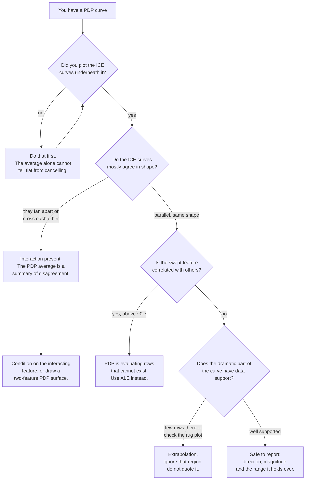

import DataCampExercise from "../../../../components/DataCampExercise.astro";
import Figure from "../../../../components/Figure.astro";
import Quiz from "../../../../components/Quiz.astro";

## What you'll learn

- what a partial dependence plot actually computes, and what it assumes
- the failure: PDP range **0.8011** where the true effect spans **−9.02 to +8.57**
- **ICE** plots, which show one curve per row instead of the average
- **centred ICE**, which separates each curve's shape from its starting level
- why PDP extrapolates into regions where no data exists
- the `method="brute"` / `method="recursion"` difference, and why it matters here
- when to trust the average and when it is actively lying to you

## From importance to direction

[Feature importance](/machine-learning/phase-09---interpretability--responsible-ml/feature-importance-and-its-traps/)
tells you a feature matters. It does not tell you *how*. Does more income raise the prediction or
lower it? Is the relationship linear, a step, a U-shape?

A **partial dependence plot** answers that. Pick a feature, sweep it across its range, and for each
value ask: what would the model predict, on average, if every row had that value?

$$
\mathrm{PD}_S(x_S) = \frac{1}{n}\sum_{i=1}^{n} \hat{f}\big(x_S,\ x_C^{(i)}\big)
$$

where $S$ is the feature you are varying and $C$ is everything else, kept at each row's actual
values. In words: replace the feature with a fixed value for *every* row, predict, average. Then
repeat for the next value on the grid.

That averaging is the whole method, and it is also the whole problem.

## The failure

Here is a dataset with two features. `x` is continuous. `group` is binary — and `group` **flips the
sign** of x's effect:

$$
y = \begin{cases} +2.5\,x & \text{if group} = 1 \\ -2.5\,x & \text{if group} = 0 \end{cases}
$$

A random forest learns this correctly; it has no trouble with it. Now plot the partial dependence
of `x`.

| Measurement | Value |
| --- | --- |
| PDP total range across the whole sweep | **0.8011** |
| Mean ICE slope for `group = 0` rows | **−9.0235** |
| Mean ICE slope for `group = 1` rows | **+8.5737** |

<Figure
  src="/images/ml/phase-09-interpretability/partial-dependence-and-ice-plots/pdp-hides-interaction"
  alt="Left: a nearly flat partial dependence curve for x with total range 0.801. Right: hundreds of individual curves fanning out, half rising steeply and half falling steeply, with the flat PDP dashed through the middle."
  title="Averaging two opposite effects gives you neither of them"
  caption="The left panel is the honest output of partial_dependence. It says x barely moves the prediction. The right panel shows the same model's per-row curves: they run from a slope of -9.02 to +8.57. The PDP is the average of those, and the average of +8.57 and -9.02 is approximately nothing."
/>

Read the left panel as a stakeholder would: **"x doesn't really matter."** It is the single most
important feature in the dataset, its effect is enormous, and the plot says nothing is happening.

The PDP is not buggy. It computed exactly what it promises — the average effect — and the average
happens to be near zero. The problem is that "the average effect" was the wrong question.

## ICE plots

An **Individual Conditional Expectation** plot performs the same sweep but skips the averaging. One
curve per row:

$$
\mathrm{ICE}^{(i)}(x_S) = \hat{f}\big(x_S,\ x_C^{(i)}\big)
$$

With `method="brute"` the PDP is precisely the pointwise mean of the ICE curves, so you lose nothing
by plotting them and you gain the entire distribution.

```python
from sklearn.inspection import partial_dependence

avg = partial_dependence(model, X, features=["x"], kind="average")     # the PDP
ind = partial_dependence(model, X, features=["x"], kind="individual")  # ICE curves
both = partial_dependence(model, X, features=["x"], kind="both")       # both at once
```

**Use `kind="both"` by default.** It makes heterogeneity impossible to miss.

### One caveat: brute against recursion

The claim "the PDP is the mean of the ICE curves" is true for `method="brute"` and **not** true for
`method="recursion"` — and for tree ensembles, `method="auto"` picks `recursion`.

The `recursion` method walks the tree structure instead of substituting values into real rows. It is
much faster, and it weights by the training distribution recorded at each node rather than by your
actual data. The two disagree:

| `method` | PDP range on this data | Equals mean of ICE? |
| --- | --- | --- |
| `"recursion"` (the default for forests) | 1.0352 | **no** |
| `"brute"` | **0.8011** | **yes, exactly** |

```python
import numpy as np
from sklearn.inspection import partial_dependence

rec = partial_dependence(model, X, features=["x"], method="recursion",
                         grid_resolution=25)["average"][0]
brute = partial_dependence(model, X, features=["x"], method="brute",
                           kind="both", grid_resolution=25)

print(np.allclose(brute["individual"][0].mean(axis=0), brute["average"][0]))  # True
print(round(float(rec.max() - rec.min()), 4))                    # 1.0352
print(round(float(brute["average"][0].ptp()), 4))                # 0.8011
```

Neither is wrong, but they answer slightly different questions, and only `brute` is the one the
formula above describes. Every number on the rest of this page uses `method="brute"` so that the
PDP and the ICE curves are guaranteed to be consistent with each other.

### Centred ICE

Raw ICE curves start at different heights, because each row has different values for the other
features. That vertical spread is real but it obscures the *shapes*, which is what you are looking
at the plot to see.

Centred ICE subtracts each curve's own value at the left edge of the grid:

$$
\mathrm{cICE}^{(i)}(x_S) = \hat{f}\big(x_S,\ x_C^{(i)}\big) - \hat{f}\big(x_S^{\min},\ x_C^{(i)}\big)
$$

Every curve now starts at zero, so what you see is purely how much the prediction *changes*.

<Figure
  src="/images/ml/phase-09-interpretability/partial-dependence-and-ice-plots/centred-ice"
  alt="Two panels of individual conditional expectation curves. On the left the curves are spread vertically and overlap into a band. On the right, after centring at the left edge, they form two clean fans, one rising and one falling from a common origin."
  title="Centring turns a cloud into two unmistakable fans"
  caption="Left: raw ICE. The curves cross and overlap, and the vertical spread from the other features makes the pattern hard to read. Right: the same curves centred at the leftmost grid point. Two groups, opposite slopes, no ambiguity."
/>

```python
ice = partial_dependence(model, X, features=["x"], kind="individual")
curves = ice["individual"][0]
centred = curves - curves[:, [0]]        # subtract each row's own starting value
```

sklearn will do it for you in the display API:

```python
from sklearn.inspection import PartialDependenceDisplay

PartialDependenceDisplay.from_estimator(
    model, X, features=["x"], kind="both", centered=True,
)
```

### See it move

The cancellation is pure arithmetic, so it can be watched directly. Below are forty ICE curves with a
slope of either $+2.5$ or $-2.5$; the amber line is their average, which is what a PDP reports. Drag
to change the mix.

```p5 title="Averaging opposite effects" desc="Forty individual conditional expectation curves with slopes of plus or minus 2.5. Dragging changes the fraction with the positive slope, and the amber average line flattens completely at a fifty-fifty mix while every individual curve keeps its full slope." height="410"
let share = 0.5;
const N = 40, SLOPE = 2.5;
let offsets = [];
function setup() {
  createCanvas(620, 410);
  textFont("monospace");
  for (let i = 0; i < N; i++) offsets.push(random(-1.6, 1.6));
}
function draw() {
  background(13, 17, 23);
  const ox = 70, oy = 40, w = 470, h = 250;
  const px = (x) => ox + ((x + 2) / 4) * w;          // x from -2 to 2
  const py = (v) => oy + h / 2 - (v / 7.5) * (h / 2);  // value from -7.5 to 7.5

  if (mouseIsPressed) share = constrain((mouseX - ox) / w, 0, 1);
  const nPos = Math.round(share * N);

  stroke(35, 42, 51);
  strokeWeight(1);
  line(ox, py(0), ox + w, py(0));
  line(px(0), oy, px(0), oy + h);

  // individual curves
  strokeWeight(1);
  for (let i = 0; i < N; i++) {
    const s = i < nPos ? SLOPE : -SLOPE;
    stroke(i < nPos ? color(107, 169, 221, 130) : color(165, 214, 164, 130));
    line(px(-2), py(-2 * s + offsets[i]), px(2), py(2 * s + offsets[i]));
  }

  // the average — this is the PDP
  const meanSlope = (nPos * SLOPE + (N - nPos) * -SLOPE) / N;
  const meanOffset = offsets.reduce((a, b) => a + b, 0) / N;
  stroke(255, 211, 67);
  strokeWeight(3);
  line(px(-2), py(-2 * meanSlope + meanOffset), px(2), py(2 * meanSlope + meanOffset));

  const pdpRange = Math.abs(4 * meanSlope);
  const iceSpread = 2 * SLOPE;

  noStroke();
  fill(118, 131, 144);
  textSize(11);
  textAlign(CENTER, TOP);
  text("x", ox + w / 2, oy + h + 10);
  push();
  translate(ox - 44, oy + h / 2);
  rotate(-HALF_PI);
  textAlign(CENTER, CENTER);
  text("prediction", 0, 0);
  pop();

  textAlign(LEFT, TOP);
  fill(107, 169, 221);
  textSize(12);
  text(nPos + " rows with slope +2.5", ox, 316);
  fill(165, 214, 164);
  text((N - nPos) + " rows with slope -2.5", ox + 250, 316);

  fill(255, 211, 67);
  text("PDP range over the sweep  " + pdpRange.toFixed(4), ox, 344);
  fill(200);
  text("ICE slope spread          " + iceSpread.toFixed(4)
    + "   (unchanged, always)", ox, 366);

  fill(pdpRange < 0.5 ? color(232, 110, 110) : color(118, 131, 144));
  textSize(11);
  textAlign(LEFT, BOTTOM);
  text(pdpRange < 0.5
    ? "The PDP now says x does nothing. Every single row disagrees."
    : "drag to change the mix", ox, height - 12);
}
```

At an even mix the PDP is exactly flat while every individual curve still climbs or falls by 10 units
across the sweep. Nothing is hidden by noise or by a modelling choice; the average of $+2.5$ and
$-2.5$ is 0, and that is the entire failure. The ICE spread, on the right of the readout, never
changes — which is why it is the number to look at.

## What PDP assumes, and when it breaks

The formula replaces feature $S$ with a fixed value while leaving $C$ at each row's real values.
That means it evaluates the model at combinations that **may never occur in reality**.

Consider `age` and `years_of_experience`. Sweeping `age` to 22 while a row keeps 30 years of
experience asks the model about a 22-year-old with 30 years of experience. The model will answer.
The answer is meaningless, and it goes into your average.

| Assumption | What breaks it | Consequence |
| --- | --- | --- |
| Features are independent | Correlated features | PDP evaluates impossible rows |
| The effect is homogeneous | Interactions | PDP averages opposite effects to zero |
| The grid stays in-distribution | Skewed features | Extrapolation into empty regions |

Two mitigations worth knowing:

**Plot the data distribution alongside the curve.** A rug plot or histogram on the x-axis shows where
the grid has support. sklearn's display does this automatically. If the curve does something dramatic
in a region with three data points, ignore it.

**For correlated features, use ALE plots instead.** Accumulated Local Effects average *local*
differences within narrow bins of the feature, so they never evaluate combinations that do not
occur. They are not in scikit-learn; `alibi` and `PyALE` implement them.

### Reading a PDP safely

The checks are cheap and the failure they prevent is expensive — a confident statement about a curve
that was averaged out of impossible rows:



The first box is not a formality. A perfectly flat PDP is produced both by a feature the model
ignores and by a feature that helps half the population and hurts the other half — and only the ICE
curves distinguish them. Everything else on this page is downstream of that one check.

## Two-feature PDP

Passing a tuple of two features gives a surface, which is how you see an interaction directly rather
than inferring it from a fan of ICE curves:

```python title="two_way_pdp.py" showLineNumbers{1}
from sklearn.inspection import PartialDependenceDisplay

# One-way plots for each, then the interaction surface.
PartialDependenceDisplay.from_estimator(
    model, X,
    features=["x", "group", ("x", "group")],
    kind="average",
)
```

For the dataset above the surface is a saddle: rising in `x` on one half of `group`, falling on the
other. That is what a sign-flip interaction looks like, and it is invisible in either one-way plot.

Note the cost. A two-way PDP over a $g \times g$ grid requires $g^2 n$ predictions. At
$g = 50$ and $n = 10{,}000$ that is 25 million model calls, which is why you subsample:

```python
PartialDependenceDisplay.from_estimator(
    model, X.sample(500, random_state=0),      # subsample rows
    features=[("x", "group")], grid_resolution=20,
)
```

## In code

The whole comparison:

```python title="pdp_vs_ice.py" showLineNumbers{1}
import numpy as np
import pandas as pd
from sklearn.ensemble import RandomForestRegressor
from sklearn.inspection import partial_dependence

rng = np.random.default_rng(3)
n = 2000
x = rng.uniform(-2, 2, n)
group = rng.integers(0, 2, n)
y = np.where(group == 1, 2.5 * x, -2.5 * x) + rng.normal(0, 0.4, n)

X = pd.DataFrame({"x": x, "group": group})
model = RandomForestRegressor(n_estimators=300, random_state=0).fit(X, y)

both = partial_dependence(model, X, features=["x"], grid_resolution=25,
                          kind="both", method="brute")
pdp = both["average"][0]
print(f"PDP total range: {pdp.max() - pdp.min():.4f}")        # 0.8011

ice = both["individual"][0]
slopes = ice[:, -1] - ice[:, 0]                # rise across the whole grid
g = X["group"].to_numpy()
print(f"ICE slope, group 0: {slopes[g == 0].mean():+.4f}")     # -9.0235
print(f"ICE slope, group 1: {slopes[g == 1].mean():+.4f}")     # +8.5737
print(f"ICE slope range:    {slopes.min():+.4f} to {slopes.max():+.4f}")
```

A cheap automated heterogeneity check worth putting in a report:

```python title="heterogeneity_check.py" showLineNumbers{1}
import numpy as np
from sklearn.inspection import partial_dependence


def heterogeneity(model, X, feature, grid_resolution=25):
    """Ratio of ICE slope spread to the PDP's own range.

    Large means the average is hiding structure and you must look at the ICE
    curves before saying anything about this feature.
    """
    both = partial_dependence(model, X, features=[feature],
                              grid_resolution=grid_resolution, kind="both",
                              method="brute")
    pdp = both["average"][0]
    curves = both["individual"][0]
    slopes = curves[:, -1] - curves[:, 0]
    pdp_range = float(pdp.max() - pdp.min())
    return {
        "pdp_range": round(pdp_range, 4),
        "ice_slope_spread": round(float(slopes.max() - slopes.min()), 4),
        "ratio": round(float(slopes.max() - slopes.min()) / max(pdp_range, 1e-9), 2),
        "sign_disagreement": float((slopes > 0).mean()),
    }


print(heterogeneity(model, X, "x"))
# {'pdp_range': 0.8011, 'ice_slope_spread': 17.5972, 'ratio': 21.97,
#  'sign_disagreement': 0.495}
```

`sign_disagreement` near 0.5 is the loudest possible warning: half the rows move up and half move
down, so no single number can describe this feature's effect.

## Pitfalls

**Reading a PDP without looking at ICE.** Measured: a PDP range of 0.8011 on a feature whose real
effect spans 17.60 in slope.

**Leaving `method` at its default and then claiming the PDP is the mean of the ICE curves.** For tree
ensembles the default is `"recursion"`, and it is not.

**Using PDP on correlated features.** It evaluates the model on combinations that never occur —
22-year-olds with 30 years of experience — and averages the results in.

**Ignoring where the data actually is.** A dramatic curve over a region with a handful of points is
extrapolation, not a finding. Plot the rug.

**Forgetting to centre ICE.** Uncentred curves overlap into a band and the shapes get lost.

**Computing a two-way PDP on the full dataset.** $g^2 n$ predictions. Subsample the rows.

**Treating a PDP as causal.** It is a statement about *the model*, not the world. "If we raised
everyone's income the prediction would go up" is not what a PDP licenses — the model learned
correlations, and intervening on income changes other things too.

**Plotting PDP for a model that does not work.** As with importance, if the model is at baseline the
curves describe noise.

## Recap

- PDP answers "what is the **average** effect of this feature?" by replacing it with a fixed value
  for every row and averaging the predictions.
- Averaging is the method and the flaw: a PDP range of **0.8011** on a feature whose per-row slopes
  run **−9.02 to +8.57**.
- **ICE** plots one curve per row; with `method="brute"` the PDP is exactly their pointwise mean.
  Use `kind="both", method="brute"`.
- **Centred ICE** removes the vertical offset from other features so the shapes are comparable.
- PDP assumes feature independence and will happily evaluate impossible rows. Use **ALE** when
  features are correlated.
- `sign_disagreement` near 0.5 means no single-number summary of the effect exists.
- A PDP describes the model, not the world. It is not a causal claim.

<Quiz
  questions={[
    {
      q: "A PDP for your most important feature is almost flat. What should you check before reporting that the feature has little effect?",
      options: [
        "Whether the model converged",
        "The ICE curves — the average of a positive and a negative effect is near zero",
        "Whether you used enough grid points",
        "The feature's correlation with the target",
      ],
      answer: 1,
      explain: "Measured on this page: a PDP range of 0.8011 for a feature whose per-row slopes ran from -9.02 to +8.57. A flat PDP is consistent with 'no effect' AND with 'two large opposite effects', and only the ICE curves distinguish them.",
    },
    {
      q: "What is the exact relationship between a PDP and the ICE curves?",
      options: [
        "They are computed by different algorithms",
        "With method='brute' the PDP is the pointwise mean of the ICE curves — you get it for free when you compute them",
        "ICE curves are a random sample of PDPs",
        "The PDP is the median of the ICE curves",
      ],
      answer: 1,
      explain: "Which is why kind=\"both\" costs nothing extra. Note the caveat: this identity only holds for method=\"brute\". For tree ensembles sklearn defaults to method=\"recursion\", which computes the average a different way and does NOT equal the mean of the ICE curves.",
    },
    {
      q: "Why is a PDP unreliable when features are correlated?",
      options: [
        "The grid becomes too fine",
        "It fixes one feature while leaving the others at their real values, so it evaluates combinations that never occur — like a 22-year-old with 30 years of experience",
        "Correlated features cannot be plotted",
        "The averaging becomes biased toward the majority class",
      ],
      answer: 1,
      explain: "The model returns a prediction for those impossible rows and it goes straight into the average. ALE plots avoid this by averaging local differences within narrow bins, so they only ever use combinations that actually appear.",
    },
    {
      q: "What does centring ICE curves at the leftmost grid point accomplish?",
      options: [
        "It makes the computation faster",
        "It removes the vertical offset caused by each row's other features, so you can compare the shapes",
        "It fixes the correlation problem",
        "It converts ICE into a PDP",
      ],
      answer: 1,
      explain: "Raw ICE curves start at different heights because the other features differ per row, and that spread hides the shapes. After centring, every curve starts at zero and shows purely the change in prediction.",
    },
    {
      q: "Your heterogeneity check reports sign_disagreement = 0.5. What does that mean?",
      options: [
        "Half the data is missing",
        "Half the rows have a rising effect and half falling — no single summary of this feature's effect is valid",
        "The model is 50% accurate",
        "The feature is unimportant",
      ],
      answer: 1,
      explain: "It is the strongest possible interaction signal for this feature. Reporting one direction would be wrong for half your population, so the honest output is a segmented analysis rather than a single curve.",
    },
  ]}
/>

## 🧪 Try It Yourself

### Exercise 1 – Compute a PDP by hand

<DataCampExercise
  lang="python"
  hint={`For each grid value, overwrite the whole column with that value, predict, and take the mean.`}
  code={`# Task: Exercise 1 - Compute a PDP by hand
import numpy as np
import pandas as pd
from sklearn.ensemble import RandomForestRegressor
from sklearn.inspection import partial_dependence

rng = np.random.default_rng(3)
n = 2000
x = rng.uniform(-2, 2, n)
group = rng.integers(0, 2, n)
y = np.where(group == 1, 2.5 * x, -2.5 * x) + rng.normal(0, 0.4, n)
X = pd.DataFrame({"x": x, "group": group})
model = RandomForestRegressor(n_estimators=300, random_state=0).fit(X, y)

# Take sklearn's own grid, so only the AVERAGING is under test.
# (sklearn grids on percentiles by default, not on min/max.)
result = partial_dependence(model, X, features=["x"], kind="average",
                            grid_resolution=5, method="brute")
grid = result["grid_values"][0]

manual = []
for value in grid:
    X_copy = X.copy()
    X_copy["x"] = value                      # every row gets this x
    manual.append(model.predict(X_copy).___())   # replace ___ with mean

print("grid   :", np.round(grid, 4))
print("by hand:", np.round(manual, 4))
print("sklearn:", np.round(result["average"][0], 4))
print("match:", np.allclose(manual, result["average"][0], atol=1e-6))

# -- Expected Output -------------------------------------------
# grid   : [-1.8108 -0.9092 -0.0075  0.8941  1.7958]
# by hand: [ 0.3227  0.0652 -0.0209 -0.1177  0.0098]
# sklearn: [ 0.3227  0.0652 -0.0209 -0.1177  0.0098]
# match: True
# --------------------------------------------------------------`}
  solution={`import numpy as np
import pandas as pd
from sklearn.ensemble import RandomForestRegressor
from sklearn.inspection import partial_dependence

rng = np.random.default_rng(3)
n = 2000
x = rng.uniform(-2, 2, n)
group = rng.integers(0, 2, n)
y = np.where(group == 1, 2.5 * x, -2.5 * x) + rng.normal(0, 0.4, n)
X = pd.DataFrame({"x": x, "group": group})
model = RandomForestRegressor(n_estimators=300, random_state=0).fit(X, y)
result = partial_dependence(model, X, features=["x"], kind="average",
                            grid_resolution=5, method="brute")
grid = result["grid_values"][0]
manual = []
for value in grid:
    X_copy = X.copy()
    X_copy["x"] = value
    manual.append(model.predict(X_copy).mean())
print("grid   :", np.round(grid, 4))
print("by hand:", np.round(manual, 4))
print("sklearn:", np.round(result["average"][0], 4))
print("match:", np.allclose(manual, result["average"][0], atol=1e-6))`}
  sct={`test_output_contains("match: True")
success_msg("Four lines reproduce partial_dependence exactly. Now you know precisely what it assumes.")`}
  height={300}
/>

### Exercise 2 – Measure the range the PDP reports

<DataCampExercise
  lang="python"
  hint={`Take max minus min of the partial dependence curve.`}
  code={`# Task: Exercise 2 - Measure the range the PDP reports
import numpy as np
from sklearn.inspection import partial_dependence

# model and X carry over from Exercise 1.
avg = partial_dependence(model, X, features=["x"], grid_resolution=25,
                         kind="average", method="brute")["average"][0]

print(f"PDP min   {avg.min():+.4f}")
print(f"PDP max   {avg.max():+.4f}")
print(f"PDP range {avg.max() - avg.___():.4f}")     # replace ___ with min
print("y range in the data:", round(float(y.max() - y.min()), 4))

# -- Expected Output -------------------------------------------
# PDP min   -0.3824
# PDP max   +0.4187
# PDP range 0.8011
# y range in the data: 11.1959
# --------------------------------------------------------------`}
  solution={`import numpy as np
from sklearn.inspection import partial_dependence

avg = partial_dependence(model, X, features=["x"], grid_resolution=25,
                         kind="average", method="brute")["average"][0]
print(f"PDP min   {avg.min():+.4f}")
print(f"PDP max   {avg.max():+.4f}")
print(f"PDP range {avg.max() - avg.min():.4f}")
print("y range in the data:", round(float(y.max() - y.min()), 4))`}
  sct={`test_output_contains("PDP range 0.8011")
success_msg("A range of 0.8011 on a target that spans 11.20. The PDP says x is nearly irrelevant.")`}
  height={260}
/>

### Exercise 3 – Let ICE contradict the PDP

<DataCampExercise
  lang="python"
  hint={`The slope of each ICE curve is its last grid value minus its first.`}
  code={`# Task: Exercise 3 - Let ICE contradict the PDP
import numpy as np
from sklearn.inspection import partial_dependence

ice = partial_dependence(model, X, features=["x"], grid_resolution=25,
                         kind="individual", method="brute")["individual"][0]

slopes = ice[:, -1] - ice[:, ___]              # replace ___ with 0
g = X["group"].to_numpy()

print(f"curves computed        {len(ice)}")
print(f"group 0 mean slope     {slopes[g == 0].mean():+.4f}")
print(f"group 1 mean slope     {slopes[g == 1].mean():+.4f}")
print(f"fraction rising        {(slopes > 0).mean():.4f}")

# -- Expected Output -------------------------------------------
# curves computed        2000
# group 0 mean slope     -9.0235
# group 1 mean slope     +8.5737
# fraction rising        0.4950
# --------------------------------------------------------------`}
  solution={`import numpy as np
from sklearn.inspection import partial_dependence

ice = partial_dependence(model, X, features=["x"], grid_resolution=25,
                         kind="individual", method="brute")["individual"][0]
slopes = ice[:, -1] - ice[:, 0]
g = X["group"].to_numpy()
print(f"curves computed        {len(ice)}")
print(f"group 0 mean slope     {slopes[g == 0].mean():+.4f}")
print(f"group 1 mean slope     {slopes[g == 1].mean():+.4f}")
print(f"fraction rising        {(slopes > 0).mean():.4f}")`}
  sct={`test_output_contains("group 1 mean slope     +8.5737")
success_msg("Exactly half the rows rise and half fall. The PDP averaged 17.6 units of effect down to 0.8.")`}
  height={270}
/>

### Exercise 4 – Centre the curves

<DataCampExercise
  hint={`Subtract each curve's own first value using ice[:, [0]] so broadcasting works per row.`}
  lang="python"
  code={`# Task: Exercise 4 - Centre the curves
import numpy as np
from sklearn.inspection import partial_dependence

ice = partial_dependence(model, X, features=["x"], grid_resolution=25,
                         kind="individual", method="brute")["individual"][0]

centred = ice - ice[:, [___]]                  # replace ___ with 0

print(f"raw     first column: min {ice[:, 0].min():+.4f} max {ice[:, 0].max():+.4f}")
print(f"centred first column: min {centred[:, 0].min():+.4f} "
      f"max {centred[:, 0].max():+.4f}")
print(f"raw     last column spread  {ice[:, -1].max() - ice[:, -1].min():.4f}")
print(f"centred last column spread  {centred[:, -1].max() - centred[:, -1].min():.4f}")

# -- Expected Output -------------------------------------------
# raw     first column: min -4.0285 max +4.5877
# centred first column: min +0.0000 max +0.0000
# raw     last column spread  8.9811
# centred last column spread  17.5972
# --------------------------------------------------------------`}
  solution={`import numpy as np
from sklearn.inspection import partial_dependence

ice = partial_dependence(model, X, features=["x"], grid_resolution=25,
                         kind="individual", method="brute")["individual"][0]
centred = ice - ice[:, [0]]
print(f"raw     first column: min {ice[:, 0].min():+.4f} max {ice[:, 0].max():+.4f}")
print(f"centred first column: min {centred[:, 0].min():+.4f} "
      f"max {centred[:, 0].max():+.4f}")
print(f"raw     last column spread  {ice[:, -1].max() - ice[:, -1].min():.4f}")
print(f"centred last column spread  {centred[:, -1].max() - centred[:, -1].min():.4f}")`}
  sct={`test_output_contains("centred first column: min +0.0000 max +0.0000")
success_msg("Every curve now starts at zero, and the spread at the far end is the full 17.60 of real effect.")`}
  height={280}
/>

### Exercise 5 – Automate the heterogeneity warning

<DataCampExercise
  lang="python"
  hint={`Compare the spread of ICE slopes against the PDP's own range.`}
  code={`# Task: Exercise 5 - Automate the heterogeneity warning
import numpy as np
from sklearn.inspection import partial_dependence

def heterogeneity(model, X, feature, grid_resolution=25):
    both = partial_dependence(model, X, features=[feature],
                              grid_resolution=grid_resolution, kind="both",
                              method="brute")
    pdp = both["average"][0]
    curves = both["individual"][0]
    slopes = curves[:, -1] - curves[:, 0]
    pdp_range = float(pdp.max() - pdp.min())
    return {
        "pdp_range": round(pdp_range, 4),
        "ice_slope_spread": round(float(slopes.max() - slopes.min()), 4),
        "ratio": round(float(slopes.max() - slopes.min()) / max(pdp_range, 1e-9), 2),
        "sign_disagreement": round(float((slopes > 0).___()), 4),
    }                                          # replace ___ with mean

r = heterogeneity(model, X, "x")
for k, v in r.items():
    print(f"{k:20s} {v}")
print("VERDICT:", "look at ICE before saying anything"
      if r["ratio"] > 2 else "the average is safe to quote")

# -- Expected Output -------------------------------------------
# pdp_range            0.8011
# ice_slope_spread     17.5972
# ratio                21.97
# sign_disagreement    0.495
# VERDICT: look at ICE before saying anything
# --------------------------------------------------------------`}
  solution={`import numpy as np
from sklearn.inspection import partial_dependence

def heterogeneity(model, X, feature, grid_resolution=25):
    both = partial_dependence(model, X, features=[feature],
                              grid_resolution=grid_resolution, kind="both",
                              method="brute")
    pdp = both["average"][0]
    curves = both["individual"][0]
    slopes = curves[:, -1] - curves[:, 0]
    pdp_range = float(pdp.max() - pdp.min())
    return {
        "pdp_range": round(pdp_range, 4),
        "ice_slope_spread": round(float(slopes.max() - slopes.min()), 4),
        "ratio": round(float(slopes.max() - slopes.min()) / max(pdp_range, 1e-9), 2),
        "sign_disagreement": round(float((slopes > 0).mean()), 4),
    }

r = heterogeneity(model, X, "x")
for k, v in r.items():
    print(f"{k:20s} {v}")
print("VERDICT:", "look at ICE before saying anything"
      if r["ratio"] > 2 else "the average is safe to quote")`}
  sct={`test_output_contains("ratio                21.97")
success_msg("Twenty-two times more spread than the average shows. Put this check in every model report.")`}
  height={310}
/>

## Next

[SHAP Values from Scratch](/machine-learning/phase-09---interpretability--responsible-ml/shap-values-from-scratch/)
— PDP and ICE describe features. The next question is how to attribute a **single prediction** across
its features, exactly and additively.
