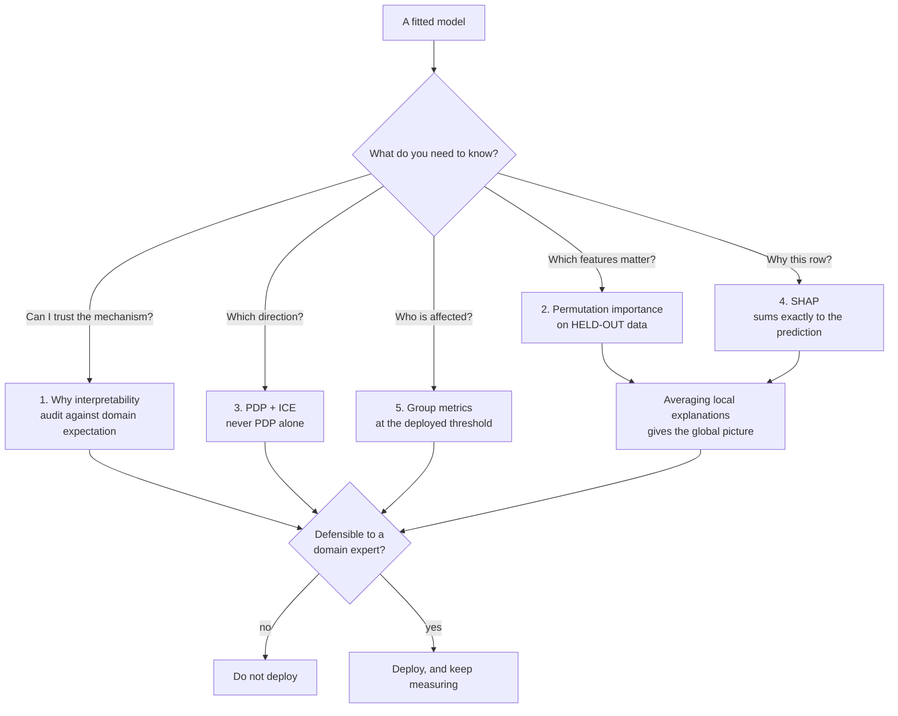

Every phase before this one asked *how well does the model score*. This one asks *what did it
actually do*, and the two questions come apart much more often than the first eight phases suggest.

The organising fact of this phase: **each of the five standard interpretability tools produces a
number that is correct and an impression that is wrong**, unless you know the specific way it lies.
None of them raise an error. All of them look authoritative in a slide deck.

## What this phase covers

| # | Page | The question it answers | The measured trap |
| --- | --- | --- | --- |
| 1 | [Why Interpretability Matters](/machine-learning/phase-09---interpretability--responsible-ml/why-interpretability-matters/) | Should we care at all? | **0.9642** at one hospital, **0.4998** at the next |
| 2 | [Feature Importance and Its Traps](/machine-learning/phase-09---interpretability--responsible-ml/feature-importance-and-its-traps/) | How much does each feature matter? | Pure noise ranked **1st, at 0.3853** |
| 3 | [Partial Dependence and ICE Plots](/machine-learning/phase-09---interpretability--responsible-ml/partial-dependence-and-ice-plots/) | Which direction does it push? | PDP range **0.8011** on an effect spanning **−9.02 to +8.57** |
| 4 | [SHAP Values from Scratch](/machine-learning/phase-09---interpretability--responsible-ml/shap-values-from-scratch/) | Why *this* prediction? | Exact, additive to **0.00e+00** — and $O(2^p)$ |
| 5 | [Fairness Metrics and Bias Auditing](/machine-learning/phase-09---interpretability--responsible-ml/fairness-metrics-and-bias-auditing/) | Is it treating groups differently? | Selection gap **0.6537** with no protected attribute in the model |

## The five measured traps

Every number below is produced by code on the page it belongs to, and every one of them is the
*default* behaviour of a standard tool.

**A 0.9642 score that meant nothing.** A forest trained at one hospital scored 0.9642 on a clean
held-out split and **0.4998** — a coin flip — at a second hospital. It had learned `scanner_id`, whose
correlation with the diagnosis was 0.9460 at the first site and −0.0007 at the second. Permutation
importance on the *first site's own* held-out data already said so: `scanner_id` **+0.4623**, the
honest clinical marker **+0.0000 ± 0.0000**.

**Impurity importance ranked pure noise first.** `feature_importances_` gave a column of Gaussian
noise **0.3853** of the total credit — rank 1 of 5, above all three genuinely informative features —
because impurity importance is computed on training data and rewards cardinality. Permutation on the
training set still inflated it to +0.1796. Only permutation on held-out data put it at +0.0134.

**A partial dependence plot that said "no effect" about a huge effect.** The PDP's total range was
**0.8011** across the whole sweep. The per-row ICE curves ran from a slope of **−9.0235** to
**+8.5737**. The PDP is the average of those, and the average of two opposite effects is
approximately nothing — a **21.97×** understatement.

**SHAP is exact, and exactness costs $2^p$.** Computed from the definition, the contributions summed
to the prediction with an error of **0.00e+00** — base value −0.2102 plus contributions +1.3965 equals
the actual prediction +1.1863. That guarantee requires evaluating every coalition: 16 subsets at 4
features, over a million at 20. Every production library approximates, and the approximation is where
the caveats live.

**Fairness gaps without a protected attribute.** The model was never given the group column and the
data contained no measurement bias, yet the selection-rate gap was **0.6537**. Closing it required
dropping one group's threshold to **0.0050**, which took overall accuracy from 0.7994 to **0.6103**
and that group's precision from 0.5551 to **0.2649**.

## The result that reorganises how you read every chart

Global and local explanations answer different questions, and the relationship between them runs one
way only. On a four-feature linear model whose true coefficients are $3, -2, 1, 0$:

| Feature | mean $\lvert\phi_j\rvert$ | Rows where it is the *decisive* contribution |
| --- | --- | --- |
| `f0_strong` | 2.5323 | 234 of 400 |
| `f1_negative` | 1.5945 | 123 of 400 |
| `f2_weak` | **0.8013** | **43 of 400** |
| `f3_useless` | 0.0068 | 0 of 400 |

`f2_weak` is a distant third globally and the deciding factor for more than one applicant in ten. On
row 102 it contributes −2.5453 of a −2.8302 total move away from the base value, while the
top-ranked feature contributes +0.2500.

**Averaging local explanations reconstructs the global picture; no amount of global information
recovers a local one.** Which means: if the question came from a person about their own case, a
global chart is not an answer to it — it is a different, true statement about something else.

## Before you start

- **[Bagging & Random Forests](/machine-learning/phase-05---ensemble-learning/bagging-random-forest-regressor-classifier/)** —
  `feature_importances_` is a forest attribute, and page 2 is largely about why you should not read it.
- **[K-Fold Cross-Validation](/machine-learning/phase-07---model-optimization--tuning/k-fold-cross-validation/)** —
  every trap here turns on the difference between training and held-out data.
- **[Monitoring Model Drift](/machine-learning/phase-08---model-deployment-mlops/monitoring-model-drift/)** —
  the shortcut failure on page 1 is a drift failure that no input-distribution monitor would flag.
- **[Precision, Recall, and F1-Score](/machine-learning/phase-04---supervised-learning---classification/precision-recall-and-f1-score/)** —
  page 5 is those four cells computed per group, and the arithmetic that links them.

No new libraries. There is no `shap` and no `fairlearn` in this phase: Shapley values are computed
exactly, by brute force over every coalition, and each fairness metric is three lines of numpy. You
end up reading definitions instead of API surfaces.

## What you'll be able to do afterwards

1. Audit a model's reliance on each feature against what a domain expert expected, and stop a
   deployment on the result.
2. Explain why `feature_importances_` put an ID column first, and what to compute instead.
3. Read a PDP without being fooled by it, and know when the ICE curves contradict it.
4. Implement Shapley values from the definition, and verify local accuracy to floating-point error.
5. Explain a single prediction in terms that sum exactly to that prediction.
6. Compute all four group fairness criteria at the threshold you actually deploy.
7. Say precisely why they cannot be satisfied together, using Chouldechova's identity.
8. Tell the difference between an explanation of the model and a claim about the world.

## How long it takes

| Activity | Time |
| --- | --- |
| Reading the five pages | 5–6 hours |
| Running the code and the 25 exercises | 5–6 hours |
| The practice project below | 8–12 hours |
| **Total** | **18–24 hours** |

## Practice project

**Write the model card nobody can argue with.**

Take the best model you built in any earlier phase — ideally one with a real dataset and at least a
dozen features.

**Part 1 — Establish the transparent baseline.** Fit logistic regression or a depth-3 tree alongside
your model. Record both scores and both "numbers a human must read" counts. If the gap is under
0.01, say so in writing; you may have just saved yourself the rest of this project.

**Part 2 — Audit the mechanism.** Permutation importance on held-out data, with `n_repeats` at least
30 and standard deviations printed. Write down, *before looking*, which three features you expect to
lead. Then compare. Anything important that you did not expect is the finding — chase it until you can
explain it.

**Part 3 — Check the direction.** PDP with `method="brute"` plus ICE for your top three features.
Report the PDP range and the spread of ICE slopes side by side. Where they disagree, find the
interacting feature.

**Part 4 — Explain three individual rows.** One confident positive, one confident negative, one right
at the decision boundary. Verify additivity to at least 1e-10 on each. Write each explanation as a
sentence you would be willing to send to the person that row describes.

**Part 5 — Audit for group differences.** Pick a group column — if your data has no protected
attribute, use any categorical column and treat it as one. Report base rate, selection rate, TPR, FPR
and precision per group with counts, at the threshold you would deploy. Then choose one criterion,
justify the choice in two sentences by naming the costly error, and report what enforcing it costs.

**Part 6 — Write the card.** Two pages, no more: intended use, out-of-scope use, the features it
leans on, direction of each top effect, the group table, the criterion you chose and why, and the
things you know are still wrong with it.

Part 2 is where the surprises live. **If your audit produced no surprise at all, check that your
expectations were written down first** — it is remarkably easy to rediscover what you already saw.

<Quiz
  questions={[
    {
      q: "What do the five traps in this phase have in common?",
      options: [
        "They only occur with deep learning",
        "Each is the default behaviour of a standard tool, producing a correct number and a wrong impression, with no error raised",
        "They come from bugs in scikit-learn",
        "They only matter in regulated industries",
      ],
      answer: 1,
      explain: "Impurity importance really does measure impurity decrease; a PDP really is the average; a held-out score really does measure same-distribution generalisation. Each number is right. What fails is the sentence people say next to it.",
    },
    {
      q: "You have a global importance report and an applicant asking why they were declined. What can you do with the report?",
      options: [
        "Read them the top three features",
        "Nothing — global importance is an average and cannot be inverted to any single row; f2_weak is third globally and decisive on 43 of 400 rows",
        "Divide the importances by n",
        "Use it if the model is linear",
      ],
      answer: 1,
      explain: "The model in that measurement was linear and the mismatch appeared anyway. On row 102, the globally third-ranked feature accounted for -2.5453 of a -2.8302 move. A per-row question needs a per-row attribution.",
    },
    {
      q: "Which page's trap would a rigorous train/validation/test protocol NOT catch?",
      options: [
        "None — a good protocol catches all of them",
        "The shortcut feature: the correlation held throughout that site's data, so every split reproduced it and the held-out score was honest about the wrong world",
        "The impurity importance trap",
        "The PDP averaging trap",
      ],
      answer: 1,
      explain: "There was no leakage across the split. Splitting protects against optimism about the same distribution; it cannot detect that the distribution itself contains a correlation absent elsewhere. Only an audit against domain expectation catches that.",
    },
    {
      q: "Why does this phase implement Shapley values by brute force rather than importing shap?",
      options: [
        "The library is unreliable",
        "Because 2^p over four features is exact and cheap, so additivity can be verified to 0.00e+00 and the reader sees the definition rather than an API",
        "To avoid the dependency",
        "Brute force is faster",
      ],
      answer: 1,
      explain: "Brute force is hopelessly slower in general — that is the point of the cost section. At p = 4 it is 16 subsets per feature and it is exact, which makes it the right tool for learning what the library is approximating.",
    },
    {
      q: "A stakeholder asks you to make the model 'fair' before Friday. What is the honest response?",
      options: [
        "Add a fairness constraint to the loss and retrain",
        "Ask which criterion, because they are mutually exclusive when base rates differ, and the choice is about which harm is acceptable rather than a hyperparameter",
        "Remove the protected attribute",
        "Report the smallest gap you can find",
      ],
      answer: 1,
      explain: "Chouldechova's identity locks prevalence, precision and the two error rates together. In the measured case, forcing demographic parity cost 0.19 of accuracy and halved one group's precision. Someone accountable has to choose, and the choice has to be documented.",
    },
  ]}
/>

## Next

Start with
[Why Interpretability Matters](/machine-learning/phase-09---interpretability--responsible-ml/why-interpretability-matters/)
— the 0.9642 model that was worth nothing, and the single permutation that would have caught it
before it shipped.
