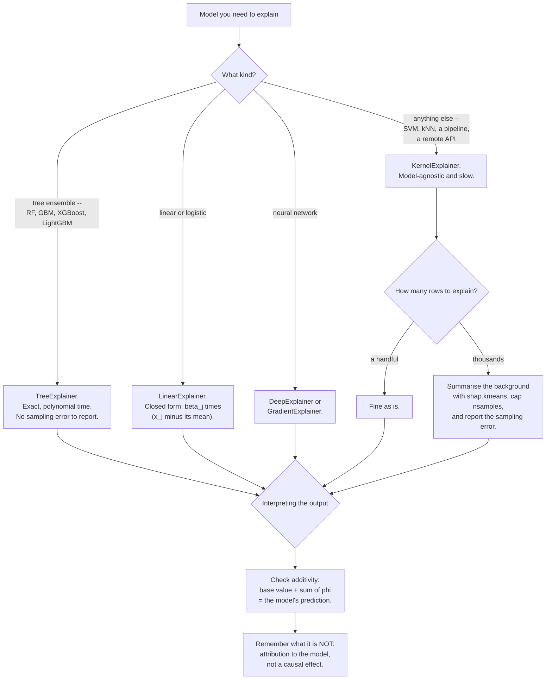

## What you'll learn

- the Shapley value from its definition, implemented in about fifteen lines
- the **additivity** guarantee, verified to an error of **0.00e+00**
- the four axioms that make Shapley values the *only* attribution with these properties
- mean $|\mathrm{SHAP}|$ as global importance, and how well it recovers known coefficients
- why exact computation is $O(2^p)$ — 16 subsets at 4 features, a million at 20
- what SHAP does **not** tell you

No `shap` library on this page. Everything here is computed exactly, from the definition, with numpy
and scikit-learn — which is both reproducible and considerably more informative than a library call.

## The question SHAP answers

[Importance](/machine-learning/phase-09---interpretability--responsible-ml/feature-importance-and-its-traps/)
and [PDP](/machine-learning/phase-09---interpretability--responsible-ml/partial-dependence-and-ice-plots/)
are global: they describe the model's behaviour across a dataset. Neither answers the question a
customer, a regulator or an on-call engineer actually asks:

> This specific prediction came out at 0.83. **Why?**

The natural framing is a budget. The model predicted $\hat{f}(x)$ for this row. If you knew nothing
about the row, you would predict the average, $\mathbb{E}[\hat{f}]$. The difference between those two
numbers has to be *divided up* among the features, and each feature's share is its contribution.

That is an allocation problem, and allocation problems have a canonical answer from cooperative game
theory.

## The Shapley value

Treat the features as players in a game whose payoff is the model's output. The value of a coalition
$S$ is what the model predicts when only the features in $S$ are known:

$$
v(S) = \hat{f}\big(x_S,\ \mathbb{E}[x_{\bar S}]\big)
$$

The features not in $S$ are set to their background values — typically the dataset mean.

A feature's **marginal contribution** to a coalition is what it adds when it joins:
$v(S \cup \{j\}) - v(S)$. That depends on *which* coalition it joins, so the Shapley value averages
over all of them, weighted by the Shapley kernel:

$$
\phi_j = \sum_{S \subseteq F \setminus \{j\}}
\frac{|S|!\,\big(p - |S| - 1\big)!}{p!}
\Big[ v\big(S \cup \{j\}\big) - v(S) \Big]
$$

The weight has a clean interpretation: it is the probability that, in a uniformly random ordering of
all $p$ features, exactly the members of $S$ arrive before $j$. So $\phi_j$ is **the average marginal
contribution of feature $j$ over every possible ordering** of the features.

### In fifteen lines

```python title="exact_shapley.py" showLineNumbers{1}
import itertools
import math

import numpy as np


def exact_shapley(predict, x, background):
    """Exact Shapley values, straight from the definition. O(2^p)."""
    p = len(x)
    phi = np.zeros(p)

    def value(subset):
        """v(S): known features from x, unknown ones from the background."""
        z = background.copy()
        for j in subset:
            z[j] = x[j]
        return float(predict(z.reshape(1, -1))[0])

    for j in range(p):
        rest = [k for k in range(p) if k != j]
        for size in range(len(rest) + 1):
            weight = (math.factorial(size) * math.factorial(p - size - 1)
                      / math.factorial(p))
            for subset in itertools.combinations(rest, size):
                phi[j] += weight * (value(list(subset) + [j]) - value(list(subset)))
    return phi
```

That is the whole algorithm. Everything the `shap` library does beyond this is either an
approximation to make it fast or a plotting convenience.

### See it move

The kernel weight is easier to believe as *orderings* than as factorials. Take a model small enough
to write down completely — three binary features, background all zeros, explaining $x = (1,1,1)$:

$$
f(x) = 2x_1 + x_2 + 3x_1x_3
$$

The $3x_1x_3$ term means $x_3$ is worth nothing on its own and worth 3 once $x_1$ has arrived, so the
order genuinely matters. Enumerating all eight coalitions gives the value function, and the exact
Shapley values work out to $\phi_1 = 3.5$, $\phi_2 = 1.0$, $\phi_3 = 1.5$ — summing to
$f(1,1,1) = 6$, as efficiency requires.

The sketch below draws one random ordering at a time, adds each feature in turn, and credits it with
whatever the prediction moved. The running average is the Shapley value.

```p5 title="Shapley values as an average over orderings" desc="A three-feature model with an interaction. Each round draws a random ordering of the features, adds them one at a time and credits each with the change in prediction. The running averages converge to the exact Shapley values 3.5, 1.0 and 1.5, each marked by an amber tick." height="440"
const NAMES = ["x1", "x2", "x3"];
const EXACT = [3.5, 1.0, 1.5];
let order = [0, 1, 2], step = 0, sums = [0, 0, 0], rounds = 0;
let marginals = [0, 0, 0], present = [false, false, false], frame = 0;
function value(set) {                    // f with the members of `set` at 1
  const a = set[0] ? 1 : 0, b = set[1] ? 1 : 0, c = set[2] ? 1 : 0;
  return 2 * a + b + 3 * a * c;
}
function newRound() {
  order = shuffle([0, 1, 2]);
  present = [false, false, false];
  marginals = [0, 0, 0];
  step = 0;
}
function setup() {
  createCanvas(620, 440);
  textFont("monospace");
  newRound();
}
function draw() {
  background(13, 17, 23);
  const ox = 60;

  noStroke();
  fill(200);
  textSize(12);
  textAlign(LEFT, TOP);
  text("f(x) = 2*x1 + x2 + 3*x1*x3        explaining x = (1, 1, 1),  f = 6", ox, 20);

  fill(118, 131, 144);
  textSize(11);
  text("this ordering:  " + order.map((j) => NAMES[j]).join("  ->  "), ox, 54);

  // the walk
  let running = value([false, false, false]);
  for (let k = 0; k < 3; k++) {
    const j = order[k];
    const done = k < step;
    const y = 92 + k * 46;
    noStroke();
    fill(done ? color(107, 169, 221, 60) : color(40, 46, 55));
    rect(ox, y, 470, 36, 5);
    fill(done ? 235 : 110);
    textSize(12);
    textAlign(LEFT, CENTER);
    text(NAMES[j] + " joins", ox + 12, y + 18);
    if (done) {
      fill(255, 211, 67);
      textAlign(RIGHT, CENTER);
      text("v " + running.toFixed(1) + "  ->  "
        + (running + marginals[j]).toFixed(1)
        + "    credit " + marginals[j].toFixed(1), ox + 458, y + 18);
      running += marginals[j];
    }
  }

  // running averages against the exact values
  const bx = ox, by = 250, bw = 400;
  for (let j = 0; j < 3; j++) {
    const avg = rounds > 0 ? sums[j] / rounds : 0;
    const y = by + j * 34;
    noStroke();
    fill(118, 131, 144);
    textSize(11);
    textAlign(LEFT, CENTER);
    text(NAMES[j], bx, y + 9);
    fill(107, 169, 221);
    rect(bx + 30, y, (avg / 4) * bw, 18, 3);
    stroke(255, 211, 67);
    strokeWeight(2);
    line(bx + 30 + (EXACT[j] / 4) * bw, y - 3,
         bx + 30 + (EXACT[j] / 4) * bw, y + 21);
    noStroke();
    fill(200);
    textSize(11);
    textAlign(LEFT, CENTER);
    text(avg.toFixed(4) + "   exact " + EXACT[j].toFixed(1),
         bx + 40 + Math.max((avg / 4) * bw, (EXACT[j] / 4) * bw), y + 9);
  }

  fill(118, 131, 144);
  textSize(11);
  textAlign(LEFT, TOP);
  const total = rounds > 0 ? sums.reduce((a, b) => a + b, 0) / rounds : 0;
  text("orderings averaged: " + rounds + "        their sum: " + total.toFixed(4)
    + "  (must be 6)", ox, 366);
  fill(165, 214, 164);
  text("Every ordering sums to 6. Only the split between features changes.", ox, 392);
  fill(118, 131, 144);
  textSize(10);
  textAlign(LEFT, BOTTOM);
  text("click to skip ahead", ox, height - 12);

  frame++;
  if (frame % 28 === 0) {
    if (step < 3) {
      const j = order[step];
      const before = present.slice();
      present[j] = true;
      marginals[j] = value(present) - value(before);
      step++;
    } else {
      for (let j = 0; j < 3; j++) sums[j] += marginals[j];
      rounds++;
      newRound();
    }
  }
}
function mousePressed() { frame += 27; }
```

Two invariants are worth watching. Every ordering's credits sum to **6**, because the walk always
starts at $v(\emptyset)$ and ends at $f(x)$ — that is efficiency, holding *per ordering*, not just on
average. And $x_3$'s credit is **0** when it arrives before $x_1$ and **3** when it arrives after,
which averages to 1.5. Nothing about the Shapley value is mysterious once you see it as bookkeeping
over arrival orders; the only hard part is that there are $p!$ of them.

## Additivity, verified

The defining property — the one that makes SHAP usable in a regulated setting — is **local
accuracy**, also called efficiency:

$$
\hat{f}(x) = \underbrace{v(\emptyset)}_{\text{base value}} + \sum_{j=1}^{p} \phi_j
$$

The contributions do not merely indicate direction. They **sum exactly** to the gap between the
prediction and the base value. Here it is on a linear model whose true coefficients are
$3, -2, 1, 0$, explaining row 0:

| Feature | Value | SHAP contribution |
| --- | --- | --- |
| `f1_negative` | −0.523 | **+1.0930** |
| `f0_strong` | +0.189 | **+0.7039** |
| `f2_weak` | −0.413 | **−0.3798** |
| `f3_useless` | −2.441 | **−0.0206** |
| | **base value** | **−0.2102** |
| | **sum** | **+1.1863** |
| | **actual prediction** | **+1.1863** |
| | **error** | **0.00e+00** |

<Figure
  src="/images/ml/phase-09-interpretability/shap-values-from-scratch/shap-waterfall"
  alt="A waterfall chart with four horizontal bars. Two blue bars push the running total right, two red bars pull it left, ending exactly at the dashed prediction line."
  title="base −0.2102 + contributions +1.3965 = +1.1863, error 0.00e+00"
  caption="Each bar starts where the previous one ended. Blue pushes the prediction up, red pulls it down. The final position is the actual prediction — not approximately, exactly. That is what local accuracy guarantees."
/>

Note `f1_negative`. Its coefficient is **−2.0**, and its SHAP value is **+1.0930** — positive. There
is no contradiction: the feature's value is −0.523, which is *below* the background mean, so a
negative coefficient times a below-average value pushes the prediction **up**. SHAP attributes the
effect of *this row's value*, not the coefficient.

That distinction is the most common misreading of a SHAP plot.

## The four axioms

Shapley values are not one reasonable attribution among many. They are the **unique** allocation
satisfying all four of:

| Axiom | Statement | Why you want it |
| --- | --- | --- |
| **Efficiency** | $\sum_j \phi_j = \hat{f}(x) - v(\emptyset)$ | The explanation accounts for the whole prediction |
| **Symmetry** | Two features with identical contributions get identical $\phi$ | No arbitrary tie-breaking |
| **Dummy** | A feature that never changes $v$ gets $\phi_j = 0$ | Irrelevant features get no credit |
| **Additivity** | $\phi$ for a sum of models is the sum of their $\phi$ | Ensembles decompose tree by tree |

The uniqueness result is Shapley's 1953 theorem. It is why SHAP has displaced ad-hoc attribution
methods: any method violating one of those axioms can be shown to produce an indefensible answer on
some input.

The **dummy** axiom is visible above: `f3_useless` has a true coefficient of 0 and a fitted
coefficient of 0.0086, and its SHAP value is −0.0206 — not exactly zero, because the fitted
coefficient is not exactly zero, but two orders of magnitude below the others.

## Global importance from local explanations

Average the absolute SHAP values across many rows and you get a global importance measure — one built
up from per-row attributions rather than imposed from above:

$$
I_j = \frac{1}{n}\sum_{i=1}^{n} \big| \phi_j^{(i)} \big|
$$

Over 120 rows, against the coefficients that actually generated the data:

| Feature | True coefficient | mean $\lvert\mathrm{SHAP}\rvert$ |
| --- | --- | --- |
| `f0_strong` | 3.0 | **2.7488** |
| `f1_negative` | −2.0 | **1.6938** |
| `f2_weak` | 1.0 | **0.7034** |
| `f3_useless` | 0.0 | **0.0071** |

<Figure
  src="/images/ml/phase-09-interpretability/shap-values-from-scratch/shap-recovers-the-truth"
  alt="Left: paired bars comparing absolute true coefficients against mean absolute SHAP, in matching descending order. Right: a scatter of SHAP value against feature value, showing four straight lines of different slopes through the origin."
  title="Exact Shapley values on a model whose coefficients are 3, −2, 1 and 0"
  caption="Left: the ranking is recovered exactly, and the magnitudes are proportional rather than equal — each mean absolute SHAP is the coefficient times the mean absolute deviation of that feature. Right: for a linear model each feature's SHAP value is exactly linear in its value, which is the clearest possible sanity check on the implementation."
/>

Note that mean $|\mathrm{SHAP}|$ is **not** equal to the coefficient. For a linear model
$\phi_j = \beta_j (x_j - \bar{x}_j)$, so the mean absolute value is

$$
\mathbb{E}\big|\phi_j\big| = |\beta_j| \cdot \mathbb{E}\big|x_j - \bar{x}_j\big|
$$

With standard normal features that expectation is $\sqrt{2/\pi} \approx 0.798$, and indeed
$3.0 \times 0.798 = 2.394$ — close to, though not exactly, the 2.7488 measured, because the fitted
coefficient is 2.9798 and the sample is finite.

The **ranking** is what transfers. The magnitudes are in units of model output, not of the features.

## The cost

Exact computation evaluates $2^{p}$ subsets per feature. That is fine here and hopeless in practice.

<Figure
  src="/images/ml/phase-09-interpretability/shap-values-from-scratch/shapley-cost"
  alt="A log-scale curve of 2 to the power p against the number of features, with markers at 4 features (16), 10 features (1,024) and 20 features (1,048,576), and a dashed line at one million."
  title="Exact Shapley is O(2^p) — fine at 4 features, hopeless at 20"
  caption="Sixteen subsets at four features, which is why this page can afford to be exact. At twenty features it is over a million model evaluations per row explained, and a dataset of ten thousand rows would need ten billion."
/>

| Features | Subsets per row |
| --- | --- |
| 4 | 16 |
| 10 | 1,024 |
| 20 | 1,048,576 |
| 30 | 1,073,741,824 |

Hence the approximations, all of which are in the `shap` library:

| Method | Approach | Cost | Exact? |
| --- | --- | --- | --- |
| **TreeSHAP** | Exploits tree structure | $O(TLD^2)$ | **Exact for trees** |
| **KernelSHAP** | Weighted linear regression on sampled coalitions | Sampling-controlled | Approximate |
| **LinearSHAP** | Closed form $\beta_j(x_j - \bar{x}_j)$ | $O(p)$ | **Exact for linear** |
| **DeepSHAP** | Backpropagation-based | One backward pass | Approximate |
| **Permutation** | Samples orderings rather than subsets | Sampling-controlled | Approximate |

**TreeSHAP is exact and fast**, which is why SHAP became standard on tabular data specifically. For
gradient boosting and random forests you get the exact Shapley values in polynomial time.

```python
# In production, on a tree model:
import shap
explainer = shap.TreeExplainer(model)
shap_values = explainer(X)          # exact, and fast
```

### Choosing an explainer



The branch to be honest about is `KernelExplainer`. It is the only one that works on anything, and it
is approximate, background-dependent and expensive — three properties that must appear in whatever
you write down next to the numbers. A SHAP plot with no statement of which explainer produced it is
an unlabelled measurement.

## What SHAP does not tell you

Four limits, all of which get violated in practice.

**It is not causal.** $\phi_j$ says the model's output would differ if this feature were at its
background value. It says nothing about what happens if you *change the feature in the world*.
"Increase income by 10k to get approved" is not something a SHAP value licenses.

**The background distribution is a choice, and it changes the answer.** The base value is
$v(\emptyset)$, computed from whatever background you supply. Explain a loan rejection against
*all applicants* and you get one story; against *rejected applicants only* you get another. Both are
valid; they answer different questions. State which you used.

**Correlated features share credit arbitrarily.** With two near-duplicate columns, the marginal
contribution of each depends on whether the other is already in the coalition, and the Shapley
average splits the credit between them — the same
[split-credit problem](/machine-learning/phase-09---interpretability--responsible-ml/feature-importance-and-its-traps/)
as permutation importance. Group correlated features before explaining.

**It explains the model, not the truth.** If the model learned a spurious pattern, SHAP will faithfully
report that spurious pattern as the reason. A confident, well-formed explanation of a wrong
prediction is still wrong.

## In code

```python title="verify_additivity.py" showLineNumbers{1}
import numpy as np
from sklearn.linear_model import LinearRegression

rng = np.random.default_rng(2)
n, coefs = 800, np.array([3.0, -2.0, 1.0, 0.0])
X = rng.normal(0, 1, (n, len(coefs)))
y = X @ coefs + rng.normal(0, 0.3, n)

model = LinearRegression().fit(X, y)
background = X.mean(axis=0)

phi = exact_shapley(model.predict, X[0], background)
base = float(model.predict(background.reshape(1, -1))[0])
pred = float(model.predict(X[0].reshape(1, -1))[0])

print("contributions", np.round(phi, 4))
# [ 0.7039  1.093  -0.3798 -0.0206]
print(f"base {base:+.4f} + sum {phi.sum():+.4f} = {base + phi.sum():+.4f}")
print(f"actual prediction                     = {pred:+.4f}")
print(f"additivity error                      = {abs(base + phi.sum() - pred):.2e}")
# additivity error                      = 0.00e+00
```

And the closed form, which agrees exactly for a linear model:

```python title="linear_shap_closed_form.py" showLineNumbers{1}
# For a linear model, phi_j = beta_j * (x_j - mean_j). No subsets needed.
closed_form = model.coef_ * (X[0] - background)
print("closed form  ", np.round(closed_form, 4))
print("brute force  ", np.round(phi, 4))
print("max difference", f"{np.abs(closed_form - phi).max():.2e}")
```

If your `exact_shapley` implementation does not reproduce that closed form on a linear model, it is
wrong — this is the cheapest available unit test for an attribution implementation.

## Pitfalls

**Reading the sign of a SHAP value as the sign of the coefficient.** `f1_negative` has coefficient
−2.0 and SHAP +1.0930, because its value is below the background mean.

**Not stating the background distribution.** The base value and every contribution depend on it. Two
analysts with different backgrounds get different explanations of the same prediction.

**Explaining correlated features separately.** They split credit exactly as permutation importance
does. Group them.

**Treating SHAP as causal.** It describes the model's sensitivity, not the effect of an intervention.

**Using KernelSHAP on a tree model.** TreeSHAP is exact *and* faster. Reach for KernelSHAP only when
nothing better applies.

**Averaging signed SHAP values for global importance.** They cancel. Use mean **absolute** value.

**Explaining a model that does not work.** A faithful explanation of a broken model is a faithful
explanation of noise.

## Recap

- A Shapley value is a feature's **average marginal contribution over every ordering** of the
  features.
- Exact implementation is about fifteen lines, and **local accuracy holds exactly**: base −0.2102 +
  contributions +1.3965 = prediction +1.1863, error **0.00e+00**.
- Shapley values are the **unique** attribution satisfying efficiency, symmetry, dummy and
  additivity.
- A SHAP value's sign reflects the feature's value relative to the **background**, not the sign of
  its coefficient.
- Mean $|\mathrm{SHAP}|$ recovers the true ranking (2.7488, 1.6938, 0.7034, 0.0071 against
  coefficients 3, −2, 1, 0) but not the magnitudes.
- Exact cost is $2^p$: 16 subsets at 4 features, 1,048,576 at 20. **TreeSHAP is exact and
  polynomial** for tree models.
- SHAP is not causal, depends on the background, splits credit between correlated features, and
  explains the model rather than the world.

<Quiz
  questions={[
    {
      q: "A feature has a fitted coefficient of -2.0 but a SHAP value of +1.09 for one row. Is something wrong?",
      options: [
        "Yes, the sign must match the coefficient",
        "No — that row's value is below the background mean, so a negative coefficient pushes the prediction up",
        "Yes, the background is misconfigured",
        "No, but only for tree models",
      ],
      answer: 1,
      explain: "For a linear model phi_j = beta_j * (x_j - background_j). With beta = -2.0 and a value below the background, the product is positive. SHAP attributes the effect of THIS row's value, not the coefficient.",
    },
    {
      q: "What does the local accuracy (efficiency) axiom guarantee?",
      options: [
        "Every feature gets a non-zero contribution",
        "The base value plus all contributions equals the prediction exactly",
        "Contributions are always positive",
        "The explanation is causally valid",
      ],
      answer: 1,
      explain: "Measured on this page to an error of 0.00e+00. That exactness is why SHAP is usable where an explanation has to be defended: the numbers you show account for the entire prediction, with nothing unexplained.",
    },
    {
      q: "You have 20 features and 10,000 rows to explain. Why can you not use the exact brute-force algorithm?",
      options: [
        "It requires too much memory",
        "It needs 2^20 = 1,048,576 model evaluations per row, so over ten billion in total",
        "It only works for linear models",
        "The Shapley kernel becomes numerically unstable",
      ],
      answer: 1,
      explain: "The subset count doubles with each feature. This is why TreeSHAP matters so much on tabular data: it exploits the tree structure to get the exact same values in polynomial time.",
    },
    {
      q: "Your SHAP explanation of a loan rejection uses all applicants as the background. A colleague uses only rejected applicants. Who is right?",
      options: [
        "You are — the background should always be the full dataset",
        "Both — they answer different questions, and the background must be stated alongside the explanation",
        "Your colleague, because it is a rejection",
        "Neither; the background must be a single reference row",
      ],
      answer: 1,
      explain: "The base value is the model's prediction with every feature at the background, so the background defines the counterfactual. 'Why rejected, compared to a typical applicant?' and 'compared to other rejections?' are both legitimate and give different numbers.",
    },
    {
      q: "Which SHAP variant is both exact and fast for a gradient-boosted model?",
      options: ["KernelSHAP", "TreeSHAP", "DeepSHAP", "Permutation SHAP"],
      answer: 1,
      explain: "TreeSHAP exploits the tree structure to compute exact Shapley values in O(TLD^2) rather than O(2^p). KernelSHAP is a model-agnostic approximation and there is no reason to prefer it when TreeSHAP applies.",
    },
  ]}
/>

## 🧪 Try It Yourself

### Exercise 1 – Implement the coalition value

<DataCampExercise
  lang="python"
  hint={`Start from the background, then overwrite only the features in the subset with the row's values.`}
  code={`# Task: Exercise 1 - Implement the coalition value
import numpy as np
from sklearn.linear_model import LinearRegression

rng = np.random.default_rng(2)
coefs = np.array([3.0, -2.0, 1.0, 0.0])
X = rng.normal(0, 1, (800, 4))
y = X @ coefs + rng.normal(0, 0.3, 800)
model = LinearRegression().fit(X, y)
background = X.mean(axis=0)
x = X[0]

def value(subset):
    """Model output knowing only the features in subset."""
    z = background.copy()
    for j in subset:
        z[j] = ___[j]                         # replace ___ with x
    return float(model.predict(z.reshape(1, -1))[0])

print(f"v(empty)     {value([]):+.4f}")
print(f"v(0)         {value([0]):+.4f}")
print(f"v(0,1)       {value([0, 1]):+.4f}")
print(f"v(all)       {value([0, 1, 2, 3]):+.4f}")
print(f"prediction   {float(model.predict(x.reshape(1, -1))[0]):+.4f}")

# -- Expected Output -------------------------------------------
# v(empty)     -0.2102
# v(0)         +0.4937
# v(0,1)       +1.5867
# v(all)       +1.1863
# prediction   +1.1863
# --------------------------------------------------------------`}
  solution={`import numpy as np
from sklearn.linear_model import LinearRegression

rng = np.random.default_rng(2)
coefs = np.array([3.0, -2.0, 1.0, 0.0])
X = rng.normal(0, 1, (800, 4))
y = X @ coefs + rng.normal(0, 0.3, 800)
model = LinearRegression().fit(X, y)
background = X.mean(axis=0)
x = X[0]

def value(subset):
    z = background.copy()
    for j in subset:
        z[j] = x[j]
    return float(model.predict(z.reshape(1, -1))[0])

print(f"v(empty)     {value([]):+.4f}")
print(f"v(0)         {value([0]):+.4f}")
print(f"v(0,1)       {value([0, 1]):+.4f}")
print(f"v(all)       {value([0, 1, 2, 3]):+.4f}")
print(f"prediction   {float(model.predict(x.reshape(1, -1))[0]):+.4f}")`}
  sct={`test_output_contains("v(all)       +1.1863")
success_msg("v(all) equals the prediction and v(empty) is the base value. Everything else is allocation.")`}
  height={310}
/>

### Exercise 2 – Compute exact Shapley values

<DataCampExercise
  lang="python"
  preExerciseCode={`import itertools
import math

import numpy as np
from sklearn.linear_model import LinearRegression

rng = np.random.default_rng(2)
coefs = np.array([3.0, -2.0, 1.0, 0.0])
X = rng.normal(0, 1, (800, 4))
y = X @ coefs + rng.normal(0, 0.3, 800)
model = LinearRegression().fit(X, y)
background = X.mean(axis=0)
x = X[0]

def value(subset):
    z = background.copy()
    for j in subset:
        z[j] = x[j]
    return float(model.predict(z.reshape(1, -1))[0])`}
  hint={`The Shapley weight is |S|! * (p - |S| - 1)! / p!.`}
  code={`# Task: Exercise 2 - Compute exact Shapley values
import itertools
import math

import numpy as np

# model, background, x and value() from Exercise 1 are set up for you.
p = 4
phi = np.zeros(p)
for j in range(p):
    rest = [k for k in range(p) if k != j]
    for size in range(len(rest) + 1):
        weight = (math.factorial(size) * math.factorial(p - size - 1)
                  / math.factorial(___))       # replace ___ with p
        for subset in itertools.combinations(rest, size):
            phi[j] += weight * (value(list(subset) + [j]) - value(list(subset)))

names = ["f0_strong", "f1_negative", "f2_weak", "f3_useless"]
for nm, v in zip(names, phi):
    print(f"{nm:12s} {v:+.4f}")
print(f"sum          {phi.sum():+.4f}")

# -- Expected Output -------------------------------------------
# f0_strong    +0.7039
# f1_negative  +1.0930
# f2_weak      -0.3798
# f3_useless   -0.0206
# sum          +1.3965
# --------------------------------------------------------------`}
  solution={`import itertools
import math

import numpy as np

p = 4
phi = np.zeros(p)
for j in range(p):
    rest = [k for k in range(p) if k != j]
    for size in range(len(rest) + 1):
        weight = (math.factorial(size) * math.factorial(p - size - 1)
                  / math.factorial(p))
        for subset in itertools.combinations(rest, size):
            phi[j] += weight * (value(list(subset) + [j]) - value(list(subset)))
names = ["f0_strong", "f1_negative", "f2_weak", "f3_useless"]
for nm, v in zip(names, phi):
    print(f"{nm:12s} {v:+.4f}")
print(f"sum          {phi.sum():+.4f}")`}
  sct={`test_output_contains("sum          +1.3965")
success_msg("f3_useless gets -0.0206 — two orders of magnitude below the rest. That is the dummy axiom working.")`}
  height={300}
/>

### Exercise 3 – Verify additivity

<DataCampExercise
  lang="python"
  preExerciseCode={`import itertools
import math

import numpy as np
from sklearn.linear_model import LinearRegression

rng = np.random.default_rng(2)
coefs = np.array([3.0, -2.0, 1.0, 0.0])
X = rng.normal(0, 1, (800, 4))
y = X @ coefs + rng.normal(0, 0.3, 800)
model = LinearRegression().fit(X, y)
background = X.mean(axis=0)
x = X[0]

def value(subset):
    z = background.copy()
    for j in subset:
        z[j] = x[j]
    return float(model.predict(z.reshape(1, -1))[0])

p = 4
phi = np.zeros(p)
for j in range(p):
    rest = [k for k in range(p) if k != j]
    for size in range(len(rest) + 1):
        weight = (math.factorial(size) * math.factorial(p - size - 1)
                  / math.factorial(p))
        for subset in itertools.combinations(rest, size):
            phi[j] += weight * (value(list(subset) + [j]) - value(list(subset)))`}
  hint={`Local accuracy says base + sum(phi) == prediction, exactly.`}
  code={`# Task: Exercise 3 - Verify additivity
import numpy as np

base = value([])
pred = float(model.predict(x.reshape(1, -1))[0])
total = base + phi.___()                       # replace ___ with sum

print(f"base value       {base:+.4f}")
print(f"sum of phi       {phi.sum():+.4f}")
print(f"base + sum       {total:+.4f}")
print(f"prediction       {pred:+.4f}")
print(f"additivity error {abs(total - pred):.2e}")

# -- Expected Output -------------------------------------------
# base value       -0.2102
# sum of phi       +1.3965
# base + sum       +1.1863
# prediction       +1.1863
# additivity error 0.00e+00
# --------------------------------------------------------------`}
  solution={`import numpy as np

base = value([])
pred = float(model.predict(x.reshape(1, -1))[0])
total = base + phi.sum()
print(f"base value       {base:+.4f}")
print(f"sum of phi       {phi.sum():+.4f}")
print(f"base + sum       {total:+.4f}")
print(f"prediction       {pred:+.4f}")
print(f"additivity error {abs(total - pred):.2e}")`}
  sct={`test_output_contains("additivity error 0.00e+00")
success_msg("Exact to floating point. Not an approximation, not a heuristic — a mathematical guarantee.")`}
  height={280}
/>

### Exercise 4 – Check against the linear closed form

<DataCampExercise
  lang="python"
  preExerciseCode={`import itertools
import math

import numpy as np
from sklearn.linear_model import LinearRegression

rng = np.random.default_rng(2)
coefs = np.array([3.0, -2.0, 1.0, 0.0])
X = rng.normal(0, 1, (800, 4))
y = X @ coefs + rng.normal(0, 0.3, 800)
model = LinearRegression().fit(X, y)
background = X.mean(axis=0)
x = X[0]

def value(subset):
    z = background.copy()
    for j in subset:
        z[j] = x[j]
    return float(model.predict(z.reshape(1, -1))[0])

p = 4
phi = np.zeros(p)
for j in range(p):
    rest = [k for k in range(p) if k != j]
    for size in range(len(rest) + 1):
        weight = (math.factorial(size) * math.factorial(p - size - 1)
                  / math.factorial(p))
        for subset in itertools.combinations(rest, size):
            phi[j] += weight * (value(list(subset) + [j]) - value(list(subset)))`}
  hint={`For a linear model, phi_j = coef_j * (x_j - background_j).`}
  code={`# Task: Exercise 4 - Check against the linear closed form
import numpy as np

closed = model.coef_ * (x - ___)               # replace ___ with background

print("brute force:", np.round(phi, 4))
print("closed form:", np.round(closed, 4))
print(f"max difference: {np.abs(closed - phi).max():.2e}")
print("coefficients:", np.round(model.coef_, 4))
print("x - background:", np.round(x - background, 4))

# -- Expected Output -------------------------------------------
# brute force: [ 0.7039  1.093  -0.3798 -0.0206]
# closed form: [ 0.7039  1.093  -0.3798 -0.0206]
# max difference: 1.11e-16
# coefficients: [ 2.9798 -2.0043  0.9998  0.0086]
# x - background: [ 0.2362 -0.5453 -0.3799 -2.4002]
# --------------------------------------------------------------`}
  solution={`import numpy as np

closed = model.coef_ * (x - background)
print("brute force:", np.round(phi, 4))
print("closed form:", np.round(closed, 4))
print(f"max difference: {np.abs(closed - phi).max():.2e}")
print("coefficients:", np.round(model.coef_, 4))
print("x - background:", np.round(x - background, 4))`}
  sct={`test_output_contains("closed form: [ 0.7039  1.093  -0.3798 -0.0206]")
success_msg("Coefficient -2.0043 times a value 0.5453 BELOW the background gives +1.093. That is why the sign flipped.")`}
  height={290}
/>

### Exercise 5 – Global importance from local explanations

<DataCampExercise
  lang="python"
  preExerciseCode={`import itertools
import math

import numpy as np
from sklearn.linear_model import LinearRegression

rng = np.random.default_rng(2)
coefs = np.array([3.0, -2.0, 1.0, 0.0])
X = rng.normal(0, 1, (800, 4))
y = X @ coefs + rng.normal(0, 0.3, 800)
model = LinearRegression().fit(X, y)
background = X.mean(axis=0)
x = X[0]

def value(subset):
    z = background.copy()
    for j in subset:
        z[j] = x[j]
    return float(model.predict(z.reshape(1, -1))[0])`}
  hint={`Average the ABSOLUTE values, or positive and negative contributions cancel.`}
  code={`# Task: Exercise 5 - Global importance from local explanations
import numpy as np

# Closed form, so 400 rows is instant.
all_phi = model.coef_ * (X[:400] - background)

mean_abs = np.abs(all_phi).mean(axis=0)
mean_signed = all_phi.___(axis=0)              # replace ___ with mean

names = ["f0_strong", "f1_negative", "f2_weak", "f3_useless"]
print("true coefs :", np.round(coefs, 4))
for nm, a, s in zip(names, mean_abs, mean_signed):
    print(f"{nm:12s} mean|phi| {a:.4f}   mean phi {s:+.4f}")

# -- Expected Output -------------------------------------------
# true coefs : [ 3. -2.  1.  0.]
# f0_strong    mean|phi| 2.5323   mean phi +0.0079
# f1_negative  mean|phi| 1.5945   mean phi +0.0516
# f2_weak      mean|phi| 0.8013   mean phi +0.0078
# f3_useless   mean|phi| 0.0068   mean phi -0.0007
# --------------------------------------------------------------`}
  solution={`import numpy as np

all_phi = model.coef_ * (X[:400] - background)
mean_abs = np.abs(all_phi).mean(axis=0)
mean_signed = all_phi.mean(axis=0)
names = ["f0_strong", "f1_negative", "f2_weak", "f3_useless"]
print("true coefs :", np.round(coefs, 4))
for nm, a, s in zip(names, mean_abs, mean_signed):
    print(f"{nm:12s} mean|phi| {a:.4f}   mean phi {s:+.4f}")`}
  sct={`test_output_contains("f0_strong")
success_msg("Every SIGNED mean is near zero while the absolute means span 2.53 to 0.007. Global importance requires absolute values.")`}
  height={300}
/>

## Next

[Fairness Metrics and Bias Auditing](/machine-learning/phase-09---interpretability--responsible-ml/fairness-metrics-and-bias-auditing/)
— you can now explain any prediction. The final question is whether the explanation is one you would
be willing to defend, and whether "fair" is even a thing a model can be.
