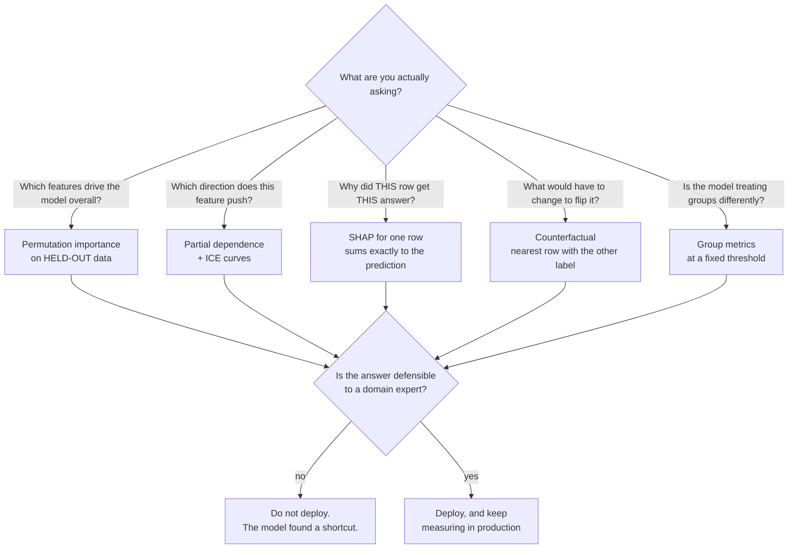

## What you'll learn

- why a **0.9642** held-out score is not evidence that a model works
- the accuracy-versus-transparency trade-off, **measured**: a 0.0651 accuracy spread against a
  **1,803×** spread in how much you have to read
- the difference between **global** and **local** explanations, and why one does not give you the other
- the four questions interpretability actually answers, and which tool answers each
- what "the model is 0.96 accurate" leaves out, and how a single permutation catches it
- where interpretability is a legal requirement rather than a nice-to-have

## A model that was right for the wrong reason

Two hospitals, one disease, one dataset each. Both datasets contain the same honest clinical
`marker`, and both contain `scanner_id` — which machine took the image. At the training hospital,
the sick were almost all scanned on machine 1, purely because of how the wards were laid out. The
correlation between `scanner_id` and the diagnosis there is **0.9460**.

At the second hospital, scanners were assigned as patients arrived. Correlation: **−0.0007**.

Train a random forest on the first hospital's data and hold out 30% of it:

```python title="the_number_that_convinced_everyone.py" showLineNumbers{1}
full = RandomForestClassifier(n_estimators=300, min_samples_leaf=50,
                              random_state=0).fit(X_train, y_train)

print(f"{full.score(X_holdout, y_holdout):.4f}")   # 0.9642
```

**0.9642.** A clean train/test split, no leakage across the split, no tuning on the test set. Every
methodological rule in [Phase 02](/machine-learning/phase-02---data-preprocessing--feature-engineering/creating-a-test-set-avoiding-data-snooping/)
was followed. This model ships.

Now run it at the second hospital.

<Figure
  src="/images/ml/phase-09-interpretability/why-interpretability-matters/shortcut-feature"
  alt="Left: grouped bars. The both-features model scores 0.9642 on the training site and 0.4998 at the new site, below the dashed coin-flip line. The marker-only model scores 0.6867 and 0.6910. Right: a horizontal bar chart where scanner_id has permutation importance +0.4623 and marker +0.0000."
  title="0.9642 at home, 0.4998 next door"
  caption="The model that scored 0.9642 is worth exactly nothing at the new site — 0.4998 is a coin flip. The model that scored only 0.6867, because it was never given the shortcut, holds up at 0.6910. Permutation importance on the training site's own held-out data already said why: all of the model's accuracy came from scanner_id, and none from the patient."
/>

**0.4998.** Not degraded — *worthless*. And the model that looked worse, the one trained on `marker`
alone, went from 0.6867 to 0.6910: unchanged, because it learned something true.

Nothing about accuracy could have warned you. The held-out score was honest about what it measured;
it just measured a world where the shortcut held. Only a question about *mechanism* separates the two
models before deployment, and interpretability is the vocabulary for asking it:

```python title="the_question_that_would_have_caught_it.py" showLineNumbers{1}
from sklearn.inspection import permutation_importance

pi = permutation_importance(full, X_holdout, y_holdout, n_repeats=30, random_state=0)
for name, mean, sd in zip(X.columns, pi.importances_mean, pi.importances_std):
    print(f"{name:12s} {mean:+.4f} +- {sd:.4f}")

# marker       +0.0000 +- 0.0000
# scanner_id   +0.4623 +- 0.0155
```

`marker` contributes **+0.0000**, to four decimal places, with a standard deviation of 0.0000 across
30 shuffles. The clinical signal is not being used *at all*. Every point of accuracy above chance
comes from the scanner ID. That is a sentence you can take to a domain expert, and any radiologist
would have stopped the deployment on the spot.

:::caution[The general shape of this failure]
A model exploits a correlation that is real in your data and absent in the world. Accuracy validates
the correlation. Only interpretability reveals which correlation was used — and only a human who
knows the domain can judge whether it should have been.
:::

## The trade-off is real, and much smaller than its reputation

The standard defence of black boxes is that transparency costs accuracy. Measure it. Five models on
the Wisconsin breast-cancer data, 5-fold cross-validation, and alongside each one the count of
numbers a human would have to read to know exactly what it does — coefficients for the linear model,
nodes across the whole ensemble for the forest:

<Figure
  src="/images/ml/phase-09-interpretability/why-interpretability-matters/accuracy-versus-transparency"
  alt="Left: five bars of 5-fold accuracy between 0.9156 and 0.9807, all clustered near the top of the axis. Right: the same models on a log scale of readable numbers, from 7 for the depth-2 tree to 12,624 for the random forest."
  title="Accuracy varies by 0.0651. How much you have to read varies by 1,803x."
  caption="The most accurate model on this dataset is logistic regression at 0.9807 — with 31 numbers you can print. The random forest needs 12,624 and scores 0.9631. The trade-off between accuracy and transparency exists, but on tabular data of this size it is usually far weaker than assumed, and it sometimes runs the other way."
/>

| Model | 5-fold accuracy | Numbers you must read |
| --- | --- | --- |
| depth-2 tree | 0.9280 | **7** |
| logistic regression | **0.9807** | 31 |
| depth-5 tree | 0.9156 | 35 |
| random forest, 300 trees | 0.9631 | **12,624** |
| hist gradient boosting | 0.9648 | not enumerable |

The whole accuracy range is **0.0651**, and the most accurate model here is the *fully transparent*
one. Reading effort ranges over **1,803×**.

This is one dataset, and it is deliberately favourable to linear models — thirty engineered,
well-scaled features and a nearly linearly separable target. On high-dimensional unstructured data
(images, audio, text) the gap is genuine and large. The honest summary is:

- On **tabular** data of modest size, always fit the transparent baseline first. It frequently wins,
  and when it loses it usually loses by less than the effort of explaining the winner costs you.
- When the black box does win by a margin that matters, you have not bought an excuse to skip
  interpretability. You have bought an *obligation* to add it, because the model is now the only
  place that knowledge lives.

:::tip[Two directions, not one]
**Interpretable by design** — pick a model you can read: linear, a shallow tree, a rule list, a
generalized additive model. The explanation *is* the model, so it cannot be wrong.

**Post-hoc explanation** — fit whatever you like, then approximate its behaviour with
[importance](/machine-learning/phase-09---interpretability--responsible-ml/feature-importance-and-its-traps/),
[PDP](/machine-learning/phase-09---interpretability--responsible-ml/partial-dependence-and-ice-plots/)
or [SHAP](/machine-learning/phase-09---interpretability--responsible-ml/shap-values-from-scratch/).
The explanation is a *second model of the first one*, and second models have error.
:::

## Global and local are different questions

<Figure
  src="/images/ml/phase-09-interpretability/why-interpretability-matters/global-versus-local"
  alt="Two rounded boxes side by side. GLOBAL lists permutation importance, partial dependence and mean absolute SHAP, used for audits and feature selection. LOCAL lists SHAP for one row, LIME and counterfactuals, used for appeals and debugging."
  title="Two questions interpretability answers"
  caption="Global methods describe the model's average behaviour; local methods explain a single decision. Averaging local explanations reconstructs the global picture, but no amount of global information tells you why one particular row got its answer."
/>

The asymmetry is worth stating precisely, because it is the reason the following pages exist in the
order they do. Let $\phi_j^{(i)}$ be feature $j$'s contribution to row $i$. Global importance is an
average over rows:

$$
I_j = \frac{1}{n}\sum_{i=1}^{n} \big|\phi_j^{(i)}\big|
$$

The map from the collection $\{\phi_j^{(i)}\}$ to $I_j$ throws information away and cannot be
inverted. Concretely, on the four-feature linear model used throughout this phase — true
coefficients $3, -2, 1, 0$ — the global picture is unambiguous:

| Feature | mean $\lvert\phi_j\rvert$ over 400 rows | Rows where it is the largest contribution |
| --- | --- | --- |
| `f0_strong` | **2.5323** | 234 of 400 |
| `f1_negative` | 1.5945 | 123 of 400 |
| `f2_weak` | 0.8013 | **43 of 400** |
| `f3_useless` | 0.0068 | 0 of 400 |

`f2_weak` is third by a wide margin globally. It is nevertheless the *decisive* feature on 43 rows —
more than one in ten. Row 102 is one of them:

```text title="row 102"
x    = [ 0.0367  0.2920 -2.5791  0.5549]
phi  = [+0.2500 -0.5400 -2.5453 +0.0051]
base = -0.2102     prediction = -3.0404
```

The prediction is $-3.0404$ and the third feature accounts for $-2.5453$ of the $-2.8302$ move away
from the base value. If this were a declined loan, the applicant's answer is `f2_weak` — the feature
the global report calls minor. Show them the global chart and you have told them something true
about the model and false about their case.

And `f3_useless`, whose true coefficient is exactly zero, is the largest contribution on **0** of 400
rows. Genuine irrelevance survives both views.

## Which tool for which question



Every arrow out of that first node is a different computation, and picking the wrong one produces a
confident answer to a question nobody asked. The most common mismatch in practice: reaching for
global importance when the question was about one person.

## Where it stops being optional

Three situations turn interpretability from good engineering into a requirement.

**Contestable decisions.** Credit, hiring, insurance, benefits, admissions. Under the EU's GDPR
(Article 22 and the surrounding recitals) a person subject to a significant automated decision has
rights of contestation, which in practice requires the deciding organisation to be able to say
something specific about the individual decision. Whatever the precise legal reading — and it is
still argued — a per-row explanation is the only artefact that answers "why me". That is a **local**
requirement, so mean importance does not satisfy it.

**Safety-critical and clinical settings.** A model that recommends a treatment is used by someone who
must be able to override it. An override requires a reason, and a reason requires knowing what the
model looked at. The scanner-ID failure above is the canonical example, and it is not hypothetical:
shortcut learning from acquisition artefacts is a recurring finding in medical imaging.

**Anything you will have to debug.** This one applies to every model you will ever build. When
accuracy falls in production, "which features is it leaning on now, compared with training?" is the
first useful question. If you cannot answer it, your only remaining move is to retrain and hope —
see [Monitoring Model Drift](/machine-learning/phase-08---model-deployment-mlops/monitoring-model-drift/).

## See it move

The shortcut model does not fail because the world changed a lot. It fails because *one* correlation
weakened. Consider the crudest possible shortcut model — the rule "predict sick if `scanner_id` is
1" — and an honest model that thresholds `marker` at 0.5. Both accuracies are exactly computable.

If the deployment site's leak strength is $\ell$ (the fraction of patients whose scanner matches
their diagnosis, the rest assigned at random), the shortcut rule is correct with probability

$$
\text{acc}_{\text{shortcut}}(\ell) = \ell + \tfrac{1}{2}(1 - \ell) = \tfrac{1 + \ell}{2}
$$

while the honest rule sits at $\Phi(0.5) \approx 0.6915$ regardless, because it reads a signal that
travels. Drag to move the new site's leak strength and watch the crossover.

```p5 title="A shortcut's accuracy is a property of the site, not the model" desc="Dragging left weakens the correlation between scanner ID and diagnosis at the deployment site. The shortcut rule's accuracy falls along (1+leak)/2 while the marker rule holds flat at 0.6915, and the two cross at leak 0.3830." height="380"
let leak = 0.95;
const HONEST = 0.69146;              // Phi(0.5)
const CROSS = 2 * HONEST - 1;        // 0.38293
function setup() {
  createCanvas(620, 380);
  textFont("monospace");
}
function draw() {
  background(13, 17, 23);
  const ox = 70, oy = 60, w = 480, h = 210;

  if (mouseIsPressed && mouseX > ox - 20 && mouseX < ox + w + 20) {
    leak = constrain((mouseX - ox) / w, 0, 1);
  }
  const shortcut = (1 + leak) / 2;

  const px = (v) => ox + v * w;
  const py = (v) => oy + h - ((v - 0.4) / 0.62) * h;

  stroke(35, 42, 51);
  strokeWeight(1);
  for (let g = 0.4; g <= 1.001; g += 0.1) {
    line(ox, py(g), ox + w, py(g));
    noStroke();
    fill(118, 131, 144);
    textSize(10);
    textAlign(RIGHT, CENTER);
    text(g.toFixed(1), ox - 8, py(g));
    stroke(35, 42, 51);
  }
  noStroke();

  // the shortcut rule: (1 + leak) / 2
  stroke(232, 110, 110);
  strokeWeight(2.4);
  noFill();
  beginShape();
  for (let l = 0; l <= 1.0001; l += 0.02) vertex(px(l), py((1 + l) / 2));
  endShape();

  // the honest rule: flat
  stroke(165, 214, 164);
  line(ox, py(HONEST), ox + w, py(HONEST));

  // crossover
  stroke(118, 131, 144);
  strokeWeight(1);
  drawingContext.setLineDash([4, 4]);
  line(px(CROSS), oy, px(CROSS), oy + h);
  drawingContext.setLineDash([]);
  noStroke();
  fill(118, 131, 144);
  textSize(10);
  textAlign(CENTER, TOP);
  text("crossover " + CROSS.toFixed(4), px(CROSS), oy + h + 8);

  // the current site
  stroke(255, 211, 67);
  strokeWeight(1.6);
  line(px(leak), oy, px(leak), oy + h);
  noStroke();
  fill(232, 110, 110);
  circle(px(leak), py(shortcut), 9);
  fill(165, 214, 164);
  circle(px(leak), py(HONEST), 9);

  fill(118, 131, 144);
  textSize(11);
  textAlign(CENTER, TOP);
  text("leak strength at the deployment site", ox + w / 2, oy + h + 30);
  textAlign(RIGHT, CENTER);
  fill(200);
  push();
  translate(ox - 40, oy + h / 2);
  rotate(-HALF_PI);
  textAlign(CENTER, CENTER);
  text("accuracy", 0, 0);
  pop();

  textAlign(LEFT, TOP);
  fill(255, 211, 67);
  textSize(12);
  text("leak = " + leak.toFixed(4), ox, 16);
  fill(232, 110, 110);
  text("scanner_id rule  " + shortcut.toFixed(4), ox + 170, 16);
  fill(165, 214, 164);
  text("marker rule  " + HONEST.toFixed(4), ox + 380, 16);

  fill(shortcut > HONEST ? color(232, 110, 110) : color(165, 214, 164));
  textSize(12);
  textAlign(LEFT, BOTTOM);
  const verdict = shortcut > HONEST
    ? "The shortcut still wins here. It has learned nothing."
    : "The shortcut now loses to a rule that reads the patient.";
  text(verdict, ox, height - 30);
  fill(118, 131, 144);
  textSize(10);
  text("drag anywhere across the plot to change the site", ox, height - 12);
}
```

Two things are worth noticing. The shortcut's accuracy is a straight line in $\ell$ — **a property
of the site, not of the model** — and at the training site's $\ell = 0.95$ it reads 0.9750, comfortably
above the honest rule's 0.6915. Any selection procedure that compares held-out scores at one site
will pick the shortcut every time. And at $\ell = 0$ the shortcut is not merely worse, it is at 0.5000,
which is what "no information" looks like.

## In code: the four-line audit

Before any model goes anywhere, run this. It is cheap and it has caught real bugs.

```python title="pre_deployment_audit.py" showLineNumbers{1}
"""The smallest interpretability check worth running on every model."""

import numpy as np
from sklearn.inspection import permutation_importance


def audit(model, X_holdout, y_holdout, expectations=None, n_repeats=30):
    """Print what the model leans on, and flag anything the domain did not expect.

    `expectations` is a set of column names a domain expert said should matter.
    Anything important that is NOT in that set is the interesting output.
    """
    pi = permutation_importance(model, X_holdout, y_holdout,
                                n_repeats=n_repeats, random_state=0)
    order = np.argsort(pi.importances_mean)[::-1]
    total = pi.importances_mean[pi.importances_mean > 0].sum()

    print(f"{'feature':22s} {'importance':>12s} {'sd':>8s} {'share':>7s}")
    for i in order:
        name = X_holdout.columns[i]
        mean, sd = pi.importances_mean[i], pi.importances_std[i]
        share = mean / total if total > 0 and mean > 0 else 0.0
        flag = ""
        if expectations is not None and name not in expectations and share > 0.10:
            flag = "  <-- NOT EXPECTED TO MATTER"
        if mean < -2 * sd:
            flag = "  <-- ACTIVELY MISLEADING"
        print(f"{name:22s} {mean:+12.4f} {sd:8.4f} {share:6.1%}{flag}")


audit(full, X_holdout, y_holdout, expectations={"marker"})
# feature                  importance       sd   share
# scanner_id                  +0.4623   0.0155 100.0%  <-- NOT EXPECTED TO MATTER
# marker                      +0.0000   0.0000   0.0%
```

The `expectations` argument is the part people skip, and it is the part that does the work. A ranked
list of importances is data; a ranked list *checked against what a domain expert expected* is a
finding. On the shortcut model it prints in one line what a month in production would have taught
you the expensive way.

:::note[Interpretability is not the same as trust]
An explanation tells you what the model did. It does not tell you the model is right. In the
shortcut case the explanation was completely accurate — `scanner_id` really did drive the
prediction — and the model was completely useless. The explanation's job is to make the model's
reasoning *available for judgement*; the judgement still has to come from someone who knows the
domain.
:::

## Pitfalls

| Pitfall | Why it bites | What to do |
| --- | --- | --- |
| Treating a high held-out score as validation of *mechanism* | The split cannot detect a correlation that holds throughout your dataset and nowhere else | Audit importances, and check them against domain expectation |
| Answering "why me" with global importance | Global is an average; on 43 of 400 rows a globally third-ranked feature is decisive | Use per-row attribution for per-row questions |
| Explaining the model when the question was about the world | Attributions describe the fitted function, not the causal structure | State the distinction explicitly in reports; causal claims need a causal design |
| Assuming the black box is worth it | Accuracy spread of 0.0651 against a 1,803× readability spread on this dataset | Always fit the transparent baseline first, and record both numbers |
| Explaining only the model you shipped | The shortcut is easiest to see by *comparison* | Also audit a model trained without the suspect feature |
| Producing explanations no human ever reads | An unread SHAP plot has the same value as no SHAP plot | Put the audit in CI, with expectations encoded, so it fails loudly |

## Recap

- A forest scored **0.9642** on a clean held-out split and **0.4998** at the next site, because it
  read `scanner_id` (correlation 0.9460 there, −0.0007 elsewhere) rather than the patient.
- The model that scored **0.6867** without the shortcut held up at **0.6910**. The worse model
  transferred.
- Permutation importance on the *training site's own* held-out data already said so:
  `scanner_id` **+0.4623**, `marker` **+0.0000 ± 0.0000**.
- Measured on the breast-cancer data, accuracy spans **0.0651** across five models while reading
  effort spans **1,803×** — and the most accurate model is the transparent one, at 0.9807.
- Global and local are different questions. `f2_weak` is third globally (mean $|\phi|$ 0.8013) and
  decisive on **43 of 400** rows.
- Averaging local explanations gives the global picture. The reverse is impossible.

<Quiz
  questions={[
    {
      q: "A model scores 0.9642 on a properly held-out split from the training site and 0.4998 at a new site. What does the first number tell you?",
      options: [
        "The model generalises well",
        "That the model reproduces whatever correlations hold in that dataset — including ones that exist nowhere else",
        "The test set was too small",
        "There was leakage across the split",
      ],
      answer: 1,
      explain: "There was no leakage across the split: the shortcut correlation held throughout the site's data, train and test alike. A held-out score measures generalisation to the same distribution, and says nothing about mechanism. Only an importance audit revealed that 100% of the model's edge came from scanner_id.",
    },
    {
      q: "Why is the marker-only model, at 0.6867 on the training site, the better model to deploy?",
      options: [
        "It is simpler, and simpler is always better",
        "Its accuracy comes from a signal that exists at both sites, so it holds at 0.6910 where the stronger model collapses to 0.4998",
        "It trains faster",
        "It has fewer features, so it cannot overfit",
      ],
      answer: 1,
      explain: "Not simplicity for its own sake — transferability. 0.6867 to 0.6910 is essentially unchanged, and it sits just under the 0.6915 ceiling that marker alone allows. The other model's extra 0.28 of accuracy was rented from one hospital's ward layout.",
    },
    {
      q: "Permutation importance reports marker at +0.0000 with a standard deviation of 0.0000. What does that mean?",
      options: [
        "marker is uncorrelated with the target",
        "The model does not use marker at all — shuffling it changes nothing, across all 30 repeats",
        "marker needs scaling",
        "The calculation failed",
      ],
      answer: 1,
      explain: "marker is genuinely predictive — a model given only that column reaches 0.6867. The zero is a statement about the model, not the feature: with scanner_id available the forest never needed to split on marker, so destroying it costs nothing.",
    },
    {
      q: "f2_weak has mean |SHAP| of 0.8013, third of four features. Can you tell an applicant their decision was mostly not about f2_weak?",
      options: [
        "Yes — the global ranking applies to every row",
        "No — it is the largest contribution on 43 of 400 rows, and on row 102 it accounts for -2.5453 of a -2.8302 move",
        "Yes, if the model is linear",
        "Only if you also report the standard deviation",
      ],
      answer: 1,
      explain: "Global importance is an average over rows and cannot be inverted back to any individual row. For a per-row question you need a per-row attribution; the model here is even linear, and the mismatch still appears.",
    },
    {
      q: "On the breast-cancer data, logistic regression scores 0.9807 with 31 readable numbers and the 300-tree forest scores 0.9631 with 12,624. What is the correct lesson?",
      options: [
        "Never use ensembles",
        "Fit the transparent baseline first and record both numbers — the trade-off is often much weaker than assumed, and sometimes reversed",
        "Accuracy does not matter",
        "Tabular data does not need ensembles",
      ],
      answer: 1,
      explain: "One dataset does not overturn ensembles, and on unstructured data the gap is real and large. The lesson is procedural: measure the trade-off instead of assuming it, because a 0.0651 total spread rarely justifies 1,803x the reading effort.",
    },
  ]}
/>

## 🧪 Try It Yourself

### Exercise 1 – Measure the trade-off instead of assuming it

<DataCampExercise
  lang="python"
  hint={`cross_val_score returns one score per fold; take the mean. The forest's size is the sum of node_count over estimators_.`}
  code={`# Task: Exercise 1 - Measure the trade-off instead of assuming it
from sklearn.datasets import load_breast_cancer
from sklearn.ensemble import RandomForestClassifier
from sklearn.linear_model import LogisticRegression
from sklearn.model_selection import cross_val_score
from sklearn.pipeline import make_pipeline
from sklearn.preprocessing import StandardScaler
from sklearn.tree import DecisionTreeClassifier

X, y = load_breast_cancer(return_X_y=True)
models = {
    "depth-2 tree": DecisionTreeClassifier(max_depth=2, random_state=0),
    "logistic regression": make_pipeline(StandardScaler(),
                                         LogisticRegression(max_iter=5000)),
    "random forest": RandomForestClassifier(n_estimators=300, random_state=0),
}

for name, est in models.items():
    acc = cross_val_score(est, X, y, cv=5).___()      # replace ___ with mean
    est.fit(X, y)
    if name == "logistic regression":
        size = est[-1].coef_.size + 1
    elif name == "random forest":
        size = sum(t.tree_.node_count for t in est.estimators_)
    else:
        size = est.tree_.node_count
    print(f"{name:20s} accuracy {acc:.4f}   numbers to read {size:>6,d}")

# -- Expected Output -------------------------------------------
# depth-2 tree         accuracy 0.9280   numbers to read      7
# logistic regression  accuracy 0.9807   numbers to read     31
# random forest        accuracy 0.9631   numbers to read 12,624
# --------------------------------------------------------------`}
  solution={`from sklearn.datasets import load_breast_cancer
from sklearn.ensemble import RandomForestClassifier
from sklearn.linear_model import LogisticRegression
from sklearn.model_selection import cross_val_score
from sklearn.pipeline import make_pipeline
from sklearn.preprocessing import StandardScaler
from sklearn.tree import DecisionTreeClassifier

X, y = load_breast_cancer(return_X_y=True)
models = {
    "depth-2 tree": DecisionTreeClassifier(max_depth=2, random_state=0),
    "logistic regression": make_pipeline(StandardScaler(),
                                         LogisticRegression(max_iter=5000)),
    "random forest": RandomForestClassifier(n_estimators=300, random_state=0),
}
for name, est in models.items():
    acc = cross_val_score(est, X, y, cv=5).mean()
    est.fit(X, y)
    if name == "logistic regression":
        size = est[-1].coef_.size + 1
    elif name == "random forest":
        size = sum(t.tree_.node_count for t in est.estimators_)
    else:
        size = est.tree_.node_count
    print(f"{name:20s} accuracy {acc:.4f}   numbers to read {size:>6,d}")`}
  sct={`test_output_contains("logistic regression  accuracy 0.9807")
success_msg("The most accurate model here is the one you can print in full: 0.9807 from 31 numbers.")`}
  height={330}
/>

### Exercise 2 – Build a shortcut and watch it die

<DataCampExercise
  lang="python"
  hint={`One generator, two sites. The leak strength is the probability that a patient's scanner matches their diagnosis; the second site uses 0.00.`}
  code={`# Task: Exercise 2 - Build a shortcut and watch it die
import numpy as np
import pandas as pd
from sklearn.ensemble import RandomForestClassifier
from sklearn.model_selection import train_test_split

rng = np.random.default_rng(11)

def block(leak, n=4000):
    """marker is honest and identical at both sites; scanner_id leaks by 'leak'."""
    sick = rng.integers(0, 2, n)
    marker = rng.normal(sick * 1.0, 1.0, n)
    follows = rng.random(n) < leak
    scanner = np.where(follows, sick, rng.integers(0, 2, n))
    return pd.DataFrame({"marker": marker, "scanner_id": scanner}), sick

X_a, y_a = block(0.95)      # training hospital: the wards created a shortcut
X_b, y_b = block(0.00)      # new hospital: scanners assigned at random

X_tr, X_te, y_tr, y_te = train_test_split(X_a, y_a, test_size=0.3, random_state=0)
full = RandomForestClassifier(n_estimators=300, min_samples_leaf=50,
                              random_state=0).fit(X_tr, y_tr)

print(f"corr(scanner_id, y) site A {np.corrcoef(X_a['scanner_id'], y_a)[0, 1]:+.4f}")
print(f"corr(scanner_id, y) site B {np.corrcoef(X_b['scanner_id'], y_b)[0, 1]:+.4f}")
print(f"held-out accuracy, site A  {full.score(X_te, y_te):.4f}")
print(f"accuracy at site B         {full.score(___, y_b):.4f}")   # replace ___ with X_b

# -- Expected Output -------------------------------------------
# corr(scanner_id, y) site A +0.9460
# corr(scanner_id, y) site B -0.0007
# held-out accuracy, site A  0.9642
# accuracy at site B         0.4998
# --------------------------------------------------------------`}
  solution={`import numpy as np
import pandas as pd
from sklearn.ensemble import RandomForestClassifier
from sklearn.model_selection import train_test_split

rng = np.random.default_rng(11)

def block(leak, n=4000):
    sick = rng.integers(0, 2, n)
    marker = rng.normal(sick * 1.0, 1.0, n)
    follows = rng.random(n) < leak
    scanner = np.where(follows, sick, rng.integers(0, 2, n))
    return pd.DataFrame({"marker": marker, "scanner_id": scanner}), sick

X_a, y_a = block(0.95)
X_b, y_b = block(0.00)
X_tr, X_te, y_tr, y_te = train_test_split(X_a, y_a, test_size=0.3, random_state=0)
full = RandomForestClassifier(n_estimators=300, min_samples_leaf=50,
                              random_state=0).fit(X_tr, y_tr)
print(f"corr(scanner_id, y) site A {np.corrcoef(X_a['scanner_id'], y_a)[0, 1]:+.4f}")
print(f"corr(scanner_id, y) site B {np.corrcoef(X_b['scanner_id'], y_b)[0, 1]:+.4f}")
print(f"held-out accuracy, site A  {full.score(X_te, y_te):.4f}")
print(f"accuracy at site B         {full.score(X_b, y_b):.4f}")`}
  sct={`test_output_contains("accuracy at site B         0.4998")
success_msg("0.9642 becomes 0.4998 - a coin flip - and no split of site A's data could have told you.")`}
  height={330}
/>

### Exercise 3 – Ask the model what it read

<DataCampExercise
  lang="python"
  preExerciseCode={`import numpy as np
import pandas as pd
from sklearn.ensemble import RandomForestClassifier
from sklearn.model_selection import train_test_split

rng = np.random.default_rng(11)

def block(leak, n=4000):
    sick = rng.integers(0, 2, n)
    marker = rng.normal(sick * 1.0, 1.0, n)
    follows = rng.random(n) < leak
    scanner = np.where(follows, sick, rng.integers(0, 2, n))
    return pd.DataFrame({"marker": marker, "scanner_id": scanner}), sick

X_a, y_a = block(0.95)
X_b, y_b = block(0.00)
X_tr, X_te, y_tr, y_te = train_test_split(X_a, y_a, test_size=0.3, random_state=0)
full = RandomForestClassifier(n_estimators=300, min_samples_leaf=50,
                              random_state=0).fit(X_tr, y_tr)`}
  hint={`permutation_importance on the held-out split of site A. Print the standard deviation too — it is what makes +0.0000 conclusive.`}
  code={`# Task: Exercise 3 - Ask the model what it read
from sklearn.inspection import permutation_importance

# X_a, full, X_te and y_te (Exercise 2's data and forest) are set up for you.
pi = permutation_importance(full, X_te, ___, n_repeats=30, random_state=0)
# replace ___ with y_te

for name, mean, sd in zip(X_a.columns, pi.importances_mean, pi.importances_std):
    print(f"{name:12s} {mean:+.4f} +- {sd:.4f}")

# -- Expected Output -------------------------------------------
# marker       +0.0000 +- 0.0000
# scanner_id   +0.4623 +- 0.0155
# --------------------------------------------------------------`}
  solution={`from sklearn.inspection import permutation_importance

pi = permutation_importance(full, X_te, y_te, n_repeats=30, random_state=0)
for name, mean, sd in zip(X_a.columns, pi.importances_mean, pi.importances_std):
    print(f"{name:12s} {mean:+.4f} +- {sd:.4f}")`}
  sct={`test_output_contains("scanner_id   +0.4623")
success_msg("marker at +0.0000 with sd 0.0000 across 30 shuffles: the clinical signal is unused. That sentence stops a deployment.")`}
  height={280}
/>

### Exercise 4 – Delete the shortcut, keep the model

<DataCampExercise
  lang="python"
  preExerciseCode={`import numpy as np
import pandas as pd
from sklearn.ensemble import RandomForestClassifier
from sklearn.model_selection import train_test_split

rng = np.random.default_rng(11)

def block(leak, n=4000):
    sick = rng.integers(0, 2, n)
    marker = rng.normal(sick * 1.0, 1.0, n)
    follows = rng.random(n) < leak
    scanner = np.where(follows, sick, rng.integers(0, 2, n))
    return pd.DataFrame({"marker": marker, "scanner_id": scanner}), sick

X_a, y_a = block(0.95)
X_b, y_b = block(0.00)
X_tr, X_te, y_tr, y_te = train_test_split(X_a, y_a, test_size=0.3, random_state=0)
full = RandomForestClassifier(n_estimators=300, min_samples_leaf=50,
                              random_state=0).fit(X_tr, y_tr)`}
  hint={`Fit on X_tr[["marker"]] only, then score on X_te[["marker"]] and X_b[["marker"]]. Compare against the ceiling that one Gaussian marker allows.`}
  code={`# Task: Exercise 4 - Delete the shortcut, keep the model
from scipy.stats import norm

# The data, splits and imports from Exercise 2 are set up for you.
honest = RandomForestClassifier(n_estimators=300, min_samples_leaf=50,
                                random_state=0).fit(X_tr[["marker"]], y_tr)

print(f"marker only, site A {honest.score(X_te[['marker']], y_te):.4f}")
print(f"marker only, site B {honest.score(X_b[[___]], y_b):.4f}")  # replace ___ with "marker"
print(f"best possible       {norm.cdf(0.5):.4f}")

# -- Expected Output -------------------------------------------
# marker only, site A 0.6867
# marker only, site B 0.6910
# best possible       0.6915
# --------------------------------------------------------------`}
  solution={`from scipy.stats import norm

honest = RandomForestClassifier(n_estimators=300, min_samples_leaf=50,
                                random_state=0).fit(X_tr[["marker"]], y_tr)
print(f"marker only, site A {honest.score(X_te[['marker']], y_te):.4f}")
print(f"marker only, site B {honest.score(X_b[['marker']], y_b):.4f}")
print(f"best possible       {norm.cdf(0.5):.4f}")`}
  sct={`test_output_contains("marker only, site B 0.6910")
success_msg("0.6867 and 0.6910, both within 0.005 of the 0.6915 ceiling that marker alone allows. Nothing was lost by moving.")`}
  height={280}
/>

### Exercise 5 – Show that global importance cannot answer a local question

<DataCampExercise
  lang="python"
  hint={`For a linear model the exact Shapley value is coef_[j] * (x[j] - mean[j]). argmax over axis 1 gives the deciding feature per row.`}
  code={`# Task: Exercise 5 - Show that global importance cannot answer a local question
import numpy as np
from sklearn.linear_model import LinearRegression

rng = np.random.default_rng(2)
names = ["f0_strong", "f1_negative", "f2_weak", "f3_useless"]
coefs = np.array([3.0, -2.0, 1.0, 0.0])
X = rng.normal(0, 1, (800, 4))
y = X @ coefs + rng.normal(0, 0.3, 800)
lin = LinearRegression().fit(X, y)

# For a linear model this IS the exact Shapley value, no approximation.
phi = lin.coef_ * (X[:400] - X.mean(axis=0))

print("global mean |phi| :", np.round(np.abs(phi).mean(axis=0), 4))
deciding = np.abs(phi).___(axis=1)          # replace ___ with argmax
for j, name in enumerate(names):
    print(f"  {name:12s} decides {(deciding == j).sum():3d} of 400 rows")
print("row 102 phi", np.round(phi[102], 4))

# -- Expected Output -------------------------------------------
# global mean |phi| : [2.5323 1.5945 0.8013 0.0068]
#   f0_strong    decides 234 of 400 rows
#   f1_negative  decides 123 of 400 rows
#   f2_weak      decides  43 of 400 rows
#   f3_useless   decides   0 of 400 rows
# row 102 phi [ 0.25   -0.54   -2.5453  0.0051]
# --------------------------------------------------------------`}
  solution={`import numpy as np
from sklearn.linear_model import LinearRegression

rng = np.random.default_rng(2)
names = ["f0_strong", "f1_negative", "f2_weak", "f3_useless"]
coefs = np.array([3.0, -2.0, 1.0, 0.0])
X = rng.normal(0, 1, (800, 4))
y = X @ coefs + rng.normal(0, 0.3, 800)
lin = LinearRegression().fit(X, y)
phi = lin.coef_ * (X[:400] - X.mean(axis=0))
print("global mean |phi| :", np.round(np.abs(phi).mean(axis=0), 4))
deciding = np.abs(phi).argmax(axis=1)
for j, name in enumerate(names):
    print(f"  {name:12s} decides {(deciding == j).sum():3d} of 400 rows")
print("row 102 phi", np.round(phi[102], 4))`}
  sct={`test_output_contains("decides  43 of 400 rows")
success_msg("Third globally and decisive on 43 of 400 rows - including row 102, where it accounts for -2.5453 on its own.")`}
  height={340}
/>

### Exercise 6 – Build the shortcut, then catch it

<DataCampExercise
  lang="python"
  hint={`Train on site 0 only, score on both sites, and let permutation importance tell you which column the model is leaning on.`}
  code={`# Task: Exercise 6 - Build the shortcut, then catch it
import numpy as np
from sklearn.ensemble import RandomForestClassifier
from sklearn.inspection import permutation_importance

rng = np.random.default_rng(11)
n = 4000
real = rng.normal(size=(n, 3))
label = (real[:, 0] + 0.5 * real[:, 1] + rng.normal(0, 0.6, n) > 0).astype(int)
site = rng.integers(0, 2, n)
# at site 0 the scanner id leaks the label; at site 1 it is pure noise
scanner = np.where(site == 0, label * 2.0 + rng.normal(0, 0.2, n),
                   rng.normal(0, 0.2, n))
features = np.column_stack([real, scanner])

train = site == 0
model = RandomForestClassifier(n_estimators=200, random_state=0).fit(
    features[train], label[train])
print(f"accuracy at the training site: {model.score(features[train], label[train]):.4f}")
print(f"accuracy at the other site:    {model.score(features[~train], label[~train]):.4f}")

importance = ___(model, features[train], label[train],
                 n_repeats=10, random_state=0)
# replace ___ with permutation_importance
for i, name in enumerate(["real_1", "real_2", "real_3", "scanner_id"]):
    print(f"  {name:11s} permutation importance "
          f"{importance.importances_mean[i]:+.4f}")
print("the shortcut is the most important feature, and it is the reason "
      "the model does not transfer")

# -- Expected Output -------------------------------------------
# accuracy at the training site: 1.0000
# accuracy at the other site:    0.5118
#   real_1      permutation importance +0.0000
#   real_2      permutation importance +0.0000
#   real_3      permutation importance +0.0000
#   scanner_id  permutation importance +0.4984
# the shortcut is the most important feature, and it is the reason the model does not transfer
# --------------------------------------------------------------`}
  solution={`import numpy as np
from sklearn.ensemble import RandomForestClassifier
from sklearn.inspection import permutation_importance

rng = np.random.default_rng(11)
n = 4000
real = rng.normal(size=(n, 3))
label = (real[:, 0] + 0.5 * real[:, 1] + rng.normal(0, 0.6, n) > 0).astype(int)
site = rng.integers(0, 2, n)
scanner = np.where(site == 0, label * 2.0 + rng.normal(0, 0.2, n),
                   rng.normal(0, 0.2, n))
features = np.column_stack([real, scanner])

train = site == 0
model = RandomForestClassifier(n_estimators=200, random_state=0).fit(
    features[train], label[train])
print(f"accuracy at the training site: {model.score(features[train], label[train]):.4f}")
print(f"accuracy at the other site:    {model.score(features[~train], label[~train]):.4f}")

importance = permutation_importance(model, features[train], label[train],
                                    n_repeats=10, random_state=0)
for i, name in enumerate(["real_1", "real_2", "real_3", "scanner_id"]):
    print(f"  {name:11s} permutation importance "
          f"{importance.importances_mean[i]:+.4f}")
print("the shortcut is the most important feature, and it is the reason "
      "the model does not transfer")`}
  sct={`test_output_contains("0.5118")
success_msg("Perfect accuracy at one site, coin-flip accuracy at the next, and the three genuinely predictive columns score exactly +0.0000 because the model never needed them. No metric on the training site could have caught this — only looking at what the model reads.")`}
  height={370}
/>

## Next

[Feature Importance and Its Traps](/machine-learning/phase-09---interpretability--responsible-ml/feature-importance-and-its-traps/)
— permutation importance caught the shortcut on this page. The next page shows the three ways the
same tool lies to you, starting with a column of pure noise that took 38.53% of the credit.
