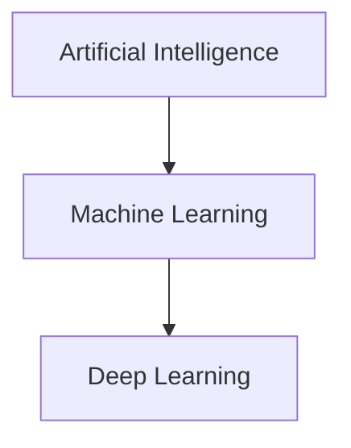

## Simple definitions

- **AI (Artificial Intelligence)**: building systems that appear “intelligent” (reasoning, planning, perception, language).
- **ML (Machine Learning)**: a subset of AI where systems learn from data.
- **Deep Learning (DL)**: a subset of ML using neural networks with many layers.

## What belongs where?

### AI without ML

- rule-based expert systems
- search/planning (A* search, game engines)

### ML without deep learning

- linear regression
- logistic regression
- decision trees, random forests
- gradient boosting

### Deep learning

- image recognition (CNNs)
- large language models (Transformers)
- speech recognition

## When should you use deep learning?

Deep learning is powerful when:

- you have **lots of data**
- the relationship is highly complex (vision, audio, text)
- you can afford compute and training time

But in many business problems, classical ML is:

- faster to train
- easier to explain
- easier to debug

## Key takeaway

AI is the umbrella goal.

ML is a major method for AI.

Deep learning is one ML family that dominates many unstructured data tasks.
