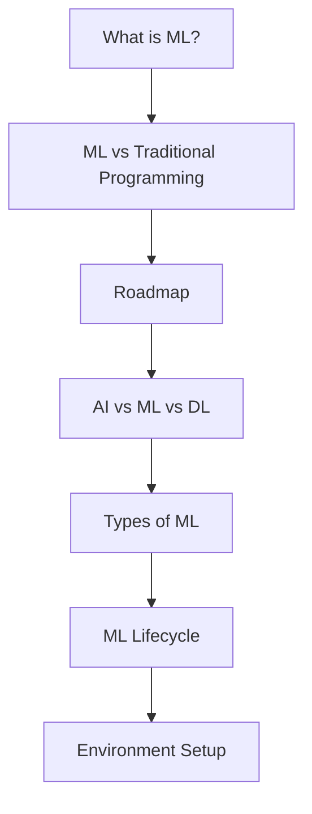

## Goals of Phase 1

By the end of this phase, you should be able to:

- explain what *Machine Learning* is in plain English
- describe **ML vs traditional programming** with a diagram
- understand common ML categories: **supervised**, **unsupervised**, **reinforcement**
- name the steps of the **ML lifecycle**, from data to deployment
- set up a solid Python ML environment

## Recommended approach

Read in order and try the mini-checkpoints.

1. What is Machine Learning?
2. ML vs Traditional Programming
3. The Machine Learning Roadmap
4. AI vs ML vs Deep Learning
5. Types of Machine Learning
6. The ML Lifecycle: From Data to Deployment
7. Setting up the ML Environment

## Phase 1 map

