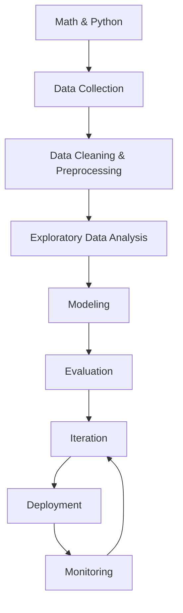

## The big picture

Here’s a realistic “career-grade” roadmap. You’ll cycle through it many times.

## Phase-by-phase (what you’ll build)

1. **Foundations** (vocabulary + intuition)
2. **Preprocessing** (where most real time goes)
3. **Regression** (predict numbers)
4. **Classification** (predict categories)
5. **Ensembles** (combine models)
6. **Unsupervised** (cluster/structure without labels)
7. **Tuning** (pipelines + CV + hyperparams)
8. **Deep learning** (neural nets)
9. **NLP** (text)
10. **Deployment/MLOps** (ship + monitor)

## Two skill tracks to learn in parallel

### Track A — Modeling skills

- pick baseline models
- avoid leakage
- choose metrics
- interpret results

### Track B — Engineering skills

- write clean reproducible notebooks/scripts
- build pipelines
- version data and models
- deploy and monitor

## Reality check: where time actually goes

Beginner expectation: “I’ll spend 80% training models.”

Real projects usually:

- **70% data cleaning and feature engineering**
- **20% evaluation, iteration, and debugging**
- **10% modeling**

## Mini-checkpoint

Write down:

- one ML problem you want to solve (ex: “predict house price”)
- your potential target label (ex: price)
- 5 candidate features (ex: bedrooms, area, age, location, condition)
