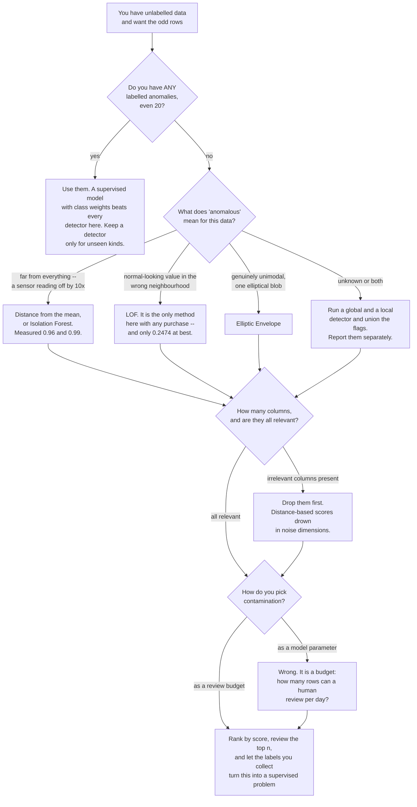

import DataCampExercise from "../../../../components/DataCampExercise.astro";
import Figure from "../../../../components/Figure.astro";
import Quiz from "../../../../components/Quiz.astro";

## What you'll learn

- the two kinds of anomaly — **global** and **local** — and why one detector cannot have both
- measured: Isolation Forest **0.9944** on global anomalies and **0.0317** on local ones
- LOF's `n_neighbors` is the whole model, and there are **no labels to tune it with**
- what irrelevant columns do: Isolation Forest **0.7554 → 0.0614** with 40 of them
- that `contamination` moves the **cut** and never the **ranking** — AP stayed at 0.7554 throughout
- how to evaluate a detector when you have no labels, and what you can honestly claim

## Two kinds of anomaly

The data below has 2,965 points and two clusters with deliberately different spreads: one tight
(standard deviation 0.28) and one loose (1.35). On top of that sit 65 anomalies of two distinct types.

<Figure
  src="/images/ml/phase-10-applied/anomaly-and-outlier-detection/two-kinds"
  alt="Left: scatter plot with a tiny dense cluster at (-3,-3), a broad cluster at (3,2.4), 45 red points scattered far out, and 20 amber points ringing the dense cluster. Right: a zoom on the dense cluster showing the amber ring sitting just outside the tight blob."
  title="2,965 points, 65 of them anomalous (2.19%)"
  caption="The 45 red points are global anomalies: far from everything, and any method finds them. The 20 amber points ring the tight cluster at 3 to 5 of ITS standard deviations — a distance that would be completely unremarkable inside the loose cluster. That is a local anomaly, and it is the reason density-based methods exist."
/>

| Group | Count | What it is |
| --- | --- | --- |
| tight cluster | 1,900 | mean (−3, −3), sd 0.28 |
| loose cluster | 1,000 | mean (3, 2.4), sd 1.35 |
| **global anomalies** | **45** | uniform, pushed clear of both clusters |
| **local anomalies** | **20** | ring around the tight cluster at radius 0.9–1.4 |
| anomaly rate | | **2.19%** |

The distinction is not academic. A transaction of €400 is unremarkable for a business account and
extraordinary for a student account; a server at 60% CPU is normal for a database and alarming for a
load balancer. Whether a point is anomalous is a question about **its neighbourhood**, not about the
dataset's global shape — and the two most popular detectors answer different questions.

## Six detectors on identical data

<Figure
  src="/images/ml/phase-10-applied/anomaly-and-outlier-detection/method-comparison"
  alt="Horizontal grouped bars of average precision for six detectors, split by all, global and local anomalies. Isolation Forest 0.7554 all, 0.9944 global, 0.0317 local. LOF k=20 0.9771, 0.9610, 0.1715. LOF k=10 0.7837, 0.6247, 0.2474. Elliptic Envelope 0.5697, 0.7996, 0.0099. One-class SVM 0.8033, 0.9297, 0.0655. Distance from the mean 0.6765, 0.9604, 0.0057."
  title="Isolation Forest owns the far outliers; only LOF sees the local ones"
  caption="Every method finds the global anomalies — even 'distance from the mean' gets 0.9604 — because being far from everything is easy to detect. On the local anomalies the numbers collapse: 0.0057 for distance, 0.0099 for Elliptic Envelope, 0.0317 for Isolation Forest, and 0.2474 for LOF with k=10. Eight times better, and still only 0.2474."
/>

| Detector | All (65) | Global (45) | Local (20) |
| --- | --- | --- | --- |
| Isolation Forest | 0.7554 | **0.9944** | 0.0317 |
| **LOF (k=20)** | **0.9771** | 0.9610 | 0.1715 |
| LOF (k=10) | 0.7837 | 0.6247 | **0.2474** |
| Elliptic Envelope | 0.5697 | 0.7996 | 0.0099 |
| One-class SVM (RBF) | 0.8033 | 0.9297 | 0.0655 |
| distance from the mean | 0.6765 | 0.9604 | 0.0057 |

Read the last row first. **Euclidean distance from the mean — one line of numpy — reaches 0.9604 on the
global anomalies.** If your anomalies are of that kind, you do not need a library. What you need a
library for is the other kind, and there the same baseline scores 0.0057.

**Isolation Forest** builds random axis-aligned splits and scores a point by how few splits it takes to
isolate. Points in empty regions get isolated fast, which is exactly the *global* notion — hence 0.9944
and 0.0317. It is also the fastest of the six, has no distance computation, and handles mixed scales
without preprocessing.

**Local Outlier Factor** compares a point's local density to the density of its $k$ neighbours:

$$
\mathrm{LOF}_k(x) = \frac{1}{|N_k(x)|}
\sum_{o \in N_k(x)} \frac{\mathrm{lrd}_k(o)}{\mathrm{lrd}_k(x)}
$$

where $\mathrm{lrd}$ is the inverse of the average reachability distance. The ratio is the point: a LOF
of 1 means "as dense as my neighbours", above 1 means "sparser than my neighbours". Because it is a
*ratio*, it does not care that the two clusters have different spreads — which is why it is the only
method here with any purchase on the local anomalies.

**Elliptic Envelope** fits one robust Gaussian to everything, so on two clusters it fits an ellipse
around both and calls the space between them normal. It is the right tool for genuinely unimodal data
and the wrong one here — 0.5697 overall, the worst of the six.

### Which detector, and what to do with its output



The loop closing at the bottom is the honest end state. Unsupervised detection is a bootstrap: you use
it to *generate* the labels that let you stop using it. Any project where a detector is still the final
answer two years in has usually skipped the step where reviewed flags were written back to a table.

## One hyperparameter, no labels

<Figure
  src="/images/ml/phase-10-applied/anomaly-and-outlier-detection/k-sensitivity"
  alt="Average precision against LOF n_neighbors on a log axis. Global AP rises from 0.169 at k=5 to about 0.975 at k=50 and above. Local AP peaks at 0.2474 at k=10 and falls to about 0.17. Overall AP rises from 0.30 to 0.986."
  title="k trades local sensitivity against global sensitivity"
  caption="At k=5 the detector is nearly useless overall (0.3025) because five neighbours is not enough to estimate a density. At k=10 the local anomalies are best detected (0.2474) and the global ones worst (0.6247). From k=20 upwards the global anomalies are found reliably and the local ones settle around 0.17. There is no k that is best at both."
/>

| `n_neighbors` | All | Global | Local |
| --- | --- | --- | --- |
| 5 | 0.3025 | 0.1689 | 0.2107 |
| **10** | 0.7837 | 0.6247 | **0.2474** |
| 20 | 0.9771 | 0.9610 | 0.1715 |
| 50 | 0.9841 | 0.9750 | 0.1736 |
| 120 | **0.9864** | 0.9755 | 0.1771 |

The table above is only computable because this page has labels. **In production you almost never
do** — that is what makes anomaly detection different from every other page in this phase. Which means
the number you would pick k by does not exist.

What you can do instead:

- **Pick k from the domain.** If you know an anomaly is a point unlike its 10 nearest peers, that is
  your k. This is a modelling statement, not a tuning problem.
- **Label a sample.** A hundred hand-labelled points give a noisy but real AP estimate, and it is far
  better than nothing. Prioritise labelling the points the detectors *disagree* about.
- **Use synthetic anomalies.** Inject known anomalies of the kind you care about, and measure recall on
  those. It only validates against the anomalies you imagined, which is a real limitation, but it
  catches gross failures.
- **Ensemble across k.** Average the scores from several k values, or take the maximum. It gives up
  peak performance for robustness — a reasonable trade when you cannot measure peak performance anyway.

## Irrelevant columns are fatal

Every real dataset has columns that carry nothing about the anomaly. Here is what they cost:

<Figure
  src="/images/ml/phase-10-applied/anomaly-and-outlier-detection/noise-dimensions"
  alt="Average precision against total dimensions for four detectors. Isolation Forest falls from 0.755 at 2 dimensions to 0.061 at 42. LOF k=20 falls from 0.977 to 0.568. Elliptic Envelope stays near 0.51-0.57. Distance from the mean falls from 0.677 to 0.289."
  title="Isolation Forest falls from 0.755 to 0.061 as noise columns are added"
  caption="Two informative dimensions plus 40 pure noise columns. Isolation Forest degrades by a factor of 12, because its random splits pick uninformative axes 95% of the time. LOF loses 42% — distances get dominated by noise, but the density ratio remains partly informative. Elliptic Envelope barely moves, because a fitted covariance can down-weight columns that do not co-vary with anything."
/>

| Total dimensions | Isolation Forest | LOF (k=20) | Elliptic Envelope | distance from the mean |
| --- | --- | --- | --- | --- |
| 2 | **0.7554** | **0.9771** | 0.5697 | 0.6765 |
| 6 | 0.4020 | 0.7091 | 0.5690 | 0.5927 |
| 12 | 0.1606 | 0.6685 | 0.5684 | 0.4851 |
| 22 | 0.1250 | 0.5975 | 0.5662 | 0.4074 |
| 42 | **0.0614** | 0.5677 | **0.5130** | 0.2892 |

Three lessons, in decreasing order of how often they are ignored.

**Feature selection matters more than model selection here.** Going from 42 columns to the 2 that
matter improves Isolation Forest by **12×** — far more than any switch between detectors. And unlike
supervised learning, you have no importance measure to guide you, so this has to come from domain
knowledge.

**The ranking of methods depends on dimensionality.** At 2 dimensions LOF beats Isolation Forest
0.9771 to 0.7554; at 42 it wins 0.5677 to 0.0614. Any blog post declaring one better than the other is
describing its own dataset.

**Elliptic Envelope's stability is not a virtue here.** It scores 0.5130 at 42 dimensions because it
was already only 0.5697 at two: it never fitted the two-cluster structure at all, so there was less to
lose.

## contamination is not a model parameter

Every sklearn detector takes `contamination`, and it is routinely misunderstood as "how sensitive the
model is". It is not. It converts scores into labels, and nothing else:

<Figure
  src="/images/ml/phase-10-applied/anomaly-and-outlier-detection/contamination-threshold"
  alt="Precision, recall and average precision against contamination. Precision falls from 1.0 at 0.005 to 0.1886 at 0.10; recall rises from 0.2308 to 0.8615; average precision is a flat dashed line at 0.7554 throughout."
  title="Ranking quality is flat at 0.7554; only the cut moves"
  caption="Five values of contamination on the same Isolation Forest. The number of flagged points goes from 15 to 297 and precision from 1.0000 to 0.1886, while average precision — which summarises the ranking, not the cut — does not move at all. contamination is the alert budget, and it belongs to operations rather than to modelling."
/>

| `contamination` | Flagged | Precision | Recall | Average precision |
| --- | --- | --- | --- | --- |
| 0.005 | 15 | **1.0000** | 0.2308 | 0.7554 |
| 0.010 | 30 | 1.0000 | 0.4615 | 0.7554 |
| 0.020 | 60 | 0.7500 | 0.6923 | 0.7554 |
| 0.050 | 149 | 0.3221 | 0.7385 | 0.7554 |
| 0.100 | 297 | 0.1886 | **0.8615** | 0.7554 |

This is [the threshold discussion](/machine-learning/phase-10---applied-ml-problems/cost-sensitive-learning-and-decision-thresholds/)
again, in different clothing. `contamination` is a threshold on the anomaly score, so it trades
precision against recall exactly as any threshold does, and the right value comes from how many alerts
a human can process — not from a grid search.

Two practical consequences:

- **Score, then threshold.** Use `score_samples` and keep the continuous score. Then flag the top-N per
  day, where N is your capacity. `predict()` throws that flexibility away.
- **Compare models with AP, not with precision.** Precision at a fixed contamination conflates ranking
  quality with the choice of cut, and the numbers above show it can vary by 5× without the model
  changing at all.

:::caution[The one API trap]
`LocalOutlierFactor` has two modes and they are not interchangeable. By default `novelty=False`, and
the *only* legal call is `fit_predict(X)` — it scores the same data it fitted, and there is no
`predict` for new points. With `novelty=True` you get `predict`/`score_samples` for unseen data but
lose `fit_predict`. Isolation Forest, One-class SVM and Elliptic Envelope have no such split.
:::

## See it move

LOF is a *ratio* of densities, which is why cluster spread does not fool it. Drag the point and compare
what a global distance threshold says with what the local ratio says.

```p5 title="Global distance against local density" desc="Two clusters of different spread and a draggable probe point. The panel shows the probe's distance from the global mean and its local outlier ratio, computed from the k nearest neighbours, and the two verdicts disagree in exactly the region that motivates LOF." height="450"
let probe = { x: -1.35, y: -1.35 };
let dragging = false;
let pts = [];
const K = 8;
function lcg(seed) {                 // small deterministic generator
  let s = seed;
  return () => (s = (s * 1103515245 + 12345) % 2147483648) / 2147483648;
}
function gauss(rand) {
  let u = 0, v = 0;
  while (u === 0) u = rand();
  while (v === 0) v = rand();
  return Math.sqrt(-2 * Math.log(u)) * Math.cos(2 * Math.PI * v);
}
function setup() {
  createCanvas(620, 450);
  textFont("monospace");
  const rand = lcg(7);
  for (let i = 0; i < 160; i++) {
    pts.push({ x: -2.2 + 0.22 * gauss(rand), y: -2.2 + 0.22 * gauss(rand) });
  }
  for (let i = 0; i < 90; i++) {
    pts.push({ x: 2.2 + 1.15 * gauss(rand), y: 1.8 + 1.15 * gauss(rand) });
  }
}
function px(x) { return 90 + ((x + 6) / 12) * 420; }
function py(y) { return 320 - ((y + 6) / 12) * 300; }
function knnDist(a, exclude) {
  const ds = [];
  for (const q of pts) {
    if (q === exclude) continue;
    ds.push(Math.hypot(q.x - a.x, q.y - a.y));
  }
  ds.sort((m, n) => m - n);
  return ds.slice(0, K);
}
function draw() {
  background(13, 17, 23);

  if (dragging) {
    probe.x = constrain(((mouseX - 90) / 420) * 12 - 6, -6, 6);
    probe.y = constrain(((320 - mouseY) / 300) * 12 - 6, -6, 6);
  }

  noStroke();
  for (const q of pts) {
    fill(118, 131, 144, 150);
    circle(px(q.x), py(q.y), 5);
  }

  // the probe's own k-distance, and its neighbours' k-distances
  const mine = knnDist(probe, null);
  const myDensity = 1 / (mine.reduce((a, b) => a + b, 0) / K);
  let neighbourDensity = 0;
  const sorted = pts.slice().sort((a, b) =>
    Math.hypot(a.x - probe.x, a.y - probe.y) - Math.hypot(b.x - probe.x, b.y - probe.y));
  for (let i = 0; i < K; i++) {
    const d = knnDist(sorted[i], sorted[i]);
    neighbourDensity += 1 / (d.reduce((a, b) => a + b, 0) / K);
    stroke(255, 211, 67, 120);
    strokeWeight(1);
    line(px(probe.x), py(probe.y), px(sorted[i].x), py(sorted[i].y));
  }
  neighbourDensity /= K;
  const lof = neighbourDensity / myDensity;

  // global mean and distance
  let mx = 0, my = 0;
  for (const q of pts) { mx += q.x; my += q.y; }
  mx /= pts.length; my /= pts.length;
  const spread = Math.sqrt(pts.reduce((a, q) =>
    a + (q.x - mx) ** 2 + (q.y - my) ** 2, 0) / pts.length);
  const globalZ = Math.hypot(probe.x - mx, probe.y - my) / spread;

  stroke(107, 169, 221);
  strokeWeight(1);
  drawingContext.setLineDash([4, 4]);
  line(px(mx), py(my), px(probe.x), py(probe.y));
  drawingContext.setLineDash([]);
  noStroke();
  fill(107, 169, 221);
  circle(px(mx), py(my), 9);

  fill(255, 211, 67);
  circle(px(probe.x), py(probe.y), 13);

  fill(118, 131, 144);
  textSize(10);
  textAlign(LEFT, BOTTOM);
  text("blue = global mean; amber lines = the " + K + " nearest neighbours", 90, 34);

  textAlign(LEFT, TOP);
  fill(107, 169, 221);
  textSize(12);
  text("global: " + globalZ.toFixed(2) + " spreads from the mean  -> "
       + (globalZ > 2 ? "ANOMALY" : "normal"), 90, 348);
  fill(255, 211, 67);
  text("local LOF ratio: " + lof.toFixed(2) + "  -> "
       + (lof > 1.5 ? "ANOMALY" : "normal"), 90, 372);

  const disagree = (globalZ > 2) !== (lof > 1.5);
  fill(disagree ? color(232, 110, 110) : color(165, 214, 164));
  textSize(11);
  text(disagree ? "the two criteria DISAGREE about this point"
                : "the two criteria agree here", 90, 400);
  fill(118, 131, 144);
  textSize(10);
  text("drag the amber point; try just outside the tight cluster on the lower left",
       90, 424);
}
function mousePressed() {
  if (Math.hypot(mouseX - px(probe.x), mouseY - py(probe.y)) < 20) dragging = true;
}
function mouseReleased() { dragging = false; }
```

The interesting region is just outside the tight cluster. There, the global criterion says "well within
two spreads of the mean, normal" while the local ratio says "far sparser than my neighbours, anomaly".
Inside the loose cluster the disagreement reverses. Every point where the two verdicts differ is a point
where your choice of detector decides the answer.

## Pitfalls

| Pitfall | Why it bites | What to do |
| --- | --- | --- |
| One detector for all anomaly types | Isolation Forest: 0.9944 global, 0.0317 local | Decide which kind you care about, then choose |
| Treating `contamination` as sensitivity | AP was 0.7554 at every setting | It is the alert budget; score first, threshold second |
| Tuning `n_neighbors` without labels | No k was best for both types | Set it from the domain, or ensemble across k |
| Keeping every column | Isolation Forest 0.7554 → 0.0614 with 40 noise columns | Feature selection beats model selection here |
| Elliptic Envelope on multi-modal data | 0.5697 — worst of six, on two clusters | Only for genuinely unimodal data |
| `LocalOutlierFactor().predict(X_new)` | Raises; `novelty=False` only supports `fit_predict` | Set `novelty=True` when you need to score new points |
| Reporting precision without recall | 1.0000 precision at 15 flagged of 65 anomalies | Report both, plus the alert count |
| Claiming "unsupervised so unmeasurable" | A hundred labels give a usable estimate | Label the disagreements; inject synthetic anomalies |

## Recap

- 2,965 points, **2.19%** anomalous, in two kinds: 45 global and 20 local.
- Isolation Forest: **0.9944** on global anomalies, **0.0317** on local ones. Distance from the mean gets
  0.9604 and 0.0057 respectively — global anomalies are easy.
- LOF at k=10 reached **0.2474** on the local anomalies, roughly **8×** Isolation Forest, while giving up
  global performance (0.6247 against 0.9944).
- No k was best at both, and in production there are no labels to choose one with.
- Adding 40 irrelevant columns cost Isolation Forest **12×** (0.7554 → 0.0614) and LOF 42%.
- `contamination` moved flagged points from 15 to 297 and precision from 1.0000 to 0.1886 while average
  precision stayed at **0.7554**.

<Quiz
  questions={[
    {
      q: "Isolation Forest gives average precision 0.9944 on your far outliers and 0.0317 on points that are unusual only relative to their neighbours. What is the fix?",
      options: [
        "More trees",
        "A density-ratio method such as LOF, which compares a point's local density to its neighbours' rather than to the global structure",
        "Lower contamination",
        "Scale the features first",
      ],
      answer: 1,
      explain: "Isolation Forest measures how quickly random splits isolate a point, which is a global emptiness criterion. LOF at k=10 reached 0.2474 on exactly those local anomalies — eight times better, and the only method here with any purchase on them.",
    },
    {
      q: "You have no labels. How do you choose LOF's n_neighbors?",
      options: [
        "Grid search on the silhouette score",
        "From the domain — decide what 'unlike its neighbours' means for your data — or ensemble several k values, and label a sample to sanity-check",
        "Use the default and move on",
        "Set it to the square root of n",
      ],
      answer: 1,
      explain: "The measured table shows no k that is best for both anomaly types, so the choice is a modelling statement about which anomalies you care about. A hundred hand-labelled points — ideally the ones detectors disagree about — turn 'no evaluation' into a noisy but real one.",
    },
    {
      q: "Raising contamination from 0.005 to 0.10 changed precision from 1.0000 to 0.1886 and left average precision at 0.7554. What does that tell you?",
      options: [
        "The model got worse",
        "contamination only converts scores to labels: the ranking is unchanged, and the parameter is an alert budget rather than a model setting",
        "Average precision is broken",
        "The model is insensitive to its hyperparameters",
      ],
      answer: 1,
      explain: "The flagged count went from 15 to 297 on identical scores. Keep score_samples output, flag the top N your team can review, and compare models by AP so that ranking quality is not conflated with the choice of cut.",
    },
    {
      q: "Adding 40 uninformative columns takes Isolation Forest from 0.7554 to 0.0614. Why is it hit so much harder than Elliptic Envelope?",
      options: [
        "It has fewer parameters",
        "Its splits are drawn uniformly over axes, so with 42 columns it spends 95% of its splits on noise; a fitted covariance can down-weight columns that co-vary with nothing",
        "It cannot handle high dimensions at all",
        "The random seed matters more in high dimensions",
      ],
      answer: 1,
      explain: "Elliptic Envelope only looks stable because it started at 0.5697 — it never captured the two-cluster structure, so it had less to lose. The transferable point is that feature selection is worth more here than any choice of detector.",
    },
    {
      q: "You call LocalOutlierFactor(n_neighbors=20).fit(X_train).predict(X_new) and get an error. Why?",
      options: [
        "n_neighbors is too large",
        "With the default novelty=False, LOF only supports fit_predict on the data it fitted; scoring new points requires novelty=True",
        "X_new has the wrong number of columns",
        "LOF needs labels",
      ],
      answer: 1,
      explain: "The two modes answer different questions: outlier detection (which of these points are odd?) against novelty detection (is this new point odd relative to what I have seen?). Set novelty=True for the second, and remember it disables fit_predict.",
    },
  ]}
/>

## 🧪 Try It Yourself

### Exercise 1 – Build both kinds of anomaly

<DataCampExercise
  lang="python"
  hint={`The local anomalies ring the TIGHT cluster at radius 0.9 to 1.4 — three to five of its standard deviations, and well within one of the loose cluster's.`}
  code={`# Task: Exercise 1 - Build both kinds of anomaly
import numpy as np

def make(n_noise=0, seed=13):
    rng = np.random.default_rng(seed)
    dense = rng.normal([-3.0, -3.0], 0.28, (1900, 2))      # tight cluster
    diffuse = rng.normal([3.0, 2.4], 1.35, (1000, 2))      # loose cluster
    far = rng.uniform(-13, 13, (45, 2))
    far += np.sign(far) * 3.5                              # global anomalies
    angle = rng.uniform(0, 2 * np.pi, 20)
    radius = rng.uniform(0.9, 1.4, 20)
    local = np.column_stack([-3.0 + radius * np.cos(angle),
                             -3.0 + radius * np.___(angle)])   # replace ___ with sin
    X = np.vstack([dense, diffuse, far, local])
    y = np.concatenate([np.zeros(2900, dtype=int), np.ones(45, dtype=int),
                        np.full(20, 2)])
    if n_noise:
        X = np.hstack([X, rng.normal(0, 1.6, (len(X), n_noise))])
    return X, y

X, y = make()
print(f"points {len(X):,}   anomalies {int((y > 0).sum())} ({(y > 0).mean():.4f})")
print(f"global {int((y == 1).sum())}   local {int((y == 2).sum())}")
print(f"tight sd {X[:1900].std(axis=0).mean():.4f}   "
      f"loose sd {X[1900:2900].std(axis=0).mean():.4f}")

# -- Expected Output -------------------------------------------
# points 2,965   anomalies 65 (0.0219)
# global 45   local 20
# tight sd 0.2812   loose sd 1.3752
# --------------------------------------------------------------`}
  solution={`import numpy as np

def make(n_noise=0, seed=13):
    rng = np.random.default_rng(seed)
    dense = rng.normal([-3.0, -3.0], 0.28, (1900, 2))
    diffuse = rng.normal([3.0, 2.4], 1.35, (1000, 2))
    far = rng.uniform(-13, 13, (45, 2))
    far += np.sign(far) * 3.5
    angle = rng.uniform(0, 2 * np.pi, 20)
    radius = rng.uniform(0.9, 1.4, 20)
    local = np.column_stack([-3.0 + radius * np.cos(angle),
                             -3.0 + radius * np.sin(angle)])
    X = np.vstack([dense, diffuse, far, local])
    y = np.concatenate([np.zeros(2900, dtype=int), np.ones(45, dtype=int),
                        np.full(20, 2)])
    if n_noise:
        X = np.hstack([X, rng.normal(0, 1.6, (len(X), n_noise))])
    return X, y

X, y = make()
print(f"points {len(X):,}   anomalies {int((y > 0).sum())} ({(y > 0).mean():.4f})")
print(f"global {int((y == 1).sum())}   local {int((y == 2).sum())}")
print(f"tight sd {X[:1900].std(axis=0).mean():.4f}   "
      f"loose sd {X[1900:2900].std(axis=0).mean():.4f}")`}
  sct={`test_output_contains("tight sd 0.2812")
success_msg("One cluster is five times tighter than the other, which is what makes 'anomalous' a local question.")`}
  height={400}
/>

### Exercise 2 – Two detectors, two answers

<DataCampExercise
  lang="python"
  hint={`LOF exposes its scores through negative_outlier_factor_ after fit_predict; negate them so that higher means more anomalous.`}
  code={`# Task: Exercise 2 - Two detectors, two answers
from sklearn.ensemble import IsolationForest
from sklearn.metrics import average_precision_score
from sklearn.neighbors import LocalOutlierFactor

s_iso = -IsolationForest(random_state=0,
                         contamination=0.02).fit(X).score_samples(X)

def lof_scores(X, k):
    lof = LocalOutlierFactor(n_neighbors=k, contamination=0.02)
    lof.fit_predict(X)
    return -lof.___                        # replace ___ with negative_outlier_factor_

for name, s in (("Isolation Forest", s_iso),
                ("LOF (k=20)", lof_scores(X, 20)),
                ("LOF (k=10)", lof_scores(X, 10))):
    print(f"{name:18s} all {average_precision_score((y > 0).astype(int), s):.4f}   "
          f"global {average_precision_score((y == 1).astype(int), s):.4f}   "
          f"local {average_precision_score((y == 2).astype(int), s):.4f}")

# -- Expected Output -------------------------------------------
# Isolation Forest   all 0.7554   global 0.9944   local 0.0317
# LOF (k=20)         all 0.9771   global 0.9610   local 0.1715
# LOF (k=10)         all 0.7837   global 0.6247   local 0.2474
# --------------------------------------------------------------`}
  solution={`from sklearn.ensemble import IsolationForest
from sklearn.metrics import average_precision_score
from sklearn.neighbors import LocalOutlierFactor

s_iso = -IsolationForest(random_state=0,
                         contamination=0.02).fit(X).score_samples(X)

def lof_scores(X, k):
    lof = LocalOutlierFactor(n_neighbors=k, contamination=0.02)
    lof.fit_predict(X)
    return -lof.negative_outlier_factor_

for name, s in (("Isolation Forest", s_iso),
                ("LOF (k=20)", lof_scores(X, 20)),
                ("LOF (k=10)", lof_scores(X, 10))):
    print(f"{name:18s} all {average_precision_score((y > 0).astype(int), s):.4f}   "
          f"global {average_precision_score((y == 1).astype(int), s):.4f}   "
          f"local {average_precision_score((y == 2).astype(int), s):.4f}")`}
  sct={`test_output_contains("global 0.9944   local 0.0317")
success_msg("0.9944 against 0.0317 for the same model on the same data. The anomaly type decides the detector.")`}
  height={340}
/>

### Exercise 3 – Sweep k, and find that no value wins

<DataCampExercise
  lang="python"
  hint={`Reuse lof_scores from the previous exercise. Watch the global and local columns move in opposite directions.`}
  code={`# Task: Exercise 3 - Sweep k, and find that no value wins
for k in (5, 10, 20, 50, 120):
    s = lof_scores(X, ___)                 # replace ___ with k
    print(f"k={k:3d}   all {average_precision_score((y > 0).astype(int), s):.4f}   "
          f"global {average_precision_score((y == 1).astype(int), s):.4f}   "
          f"local {average_precision_score((y == 2).astype(int), s):.4f}")

# -- Expected Output -------------------------------------------
# k=  5   all 0.3025   global 0.1689   local 0.2107
# k= 10   all 0.7837   global 0.6247   local 0.2474
# k= 20   all 0.9771   global 0.9610   local 0.1715
# k= 50   all 0.9841   global 0.9750   local 0.1736
# k=120   all 0.9864   global 0.9755   local 0.1771
# --------------------------------------------------------------`}
  solution={`for k in (5, 10, 20, 50, 120):
    s = lof_scores(X, k)
    print(f"k={k:3d}   all {average_precision_score((y > 0).astype(int), s):.4f}   "
          f"global {average_precision_score((y == 1).astype(int), s):.4f}   "
          f"local {average_precision_score((y == 2).astype(int), s):.4f}")`}
  sct={`test_output_contains("k= 10   all 0.7837   global 0.6247   local 0.2474")
success_msg("k=10 is best for local anomalies and worst-but-one for global ones. Without labels, you cannot see this table.")`}
  height={280}
/>

### Exercise 4 – Add columns that contain nothing

<DataCampExercise
  lang="python"
  hint={`make(n_noise) appends n_noise columns of pure Gaussian noise. Refit both detectors on each version.`}
  code={`# Task: Exercise 4 - Add columns that contain nothing
for n_noise in (0, 10, 40):
    Xn, yn = make(___)                     # replace ___ with n_noise
    s_i = -IsolationForest(random_state=0,
                           contamination=0.02).fit(Xn).score_samples(Xn)
    lof = LocalOutlierFactor(n_neighbors=20, contamination=0.02)
    lof.fit_predict(Xn)
    s_l = -lof.negative_outlier_factor_
    print(f"dims {2 + n_noise:3d}   "
          f"Isolation Forest {average_precision_score((yn > 0).astype(int), s_i):.4f}   "
          f"LOF (k=20) {average_precision_score((yn > 0).astype(int), s_l):.4f}")

# -- Expected Output -------------------------------------------
# dims   2   Isolation Forest 0.7554   LOF (k=20) 0.9771
# dims  12   Isolation Forest 0.1606   LOF (k=20) 0.6685
# dims  42   Isolation Forest 0.0614   LOF (k=20) 0.5677
# --------------------------------------------------------------`}
  solution={`for n_noise in (0, 10, 40):
    Xn, yn = make(n_noise)
    s_i = -IsolationForest(random_state=0,
                           contamination=0.02).fit(Xn).score_samples(Xn)
    lof = LocalOutlierFactor(n_neighbors=20, contamination=0.02)
    lof.fit_predict(Xn)
    s_l = -lof.negative_outlier_factor_
    print(f"dims {2 + n_noise:3d}   "
          f"Isolation Forest {average_precision_score((yn > 0).astype(int), s_i):.4f}   "
          f"LOF (k=20) {average_precision_score((yn > 0).astype(int), s_l):.4f}")`}
  sct={`test_output_contains("dims  42   Isolation Forest 0.0614")
success_msg("Twelve-fold degradation from columns that contain nothing. Feature selection outranks model selection here.")`}
  height={300}
/>

### Exercise 5 – Show that contamination is only a threshold

<DataCampExercise
  lang="python"
  hint={`Fit a fresh model per contamination value, then compare predict()'s labels against score_samples()'s ranking.`}
  code={`# Task: Exercise 5 - Show that contamination is only a threshold
from sklearn.metrics import precision_score, recall_score

truth = (y > 0).astype(int)
for c in (0.005, 0.01, 0.02, 0.05, 0.10):
    model = IsolationForest(random_state=0, contamination=c).fit(X)
    pred = (model.predict(X) == ___).astype(int)      # replace ___ with -1
    print(f"contamination {c:.3f}   flagged {int(pred.sum()):4d}   "
          f"precision {precision_score(truth, pred, zero_division=0):.4f}   "
          f"recall {recall_score(truth, pred):.4f}   "
          f"AP {average_precision_score(truth, -model.score_samples(X)):.4f}")

# -- Expected Output -------------------------------------------
# contamination 0.005   flagged   15   precision 1.0000   recall 0.2308   AP 0.7554
# contamination 0.010   flagged   30   precision 1.0000   recall 0.4615   AP 0.7554
# contamination 0.020   flagged   60   precision 0.7500   recall 0.6923   AP 0.7554
# contamination 0.050   flagged  149   precision 0.3221   recall 0.7385   AP 0.7554
# contamination 0.100   flagged  297   precision 0.1886   recall 0.8615   AP 0.7554
# --------------------------------------------------------------`}
  solution={`from sklearn.metrics import precision_score, recall_score

truth = (y > 0).astype(int)
for c in (0.005, 0.01, 0.02, 0.05, 0.10):
    model = IsolationForest(random_state=0, contamination=c).fit(X)
    pred = (model.predict(X) == -1).astype(int)
    print(f"contamination {c:.3f}   flagged {int(pred.sum()):4d}   "
          f"precision {precision_score(truth, pred, zero_division=0):.4f}   "
          f"recall {recall_score(truth, pred):.4f}   "
          f"AP {average_precision_score(truth, -model.score_samples(X)):.4f}")`}
  sct={`test_output_contains("contamination 0.100   flagged  297   precision 0.1886")
success_msg("Precision moved 5x and average precision did not move at all. contamination is an alert budget.")`}
  height={320}
/>

## Next

[Phase 10 - Applied ML Problems](/machine-learning/phase-10---applied-ml-problems/phase-10---applied-ml-problems/)
— the phase overview, with the six measurements from these pages that generalise beyond their own
datasets.
