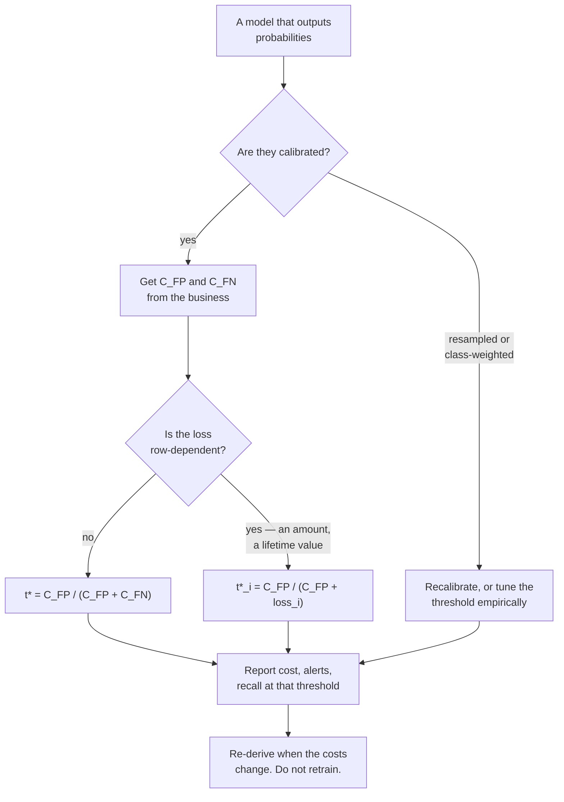

import DataCampExercise from "../../../../components/DataCampExercise.astro";
import Figure from "../../../../components/Figure.astro";
import Quiz from "../../../../components/Quiz.astro";

## What you'll learn

- the derivation of the cost-optimal threshold, $t^* = C_{FP} / (C_{FP} + C_{FN})$
- why the default 0.50 cost **EUR 12,005** where $t^* = 0.0099$ cost **EUR 3,410**
- that theory matched a validation-tuned threshold to within **EUR 20**, with no tuning data
- how wrong your cost estimates can be: **any ratio from 21 to 535** stays within 1.4× of optimal
- why a miscalibrated model breaks the rule — a **EUR 1,970** penalty after SMOTE
- per-row thresholds when the loss is the transaction amount: **17.8% cheaper**, once you have enough
  frauds to measure it

## Where 0.5 comes from, and why it is wrong

`predict()` thresholds at 0.5. That is the right choice under exactly one assumption: that a false
positive and a false negative cost the same. Almost no real decision satisfies it.

Continuing with the fraud data from the
[previous page](/machine-learning/phase-10---applied-ml-problems/imbalanced-classification-and-fraud-detection/),
put two numbers on the errors:

| Error | What it is | Cost |
| --- | --- | --- |
| false positive | an analyst reviews a legitimate transaction | $C_{FP}$ = **EUR 5** |
| false negative | a fraud goes through | $C_{FN}$ = **EUR 500** |

The split here is 50% to fit, 20% to tune thresholds, 30% to report — 44 frauds to learn from, 17 to
tune on, **26** to be judged on.

## The derivation

Take one row with predicted probability $p = P(y = 1 \mid x)$. Flagging it costs $C_{FP}$ whenever the
row is *not* fraud; leaving it costs $C_{FN}$ whenever it *is*:

$$
\mathbb{E}[\text{cost} \mid \text{flag}] = (1 - p)\,C_{FP}, \qquad
\mathbb{E}[\text{cost} \mid \text{pass}] = p\,C_{FN}
$$

Flag whenever flagging is cheaper:

$$
(1 - p)\,C_{FP} < p\,C_{FN}
\;\Longleftrightarrow\;
p > \frac{C_{FP}}{C_{FP} + C_{FN}} \;=\; t^*
$$

That is the whole result. Three properties are worth naming:

- **Only the ratio matters.** $t^* = 1/(1 + C_{FN}/C_{FP})$, so doubling both costs changes nothing.
- **0.5 is the special case** $C_{FP} = C_{FN}$.
- **It requires calibrated probabilities.** The comparison is between two expected costs, and if $p$
  is not a probability the comparison is meaningless. This is where resampling does its damage.

With EUR 5 and EUR 500:

$$
t^* = \frac{5}{5 + 500} = 0.009901
$$

## What it is worth

<Figure
  src="/images/ml/phase-10-applied/cost-sensitive-learning-and-decision-thresholds/cost-versus-threshold"
  alt="A U-shaped cost curve against a log-scale threshold, from about 20,000 EUR at 1e-5 down to a minimum near 2,700 EUR around 0.003 and back up to 13,000 EUR at 1.0. Marked points: default 0.50 at 12,005, theory t*=0.0099 at 3,410, validation-tuned 0.0097 at 3,430, test-set optimum 0.0034 at 2,675."
  title="Total cost against threshold, and three ways of choosing one"
  caption="The curve is flat-bottomed across more than a decade of threshold, which is why the exact value matters less than being in the right region. The default 0.50 is not in the right region: it costs EUR 12,005 against EUR 3,410. Theory and validation-tuning picked nearly the same threshold, and theory needed no data at all."
/>

| Policy | Threshold | Alerts | False alerts | Frauds missed | Cost |
| --- | --- | --- | --- | --- | --- |
| review nothing | — | 0 | 0 | 26 | EUR 13,000 |
| review everything | 0 | 6,000 | 5,974 | 0 | EUR 29,870 |
| **default 0.50** | 0.5000 | 3 | 1 | **24** | **EUR 12,005** |
| **theory** $t^*$ | 0.0099 | 304 | 282 | **4** | **EUR 3,410** |
| tuned on validation | 0.0097 | 308 | 286 | 4 | EUR 3,430 |
| *test-set optimum (oracle)* | *0.0034* | — | — | — | *EUR 2,675* |

The comparison to sit with is the third and fourth rows. **The same model, the same predictions**, and
a 3.5× difference in cost. Nothing was retrained; a single number changed.

Two more readings:

**Theory beat tuning.** The closed form scored EUR 3,410 against the validation-tuned threshold's EUR
3,430. Not because tuning is wrong in principle, but because tuning on **17 positives** is noisy,
while the formula uses information tuning cannot see — your actual costs. When you know the costs,
compute the threshold; do not search for it.

**The oracle is only 22% better.** A threshold chosen with knowledge of the test labels reaches EUR
2,675. That gap is the irreducible cost of not knowing which specific rows are fraud, and it is small
compared to the 3.5× you lose by leaving the threshold at 0.5.

<Figure
  src="/images/ml/phase-10-applied/cost-sensitive-learning-and-decision-thresholds/cost-decomposition"
  alt="Stacked bars for four policies. Review nothing: 13,000 EUR all from missed fraud. Review everything: 29,870 EUR all from reviews. Threshold 0.50: 12,005 EUR almost all missed fraud. Threshold 0.0099: 3,410 EUR, split between 1,410 of reviews and 2,000 of missed fraud."
  title="Spending EUR 1,410 on reviews avoids EUR 11,000 of losses"
  caption="The cost-optimal policy is the only one that spends meaningfully on both sides. It buys 282 unnecessary reviews at EUR 5 each in order to stop 20 frauds at EUR 500 each. Any policy that shows a cost concentrated entirely in one colour is at the wrong threshold."
/>

## How precise do the costs have to be?

The usual objection is that nobody knows $C_{FN}$ to two decimal places. They do not have to.

<Figure
  src="/images/ml/phase-10-applied/cost-sensitive-learning-and-decision-thresholds/ratio-sensitivity"
  alt="Cost relative to the best possible, against the assumed cost ratio on a log axis. The curve is 3.5x at ratio 2, dips to about 1.0 near ratio 300, and rises to 3.5x at 5000. A shaded band marks ratios 21 to 535 as within 1.4x."
  title="Guessing the cost ratio within an order of magnitude is enough"
  caption="Any assumed ratio between 21 and 535 lands within 1.4× of the best achievable cost on this test set — a factor of 25 in the input mapping to 40% in the output. Being at 0.5 — an implied ratio of 1 — costs 4.5×. Order-of-magnitude honesty about your costs is enough; precision is not required."
/>

The cost curve is flat-bottomed, so the mapping from cost estimates to money is heavily damped. The
practical consequence: **do not skip cost-based thresholding because the numbers are uncertain.** Ask
the business for a range, take the geometric midpoint, and you will land inside the flat region. The
mistake that actually costs money is leaving the default in place.

## The rule needs calibrated probabilities

Here is where the previous page's warning turns into euros. Apply the same $t^* = 0.0099$ to a model
trained on SMOTE-resampled data, whose probabilities are inflated roughly 13×:

<Figure
  src="/images/ml/phase-10-applied/cost-sensitive-learning-and-decision-thresholds/miscalibration-penalty"
  alt="Two cost curves. Left, plain model with mean predicted probability 0.0038: t* costs 3,410 against its own optimum of 2,675 at threshold 0.0034. Right, after SMOTE with mean 0.0490: t* costs 4,690 against its own optimum of 2,720 at threshold 0.0746."
  title="Same rule, same costs, and on the resampled model it points at the wrong threshold"
  caption="Both models rank about equally well, so both have a similar best-case cost — 2,675 and 2,720. But the closed-form threshold is derived from probabilities, and after SMOTE the probabilities mean something else. Following the rule costs EUR 4,690 instead of EUR 2,720: a EUR 1,970 penalty for using a valid rule on invalid inputs."
/>

| Model | Mean $\hat{p}$ | Cost at $t^* = 0.0099$ | Its own best threshold | Its own best cost | Penalty |
| --- | --- | --- | --- | --- | --- |
| plain | 0.0038 | **EUR 3,410** | 0.0034 | EUR 2,675 | EUR 735 |
| after SMOTE | 0.0490 | **EUR 4,690** | 0.0746 | EUR 2,720 | **EUR 1,970** |

The resampled model is not worse at ranking — its achievable cost is within EUR 45 of the plain
model's. It is worse at *being a probability*, and the rule consumes probabilities. Its optimal
threshold has moved from 0.0034 to 0.0746, a factor of 22, purely because of the training prior.

:::caution[The rule and the resampler are incompatible]
If you resample, you may not use $t^* = C_{FP}/(C_{FP} + C_{FN})$. Either train without resampling,
or recalibrate afterwards (`CalibratedClassifierCV`, or the odds correction from the previous page),
or abandon the closed form and tune the threshold empirically on a validation set drawn from the real
distribution. Mixing a probability rule with resampled probabilities is the expensive option.
:::

## class_weight is the same idea, applied earlier

Passing `class_weight={0: 1, 1: 100}` multiplies the minority class's contribution to the loss by the
cost ratio. It is the training-time expression of the same asymmetry, and it moves the decision
boundary rather than the threshold.

```python title="two_routes_to_the_same_place.py" showLineNumbers{1}
# Route 1 — plain model, threshold moved to where the costs say
plain = make_pipeline(StandardScaler(), LogisticRegression(max_iter=3000))
plain.fit(X_fit, y_fit)
flag = plain.predict_proba(X_test)[:, 1] >= C_FP / (C_FP + C_FN)

# Route 2 — weighted training, threshold left at 0.5
weighted = make_pipeline(
    StandardScaler(),
    LogisticRegression(max_iter=3000, class_weight={0: 1, 1: C_FN / C_FP}))
weighted.fit(X_fit, y_fit)
flag = weighted.predict(X_test)
```

Prefer **route 1**, for three reasons that have nothing to do with accuracy:

- The threshold is a **deployment parameter**. Costs change — a new fraud pattern, a cheaper review
  team, a seasonal spike — and route 1 changes a config value while route 2 retrains.
- Route 1 keeps calibrated probabilities, so you can also report expected loss per transaction.
- One model can serve several decisions at once: a high threshold for automatic blocking, a low one
  for manual review, from the same probabilities.

Use `class_weight` when the minority class is so rare that the optimiser barely notices it, or when a
library gives you no access to probabilities.

## When the loss is not a constant

Missing a EUR 2 fraud and missing a EUR 900 fraud are not the same event, and the derivation never
required $C_{FN}$ to be constant. Redo it per row with $C_{FN}^{(i)} = \mathrm{amount}_i$:

$$
t^*_i = \frac{C_{FP}}{C_{FP} + \mathrm{amount}_i}
$$

Cheap transactions get a high bar; expensive ones get a low one. On this data the amounts are
lognormal across the whole dataset with a median of **EUR 24.55**, a mean of EUR 39.70 and a maximum
of **EUR 1,103.67**. On the test split that makes the per-row thresholds span **0.0056 to 0.8662**,
with a median of 0.1694.

<Figure
  src="/images/ml/phase-10-applied/cost-sensitive-learning-and-decision-thresholds/per-row-thresholds"
  alt="Left: log-log scatter of amount against predicted probability, with an amber curve of the per-row threshold falling from 1.0 to 0.005 as amount rises; fraud dots sit mostly above the curve. Right: cost per 1,000 transactions, per-row against single tuned threshold, 142.1 vs 131.2 on the 26-fraud test set and 144.7 vs 176.1 on the 598-fraud one."
  title="Per-row thresholds lose on 26 positives and win by 17.8% on 598"
  caption="The rule is right in expectation and invisible in a small sample. On the 6,000-row test set with 26 frauds it looks 8.3% worse than a single tuned threshold; on a 120,000-row test set with 598 frauds the same rule is 17.8% cheaper. One missed EUR 250 fraud is worth 50 unnecessary reviews, so with 26 positives the comparison is decided by luck."
/>

| Test set | Frauds | Per-row thresholds | One tuned threshold | Difference |
| --- | --- | --- | --- | --- |
| 6,000 rows | 26 | EUR 853 | EUR 787 | **8.3% worse** |
| 120,000 rows | 598 | **EUR 17,361** | EUR 21,128 | **17.8% better** |

This is the most useful measurement on the page, and it says two things at once.

**The theory is right.** With enough positives, per-row thresholds save 17.8% — 1,740 alerts catching
384 of 598 frauds, against 1,594 alerts catching 400 of them. Fewer frauds caught, less money lost:
the ones it lets through are the cheap ones.

**Your test set probably cannot see it.** At 26 positives, a 15% effect is far below the noise floor;
one unlucky EUR 250 fraud moves the total by more than the entire effect. If you evaluate a
per-row-threshold change on a handful of positives and it looks worse, you have learned nothing about
the change.

:::tip[Reporting rule]
Before comparing two decision policies, ask what effect size the test set can resolve. A quick
bootstrap of the cost difference answers it. With rare, high-variance losses the answer is often
"nothing under 30%", and the honest report is "no measurable difference", not "worse".
:::

## See it move

Two costs, one threshold, and the expected cost per transaction. The curve below is computed in closed
form from the fraud and legitimate score distributions, so you can watch $t^*$ track the ratio.

```p5 title="The cost ratio picks the threshold" desc="Fraud and legitimate score distributions with a base rate of 1 in 200. Dragging the cost of a missed fraud moves the expected-cost curve and its minimum, and the marked minimum always sits at C_FP/(C_FP+C_FN)." height="440"
let logFN = 2.7;                 // cost of a missed fraud, 10^logFN
const C_FP = 5, BASE = 0.005, SEP = 2.6;
function Phi(z) {
  const s = z < 0 ? -1 : 1;
  const x = Math.abs(z) / Math.SQRT2;
  const t = 1 / (1 + 0.3275911 * x);
  const e = 1 - ((((1.061405429 * t - 1.453152027) * t + 1.421413741) * t
    - 0.284496736) * t + 0.254829592) * t * Math.exp(-x * x);
  return 0.5 * (1 + s * e);
}
// expected cost per transaction for a score cut at z
function cost(z, cfn) {
  const recall = Phi(SEP - z), fpr = Phi(-z);
  return (1 - BASE) * fpr * C_FP + BASE * (1 - recall) * cfn;
}
function setup() {
  createCanvas(620, 440);
  textFont("monospace");
}
function draw() {
  background(13, 17, 23);
  const ox = 70, w = 480, oy = 50, h = 250;
  const cfn = Math.pow(10, logFN);

  if (mouseIsPressed && mouseY > 330 && mouseY < 380) {
    logFN = constrain(0.7 + ((mouseX - ox) / w) * 3.3, 0.7, 4.0);
  }

  // sweep the score cut and find the minimum
  let zs = [], cs = [], best = 0;
  for (let i = 0; i <= 200; i++) {
    const z = -1 + (i / 200) * 6;
    zs.push(z);
    cs.push(cost(z, cfn));
    if (cs[i] < cs[best]) best = i;
  }
  const top = Math.max(...cs) * 1.05;
  const px = (z) => ox + ((z + 1) / 6) * w;
  const py = (c) => oy + h - (c / top) * h;

  stroke(35, 42, 51);
  strokeWeight(1);
  line(ox, oy + h, ox + w, oy + h);

  stroke(255, 211, 67);
  strokeWeight(2.4);
  noFill();
  beginShape();
  for (let i = 0; i < zs.length; i++) vertex(px(zs[i]), py(cs[i]));
  endShape();

  // the minimum, and the probability threshold it corresponds to
  const zStar = zs[best];
  const tStar = C_FP / (C_FP + cfn);
  noStroke();
  fill(165, 214, 164);
  circle(px(zStar), py(cs[best]), 11);
  stroke(165, 214, 164);
  strokeWeight(1);
  drawingContext.setLineDash([4, 4]);
  line(px(zStar), py(cs[best]), px(zStar), oy + h);
  drawingContext.setLineDash([]);

  noStroke();
  fill(118, 131, 144);
  textSize(11);
  textAlign(CENTER, TOP);
  text("score cut", ox + w / 2, oy + h + 12);
  push();
  translate(ox - 46, oy + h / 2);
  rotate(-HALF_PI);
  textAlign(CENTER, CENTER);
  text("expected cost per transaction (EUR)", 0, 0);
  pop();

  // the cost slider
  const sy = 355;
  stroke(60);
  strokeWeight(3);
  line(ox, sy, ox + w, sy);
  const handle = ox + ((logFN - 0.7) / 3.3) * w;
  stroke(107, 169, 221);
  line(ox, sy, handle, sy);
  noStroke();
  fill(107, 169, 221);
  circle(handle, sy, 13);
  fill(118, 131, 144);
  textSize(10);
  textAlign(LEFT, BOTTOM);
  text("cost of a missed fraud  (drag)", ox, sy - 12);

  textAlign(LEFT, TOP);
  fill(107, 169, 221);
  textSize(12);
  text("C_FN = EUR " + cfn.toFixed(0) + "     C_FP = EUR " + C_FP, ox, sy + 14);
  fill(165, 214, 164);
  text("t* = C_FP/(C_FP+C_FN) = " + tStar.toFixed(6), ox, sy + 38);
  fill(255, 211, 67);
  text("cost at the minimum = EUR " + cs[best].toFixed(4) + " per transaction",
       ox, sy + 62);

  fill(118, 131, 144);
  textSize(10);
  textAlign(LEFT, BOTTOM);
  text("base rate 1 in 200; fraud scores sit 2.6 standard deviations higher",
       ox, height - 10);
}
```

Drag the cost of a missed fraud from EUR 5 to EUR 10,000 and watch two things: the minimum slides
left, monotonically, and the threshold it corresponds to is always $C_{FP}/(C_{FP} + C_{FN})$. At
$C_{FN} = C_{FP}$ the minimum sits exactly where `predict()` would put it — which is the only setting
in which the default is defensible.

## Putting it together



## Pitfalls

| Pitfall | Why it bites | What to do |
| --- | --- | --- |
| Leaving the threshold at 0.5 | EUR 12,005 against EUR 3,410 on identical predictions | Derive it from costs, or tune it, but never inherit it |
| Applying $t^*$ to resampled probabilities | EUR 1,970 penalty after SMOTE | Recalibrate, or tune empirically |
| Refusing to threshold because costs are uncertain | Any ratio from 21 to 535 stays within 1.4× | Ask for a range, take the middle, ship |
| Retraining when costs change | The threshold is a config value | Keep the model, move the threshold |
| Using one threshold when the loss varies per row | 17.8% of avoidable cost at scale | $t^*_i = C_{FP}/(C_{FP} + \mathrm{loss}_i)$ |
| Comparing policies on a handful of positives | Per-row thresholds looked 8.3% *worse* on 26 frauds | Bootstrap the cost difference before concluding |
| Optimising F1 and calling it cost-sensitive | F1 encodes a cost ratio of 1 that nobody chose | State the ratio you are assuming, explicitly |

## Recap

- $t^* = C_{FP} / (C_{FP} + C_{FN})$, derived by comparing two expected costs per row.
- At EUR 5 and EUR 500 that is **0.009901**, and it cost **EUR 3,410** against the default's
  **EUR 12,005** — a **3.5×** difference from one number.
- A threshold tuned on 17 validation positives scored **EUR 3,430**: the closed form did marginally
  better with no data.
- The oracle threshold reached EUR 2,675, so the remaining headroom is 22%.
- Any assumed cost ratio between **21 and 535** stays within **1.4×** of optimal. Precision is not
  required; using 0.5 is.
- The rule needs calibrated probabilities: after SMOTE it costs **EUR 4,690** against that model's own
  achievable **EUR 2,720**.
- Per-row thresholds $t^*_i = C_{FP}/(C_{FP} + \mathrm{amount}_i)$ were **17.8% cheaper** on 598
  frauds and **8.3% worse** on 26 — the theory is right and small test sets cannot see it.

<Quiz
  questions={[
    {
      q: "A review costs EUR 5 and a missed fraud costs EUR 500. What threshold should you flag at?",
      options: [
        "0.5, the default",
        "0.0099 — that is C_FP / (C_FP + C_FN), the point where the expected cost of flagging equals the expected cost of passing",
        "0.01, chosen by tuning on validation",
        "0.99, because fraud is rare",
      ],
      answer: 1,
      explain: "5 / 505 = 0.009901. On the measured test set that cost EUR 3,410 against EUR 12,005 at the default, using the very same predictions. Tuning on validation independently arrived at 0.0097 and scored EUR 3,430.",
    },
    {
      q: "You do not know C_FN precisely — somewhere between EUR 100 and EUR 1,500 per missed fraud. What now?",
      options: [
        "Keep 0.5 until finance gives you a number",
        "Pick a value in the middle and ship it — any assumed cost ratio between 21 and 535 lands within 1.4x of the best achievable cost",
        "Tune the threshold on the test set",
        "Use F1 instead",
      ],
      answer: 1,
      explain: "The cost curve is flat-bottomed: a factor of 25 in the assumed ratio maps to 40% in cost. The default 0.5 corresponds to an assumed ratio of 1, which on this data costs 3.5x the optimum. Uncertainty is not a reason to keep the worst option.",
    },
    {
      q: "Your model was trained with SMOTE and its mean predicted probability is 0.0490 against a true rate of 0.0044. You apply t* = 0.0099. What happens?",
      options: [
        "Nothing — the threshold is correct by construction",
        "You over-flag: the rule assumes calibrated probabilities, and the cost comes out at EUR 4,690 against the EUR 2,720 that same model could reach at 0.0746",
        "The model becomes better calibrated",
        "The threshold should be 0.5 instead",
      ],
      answer: 1,
      explain: "Resampling shifts the prior, so every probability is inflated — here about 13-fold. The ranking is fine, but the closed form consumes probabilities, and feeding it inflated ones moves the decision to the wrong place. Recalibrate or tune empirically.",
    },
    {
      q: "Why prefer moving the threshold over training with class_weight?",
      options: [
        "class_weight is less accurate",
        "The threshold is a deployment parameter: costs change without retraining, probabilities stay calibrated, and one model can serve several decisions at once",
        "class_weight does not work for logistic regression",
        "Thresholds are faster to compute",
      ],
      answer: 1,
      explain: "Both express the same asymmetry and reach similar operating points. The difference is operational: a config change against a retrain, and calibrated probabilities against distorted ones. Reach for class_weight when the optimiser genuinely ignores the minority class, or when a library hides predict_proba.",
    },
    {
      q: "Per-row thresholds looked 8.3% worse than a single tuned threshold on your 26-positive test set. What is the right conclusion?",
      options: [
        "Per-row thresholds do not work",
        "The test set cannot resolve the effect — the same rule was 17.8% cheaper on a test set with 598 frauds, and at 26 positives one unlucky expensive fraud dominates the total",
        "The amounts must be wrong",
        "The model needs recalibration",
      ],
      answer: 1,
      explain: "With rare, high-variance losses the noise floor is enormous. One EUR 250 fraud is worth 50 unnecessary reviews, so a 15% systematic effect is invisible on 26 positives. Bootstrap the cost difference and report 'no measurable difference' rather than 'worse'.",
    },
  ]}
/>

## 🧪 Try It Yourself

### Exercise 1 – Derive and apply the threshold

<DataCampExercise
  lang="python"
  hint={`t_star = C_FP / (C_FP + C_FN). The split is 50 / 20 / 30: fit, tune, report.`}
  code={`# Task: Exercise 1 - Derive and apply the threshold
import numpy as np
import pandas as pd
from sklearn.linear_model import LogisticRegression
from sklearn.model_selection import train_test_split
from sklearn.pipeline import make_pipeline
from sklearn.preprocessing import StandardScaler

rng = np.random.default_rng(0)
n = 20000
w = np.array([1.4, 0.9, -1.1, 1.6, 2.0, 0.0])
names = ["amount_z", "hour_z", "device_age", "velocity", "geo_mismatch", "noise"]
X = pd.DataFrame(rng.normal(0, 1, (n, len(w))), columns=names)
score = X.to_numpy() @ w
sigmoid = lambda z: 1 / (1 + np.exp(-z))
lo, hi = -30.0, 10.0
for _ in range(200):
    mid = (lo + hi) / 2
    if sigmoid(score + mid).mean() > 0.005:
        hi = mid
    else:
        lo = mid
y = (rng.random(n) < sigmoid(score + (lo + hi) / 2)).astype(int)

X_fit, X_rest, y_fit, y_rest = train_test_split(X, y, test_size=0.5,
                                                random_state=0, stratify=y)
X_val, X_te, y_val, y_te = train_test_split(X_rest, y_rest, test_size=0.6,
                                            random_state=0, stratify=y_rest)
model = make_pipeline(StandardScaler(), LogisticRegression(max_iter=3000))
model.fit(X_fit, y_fit)
p_te = model.predict_proba(X_te)[:, 1]

C_FP, C_FN = 5.0, 500.0
t_star = C_FP / (C_FP + ___)                 # replace ___ with C_FN

def cost(pred, y_true):
    fp = int(((pred == 1) & (y_true == 0)).sum())
    fn = int(((pred == 0) & (y_true == 1)).sum())
    return fp * C_FP + fn * C_FN, fp, fn

print(f"frauds: fit {y_fit.sum()}  val {y_val.sum()}  test {y_te.sum()}")
print(f"t* = {t_star:.6f}")
for label, t in (("default 0.50", 0.5), ("cost-optimal", t_star)):
    c, fp, fn = cost((p_te >= t).astype(int), y_te)
    print(f"{label:13s} alerts {int((p_te >= t).sum()):4d}  fp {fp:4d}  "
          f"missed {fn:2d}  cost EUR {c:7,.0f}")

# -- Expected Output -------------------------------------------
# frauds: fit 44  val 17  test 26
# t* = 0.009901
# default 0.50  alerts    3  fp    1  missed 24  cost EUR  12,005
# cost-optimal  alerts  304  fp  282  missed  4  cost EUR   3,410
# --------------------------------------------------------------`}
  solution={`import numpy as np
import pandas as pd
from sklearn.linear_model import LogisticRegression
from sklearn.model_selection import train_test_split
from sklearn.pipeline import make_pipeline
from sklearn.preprocessing import StandardScaler

rng = np.random.default_rng(0)
n = 20000
w = np.array([1.4, 0.9, -1.1, 1.6, 2.0, 0.0])
names = ["amount_z", "hour_z", "device_age", "velocity", "geo_mismatch", "noise"]
X = pd.DataFrame(rng.normal(0, 1, (n, len(w))), columns=names)
score = X.to_numpy() @ w
sigmoid = lambda z: 1 / (1 + np.exp(-z))
lo, hi = -30.0, 10.0
for _ in range(200):
    mid = (lo + hi) / 2
    if sigmoid(score + mid).mean() > 0.005:
        hi = mid
    else:
        lo = mid
y = (rng.random(n) < sigmoid(score + (lo + hi) / 2)).astype(int)

X_fit, X_rest, y_fit, y_rest = train_test_split(X, y, test_size=0.5,
                                                random_state=0, stratify=y)
X_val, X_te, y_val, y_te = train_test_split(X_rest, y_rest, test_size=0.6,
                                            random_state=0, stratify=y_rest)
model = make_pipeline(StandardScaler(), LogisticRegression(max_iter=3000))
model.fit(X_fit, y_fit)
p_te = model.predict_proba(X_te)[:, 1]

C_FP, C_FN = 5.0, 500.0
t_star = C_FP / (C_FP + C_FN)

def cost(pred, y_true):
    fp = int(((pred == 1) & (y_true == 0)).sum())
    fn = int(((pred == 0) & (y_true == 1)).sum())
    return fp * C_FP + fn * C_FN, fp, fn

print(f"frauds: fit {y_fit.sum()}  val {y_val.sum()}  test {y_te.sum()}")
print(f"t* = {t_star:.6f}")
for label, t in (("default 0.50", 0.5), ("cost-optimal", t_star)):
    c, fp, fn = cost((p_te >= t).astype(int), y_te)
    print(f"{label:13s} alerts {int((p_te >= t).sum()):4d}  fp {fp:4d}  "
          f"missed {fn:2d}  cost EUR {c:7,.0f}")`}
  sct={`test_output_contains("cost EUR   3,410")
success_msg("EUR 12,005 against EUR 3,410 from the same predictions. One number, 3.5x the cost.")`}
  height={400}
/>

### Exercise 2 – Beat the tuner with arithmetic

<DataCampExercise
  lang="python"
  hint={`Sweep a geometric grid of thresholds on the VALIDATION split, take the argmin, then score it on the test split.`}
  code={`# Task: Exercise 2 - Beat the tuner with arithmetic
p_val = model.predict_proba(X_val)[:, 1]
grid = np.geomspace(1e-5, 0.999, 600)

val_costs = np.array([cost((p_val >= t).astype(int), y_val)[0] for t in grid])
t_tuned = grid[int(np.___(val_costs))]           # replace ___ with argmin

for label, t in (("tuned on validation", t_tuned), ("theory t*", t_star)):
    c, fp, fn = cost((p_te >= t).astype(int), y_te)
    print(f"{label:20s} threshold {t:.6f}   test cost EUR {c:7,.0f}")

best = min(cost((p_te >= t).astype(int), y_te)[0] for t in grid)
print(f"{'oracle on test':20s} threshold        --   test cost EUR {best:7,.0f}")

# -- Expected Output -------------------------------------------
# tuned on validation  threshold 0.009729   test cost EUR   3,430
# theory t*            threshold 0.009901   test cost EUR   3,410
# oracle on test       threshold        --   test cost EUR   2,675
# --------------------------------------------------------------`}
  solution={`p_val = model.predict_proba(X_val)[:, 1]
grid = np.geomspace(1e-5, 0.999, 600)
val_costs = np.array([cost((p_val >= t).astype(int), y_val)[0] for t in grid])
t_tuned = grid[int(np.argmin(val_costs))]
for label, t in (("tuned on validation", t_tuned), ("theory t*", t_star)):
    c, fp, fn = cost((p_te >= t).astype(int), y_te)
    print(f"{label:20s} threshold {t:.6f}   test cost EUR {c:7,.0f}")
best = min(cost((p_te >= t).astype(int), y_te)[0] for t in grid)
print(f"{'oracle on test':20s} threshold        --   test cost EUR {best:7,.0f}")`}
  sct={`test_output_contains("theory t*            threshold 0.009901   test cost EUR   3,410")
success_msg("The closed form landed within EUR 20 of a tuned threshold, using zero validation data - and 22% off an oracle that saw the labels.")`}
  height={300}
/>

### Exercise 3 – Map the sensitivity to your cost guess

<DataCampExercise
  lang="python"
  hint={`For an assumed ratio r, the threshold is 1 / (1 + r). Compare each resulting cost against the best achievable on the test set.`}
  code={`# Task: Exercise 3 - Map the sensitivity to your cost guess
best = min(cost((p_te >= t).astype(int), y_te)[0] for t in grid)

for assumed in (1, 10, 25, 100, 500, 2000):
    t = 1 / (1 + ___)                     # replace ___ with assumed
    c, fp, fn = cost((p_te >= t).astype(int), y_te)
    print(f"assumed ratio {assumed:5d} -> threshold {t:.6f}  "
          f"cost EUR {c:7,.0f}  ({c / best:.2f}x optimum)")

# -- Expected Output -------------------------------------------
# assumed ratio     1 -> threshold 0.500000  cost EUR  12,005  (4.49x optimum)
# assumed ratio    10 -> threshold 0.090909  cost EUR   4,700  (1.76x optimum)
# assumed ratio    25 -> threshold 0.038462  cost EUR   3,515  (1.31x optimum)
# assumed ratio   100 -> threshold 0.009901  cost EUR   3,410  (1.27x optimum)
# assumed ratio   500 -> threshold 0.001996  cost EUR   3,625  (1.36x optimum)
# assumed ratio  2000 -> threshold 0.000500  cost EUR   6,700  (2.50x optimum)
# --------------------------------------------------------------`}
  solution={`best = min(cost((p_te >= t).astype(int), y_te)[0] for t in grid)
for assumed in (1, 10, 25, 100, 500, 2000):
    t = 1 / (1 + assumed)
    c, fp, fn = cost((p_te >= t).astype(int), y_te)
    print(f"assumed ratio {assumed:5d} -> threshold {t:.6f}  "
          f"cost EUR {c:7,.0f}  ({c / best:.2f}x optimum)")`}
  sct={`test_output_contains("assumed ratio   100 -> threshold 0.009901")
success_msg("A factor of 20 in the assumed ratio costs about 10% - while assuming 1, which is what 0.5 means, costs 4.5x.")`}
  height={320}
/>

### Exercise 4 – Price the miscalibration

<DataCampExercise
  lang="python"
  hint={`Reuse the smote() function from the previous page. Score the resampled model at t* AND at its own best threshold to separate ranking from calibration.`}
  code={`# Task: Exercise 4 - Price the miscalibration
def smote(X, y, k=5, seed=0):
    rng = np.random.default_rng(seed)
    X = np.asarray(X, dtype=float)
    minority = X[y == 1]
    n_needed = int((y == 0).sum()) - len(minority)
    d = np.linalg.norm(minority[:, None, :] - minority[None, :, :], axis=2)
    np.fill_diagonal(d, np.inf)
    nb = np.argsort(d, axis=1)[:, :k]
    seeds = rng.integers(0, len(minority), n_needed)
    picks = nb[seeds, rng.integers(0, k, n_needed)]
    gaps = rng.random((n_needed, 1))
    synth = minority[seeds] + gaps * (minority[picks] - minority[seeds])
    return (np.vstack([X, synth]),
            np.concatenate([np.asarray(y), np.ones(n_needed, dtype=int)]))

X_sm, y_sm = smote(X_fit.to_numpy(), y_fit, seed=1)
resampled = make_pipeline(StandardScaler(), LogisticRegression(max_iter=3000))
resampled.fit(X_sm, ___)                        # replace ___ with y_sm
p_sm = resampled.predict_proba(X_te.to_numpy())[:, 1]

for label, pr in (("plain", p_te), ("after SMOTE", p_sm)):
    own = min(cost((pr >= t).astype(int), y_te)[0] for t in grid)
    at_star = cost((pr >= t_star).astype(int), y_te)[0]
    print(f"{label:12s} mean p {pr.mean():.4f}   at t* EUR {at_star:6,.0f}   "
          f"own best EUR {own:6,.0f}   penalty EUR {at_star - own:5,.0f}")

# -- Expected Output -------------------------------------------
# plain        mean p 0.0038   at t* EUR  3,410   own best EUR  2,675   penalty EUR   735
# after SMOTE  mean p 0.0490   at t* EUR  4,690   own best EUR  2,720   penalty EUR 1,970
# --------------------------------------------------------------`}
  solution={`def smote(X, y, k=5, seed=0):
    rng = np.random.default_rng(seed)
    X = np.asarray(X, dtype=float)
    minority = X[y == 1]
    n_needed = int((y == 0).sum()) - len(minority)
    d = np.linalg.norm(minority[:, None, :] - minority[None, :, :], axis=2)
    np.fill_diagonal(d, np.inf)
    nb = np.argsort(d, axis=1)[:, :k]
    seeds = rng.integers(0, len(minority), n_needed)
    picks = nb[seeds, rng.integers(0, k, n_needed)]
    gaps = rng.random((n_needed, 1))
    synth = minority[seeds] + gaps * (minority[picks] - minority[seeds])
    return (np.vstack([X, synth]),
            np.concatenate([np.asarray(y), np.ones(n_needed, dtype=int)]))

X_sm, y_sm = smote(X_fit.to_numpy(), y_fit, seed=1)
resampled = make_pipeline(StandardScaler(), LogisticRegression(max_iter=3000))
resampled.fit(X_sm, y_sm)
p_sm = resampled.predict_proba(X_te.to_numpy())[:, 1]
for label, pr in (("plain", p_te), ("after SMOTE", p_sm)):
    own = min(cost((pr >= t).astype(int), y_te)[0] for t in grid)
    at_star = cost((pr >= t_star).astype(int), y_te)[0]
    print(f"{label:12s} mean p {pr.mean():.4f}   at t* EUR {at_star:6,.0f}   "
          f"own best EUR {own:6,.0f}   penalty EUR {at_star - own:5,.0f}")`}
  sct={`test_output_contains("penalty EUR 1,970")
success_msg("Both models rank equally well - 2,675 against 2,720 at their own optima - and the rule costs EUR 1,970 extra on the resampled one.")`}
  height={400}
/>

### Exercise 5 – Give every row its own threshold

<DataCampExercise
  hint={`t_row is an array, so proba >= t_row compares elementwise. The false-negative cost is now amount[i], not a constant.`}
  lang="python"
  code={`# Task: Exercise 5 - Give every row its own threshold
rng2 = np.random.default_rng(5)
amount = np.exp(3.2 + 0.85 * X["amount_z"].to_numpy() + rng2.normal(0, 0.45, n))
a_fit = amount[X_fit.index]
a_te = amount[X_te.index]

def cost_amt(pred, y_true, amounts):
    fp = int(((pred == 1) & (y_true == 0)).sum())
    missed = (pred == 0) & (y_true == 1)
    return fp * C_FP + float(amounts[missed].sum()), fp, int(missed.sum())

t_row = C_FP / (C_FP + ___)                    # replace ___ with a_te
per_row = cost_amt((p_te >= t_row).astype(int), y_te, a_te)
flat = cost_amt((p_te >= C_FP / (C_FP + a_fit.mean())).astype(int),
                y_te, a_te)

print(f"amounts: median EUR {np.median(a_te):.2f}   max EUR {a_te.max():.2f}")
print(f"per-row thresholds span {t_row.min():.4f} to {t_row.max():.4f}")
print(f"per-row      alerts {int((p_te >= t_row).sum()):3d}  fp {per_row[1]:3d}  "
      f"missed {per_row[2]:2d}  cost EUR {per_row[0]:6,.0f}")
print(f"mean-amount  alerts {int((p_te >= C_FP / (C_FP + a_fit.mean())).sum()):3d}  "
      f"fp {flat[1]:3d}  missed {flat[2]:2d}  cost EUR {flat[0]:6,.0f}")

# -- Expected Output -------------------------------------------
# amounts: median EUR 24.52   max EUR 895.10
# per-row thresholds span 0.0056 to 0.8662
# per-row      alerts  80  fp  64  missed 10  cost EUR    853
# mean-amount  alerts  48  fp  31  missed  9  cost EUR    737
# --------------------------------------------------------------`}
  solution={`rng2 = np.random.default_rng(5)
amount = np.exp(3.2 + 0.85 * X["amount_z"].to_numpy() + rng2.normal(0, 0.45, n))
a_fit = amount[X_fit.index]
a_te = amount[X_te.index]

def cost_amt(pred, y_true, amounts):
    fp = int(((pred == 1) & (y_true == 0)).sum())
    missed = (pred == 0) & (y_true == 1)
    return fp * C_FP + float(amounts[missed].sum()), fp, int(missed.sum())

t_row = C_FP / (C_FP + a_te)
per_row = cost_amt((p_te >= t_row).astype(int), y_te, a_te)
flat = cost_amt((p_te >= C_FP / (C_FP + a_fit.mean())).astype(int),
                y_te, a_te)
print(f"amounts: median EUR {np.median(a_te):.2f}   max EUR {a_te.max():.2f}")
print(f"per-row thresholds span {t_row.min():.4f} to {t_row.max():.4f}")
print(f"per-row      alerts {int((p_te >= t_row).sum()):3d}  fp {per_row[1]:3d}  "
      f"missed {per_row[2]:2d}  cost EUR {per_row[0]:6,.0f}")
print(f"mean-amount  alerts {int((p_te >= C_FP / (C_FP + a_fit.mean())).sum()):3d}  "
      f"fp {flat[1]:3d}  missed {flat[2]:2d}  cost EUR {flat[0]:6,.0f}")`}
  sct={`test_output_contains("per-row thresholds span 0.0056 to 0.8662")
success_msg("Per-row thresholds cost EUR 853 against EUR 737 here - and 17.8% LESS on a test set with 598 frauds. Twenty-six positives cannot resolve it.")`}
  height={400}
/>

## Next

[Time Series Forecasting Fundamentals](/machine-learning/phase-10---applied-ml-problems/time-series-forecasting-fundamentals/)
— every split so far has been random. When rows are ordered in time, a random split leaks the future
into the past, and the measured penalty is large.
