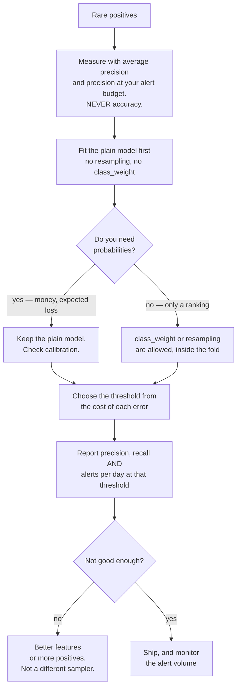

## What you'll learn

- why **0.9957 accuracy** is the *worst* possible model on this dataset
- why **ROC-AUC 0.9848** and **average precision 0.4561** describe the same predictions
- how to pick a threshold from a recall target, and what it costs: 232 alerts to catch 24 of 26
- SMOTE implemented from its definition, in fifteen lines of numpy
- the measured verdict on resampling: **no ranking improvement**, and calibration destroyed
- the leakage that makes SMOTE look brilliant — **0.9879** against an honest **0.4517**

## The dataset

20,000 transactions, six features, and a label drawn from a logistic model whose intercept is solved
so the fraud rate lands at 0.5%. Nothing is separable — the Bayes-optimal classifier still makes
mistakes — which is what makes every question below non-trivial.

```python title="the_data.py" showLineNumbers{1}
rng = np.random.default_rng(0)
X = rng.normal(0, 1, (20_000, 6))
w = np.array([1.4, 0.9, -1.1, 1.6, 2.0, 0.0])      # the last feature is noise

lo, hi = -30.0, 10.0                                # solve for a 0.5% base rate
for _ in range(200):
    mid = (lo + hi) / 2
    if sigmoid(X @ w + mid).mean() > 0.005:
        hi = mid
    else:
        lo = mid

p_true = sigmoid(X @ w + (lo + hi) / 2)
y = (rng.random(20_000) < p_true).astype(int)

print(y.sum(), y.mean())        # 87 0.0043
```

**87 frauds in 20,000 rows.** A 70/30 split puts **26** of them in the test set, alongside 5,974
legitimate transactions. Keep those two numbers in mind; almost every surprise on this page is a
consequence of the second being 230 times the first.

## The accuracy paradox, measured

<Figure
  src="/images/ml/phase-10-applied/imbalanced-classification-and-fraud-detection/accuracy-paradox"
  alt="Two bar charts. Left: accuracy 0.9957 for predicting never-fraud against 0.9962 for the logistic model, on a zoomed axis. Right: frauds caught, 0 of 26 against 5 of 26, with a dashed line at 26."
  title="The same two models, scored two ways"
  caption="On accuracy the two models are 0.0005 apart, which rounds to identical in any report. On the job — catching fraud — one of them does nothing at all and the other catches 5 of 26. Accuracy divides by 6,000; the work divides by 26."
/>

```python title="the_paradox.py" showLineNumbers{1}
never_fraud = np.zeros(len(y_test), dtype=int)
print(f"{(never_fraud == y_test).mean():.4f}")      # 0.9957, catching 0 of 26

model = make_pipeline(StandardScaler(), LogisticRegression(max_iter=2000))
model.fit(X_train, y_train)
proba = model.predict_proba(X_test)[:, 1]
print(f"{((proba >= 0.5) == y_test).mean():.4f}")   # 0.9962, catching 5 of 26
```

A model that has never heard of fraud scores **0.9957**. The fitted model — which happens to be the
*correct* model, since the data was generated by a logistic rule — scores **0.9962** at the default
threshold, and catches **5 of 26** with 2 false positives.

Accuracy is not merely uninformative here, it is actively misleading: it puts a 0.0005 gap between
"nothing" and "something", and it would put a similarly trivial gap between two genuinely different
fraud systems.

:::caution[The first rule]
At a 0.5% base rate, never report accuracy. Not as a secondary metric, not "for reference". Someone
will quote it in a slide, and the number will be 0.99-something no matter what the model does.
:::

## ROC-AUC against average precision

Both are threshold-free summaries of the *same* ranking. They disagree violently.

<Figure
  src="/images/ml/phase-10-applied/imbalanced-classification-and-fraud-detection/roc-versus-pr"
  alt="Left: an ROC curve hugging the top-left corner, AUC 0.9848. Right: a precision-recall curve descending in steps from 1.0 to near zero, average precision 0.4561, with a dashed chance line at 0.0043."
  title="One set of predictions, two summaries: AUC 0.9848 and AP 0.4561"
  caption="The ROC curve's x-axis is false positive RATE — 208 false positives among 5,974 negatives is a rate of 0.0348, which barely moves it. The precision-recall curve divides those same 208 by the number of alerts, so it shows what the reviewer experiences. Both numbers are correct; only one is about the workload."
/>

The mechanism is in the denominators:

$$
\mathrm{FPR} = \frac{\mathrm{FP}}{\mathrm{FP} + \mathrm{TN}}, \qquad
\mathrm{precision} = \frac{\mathrm{TP}}{\mathrm{TP} + \mathrm{FP}}
$$

FPR divides false positives by the **5,974 negatives**, so 208 of them is 0.0348 — invisible on an
ROC plot. Precision divides the same 208 by the **232 alerts**, giving 0.1034. The negatives dominate
one denominator and are absent from the other.

| Metric | Value | What it is relative to |
| --- | --- | --- |
| accuracy | 0.9962 | all 6,000 rows |
| ROC-AUC | **0.9848** | pairs of one fraud and one non-fraud |
| average precision | **0.4561** | chance = base rate **0.0043** |
| lift over chance | **105×** | 0.4561 / 0.0043 |

Average precision at 0.4561 against a 0.0043 baseline is a genuinely strong model — a **105×** lift.
It is also nowhere near 0.9848, and if you promised stakeholders "98%" you have promised something
that does not exist.

:::tip[Which one to report]
Report **average precision** (or precision at a fixed alert budget) whenever positives are rare and
the cost of review scales with alerts. Report ROC-AUC when you genuinely care about ranking a random
positive above a random negative and the class balance in deployment is unknown — model comparison in
a paper, for instance. Never report only one and never report accuracy.
:::

## The threshold is the product decision

Nothing in training changes the trade-off below. It is a property of the ranking, and choosing a
point on it is a business decision about how many humans you employ.

<Figure
  src="/images/ml/phase-10-applied/imbalanced-classification-and-fraud-detection/threshold-sweep"
  alt="Left: precision, recall and F1 against a log-scale threshold; recall falls as precision rises and F1 peaks at 0.4348 near threshold 0.268. Right: bars of alert counts for three recall targets, 40 alerts at recall 0.50, 70 at 0.73 and 232 at 0.92."
  title="Each recall target has a price, quoted in rows a human must read"
  caption="To catch half the fraud, review 40 rows and accept precision 0.325. To catch 92%, review 232 rows at precision 0.103 — nine out of ten alerts are false. The model did not get worse; you asked it for more recall, and this is the exchange rate."
/>

| Recall target | Threshold | Precision | Alerts | Frauds caught |
| --- | --- | --- | --- | --- |
| 0.50 | 0.1805 | 0.3250 | 40 | 13 of 26 |
| 0.73 | 0.0934 | 0.2714 | 70 | 19 of 26 |
| **0.92** | **0.0165** | **0.1034** | **232** | **24 of 26** |

Read the last row carefully. Going from 19 to 24 frauds caught costs **162 extra reviews**, and takes
precision from 0.271 to 0.103. Whether that is a good trade depends on two numbers the model does not
know: the average loss per undetected fraud, and the cost of a review. That calculation is the
subject of the [next page](/machine-learning/phase-10---applied-ml-problems/cost-sensitive-learning-and-decision-thresholds/).

Note also what the F1-optimal threshold does. **Best F1 is 0.4348 at threshold 0.268**, giving
precision 0.500 and recall 0.385 — it catches 10 of 26 frauds. F1 weights precision and recall
equally, which is a statement about the world that is almost never true for fraud.

## See it move

Precision under a rare event is bounded by arithmetic, not by model quality. Below, fraud scores are
$\mathcal{N}(2, 1)$ and legitimate scores $\mathcal{N}(0,1)$ — a genuinely strong separation — and the
base rate is yours to set. Everything is computed in closed form from the normal CDF.

$$
\text{alerts} = N\big[b\,\Phi(2-t) + (1-b)\,\Phi(-t)\big], \qquad
\text{precision} = \frac{b\,\Phi(2-t)}{b\,\Phi(2-t) + (1-b)\,\Phi(-t)}
$$

```p5 title="Precision is capped by the base rate, not the model" desc="Fraud scores are normal with mean 2 and legitimate scores normal with mean 0, an unchanging separation. Dragging the threshold and the base rate shows precision collapsing as the base rate falls, even though recall at any threshold never changes." height="440"
let thr = 2.0, logRate = -2.3;      // base rate 10^logRate
let dragging = 0;
function Phi(z) {                   // Abramowitz & Stegun 7.1.26
  const s = z < 0 ? -1 : 1;
  const x = Math.abs(z) / Math.SQRT2;
  const t = 1 / (1 + 0.3275911 * x);
  const e = 1 - ((((1.061405429 * t - 1.453152027) * t + 1.421413741) * t
    - 0.284496736) * t + 0.254829592) * t * Math.exp(-x * x);
  return 0.5 * (1 + s * e);
}
function setup() {
  createCanvas(620, 440);
  textFont("monospace");
}
function draw() {
  background(13, 17, 23);
  const ox = 60, w = 500, oy = 60, h = 130;
  const px = (v) => ox + ((v + 3) / 9) * w;         // score from -3 to 6

  if (mouseIsPressed) {
    if (mouseY < oy + h + 40) thr = constrain(((mouseX - ox) / w) * 9 - 3, -3, 6);
    else if (mouseY > 240 && mouseY < 290) logRate = constrain(-4 + ((mouseX - ox) / w) * 4, -4, 0);
  }

  const rate = Math.pow(10, logRate);
  const N = 100000;
  const recall = Phi(2 - thr);
  const fpr = Phi(-thr);
  const caught = N * rate * recall;
  const falseAlerts = N * (1 - rate) * fpr;
  const alerts = caught + falseAlerts;
  const precision = alerts > 0 ? caught / alerts : 0;

  // the two score distributions, each scaled by its class share
  for (const [mu, share, col] of [[0, 1 - rate, [118, 131, 144]],
                                  [2, rate, [232, 110, 110]]]) {
    noStroke();
    fill(col[0], col[1], col[2], 150);
    beginShape();
    vertex(ox, oy + h);
    for (let x = -3; x <= 6.001; x += 0.06) {
      const d = Math.exp(-0.5 * (x - mu) * (x - mu));
      // draw the rare class at readable height, and say so
      vertex(px(x), oy + h - d * h * (share < 0.5 ? 0.9 : 0.9));
    }
    vertex(ox + w, oy + h);
    endShape(CLOSE);
  }
  noStroke();
  fill(118, 131, 144);
  textSize(10);
  textAlign(LEFT, BOTTOM);
  text("both curves drawn to the same height: the red class is " +
       (1 / rate).toFixed(0) + "x rarer than it looks", ox, oy - 8);

  stroke(255, 211, 67);
  strokeWeight(2);
  line(px(thr), oy - 4, px(thr), oy + h + 14);
  noStroke();
  fill(255, 211, 67);
  textSize(11);
  textAlign(CENTER, TOP);
  text("threshold " + thr.toFixed(2), px(thr), oy + h + 18);

  // base-rate slider
  const sy = 265;
  stroke(60);
  strokeWeight(3);
  line(ox, sy, ox + w, sy);
  const handle = ox + ((logRate + 4) / 4) * w;
  stroke(107, 169, 221);
  strokeWeight(3);
  line(ox, sy, handle, sy);
  noStroke();
  fill(107, 169, 221);
  circle(handle, sy, 13);
  fill(118, 131, 144);
  textSize(10);
  textAlign(LEFT, BOTTOM);
  text("base rate  (drag)", ox, sy - 12);
  textAlign(LEFT, TOP);
  fill(107, 169, 221);
  textSize(12);
  text("1 in " + (1 / rate).toFixed(0) + "   (" + (100 * rate).toFixed(3) + "%)",
       ox, sy + 12);

  textAlign(LEFT, TOP);
  fill(200);
  textSize(12);
  text("per 100,000 transactions", ox, 320);
  fill(232, 110, 110);
  text("frauds caught   " + caught.toFixed(0), ox, 344);
  fill(118, 131, 144);
  text("false alerts    " + falseAlerts.toFixed(0), ox, 366);
  fill(255, 211, 67);
  text("recall    " + recall.toFixed(4) + "   (unchanged by the base rate)",
       ox + 250, 344);
  fill(precision > 0.5 ? color(165, 214, 164) : color(232, 110, 110));
  text("precision " + precision.toFixed(4), ox + 250, 366);

  fill(118, 131, 144);
  textSize(11);
  textAlign(LEFT, BOTTOM);
  text("drag the top area to move the threshold, the blue bar to change the base rate",
       ox, height - 12);
}
```

Two invariants worth internalising. **Recall does not depend on the base rate at all** — it is a
property of the positive class's score distribution. **Precision depends on it almost entirely**: at
1 in 10 the same threshold gives comfortable precision, and at 1 in 10,000 the same model at the same
threshold drowns in false alerts. When someone reports a fraud model's precision, the first question
is what base rate it was measured at.

## Resampling: what it actually does

The standard advice is to rebalance the training set. Four strategies on identical data, with a
bootstrap confidence interval on average precision so the differences can be judged rather than
admired:

<Figure
  src="/images/ml/phase-10-applied/imbalanced-classification-and-fraud-detection/resampling-scorecard"
  alt="Left: average precision for four strategies, 0.4561, 0.4572, 0.4707 and 0.4467, each with a confidence interval spanning roughly 0.27 to 0.65, and a dashed oracle line at 0.4703. Right: mean predicted probability 0.0046, 0.0841, 0.0625 and 0.1254 against a dashed true rate of 0.0043, with Brier scores annotated."
  title="No ranking gain, and every resampler inflates the probabilities"
  caption="The four average precisions differ by 0.024 while each 95% bootstrap interval spans about 0.37 — they are statistically indistinguishable, and all four sit at the oracle's 0.4703, which is the ceiling this data allows. Meanwhile mean predicted probability goes from 0.0046 (the truth is 0.0043) to 0.1254, and the Brier score degrades 19-fold."
/>

| Strategy | Training rows | Average precision | 95% CI | Brier | Mean $\hat{p}$ |
| --- | --- | --- | --- | --- | --- |
| nothing | 14,000 | 0.4561 | [0.2736, 0.6413] | **0.0031** | **0.0046** |
| `class_weight="balanced"` | 14,000 | 0.4572 | [0.2754, 0.6396] | 0.0499 | 0.0841 |
| SMOTE to 1:1 | **27,878** | 0.4707 | [0.2858, 0.6519] | 0.0380 | 0.0625 |
| random undersample | **122** | 0.4467 | [0.2642, 0.6206] | 0.0594 | 0.1254 |
| *oracle — the true probabilities* | | *0.4703* | | | *0.0043* |

Three readings, in order of importance.

**The differences are noise.** Every interval spans roughly 0.37 of average precision, from about 0.27 to 0.65. With 26 positives in the
test set, an AP difference of 0.02 carries no information. Any blog post that reports "SMOTE improved
AP from 0.456 to 0.471" on a test set this size is reporting sampling variation.

**There was no headroom anyway.** The oracle — scoring with the *true* probabilities that generated
the labels — gets **0.4703**. The plain model is already at the ceiling. No resampler can beat the
data-generating process, and on a well-specified model none of them will.

**Calibration is destroyed, and that is not noise.** Mean predicted probability goes from 0.0046
against a true 0.0043, to 0.0841, 0.0625 and 0.1254. The Brier score degrades from 0.0031 to 0.0594.
Resampling changes the prior the model was fit under, so every probability it outputs is a probability
for a world where fraud happens 50% of the time.

If you need probabilities — and you do, the moment anyone multiplies them by a euro amount — this
matters far more than the AP that did not move.

:::note[When resampling does help]
Two cases, neither of them "always". **Undersampling as a compute strategy**: at 40 million rows and
0.1% positives you can train on 1% of the negatives and lose almost nothing, and here it *is* worth
the calibration cost because you can correct for it. **Genuinely tiny minority counts** — a few dozen
positives — where SMOTE's interpolation acts as a smoothness prior. In both cases: resample only the
training fold, and either recalibrate afterwards or accept that the outputs are scores rather than
probabilities.
:::

### Correcting the prior back

If you do undersample, the shift is analytic. With a training positive rate of $\pi'$ and a true rate
$\pi$, the corrected odds are

$$
\frac{p}{1-p} = \frac{p'}{1-p'} \cdot \frac{\pi}{1 - \pi} \cdot \frac{1 - \pi'}{\pi'}
$$

so a single multiplication on the odds scale undoes the sampling. Applied to the undersampled model —
trained at $\pi' = 0.5$ against a true $\pi = 0.0044$ — it brings mean predicted probability from
**0.1254 to 0.0031** against a true test rate of 0.0043, and the Brier score from **0.0594 to
0.0033**. Average precision is unchanged at 0.4467, because the correction is monotone and cannot
reorder anything.

That is why undersampling is the defensible resampler: its distortion is one known multiplication.
SMOTE's synthetic neighbours have no such closed-form undo.

## SMOTE in fifteen lines

Worth writing once, because the mechanism explains both what it fixes and what it breaks.

```python title="smote.py" showLineNumbers{1}
def smote(X, y, k=5, seed=0):
    """Interpolate between a minority row and one of its k minority neighbours."""
    rng = np.random.default_rng(seed)
    X = np.asarray(X, dtype=float)
    minority = X[y == 1]
    n_needed = int((y == 0).sum()) - len(minority)      # grow to 1:1

    d = np.linalg.norm(minority[:, None, :] - minority[None, :, :], axis=2)
    np.fill_diagonal(d, np.inf)
    neighbours = np.argsort(d, axis=1)[:, :k]

    seeds = rng.integers(0, len(minority), n_needed)
    picks = neighbours[seeds, rng.integers(0, k, n_needed)]
    gaps = rng.random((n_needed, 1))
    synthetic = minority[seeds] + gaps * (minority[picks] - minority[seeds])

    return (np.vstack([X, synthetic]),
            np.concatenate([np.asarray(y), np.ones(n_needed, dtype=int)]))
```

Every synthetic row is a convex combination of two real minority rows. Three consequences follow
directly:

- **It cannot invent structure.** Synthetic points lie on segments between existing ones, so SMOTE
  interpolates the minority cloud and never extrapolates beyond its convex hull.
- **It amplifies mislabelled positives.** A minority point that is actually a mistake becomes the
  parent of dozens of synthetic points.
- **It is meaningless for categoricals.** The midpoint of `country=DE` and `country=BR` is not a
  country. (SMOTE-NC exists and picks the majority category instead; know which variant you are
  running.)

Here it grew 61 minority rows into **13,939** of them — 228 synthetic points per real fraud, all of
them inside the convex hull of 61 observations.

## The leakage that makes it look brilliant

This is the single most common mistake in imbalanced-learning write-ups, and the numbers it produces
are spectacular.

<Figure
  src="/images/ml/phase-10-applied/imbalanced-classification-and-fraud-detection/resample-before-split"
  alt="Three bars of average precision: 0.9879 for resample-then-split scored on synthetic rows, 0.4517 for the same model on the real test set, and 0.4707 for resampling inside training only."
  title="0.9879 against 0.4517, from the same fitted model"
  caption="Applying SMOTE before the train/test split puts synthetic rows derived from training frauds into the test set, so the model is scored partly on interpolations of rows it trained on. The score more than doubles. The same model, evaluated on the real test set, gets 0.4517 — slightly worse than not resampling at all."
/>

```python title="the_mistake.py" showLineNumbers{1}
# WRONG — synthetic rows built from training frauds end up in the test set
X_all, y_all = smote(X, y)
X_tr, X_te, y_tr, y_te = train_test_split(X_all, y_all, test_size=0.3)
# average precision: 0.9879

# The same fitted model, scored on the real test set: 0.4517
```

The synthetic test rows are convex combinations of *training* frauds, so predicting them is nearly
free. The reported 0.9879 is a measurement of interpolation, not of fraud detection.

The rule is mechanical: **every resampling step belongs inside the training fold**, which means inside
each cross-validation split, which in practice means inside a `Pipeline` (or `imblearn`'s
`Pipeline`, which understands resamplers). If you resample before you split, you will get a beautiful
number and a useless model.

## The workflow that works



The step people skip is the second one. Fitting the plain model first tells you whether there is a
problem to solve: here it reached the oracle's ceiling immediately, and every hour spent on samplers
after that was an hour spent on nothing.

## Pitfalls

| Pitfall | Why it bites | What to do |
| --- | --- | --- |
| Reporting accuracy | 0.9957 for a model that catches nothing | Average precision, plus precision at your alert budget |
| Reporting ROC-AUC alone | 0.9848 while 90% of alerts are false | Report AP against the base rate as chance |
| Resampling before splitting | AP 0.9879 against an honest 0.4517 | Resample inside the fold, via a `Pipeline` |
| Resampling when you need probabilities | Mean $\hat{p}$ 0.0046 → 0.1254 against a true 0.0043 | Leave the prior alone, or correct the odds afterwards |
| Comparing samplers on a small test set | Four strategies within 0.024, CIs spanning 0.37 | Bootstrap the metric before believing a difference |
| Optimising F1 by default | Best F1 catches 10 of 26 frauds | Choose the operating point from costs, not from a symmetric metric |
| SMOTE on categorical features | The midpoint of two countries is not a country | SMOTE-NC, or don't |
| Plain `KFold` at a 0.4% rate | Fold-to-fold positive counts swing | `StratifiedKFold`, always |

## Recap

- 87 frauds in 20,000 rows; 26 in the test set against 5,974 negatives.
- Predicting "never fraud" scores **0.9957**. The correct model scores **0.9962** and catches 5 of 26.
- ROC-AUC **0.9848**, average precision **0.4561** — the same predictions, a **105×** lift over the
  0.0043 chance line.
- Threshold sets the workload: **40 alerts** for recall 0.50, **232** for recall 0.92 at precision
  0.103.
- Four rebalancing strategies land within **0.024** AP of each other, with CIs spanning ~0.37, all at
  the oracle's **0.4703** ceiling.
- Every resampler wrecks calibration: mean $\hat{p}$ up to **0.1254** against a true **0.0043**,
  Brier 0.0031 → 0.0594.
- SMOTE before the split reports **0.9879**; the same model scores **0.4517** honestly.

<Quiz
  questions={[
    {
      q: "Your fraud model reports 0.9962 accuracy. The baseline that predicts 'never fraud' reports 0.9957. What have you learned?",
      options: [
        "The model is slightly better than the baseline",
        "Almost nothing — accuracy is dominated by the 99.6% of rows that are not fraud, and the useful difference is 5 frauds caught out of 26",
        "The model is overfitting",
        "The test set is too small",
      ],
      answer: 1,
      explain: "Both numbers are arithmetic facts about the base rate. The gap of 0.0005 corresponds to catching 5 frauds; the same gap could equally correspond to nothing at all. Report average precision and the count of frauds caught instead.",
    },
    {
      q: "ROC-AUC is 0.9848 and average precision is 0.4561 on the same predictions. Which is wrong?",
      options: [
        "The AUC — it is inflated",
        "Neither. FPR divides false positives by 5,974 negatives while precision divides them by the 232 alerts, so the same 208 false positives read as 0.0348 or as 0.897",
        "The AP — it needs a different averaging",
        "Both, because the classes are imbalanced",
      ],
      answer: 1,
      explain: "It is a denominator difference, not an error. Under heavy imbalance the negative class dominates FPR and is absent from precision, so ROC stays optimistic about a workload that precision-recall shows honestly.",
    },
    {
      q: "SMOTE raised average precision from 0.4561 to 0.4707. Should you ship it?",
      options: [
        "Yes, it is an improvement",
        "No — the 95% bootstrap intervals span about 0.38 each, the oracle ceiling is 0.4703, and SMOTE moved mean predicted probability from 0.0046 to 0.0625",
        "Yes, if you also tune the threshold",
        "Only with more SMOTE neighbours",
      ],
      answer: 1,
      explain: "0.0146 of AP on 26 positives is noise, and the plain model was already at the ceiling that the true probabilities achieve. What SMOTE definitely did was multiply every predicted probability by about 14, which breaks any downstream expected-loss calculation.",
    },
    {
      q: "A write-up reports average precision 0.9879 using SMOTE. What is the most likely explanation?",
      options: [
        "A better feature set",
        "SMOTE was applied before the train/test split, so the test set contains synthetic rows interpolated from training frauds",
        "More trees",
        "A larger k for the neighbours",
      ],
      answer: 1,
      explain: "That is the exact measured value for this mistake: 0.9879 on the resampled test set against 0.4517 for the same model on real rows. Resampling belongs strictly inside the training fold.",
    },
    {
      q: "Fraud analysts can review 50 rows a day. What is the right way to set the threshold?",
      options: [
        "Use 0.5, the default",
        "Maximise F1",
        "Take the top 50 scores per day and report the precision and recall you get there — the alert budget IS the threshold",
        "Rebalance the training set until predict_proba exceeds 0.5 more often",
      ],
      answer: 2,
      explain: "With a fixed review capacity the operating point is determined: sort by score, take 50, and report what that buys. On this data 40 alerts caught 13 of 26 at precision 0.325. F1's 0.4348 optimum, by contrast, catches 10 of 26 and answers a question nobody asked.",
    },
  ]}
/>

## 🧪 Try It Yourself

### Exercise 1 – Build the rare-event dataset

<DataCampExercise
  lang="python"
  hint={`The bisection is solving for the intercept that makes the mean of sigmoid(score + intercept) equal 0.005. Stratify the split so the test set gets its share of the 87 frauds.`}
  code={`# Task: Exercise 1 - Build the rare-event dataset
import numpy as np
import pandas as pd
from sklearn.model_selection import train_test_split

rng = np.random.default_rng(0)
n = 20000
names = ["amount_z", "hour_z", "device_age", "velocity", "geo_mismatch", "noise"]
w = np.array([1.4, 0.9, -1.1, 1.6, 2.0, 0.0])
X = pd.DataFrame(rng.normal(0, 1, (n, len(w))), columns=names)
score = X.to_numpy() @ w

sigmoid = lambda z: 1 / (1 + np.exp(-z))
lo, hi = -30.0, 10.0
for _ in range(200):                      # solve the intercept for a 0.5% rate
    mid = (lo + hi) / 2
    if sigmoid(score + mid).mean() > 0.005:
        hi = mid
    else:
        lo = mid
p_true = sigmoid(score + (lo + hi) / 2)
y = (rng.random(n) < p_true).astype(int)

X_tr, X_te, y_tr, y_te = train_test_split(X, y, test_size=0.3, random_state=0,
                                          stratify=___)   # replace ___ with y

print(f"rows {len(y):,}   frauds {y.sum()}   rate {y.mean():.4f}")
print(f"test frauds {y_te.sum()} of {len(y_te):,}")
print(f"'never fraud' accuracy {(y_te == 0).mean():.4f}   recall 0.0000")

# -- Expected Output -------------------------------------------
# rows 20,000   frauds 87   rate 0.0043
# test frauds 26 of 6,000
# 'never fraud' accuracy 0.9957   recall 0.0000
# --------------------------------------------------------------`}
  solution={`import numpy as np
import pandas as pd
from sklearn.model_selection import train_test_split

rng = np.random.default_rng(0)
n = 20000
names = ["amount_z", "hour_z", "device_age", "velocity", "geo_mismatch", "noise"]
w = np.array([1.4, 0.9, -1.1, 1.6, 2.0, 0.0])
X = pd.DataFrame(rng.normal(0, 1, (n, len(w))), columns=names)
score = X.to_numpy() @ w

sigmoid = lambda z: 1 / (1 + np.exp(-z))
lo, hi = -30.0, 10.0
for _ in range(200):
    mid = (lo + hi) / 2
    if sigmoid(score + mid).mean() > 0.005:
        hi = mid
    else:
        lo = mid
p_true = sigmoid(score + (lo + hi) / 2)
y = (rng.random(n) < p_true).astype(int)

X_tr, X_te, y_tr, y_te = train_test_split(X, y, test_size=0.3, random_state=0,
                                          stratify=y)
print(f"rows {len(y):,}   frauds {y.sum()}   rate {y.mean():.4f}")
print(f"test frauds {y_te.sum()} of {len(y_te):,}")
print(f"'never fraud' accuracy {(y_te == 0).mean():.4f}   recall 0.0000")`}
  sct={`test_output_contains("'never fraud' accuracy 0.9957")
success_msg("0.9957 accuracy for a model that has never heard of fraud. That is the number you must never report.")`}
  height={340}
/>

### Exercise 2 – Two metrics, one ranking

<DataCampExercise
  lang="python"
  preExerciseCode={`import numpy as np
import pandas as pd
from sklearn.model_selection import train_test_split

rng = np.random.default_rng(0)
n = 20000
names = ["amount_z", "hour_z", "device_age", "velocity", "geo_mismatch", "noise"]
w = np.array([1.4, 0.9, -1.1, 1.6, 2.0, 0.0])
X = pd.DataFrame(rng.normal(0, 1, (n, len(w))), columns=names)
score = X.to_numpy() @ w

sigmoid = lambda z: 1 / (1 + np.exp(-z))
lo, hi = -30.0, 10.0
for _ in range(200):
    mid = (lo + hi) / 2
    if sigmoid(score + mid).mean() > 0.005:
        hi = mid
    else:
        lo = mid
p_true = sigmoid(score + (lo + hi) / 2)
y = (rng.random(n) < p_true).astype(int)

X_tr, X_te, y_tr, y_te = train_test_split(X, y, test_size=0.3, random_state=0,
                                          stratify=y)`}
  hint={`average_precision_score is the area under the precision-recall curve; its chance level is the positive rate, not 0.5.`}
  code={`# Task: Exercise 2 - Two metrics, one ranking
from sklearn.linear_model import LogisticRegression
from sklearn.metrics import (average_precision_score, confusion_matrix,
                             roc_auc_score)
from sklearn.pipeline import make_pipeline
from sklearn.preprocessing import StandardScaler

# X_tr, X_te, y_tr, y_te (Exercise 1's split) are set up for you.
model = make_pipeline(StandardScaler(), LogisticRegression(max_iter=2000))
model.fit(X_tr, y_tr)
proba = model.predict_proba(X_te)[:, ___]        # replace ___ with 1

tn, fp, fn, tp = confusion_matrix(y_te, (proba >= 0.5).astype(int)).ravel()
print(f"at 0.50: accuracy {((proba >= 0.5) == y_te).mean():.4f}  "
      f"tp {tp}  fp {fp}  fn {fn}")
print(f"ROC-AUC           {roc_auc_score(y_te, proba):.4f}")
print(f"average precision {average_precision_score(y_te, proba):.4f}")
print(f"chance AP         {y_te.mean():.4f}")

# -- Expected Output -------------------------------------------
# at 0.50: accuracy 0.9962  tp 5  fp 2  fn 21
# ROC-AUC           0.9848
# average precision 0.4561
# chance AP         0.0043
# --------------------------------------------------------------`}
  solution={`from sklearn.linear_model import LogisticRegression
from sklearn.metrics import (average_precision_score, confusion_matrix,
                             roc_auc_score)
from sklearn.pipeline import make_pipeline
from sklearn.preprocessing import StandardScaler

model = make_pipeline(StandardScaler(), LogisticRegression(max_iter=2000))
model.fit(X_tr, y_tr)
proba = model.predict_proba(X_te)[:, 1]
tn, fp, fn, tp = confusion_matrix(y_te, (proba >= 0.5).astype(int)).ravel()
print(f"at 0.50: accuracy {((proba >= 0.5) == y_te).mean():.4f}  "
      f"tp {tp}  fp {fp}  fn {fn}")
print(f"ROC-AUC           {roc_auc_score(y_te, proba):.4f}")
print(f"average precision {average_precision_score(y_te, proba):.4f}")
print(f"chance AP         {y_te.mean():.4f}")`}
  sct={`test_output_contains("average precision 0.4561")
success_msg("0.9848 and 0.4561 from the same predictions. The second one is a 106x lift over the 0.0043 chance line - and the honest number.")`}
  height={320}
/>

### Exercise 3 – Price each recall target

<DataCampExercise
  lang="python"
  preExerciseCode={`import numpy as np
import pandas as pd
from sklearn.model_selection import train_test_split

rng = np.random.default_rng(0)
n = 20000
names = ["amount_z", "hour_z", "device_age", "velocity", "geo_mismatch", "noise"]
w = np.array([1.4, 0.9, -1.1, 1.6, 2.0, 0.0])
X = pd.DataFrame(rng.normal(0, 1, (n, len(w))), columns=names)
score = X.to_numpy() @ w

sigmoid = lambda z: 1 / (1 + np.exp(-z))
lo, hi = -30.0, 10.0
for _ in range(200):
    mid = (lo + hi) / 2
    if sigmoid(score + mid).mean() > 0.005:
        hi = mid
    else:
        lo = mid
p_true = sigmoid(score + (lo + hi) / 2)
y = (rng.random(n) < p_true).astype(int)

X_tr, X_te, y_tr, y_te = train_test_split(X, y, test_size=0.3, random_state=0,
                                          stratify=y)

from sklearn.linear_model import LogisticRegression
from sklearn.metrics import average_precision_score
from sklearn.pipeline import make_pipeline
from sklearn.preprocessing import StandardScaler

model = make_pipeline(StandardScaler(), LogisticRegression(max_iter=2000))
model.fit(X_tr, y_tr)
proba = model.predict_proba(X_te)[:, 1]`}
  hint={`precision_recall_curve returns thresholds one shorter than precision and recall. Take the LAST index whose recall still meets the target — that is the highest threshold that qualifies.`}
  code={`# Task: Exercise 3 - Price each recall target
from sklearn.metrics import precision_recall_curve

prec, rec, thr = precision_recall_curve(y_te, proba)

for target in (0.50, 0.70, 0.90):
    i = int(np.flatnonzero(rec[:-1] >= target)[___])     # replace ___ with -1
    alerts = int((proba >= thr[i]).sum())
    print(f"recall >= {target:.2f}: threshold {thr[i]:.4f}  "
          f"precision {prec[i]:.4f}  recall {rec[i]:.4f}  alerts {alerts}")

# -- Expected Output -------------------------------------------
# recall >= 0.50: threshold 0.1805  precision 0.3250  recall 0.5000  alerts 40
# recall >= 0.70: threshold 0.0934  precision 0.2714  recall 0.7308  alerts 70
# recall >= 0.90: threshold 0.0165  precision 0.1034  recall 0.9231  alerts 232
# --------------------------------------------------------------`}
  solution={`from sklearn.metrics import precision_recall_curve

prec, rec, thr = precision_recall_curve(y_te, proba)
for target in (0.50, 0.70, 0.90):
    i = int(np.flatnonzero(rec[:-1] >= target)[-1])
    alerts = int((proba >= thr[i]).sum())
    print(f"recall >= {target:.2f}: threshold {thr[i]:.4f}  "
          f"precision {prec[i]:.4f}  recall {rec[i]:.4f}  alerts {alerts}")`}
  sct={`test_output_contains("alerts 232")
success_msg("Catching 24 of 26 frauds costs 232 reviews at precision 0.103. That is the trade, stated in the only units that matter.")`}
  height={300}
/>

### Exercise 4 – SMOTE from scratch, and what it costs

<DataCampExercise
  lang="python"
  preExerciseCode={`import numpy as np
import pandas as pd
from sklearn.model_selection import train_test_split

rng = np.random.default_rng(0)
n = 20000
names = ["amount_z", "hour_z", "device_age", "velocity", "geo_mismatch", "noise"]
w = np.array([1.4, 0.9, -1.1, 1.6, 2.0, 0.0])
X = pd.DataFrame(rng.normal(0, 1, (n, len(w))), columns=names)
score = X.to_numpy() @ w

sigmoid = lambda z: 1 / (1 + np.exp(-z))
lo, hi = -30.0, 10.0
for _ in range(200):
    mid = (lo + hi) / 2
    if sigmoid(score + mid).mean() > 0.005:
        hi = mid
    else:
        lo = mid
p_true = sigmoid(score + (lo + hi) / 2)
y = (rng.random(n) < p_true).astype(int)

X_tr, X_te, y_tr, y_te = train_test_split(X, y, test_size=0.3, random_state=0,
                                          stratify=y)

from sklearn.linear_model import LogisticRegression
from sklearn.metrics import average_precision_score
from sklearn.pipeline import make_pipeline
from sklearn.preprocessing import StandardScaler`}
  hint={`Each synthetic row is minority[seed] + gap * (minority[pick] - minority[seed]) with gap uniform on [0, 1). Watch the Brier score and the mean predicted probability, not just AP.`}
  code={`# Task: Exercise 4 - SMOTE from scratch, and what it costs
from sklearn.metrics import brier_score_loss

def smote(X, y, k=5, seed=0):
    """Interpolate between a minority row and one of its k minority neighbours."""
    rng = np.random.default_rng(seed)
    X = np.asarray(X, dtype=float)
    minority = X[y == 1]
    n_needed = int((y == 0).sum()) - len(minority)
    d = np.linalg.norm(minority[:, None, :] - minority[None, :, :], axis=2)
    np.fill_diagonal(d, np.inf)
    neighbours = np.argsort(d, axis=1)[:, :k]
    seeds = rng.integers(0, len(minority), n_needed)
    picks = neighbours[seeds, rng.integers(0, k, n_needed)]
    gaps = rng.random((n_needed, 1))
    synthetic = minority[seeds] + gaps * (minority[picks] - minority[___])
    # replace ___ with seeds
    return (np.vstack([X, synthetic]),
            np.concatenate([np.asarray(y), np.ones(n_needed, dtype=int)]))

X_sm, y_sm = smote(X_tr.to_numpy(), y_tr, seed=1)
print(f"training rows {len(y_tr):,} -> {len(y_sm):,}   "
      f"minority {y_tr.sum()} -> {int(y_sm.sum())}")

for label, fx, fy, weight in (("nothing", X_tr.to_numpy(), y_tr, None),
                              ("class_weight", X_tr.to_numpy(), y_tr, "balanced"),
                              ("SMOTE", X_sm, y_sm, None)):
    m = make_pipeline(StandardScaler(),
                      LogisticRegression(max_iter=2000, class_weight=weight))
    m.fit(fx, fy)
    pr = m.predict_proba(X_te.to_numpy())[:, 1]
    print(f"{label:13s} AP {average_precision_score(y_te, pr):.4f}   "
          f"Brier {brier_score_loss(y_te, pr):.4f}   "
          f"mean predicted {pr.mean():.4f}")
print(f"true rate in test                              {y_te.mean():.4f}")

# -- Expected Output -------------------------------------------
# training rows 14,000 -> 27,878   minority 61 -> 13939
# nothing       AP 0.4561   Brier 0.0031   mean predicted 0.0046
# class_weight  AP 0.4572   Brier 0.0499   mean predicted 0.0841
# SMOTE         AP 0.4707   Brier 0.0380   mean predicted 0.0625
# true rate in test                              0.0043
# --------------------------------------------------------------`}
  solution={`from sklearn.metrics import brier_score_loss

def smote(X, y, k=5, seed=0):
    rng = np.random.default_rng(seed)
    X = np.asarray(X, dtype=float)
    minority = X[y == 1]
    n_needed = int((y == 0).sum()) - len(minority)
    d = np.linalg.norm(minority[:, None, :] - minority[None, :, :], axis=2)
    np.fill_diagonal(d, np.inf)
    neighbours = np.argsort(d, axis=1)[:, :k]
    seeds = rng.integers(0, len(minority), n_needed)
    picks = neighbours[seeds, rng.integers(0, k, n_needed)]
    gaps = rng.random((n_needed, 1))
    synthetic = minority[seeds] + gaps * (minority[picks] - minority[seeds])
    return (np.vstack([X, synthetic]),
            np.concatenate([np.asarray(y), np.ones(n_needed, dtype=int)]))

X_sm, y_sm = smote(X_tr.to_numpy(), y_tr, seed=1)
print(f"training rows {len(y_tr):,} -> {len(y_sm):,}   "
      f"minority {y_tr.sum()} -> {int(y_sm.sum())}")
for label, fx, fy, weight in (("nothing", X_tr.to_numpy(), y_tr, None),
                              ("class_weight", X_tr.to_numpy(), y_tr, "balanced"),
                              ("SMOTE", X_sm, y_sm, None)):
    m = make_pipeline(StandardScaler(),
                      LogisticRegression(max_iter=2000, class_weight=weight))
    m.fit(fx, fy)
    pr = m.predict_proba(X_te.to_numpy())[:, 1]
    print(f"{label:13s} AP {average_precision_score(y_te, pr):.4f}   "
          f"Brier {brier_score_loss(y_te, pr):.4f}   "
          f"mean predicted {pr.mean():.4f}")
print(f"true rate in test                              {y_te.mean():.4f}")`}
  sct={`test_output_contains("mean predicted 0.0625")
success_msg("AP moved by 0.0146 - noise on 26 positives - while the mean predicted probability went from 0.0046 to 0.0625 against a true 0.0043.")`}
  height={380}
/>

### Exercise 5 – Reproduce the leakage

<DataCampExercise
  lang="python"
  preExerciseCode={`import numpy as np
import pandas as pd
from sklearn.model_selection import train_test_split

rng = np.random.default_rng(0)
n = 20000
names = ["amount_z", "hour_z", "device_age", "velocity", "geo_mismatch", "noise"]
w = np.array([1.4, 0.9, -1.1, 1.6, 2.0, 0.0])
X = pd.DataFrame(rng.normal(0, 1, (n, len(w))), columns=names)
score = X.to_numpy() @ w

sigmoid = lambda z: 1 / (1 + np.exp(-z))
lo, hi = -30.0, 10.0
for _ in range(200):
    mid = (lo + hi) / 2
    if sigmoid(score + mid).mean() > 0.005:
        hi = mid
    else:
        lo = mid
p_true = sigmoid(score + (lo + hi) / 2)
y = (rng.random(n) < p_true).astype(int)

X_tr, X_te, y_tr, y_te = train_test_split(X, y, test_size=0.3, random_state=0,
                                          stratify=y)

from sklearn.linear_model import LogisticRegression
from sklearn.metrics import average_precision_score
from sklearn.pipeline import make_pipeline
from sklearn.preprocessing import StandardScaler

def smote(X, y, k=5, seed=0):
    rng = np.random.default_rng(seed)
    X = np.asarray(X, dtype=float)
    minority = X[y == 1]
    n_needed = int((y == 0).sum()) - len(minority)
    d = np.linalg.norm(minority[:, None, :] - minority[None, :, :], axis=2)
    np.fill_diagonal(d, np.inf)
    neighbours = np.argsort(d, axis=1)[:, :k]
    seeds = rng.integers(0, len(minority), n_needed)
    picks = neighbours[seeds, rng.integers(0, k, n_needed)]
    gaps = rng.random((n_needed, 1))
    synthetic = minority[seeds] + gaps * (minority[picks] - minority[seeds])
    return (np.vstack([X, synthetic]),
            np.concatenate([np.asarray(y), np.ones(n_needed, dtype=int)]))`}
  hint={`Resample the FULL dataset first, then split it. Score the resulting model twice: on the resampled test set, and on the real one from Exercise 1.`}
  code={`# Task: Exercise 5 - Reproduce the leakage
# WRONG on purpose: resample before splitting.
X_all, y_all = smote(X.to_numpy(), y, seed=2)
A_tr, A_te, b_tr, b_te = train_test_split(X_all, y_all, test_size=0.3,
                                          random_state=0, stratify=y_all)
leaky = make_pipeline(StandardScaler(),
                      LogisticRegression(max_iter=2000)).fit(A_tr, b_tr)

on_synthetic = average_precision_score(b_te, leaky.predict_proba(A_te)[:, 1])
on_real = average_precision_score(___, leaky.predict_proba(X_te.to_numpy())[:, 1])
# replace ___ with y_te

print(f"scored on the resampled test set {on_synthetic:.4f}")
print(f"same model, real test set        {on_real:.4f}")

# -- Expected Output -------------------------------------------
# scored on the resampled test set 0.9879
# same model, real test set        0.4517
# --------------------------------------------------------------`}
  solution={`X_all, y_all = smote(X.to_numpy(), y, seed=2)
A_tr, A_te, b_tr, b_te = train_test_split(X_all, y_all, test_size=0.3,
                                          random_state=0, stratify=y_all)
leaky = make_pipeline(StandardScaler(),
                      LogisticRegression(max_iter=2000)).fit(A_tr, b_tr)
on_synthetic = average_precision_score(b_te, leaky.predict_proba(A_te)[:, 1])
on_real = average_precision_score(y_te, leaky.predict_proba(X_te.to_numpy())[:, 1])
print(f"scored on the resampled test set {on_synthetic:.4f}")
print(f"same model, real test set        {on_real:.4f}")`}
  sct={`test_output_contains("real test set        0.4517")
success_msg("0.9879 and 0.4517 from one fitted model. The first number is a measurement of interpolation.")`}
  height={300}
/>

## Next

[Cost-Sensitive Learning and Decision Thresholds](/machine-learning/phase-10---applied-ml-problems/cost-sensitive-learning-and-decision-thresholds/)
— this page priced recall in alerts. The next one prices it in money, and derives the threshold that
minimises expected loss instead of guessing at 0.5.
