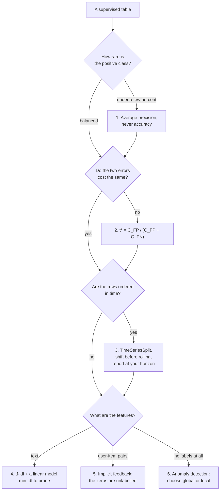

Phases 01–09 taught one problem shape: a table of independent rows, a balanced-ish target, a random
split, accuracy or RMSE. Every page in this phase breaks one of those assumptions, and each break has a
measured consequence that the default workflow cannot see.

## What this phase covers

| # | Page | The assumption it breaks | The measured consequence |
| --- | --- | --- | --- |
| 1 | [Imbalanced Classification and Fraud Detection](/machine-learning/phase-10---applied-ml-problems/imbalanced-classification-and-fraud-detection/) | The classes are comparable in size | Predicting "never fraud" scores **0.9957** |
| 2 | [Cost-Sensitive Learning and Decision Thresholds](/machine-learning/phase-10---applied-ml-problems/cost-sensitive-learning-and-decision-thresholds/) | Both errors cost the same | Threshold 0.50 costs **EUR 12,005**, $t^*$ costs **3,410** |
| 3 | [Time Series Forecasting Fundamentals](/machine-learning/phase-10---applied-ml-problems/time-series-forecasting-fundamentals/) | Rows are exchangeable | Shuffled CV reports **6.72** where the truth is **10.41** |
| 4 | [Text Classification with TF-IDF](/machine-learning/phase-10---applied-ml-problems/text-classification-with-tf-idf/) | Features are dense and few | A **2,447**-column matrix that is **99.17%** zeros |
| 5 | [Recommender Systems from Scratch](/machine-learning/phase-10---applied-ml-problems/recommender-systems-from-scratch/) | Absent values are missing data | The **97.98%** of empty cells *are* the target |
| 6 | [Anomaly and Outlier Detection](/machine-learning/phase-10---applied-ml-problems/anomaly-and-outlier-detection/) | You have labels | Isolation Forest: **0.9944** global, **0.0317** local |

## The six measurements worth remembering

**A 0.5% base rate makes accuracy a constant.** Predicting "never fraud" on 6,000 transactions scored
**0.9957**; the correct model scored **0.9962** and caught 5 of 26 frauds. Average precision separated
them properly — **0.4561** against a **0.0043** chance line — while ROC-AUC said 0.9848 and hid the
workload entirely. Resampling changed nothing that mattered: four strategies within **0.024** AP of
each other, all at the oracle's **0.4703** ceiling, every one of them wrecking calibration.

**The threshold is worth more than the model.** With a EUR 5 review and a EUR 500 loss,
$t^* = C_{FP}/(C_{FP}+C_{FN}) = 0.0099$ cost **EUR 3,410** where the default 0.50 cost **EUR 12,005** —
3.5× more money, same predictions. A threshold tuned on a validation set landed within EUR 20 of the
closed form, and any assumed cost ratio between **21 and 535** stayed within 1.4× of optimal.

**Shuffling ordered rows does not degrade a score, it reorders your candidates.** On a daily series,
shuffled cross-validation reported MAE **6.65** for ridge and **6.72** for boosting — apparently
equivalent. In time order: **7.38** and **10.41**. The flexible model gained 3.69 MAE from leakage and
the linear one 0.73, which is enough to pick the wrong model with confidence.

**Sparse and linear beats dense and clever on text.** 6,000 tickets became a 2,447-column matrix that
was 99.17% zeros. Multinomial Naive Bayes scored **0.8733**; gradient boosting on 120 SVD components
scored **0.8100**. Raising `min_df` to 50 deleted **92%** of the vocabulary and *raised* accuracy to
0.8711.

**The baseline you skipped is stronger than you think.** Recommending the most popular items reached
hit rate **0.1976** at 10 with no personalisation, and beat both personalised models on users with four
interactions (**0.25** against 0.17 and 0.19). Six lines of cosine similarity reached **0.3481** and
beat 30 epochs of matrix factorisation (0.3196) at this data size.

**Without labels, the hyperparameter you cannot tune is the one that matters.** Isolation Forest scored
**0.9944** on far outliers and **0.0317** on locally unusual points; LOF at k=10 reversed it. No k was
best at both, and 40 irrelevant columns cost Isolation Forest a factor of **12**.

## The pattern underneath all six

Each page contains a number that looks like success and is not:

| Page | The flattering number | What it actually was |
| --- | --- | --- |
| Imbalanced | accuracy 0.9957 | the base rate |
| Imbalanced | AP 0.9879 after SMOTE | resampling before the split; honestly **0.4517** |
| Cost-sensitive | precision 1.0000 | 15 alerts out of 65 frauds |
| Time series | MAE 5.147 | a centred window averaging three future days |
| Time series | shuffled CV 6.72 | training on the test days' neighbours |
| Text | accuracy 0.9482 on a segment | a template token worth **+5.459**, gone at the next migration |
| Recommenders | hit rate 0.6627 | ranking against 100 sampled negatives, not 600 items |
| Anomaly | precision 1.0000 | contamination set to 0.005 |

In every case the metric is computed correctly and the sentence people say next to it is wrong. The
defence is the same each time: **know what your number is divided by, and know what a perfect model
would score.**

## Before you start

- **[Precision, Recall, and F1-Score](/machine-learning/phase-04---supervised-learning---classification/precision-recall-and-f1-score/)** —
  pages 1 and 2 are those four cells, priced.
- **[The ROC Curve and AUC](/machine-learning/phase-04---supervised-learning---classification/the-roc-curve-and-auc/)** —
  page 1 explains when it misleads.
- **[K-Fold Cross-Validation](/machine-learning/phase-07---model-optimization--tuning/k-fold-cross-validation/)** —
  page 3 is the case where it is simply invalid.
- **[Principal Component Analysis](/machine-learning/phase-06---unsupervised-learning--dimensionality-reduction/principal-component-analysis-pca/)**
  and **[Anomaly Detection with Isolation Forests](/machine-learning/phase-06---unsupervised-learning--dimensionality-reduction/anomaly-detection-with-isolation-forests/)** —
  pages 4 and 6 extend both.
- **[Why Interpretability Matters](/machine-learning/phase-09---interpretability--responsible-ml/why-interpretability-matters/)** —
  the template-token failure on page 4 is that page's shortcut, in text.

No new libraries: SMOTE, BPR matrix factorisation, item-item cosine and every metric here are written
out in numpy.

## What you'll be able to do afterwards

1. Choose a metric that survives a 0.5% base rate, and refuse to report accuracy.
2. Derive a decision threshold from two cost numbers, and defend it when the costs are uncertain.
3. Recognise the four common resampling claims and test them with a bootstrap before believing any.
4. Build lag features that cannot see the future, and validate with a cut rather than a sample.
5. Report forecast error at the horizon the decision needs.
6. Build a text pipeline that is small, fast and auditable, and check its top tokens for artefacts.
7. Evaluate a recommender against a full catalogue, segmented by user activity.
8. Pick an anomaly detector by naming the kind of anomaly you care about, and admit what you cannot
   measure without labels.

## How long it takes

| Activity | Time |
| --- | --- |
| Reading the six pages | 6–8 hours |
| Running the code and the 30 exercises | 6–8 hours |
| The practice project below | 10–15 hours |
| **Total** | **22–31 hours** |

## Practice project

**One dataset, four framings.**

Take any dataset with a rare binary outcome, a timestamp, and a free-text column — support tickets,
insurance claims, transaction logs, moderation queues. Public ones are easy to find; a synthetic one
built like the generators in this phase is equally valid, as long as you write down the generating
process.

**Part 1 — Frame it as rare-event classification.** Report average precision against the base rate,
precision at three alert budgets, and the confusion matrix at the budget you would actually staff. Add
the four resampling strategies and bootstrap the AP difference. Write one sentence on whether any of
them helped.

**Part 2 — Put money on it.** Get, estimate or invent $C_{FP}$ and $C_{FN}$, state them explicitly,
compute $t^*$, and produce the cost curve. Then compute the cost of using 0.5 instead, and of being
wrong about the ratio by 10×.

**Part 3 — Respect the clock.** Rebuild the same model with a chronological split and `TimeSeriesSplit`,
and compare against the shuffled numbers from Part 1. If the gap is small, say so — the interesting
result is the size of the gap, not its sign.

**Part 4 — Use the text.** tf-idf plus a linear model on the text column alone. Report the top ten
coefficients per class and mark each one as *meaningful* or *artefact*. Delete the artefacts and
re-measure; that second number is the one to trust.

**Part 5 — Drop the labels.** Run Isolation Forest and LOF on the feature table with the label hidden.
Then reveal the labels and compute AP for both. Write down what you would have chosen without labels,
and whether it was the better choice.

**Part 6 — One page.** The metric, the threshold and its justification, the honest error estimate, the
artefacts you removed, and what you still cannot measure.

Part 5 is the one that changes how people work: it is a direct measurement of how good your judgement
is when the labels are not available to check it.

<Quiz
  questions={[
    {
      q: "What do all six flattering numbers in this phase have in common?",
      options: [
        "They come from bugs",
        "Each is computed correctly and describes something other than what the reader assumes — a base rate, a sampled candidate set, a threshold, a leak",
        "They only occur with small datasets",
        "They are all accuracy scores",
      ],
      answer: 1,
      explain: "0.9957 is the base rate; 0.6627 is a 101-candidate ranking; 1.0000 precision is 15 alerts; 5.147 MAE is a window that averages the future. The metric is never wrong — the sentence next to it is.",
    },
    {
      q: "Which single change was worth the most money in this phase?",
      options: [
        "Switching from logistic regression to gradient boosting",
        "Moving the decision threshold from 0.50 to C_FP/(C_FP+C_FN) — EUR 12,005 to EUR 3,410 on identical predictions",
        "Applying SMOTE to the training set",
        "Adding bigrams to the text features",
      ],
      answer: 1,
      explain: "3.5x the cost, from one number and no retraining. For contrast: four resampling strategies moved average precision by 0.024 with confidence intervals spanning 0.37, and bigrams added 16,239 columns for nothing.",
    },
    {
      q: "You are handed a tabular dataset with a timestamp column. What is the first thing you change about your usual workflow?",
      options: [
        "Add the timestamp as a feature",
        "Replace the random split with a chronological one and TimeSeriesSplit — a shuffled split reported 6.72 MAE where the honest number was 10.41, and reversed the model ranking",
        "Sort the rows",
        "Nothing, provided you have enough data",
      ],
      answer: 1,
      explain: "The optimism is not uniform across models, so it does not just inflate scores — it changes which model you ship. Also check every rolling feature for a missing shift(1).",
    },
    {
      q: "Which of these problems can be evaluated without any labels at all?",
      options: [
        "None of them",
        "Anomaly detection — but only in the weak sense that you can compute scores; choosing between detectors or between k values genuinely requires labels, synthetic anomalies, or a hand-labelled sample",
        "Recommendation, using hit rate",
        "Text classification, using perplexity",
      ],
      answer: 1,
      explain: "This is the honest position: LOF at k=10 was eight times better than Isolation Forest on local anomalies and worse on global ones, and nothing in the unlabelled data tells you which you have. Label a hundred points, starting with the ones the detectors disagree about.",
    },
  ]}
/>

## Next

Start with
[Imbalanced Classification and Fraud Detection](/machine-learning/phase-10---applied-ml-problems/imbalanced-classification-and-fraud-detection/)
— 87 frauds in 20,000 rows, and the 0.9957 accuracy that a model achieves by doing nothing at all.
