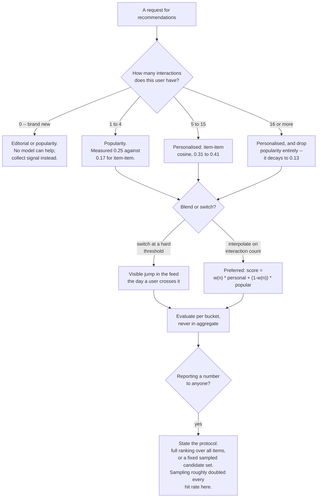

import DataCampExercise from "../../../../components/DataCampExercise.astro";
import Figure from "../../../../components/Figure.astro";
import Quiz from "../../../../components/Quiz.astro";

## What you'll learn

- why the empty cells of a user-item matrix are the **target**, not missing data
- the popularity baseline, which is not a straw man: **hit rate 0.1976 at 10**
- item-item collaborative filtering in **six lines of numpy**: **0.3481**
- BPR matrix factorisation by SGD, and why it *lost* here: **0.3196**
- the evaluation trap that doubles every published number: **100 sampled negatives**
- cold start, measured: with 4 interactions, popularity beats personalisation **0.25 to 0.17**

## Implicit feedback

The data is 1,200 users, 600 items, and a 1 wherever a user interacted with an item. Generated from
latent factors plus an item popularity term, so the *reason* any cell is filled is known — which lets
us separate "the model learned taste" from "the model learned what is popular".

<Figure
  src="/images/ml/phase-10-applied/recommender-systems-from-scratch/the-matrix"
  alt="Left: a 150 by 150 corner of the user-item matrix, sparsely dotted with blue cells. Right: a table — 1,200 by 600, 14,514 interactions, 2.02% density, median 10 per user, 183 users with fewer than 5, 4 items with none, top 10% of items hold 40.3% of clicks, 1,017 evaluable users."
  title="2.02% of the cells are filled, and the empty ones are the prediction target"
  caption="Text was 99.17% zeros; this is 97.98% zeros with a crucial difference. In text a zero means 'this document does not contain that word' — a fact. Here a zero means 'this user has not interacted with that item yet', which is a mixture of dislike, ignorance and not-yet, and telling those apart is the entire problem."
/>

| Quantity | Value |
| --- | --- |
| users × items | 1,200 × 600 |
| interactions | **14,514** |
| density | **2.02%** |
| median interactions per user | 10 |
| users with fewer than 5 | **183** |
| items with none at all | 4 |
| top 10% of items hold | **40.3%** of all interactions |

:::caution[Missing is not negative]
The single most consequential modelling decision on this page: a zero is **unlabelled**, not negative.
Treating all 691,486 zeros as negative examples trains the model to predict "no" — which is right
97.98% of the time and useless. The three standard responses are:

- **implicit-feedback objectives** that only compare a seen item against an unseen one (BPR, below)
- **negative sampling**, drawing a few zeros per positive rather than all of them
- **weighted least squares** (ALS) with a small confidence weight on the zeros
:::

## The long tail, and why popularity is hard to beat

<Figure
  src="/images/ml/phase-10-applied/recommender-systems-from-scratch/long-tail"
  alt="Left: interactions per item against rank on a log axis, falling from 325 for the most popular item to zero. Right: cumulative share of interactions against fraction of items, rising steeply above the diagonal, with the top 10% of items marked at 40.3%."
  title="Recommending the most popular items is not a straw man: it is a real 0.1976 hit rate"
  caption="The most popular item collected 325 interactions and four items collected none. The top 10% of the catalogue accounts for 40.3% of all activity, so a non-personalised list of the ten most popular items is right surprisingly often — and any personalised model has to beat that before it has earned anything."
/>

## Evaluation, before any model

**Leave-one-out**: for every user with at least 5 interactions, hide one at random. That gives
**1,017** evaluable users. Then, for each of them, rank all 600 items — excluding the ones they already
interacted with in training — and ask where the hidden item landed.

$$
\mathrm{HitRate@}k = \frac{1}{|U|}\sum_{u \in U} \mathbb{1}\big[\mathrm{rank}_u \le k\big],
\qquad
\mathrm{NDCG@}k = \frac{1}{|U|}\sum_{u \in U}
\frac{\mathbb{1}\big[\mathrm{rank}_u \le k\big]}{\log_2(\mathrm{rank}_u + 1)}
$$

With one held-out item per user, NDCG reduces to a rank-discounted hit rate: it rewards position 1
over position 9, which hit rate does not.

## Four scorers

<Figure
  src="/images/ml/phase-10-applied/recommender-systems-from-scratch/baselines"
  alt="Left: hit rate at 10 — random 0.0098, popularity 0.1976, item-item cosine 0.3481, BPR matrix factorisation 0.3196. Right: median rank of the held-out item — random 304, popularity 82, item-item 23, BPR 26."
  title="Item-item cosine, in six lines of numpy, beats matrix factorisation at this data size"
  caption="Random ranking puts the held-out item at median rank 304 of 600, as it should. Popularity gets it to 82 without knowing anything about the user. Item-item cosine reaches 23, and 30 epochs of BPR reach 26. The gap between random and popularity is bigger than the gap between popularity and the best model."
/>

| Scorer | Hit@10 | NDCG@10 | Median rank |
| --- | --- | --- | --- |
| random | 0.0098 | 0.0051 | 304 |
| popularity | **0.1976** | 0.0975 | 82 |
| **item-item cosine** | **0.3481** | **0.2024** | **23** |
| BPR matrix factorisation | 0.3196 | 0.1776 | 26 |

### Item-item collaborative filtering

The whole method, once the matrix is in memory:

```python title="item_item.py" showLineNumbers{1}
norms = np.linalg.norm(train, axis=0)          # column norms = item popularity
norms[norms == 0] = 1.0                        # unseen items: avoid dividing by 0
unit = train / norms                           # L2-normalise each item column
similarity = unit.T @ unit                     # cosine between every item pair
np.fill_diagonal(similarity, 0.0)              # an item is not its own neighbour

scores = train[user] @ similarity               # sum of similarities to what you took
```

The last line is the recommendation: **an item scores highly if it is similar to the items this user
already interacted with**. No optimisation, no hyperparameters, no training loop. On this data it is
the best of the four.

Two properties are worth knowing. The cosine normalisation is what stops popular items dominating —
without it, `train[user] @ train.T @ train` is essentially a popularity ranking. And the similarity
matrix is $600 \times 600$ here but $|I|^2$ in general, so at a million items you need approximate
neighbours (`NearestNeighbors` with a tree, FAISS, ScaNN) instead of a dense product.

### BPR matrix factorisation

Matrix factorisation learns a vector per user and per item such that the dot product ranks correctly.
The **BPR** objective takes a seen item $i$ and an unseen item $j$ and pushes them apart:

$$
\max \sum_{(u,i,j)} \log \sigma\big(\mathbf{p}_u^\top \mathbf{q}_i
- \mathbf{p}_u^\top \mathbf{q}_j\big) - \lambda\big(\lVert\mathbf{p}_u\rVert^2
+ \lVert\mathbf{q}_i\rVert^2 + \lVert\mathbf{q}_j\rVert^2\big)
$$

```python title="bpr.py" showLineNumbers{1}
def bpr(train, k=16, epochs=30, lr=0.05, reg=0.01, seed=1):
    """Rank a seen item above a randomly drawn unseen one, by SGD."""
    rng = np.random.default_rng(seed)
    n_users, n_items = train.shape
    P = rng.normal(0, 0.1, (n_users, k))
    Q = rng.normal(0, 0.1, (n_items, k))
    pairs = np.argwhere(train == 1)

    for _ in range(epochs):
        rng.shuffle(pairs)
        for u, i in pairs:
            j = int(rng.integers(0, n_items))          # sample a negative
            while train[u, j] == 1:
                j = int(rng.integers(0, n_items))
            gradient = 1.0 / (1.0 + np.exp(P[u] @ (Q[i] - Q[j])))
            pu, qi, qj = P[u].copy(), Q[i].copy(), Q[j].copy()
            P[u] += lr * (gradient * (qi - qj) - reg * pu)
            Q[i] += lr * (gradient * pu - reg * qi)
            Q[j] += lr * (-gradient * pu - reg * qj)
    return P, Q
```

It reached 0.3196 after 30 epochs over 13,497 positive pairs — and **0.2281 after 10 epochs**, which is
worth knowing before you conclude that factorisation does not work. It is an iterative method and it
needs its iterations.

Why it still loses to a six-line neighbourhood method here: **13,497 interactions is not much data for
1,800 factor vectors**. At 16 factors, BPR is fitting 1,200 × 16 + 600 × 16 = 28,800 parameters from
13,497 observations. Item-item cosine fits nothing. The ordering reverses on real catalogues with
millions of interactions, where factorisation generalises across the sparsity in a way neighbourhoods
cannot — but "matrix factorisation is better" is a statement about data volume, not about algorithms.

## The evaluation trap

Ranking the held-out item against **all** items is expensive, so a very common shortcut is to rank it
against a sample of 100 unseen items. Here is what that does:

<Figure
  src="/images/ml/phase-10-applied/recommender-systems-from-scratch/sampled-negatives"
  alt="Grouped bars of hit rate at 10 under two protocols. Popularity 0.1976 full against 0.4238 sampled (2.14x), item-item 0.3481 against 0.6627 (1.90x), BPR 0.3196 against 0.6441 (2.01x)."
  title="The same models, two evaluation protocols"
  caption="Ranking against 100 sampled negatives instead of all 600 items roughly doubles every hit rate — and does not do so uniformly, since the inflation factor ranges from 1.90 to 2.14. Both protocols are internally consistent; the numbers are simply not comparable, and a 'hit rate at 10 of 0.66' means nothing without the protocol attached."
/>

| Scorer | Full ranking (600 items) | 100 sampled negatives | Inflation |
| --- | --- | --- | --- |
| popularity | 0.1976 | 0.4238 | **2.14×** |
| item-item cosine | 0.3481 | 0.6627 | 1.90× |
| BPR matrix factorisation | 0.3196 | 0.6441 | 2.01× |

The arithmetic is straightforward — being in the top 10 of 101 candidates is far easier than the top 10
of 600 — but two consequences are not:

- **Cross-paper comparison breaks.** A published 0.66 and your 0.35 may be the same model.
- **The ranking can change.** The inflation is not a constant factor: it depends on how a model
  distributes scores over the tail. Krichene and Rendle showed in 2020 that sampled metrics can reorder
  methods, which is why full ranking (or a documented, fixed candidate set) is now expected.

If you must sample for speed, sample **the same** negatives for every model and say so in the report.

## Cold start, measured

<Figure
  src="/images/ml/phase-10-applied/recommender-systems-from-scratch/cold-start"
  alt="Grouped bars of hit rate at 10 by user activity bucket. With 4 interactions: popularity 0.25, item-item 0.17, BPR 0.19. With 5-7: 0.24, 0.31, 0.31. With 8-10: 0.21, 0.33, 0.32. With 11-15: 0.21, 0.41, 0.37. With 16-61: 0.13, 0.40, 0.33."
  title="Personalisation needs history; popularity does not"
  caption="For users with exactly four interactions in the training matrix, popularity (0.25) beats both personalised models (0.17 and 0.19). From five interactions onwards personalisation wins, and by 16 or more it wins three to one. Popularity's own performance falls as users get more active, because heavy users have already seen the popular items."
/>

| Interactions in training | n | popularity | item-item | BPR |
| --- | --- | --- | --- | --- |
| 4 | 81 | **0.25** | 0.17 | 0.19 |
| 5–7 | 252 | 0.24 | **0.31** | 0.31 |
| 8–10 | 199 | 0.21 | **0.33** | 0.32 |
| 11–15 | 203 | 0.21 | **0.41** | 0.37 |
| 16–61 | 282 | 0.13 | **0.40** | 0.33 |

Both halves of this table are load-bearing.

**Personalisation loses on cold users.** With four interactions there is not enough signal, and the
best available guess is what everyone else likes. This is why production systems are almost always a
*blend*: popularity (or editorial curation) for new users, collaborative filtering once history
accumulates, usually with a smooth interpolation rather than a switch.

**Popularity gets worse as users get more active** — 0.25 down to 0.13 — because the recommendation
excludes items the user already has, and heavy users have consumed most of the head. An aggregate hit
rate hides both effects. Always segment by activity.

Note also the 183 users with fewer than five interactions who were **excluded from evaluation
entirely**. They are 15% of the user base, they are the hardest cases, and every leave-one-out
benchmark quietly drops them. Their existence is a product problem, not a modelling one.

### What to serve whom

The measured table above is a routing policy waiting to be written down:



Two of those boxes exist only because of measurements on this page: the 1-to-4 bucket routes to
popularity because personalisation *loses* there, and the reporting box exists because the same three
models scored between 1.90× and 2.14× higher under sampled evaluation. Neither is a design preference;
both are what the numbers said.

## See it move

Item-item cosine is one formula, and the effect of normalisation is easiest to feel by toggling it.
Below, five users have interacted with six items; the similarity between two items is the cosine of
their columns.

```p5 title="Item-item similarity, with and without normalisation" desc="A five-by-six interaction matrix. Clicking a cell toggles it and the item-item cosine similarity matrix updates. A toggle switches between cosine similarity and raw co-occurrence counts, showing how the popular item dominates without normalisation." height="470"
let R = [[1,1,0,1,0,0],[1,0,1,1,0,0],[1,1,1,0,1,0],[0,1,0,1,0,1],[1,0,1,1,1,0]];
let normalise = true;
const NU = 5, NI = 6, cell = 42;
function colDot(a, b, norm) {
  let dot = 0, na = 0, nb = 0;
  for (let u = 0; u < NU; u++) {
    dot += R[u][a] * R[u][b];
    na += R[u][a] * R[u][a];
    nb += R[u][b] * R[u][b];
  }
  if (!norm) return dot;
  return (na === 0 || nb === 0) ? 0 : dot / Math.sqrt(na * nb);
}
function setup() {
  createCanvas(620, 470);
  textFont("monospace");
}
function draw() {
  background(13, 17, 23);
  const ox = 90, oy = 60;

  noStroke();
  fill(118, 131, 144);
  textSize(11);
  textAlign(LEFT, BOTTOM);
  text("interactions — click any cell to toggle", ox, oy - 12);

  for (let u = 0; u < NU; u++) {
    fill(118, 131, 144);
    textSize(10);
    textAlign(RIGHT, CENTER);
    text("user " + (u + 1), ox - 8, oy + u * cell + cell / 2);
    for (let i = 0; i < NI; i++) {
      fill(R[u][i] ? color(107, 169, 221) : color(38, 44, 52));
      rect(ox + i * cell, oy + u * cell, cell - 4, cell - 4, 5);
    }
  }
  for (let i = 0; i < NI; i++) {
    let count = 0;
    for (let u = 0; u < NU; u++) count += R[u][i];
    fill(118, 131, 144);
    textSize(10);
    textAlign(CENTER, TOP);
    text("i" + (i + 1), ox + i * cell + cell / 2 - 2, oy + NU * cell + 4);
    text(count + "", ox + i * cell + cell / 2 - 2, oy + NU * cell + 20);
  }

  const sy = oy + NU * cell + 58;
  fill(118, 131, 144);
  textSize(11);
  textAlign(LEFT, BOTTOM);
  text(normalise ? "cosine similarity (normalised)"
                 : "raw co-occurrence counts", ox, sy - 8);

  let peak = 0;
  for (let a = 0; a < NI; a++) {
    for (let b = 0; b < NI; b++) {
      if (a !== b) peak = Math.max(peak, colDot(a, b, normalise));
    }
  }
  for (let a = 0; a < NI; a++) {
    for (let b = 0; b < NI; b++) {
      const v = a === b ? 0 : colDot(a, b, normalise);
      const t = peak > 0 ? v / peak : 0;
      noStroke();
      fill(a === b ? color(30, 34, 40) : color(255, 211, 67, 40 + t * 190));
      rect(ox + b * cell, sy + a * cell, cell - 4, cell - 4, 5);
      if (a !== b) {
        fill(t > 0.55 ? color(13, 17, 23) : color(190));
        textSize(9);
        textAlign(CENTER, CENTER);
        text(normalise ? v.toFixed(2) : v.toFixed(0),
             ox + b * cell + (cell - 4) / 2, sy + a * cell + (cell - 4) / 2);
      }
    }
  }

  fill(118, 131, 144);
  textSize(10);
  textAlign(LEFT, BOTTOM);
  text("press N to toggle normalisation; the row of counts above is item popularity",
       ox - 70, height - 10);
}
function keyPressed() {
  if (key === "n" || key === "N") normalise = !normalise;
}
function mousePressed() {
  const ox = 90, oy = 60;
  for (let u = 0; u < NU; u++) {
    for (let i = 0; i < NI; i++) {
      if (mouseX > ox + i * cell && mouseX < ox + i * cell + cell - 4 &&
          mouseY > oy + u * cell && mouseY < oy + u * cell + cell - 4) {
        R[u][i] = R[u][i] ? 0 : 1;
      }
    }
  }
}
```

Fill an entire column — make one item universally popular — and watch what happens. Under raw
co-occurrence that item becomes the most similar item to *everything*, so it is recommended to
everybody. Under cosine it does not, because the normalisation divides by its own norm. That single
division is the difference between a recommender and a bestseller list.

## Pitfalls

| Pitfall | Why it bites | What to do |
| --- | --- | --- |
| Treating zeros as negatives | 97.98% of cells are zero; the model learns to say no | BPR, negative sampling or weighted ALS |
| Skipping the popularity baseline | It scores 0.1976 at 10 here, unpersonalised | Always report it alongside your model |
| Sampled negatives in the metric | Inflated 1.90× to 2.14×, non-uniformly | Rank against everything, or fix and document the candidate set |
| Recommending items the user already has | Trivially "correct" and useless | Mask known items before ranking |
| One aggregate hit rate | Popularity wins at 4 interactions and loses at 16 | Segment by user activity |
| Ignoring the excluded users | 183 users (15%) had too little history to evaluate | Report the coverage, and design for them explicitly |
| Un-normalised similarity | Popular items become everyone's nearest neighbour | Cosine, or shrinkage on the counts |
| Concluding MF beats neighbourhoods (or vice versa) | 0.3196 against 0.3481 here at 13.5k interactions | Measure both at *your* data volume |

## Recap

- The matrix is **1,200 × 600** and **2.02%** filled; the zeros are the prediction target, not missing
  data.
- The top 10% of items hold **40.3%** of interactions, which is why popularity reaches **0.1976** at 10
  with no personalisation.
- Item-item cosine, six lines of numpy, reached **0.3481** and median rank **23** of 600.
- BPR matrix factorisation reached **0.3196** after 30 epochs and **0.2281** after 10 — it lost here
  because 13,497 interactions is thin for 28,800 parameters.
- Ranking against 100 sampled negatives inflated hit rate by **1.90× to 2.14×**, non-uniformly.
- With four interactions, popularity beat personalisation **0.25 to 0.17**; with 16 or more it lost
  **0.13 to 0.40**.

<Quiz
  questions={[
    {
      q: "Your user-item matrix is 97.98% zeros. How should the zeros be treated?",
      options: [
        "As negative examples — the user did not interact, so they were not interested",
        "As unlabelled: a zero mixes dislike, ignorance and not-yet, so use an implicit-feedback objective, negative sampling or weighted ALS",
        "Drop them and train only on positives",
        "Impute them with the item's mean rating",
      ],
      answer: 1,
      explain: "Training on all 691,486 zeros as negatives teaches the model to predict 'no', which is right 97.98% of the time and worthless. BPR sidesteps it by only ever comparing a seen item against an unseen one.",
    },
    {
      q: "Your new model reaches hit rate at 10 of 0.30. Is it good?",
      options: [
        "Yes, 30% of the time the right item is in the top 10",
        "Unknown until you compare against popularity (0.1976 here) and state the evaluation protocol — the same model scores 0.64 against 100 sampled negatives",
        "Yes, if NDCG is also above 0.2",
        "No, anything below 0.5 is unusable",
      ],
      answer: 1,
      explain: "Two references are missing: the unpersonalised baseline and the candidate set. Both change the interpretation by a factor of two here, and neither is visible in the number itself.",
    },
    {
      q: "Item-item cosine (0.3481) beat BPR matrix factorisation (0.3196) on this data. What does that establish?",
      options: [
        "Neighbourhood methods are better than factorisation",
        "At 13,497 interactions, fitting 28,800 factor parameters is data-starved — the ordering is about data volume, and would likely reverse on a large catalogue",
        "The BPR implementation is wrong",
        "Cosine similarity is the state of the art",
      ],
      answer: 1,
      explain: "BPR also improved from 0.2281 at 10 epochs to 0.3196 at 30, so it was still learning. The transferable lesson is procedural: implement the cheap neighbourhood baseline first, because it may win at your scale.",
    },
    {
      q: "Why does the popularity baseline get WORSE for more active users, from 0.25 down to 0.13?",
      options: [
        "Active users have more unusual taste",
        "Known items are excluded from the ranking, and active users have already consumed most of the popular head",
        "The metric is biased against active users",
        "Their held-out items are harder to predict",
      ],
      answer: 1,
      explain: "Masking known items is correct — recommending something already purchased is worthless — and it systematically strips popularity of its best candidates for heavy users. It is also why an aggregate hit rate hides the cold-start problem entirely.",
    },
    {
      q: "A paper reports hit rate at 10 of 0.66 using 100 sampled negatives. Your full-ranking evaluation gives 0.35. What can you conclude?",
      options: [
        "Their model is nearly twice as good",
        "Nothing about relative quality — the protocols differ, and here the same models moved by 1.90x to 2.14x under exactly that change",
        "Your implementation has a bug",
        "You should switch to sampled negatives to compare",
      ],
      answer: 1,
      explain: "The inflation is real, large and model-dependent, which means it can reorder methods rather than shifting them all equally. Reproduce their protocol or rank against the full catalogue; do not compare across protocols.",
    },
  ]}
/>

## 🧪 Try It Yourself

### Exercise 1 – Build the interaction matrix

<DataCampExercise
  lang="python"
  hint={`The bisection solves for the global offset that makes the mean interaction probability equal 0.02.`}
  code={`# Task: Exercise 1 - Build the interaction matrix
import numpy as np

rng = np.random.default_rng(11)
n_users, n_items, n_factors = 1200, 600, 6
U = rng.normal(0, 1, (n_users, n_factors))
V = rng.normal(0, 1, (n_items, n_factors))
popularity = -0.9 * np.log1p(np.arange(n_items))
rng.shuffle(popularity)

sigmoid = lambda z: 1 / (1 + np.exp(-z))
logits = U @ V.T * 0.9 + popularity
lo, hi = -30.0, 30.0
for _ in range(200):
    mid = (lo + hi) / 2
    if sigmoid(logits + mid).mean() > 0.02:
        hi = mid
    else:
        lo = mid
R = (rng.random(logits.shape) < sigmoid(logits + (lo + hi) / 2)).astype(np.int8)

per_user, per_item = R.sum(1), R.sum(___)          # replace ___ with 0
order = np.argsort(per_item)[::-1]
print(f"matrix {R.shape}   interactions {int(R.sum()):,}   density {R.mean():.4f}")
print(f"median per user {np.median(per_user):.0f}   "
      f"users with <5 {int((per_user < 5).sum())}")
print(f"items with none {int((per_item == 0).sum())}   "
      f"top 10% of items hold {per_item[order[:60]].sum() / per_item.sum():.4f}")

# -- Expected Output -------------------------------------------
# matrix (1200, 600)   interactions 14,514   density 0.0202
# median per user 10   users with <5 183
# items with none 4   top 10% of items hold 0.4034
# --------------------------------------------------------------`}
  solution={`import numpy as np

rng = np.random.default_rng(11)
n_users, n_items, n_factors = 1200, 600, 6
U = rng.normal(0, 1, (n_users, n_factors))
V = rng.normal(0, 1, (n_items, n_factors))
popularity = -0.9 * np.log1p(np.arange(n_items))
rng.shuffle(popularity)
sigmoid = lambda z: 1 / (1 + np.exp(-z))
logits = U @ V.T * 0.9 + popularity
lo, hi = -30.0, 30.0
for _ in range(200):
    mid = (lo + hi) / 2
    if sigmoid(logits + mid).mean() > 0.02:
        hi = mid
    else:
        lo = mid
R = (rng.random(logits.shape) < sigmoid(logits + (lo + hi) / 2)).astype(np.int8)
per_user, per_item = R.sum(1), R.sum(0)
order = np.argsort(per_item)[::-1]
print(f"matrix {R.shape}   interactions {int(R.sum()):,}   density {R.mean():.4f}")
print(f"median per user {np.median(per_user):.0f}   "
      f"users with <5 {int((per_user < 5).sum())}")
print(f"items with none {int((per_item == 0).sum())}   "
      f"top 10% of items hold {per_item[order[:60]].sum() / per_item.sum():.4f}")`}
  sct={`test_output_contains("top 10% of items hold 0.4034")
success_msg("2.02% density, and 40% of all activity concentrated in a tenth of the catalogue.")`}
  height={360}
/>

### Exercise 2 – Leave one out, then try popularity

<DataCampExercise
  lang="python"
  hint={`Mask the user's known items with -inf before ranking, otherwise the model gets credit for recommending what they already have.`}
  code={`# Task: Exercise 2 - Leave one out, then try popularity
rng2 = np.random.default_rng(0)
train = R.copy()
held = {}
for u in range(n_users):
    seen = np.flatnonzero(R[u])
    if len(seen) >= 5:
        pick = int(rng2.choice(seen))
        train[u, pick] = 0
        held[u] = pick
print(f"evaluable users {len(held):,}   held-out interactions {len(held):,}")

def evaluate(score_fn, k=10):
    hits, ndcg, ranks = 0, 0.0, []
    for u, item in held.items():
        scores = np.asarray(score_fn(u), dtype=float).copy()
        scores[np.flatnonzero(train[u])] = -np.inf      # never recommend known items
        rank = int((scores > scores[item]).sum()) + 1
        ranks.append(rank)
        if rank <= k:
            hits += 1
            ndcg += 1 / np.log2(rank + 1)
    n = len(held)
    return hits / n, ndcg / n, float(np.median(ranks))

pop_train = train.sum(0).astype(float)
h, n_, med = evaluate(lambda u: ___)                    # replace ___ with pop_train
print(f"popularity   hit@10 {h:.4f}   NDCG@10 {n_:.4f}   median rank {med:.0f}")

# -- Expected Output -------------------------------------------
# evaluable users 1,017   held-out interactions 1,017
# popularity   hit@10 0.1976   NDCG@10 0.0975   median rank 82
# --------------------------------------------------------------`}
  solution={`rng2 = np.random.default_rng(0)
train = R.copy()
held = {}
for u in range(n_users):
    seen = np.flatnonzero(R[u])
    if len(seen) >= 5:
        pick = int(rng2.choice(seen))
        train[u, pick] = 0
        held[u] = pick
print(f"evaluable users {len(held):,}   held-out interactions {len(held):,}")

def evaluate(score_fn, k=10):
    hits, ndcg, ranks = 0, 0.0, []
    for u, item in held.items():
        scores = np.asarray(score_fn(u), dtype=float).copy()
        scores[np.flatnonzero(train[u])] = -np.inf
        rank = int((scores > scores[item]).sum()) + 1
        ranks.append(rank)
        if rank <= k:
            hits += 1
            ndcg += 1 / np.log2(rank + 1)
    n = len(held)
    return hits / n, ndcg / n, float(np.median(ranks))

pop_train = train.sum(0).astype(float)
h, n_, med = evaluate(lambda u: pop_train)
print(f"popularity   hit@10 {h:.4f}   NDCG@10 {n_:.4f}   median rank {med:.0f}")`}
  sct={`test_output_contains("hit@10 0.1976")
success_msg("0.1976 at 10 with no personalisation whatsoever. That is the number your model has to beat.")`}
  height={380}
/>

### Exercise 3 – Item-item cosine in six lines

<DataCampExercise
  lang="python"
  hint={`Normalise the item columns, take the Gram matrix of the normalised columns, zero the diagonal, then score with train[user] @ similarity.`}
  code={`# Task: Exercise 3 - Item-item cosine in six lines
norms = np.linalg.norm(train, axis=0)
norms[norms == 0] = 1.0
unit = train / norms
similarity = unit.T @ ___                     # replace ___ with unit
np.fill_diagonal(similarity, 0.0)

h, n_, med = evaluate(lambda u: train[u] @ similarity)
print(f"item-item    hit@10 {h:.4f}   NDCG@10 {n_:.4f}   median rank {med:.0f}")

# -- Expected Output -------------------------------------------
# item-item    hit@10 0.3481   NDCG@10 0.2024   median rank 23
# --------------------------------------------------------------`}
  solution={`norms = np.linalg.norm(train, axis=0)
norms[norms == 0] = 1.0
unit = train / norms
similarity = unit.T @ unit
np.fill_diagonal(similarity, 0.0)
h, n_, med = evaluate(lambda u: train[u] @ similarity)
print(f"item-item    hit@10 {h:.4f}   NDCG@10 {n_:.4f}   median rank {med:.0f}")`}
  sct={`test_output_contains("hit@10 0.3481")
success_msg("0.3481 and median rank 23 of 600, from five lines of linear algebra and no training loop.")`}
  height={260}
/>

### Exercise 4 – BPR by hand

<DataCampExercise
  lang="python"
  hint={`The gradient of log-sigmoid(x) is sigmoid(-x) = 1 / (1 + exp(x)). Copy the vectors before updating, or you will use half-updated values.`}
  code={`# Task: Exercise 4 - BPR by hand
def bpr(train, k=16, epochs=10, lr=0.05, reg=0.01, seed=1):
    """Rank a seen item above a randomly drawn unseen one, by SGD."""
    rng = np.random.default_rng(seed)
    n_u, n_i = train.shape
    P = rng.normal(0, 0.1, (n_u, k))
    Q = rng.normal(0, 0.1, (n_i, k))
    pairs = np.argwhere(train == 1)
    for _ in range(epochs):
        rng.shuffle(pairs)
        for u, i in pairs:
            j = int(rng.integers(0, n_i))
            while train[u, j] == 1:                  # keep sampling until unseen
                j = int(rng.integers(0, n_i))
            g = 1 / (1 + np.exp(P[u] @ (Q[i] - Q[___])))     # replace ___ with j
            pu, qi, qj = P[u].copy(), Q[i].copy(), Q[j].copy()
            P[u] += lr * (g * (qi - qj) - reg * pu)
            Q[i] += lr * (g * pu - reg * qi)
            Q[j] += lr * (-g * pu - reg * qj)
    return P, Q

P, Q = bpr(train)
h, n_, med = evaluate(lambda u: Q @ P[u])
print(f"BPR (10 epochs)  hit@10 {h:.4f}   NDCG@10 {n_:.4f}   median rank {med:.0f}")

# -- Expected Output -------------------------------------------
# BPR (10 epochs)  hit@10 0.2281   NDCG@10 0.1271   median rank 51
# --------------------------------------------------------------`}
  solution={`def bpr(train, k=16, epochs=10, lr=0.05, reg=0.01, seed=1):
    rng = np.random.default_rng(seed)
    n_u, n_i = train.shape
    P = rng.normal(0, 0.1, (n_u, k))
    Q = rng.normal(0, 0.1, (n_i, k))
    pairs = np.argwhere(train == 1)
    for _ in range(epochs):
        rng.shuffle(pairs)
        for u, i in pairs:
            j = int(rng.integers(0, n_i))
            while train[u, j] == 1:
                j = int(rng.integers(0, n_i))
            g = 1 / (1 + np.exp(P[u] @ (Q[i] - Q[j])))
            pu, qi, qj = P[u].copy(), Q[i].copy(), Q[j].copy()
            P[u] += lr * (g * (qi - qj) - reg * pu)
            Q[i] += lr * (g * pu - reg * qi)
            Q[j] += lr * (-g * pu - reg * qj)
    return P, Q

P, Q = bpr(train)
h, n_, med = evaluate(lambda u: Q @ P[u])
print(f"BPR (10 epochs)  hit@10 {h:.4f}   NDCG@10 {n_:.4f}   median rank {med:.0f}")`}
  sct={`test_output_contains("hit@10 0.2281")
success_msg("0.2281 after 10 epochs, and 0.3196 after 30 - factorisation is an iterative method and needs its iterations.")`}
  height={400}
/>

### Exercise 5 – Reproduce the sampled-negatives inflation

<DataCampExercise
  lang="python"
  hint={`Rank the held-out item against only the sampled negatives: the rank is 1 plus the number of negatives that outscore it.`}
  code={`# Task: Exercise 5 - Reproduce the sampled-negatives inflation
def evaluate_sampled(score_fn, n_neg=100, k=10, seed=3):
    r = np.random.default_rng(seed)
    all_items = np.arange(n_items)
    hits, ranks = 0, []
    for u, item in held.items():
        scores = np.asarray(score_fn(u), dtype=float)
        pool = np.setdiff1d(all_items, np.append(np.flatnonzero(train[u]), item))
        negatives = r.choice(pool, n_neg, replace=False)
        rank = int((scores[negatives] > scores[item]).sum()) + ___   # replace ___ with 1
        ranks.append(rank)
        if rank <= k:
            hits += 1
    return hits / len(held), float(np.median(ranks))

for name, fn in (("popularity", lambda u: pop_train),
                 ("item-item", lambda u: train[u] @ similarity),
                 ("BPR", lambda u: Q @ P[u])):
    full_h = evaluate(fn)[0]
    samp_h, samp_med = evaluate_sampled(fn)
    print(f"{name:11s} full {full_h:.4f}   sampled-100 {samp_h:.4f}   "
          f"inflation {samp_h / full_h:.2f}x")

# -- Expected Output -------------------------------------------
# popularity  full 0.1976   sampled-100 0.4238   inflation 2.14x
# item-item   full 0.3481   sampled-100 0.6627   inflation 1.90x
# BPR         full 0.2281   sampled-100 0.5162   inflation 2.26x
# --------------------------------------------------------------`}
  solution={`def evaluate_sampled(score_fn, n_neg=100, k=10, seed=3):
    r = np.random.default_rng(seed)
    all_items = np.arange(n_items)
    hits, ranks = 0, []
    for u, item in held.items():
        scores = np.asarray(score_fn(u), dtype=float)
        pool = np.setdiff1d(all_items, np.append(np.flatnonzero(train[u]), item))
        negatives = r.choice(pool, n_neg, replace=False)
        rank = int((scores[negatives] > scores[item]).sum()) + 1
        ranks.append(rank)
        if rank <= k:
            hits += 1
    return hits / len(held), float(np.median(ranks))

for name, fn in (("popularity", lambda u: pop_train),
                 ("item-item", lambda u: train[u] @ similarity),
                 ("BPR", lambda u: Q @ P[u])):
    full_h = evaluate(fn)[0]
    samp_h, samp_med = evaluate_sampled(fn)
    print(f"{name:11s} full {full_h:.4f}   sampled-100 {samp_h:.4f}   "
          f"inflation {samp_h / full_h:.2f}x")`}
  sct={`test_output_contains("inflation 1.90x")
success_msg("Every number roughly doubles, and not by the same factor - which is how sampled metrics reorder methods.")`}
  height={380}
/>

## Next

[Anomaly and Outlier Detection](/machine-learning/phase-10---applied-ml-problems/anomaly-and-outlier-detection/)
— the last applied problem, and the only one where you usually have no labels at all, which changes
what "evaluation" can even mean.
