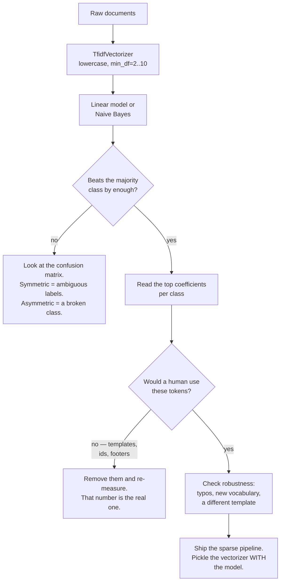

## What you'll learn

- how a bag of words turns 6,000 short tickets into a **2,447 × 4,200** matrix that is **99.17% zeros**
- what idf actually computes, and why the loudest weights go to the least useful tokens
- why sparse linear models win on text: **0.8733** for Naive Bayes against **0.8100** for boosting on
  120 SVD components
- that `min_df=50` deletes **92%** of the vocabulary and *improves* accuracy to **0.8711**
- how a template artefact becomes a 5.46 coefficient, and costs **15 accuracy points** when the
  template changes
- when character n-grams beat word n-grams: **0.8611** against **0.8289** on typo'd text

## The corpus

Real support tickets cannot be published, so this page uses a synthetic corpus generated from a known
process: 6,000 tickets, three queues, about 22 words each. Filler words, a handful of topical words,
and a long tail of case identifiers.

```python title="the_corpus.py" showLineNumbers{1}
TOPICS = {
    "billing":   "invoice charged refund payment card ... late lost error".split(),
    "shipping":  "parcel delivery courier tracking ... late lost refund".split(),
    "technical": "login password reset error crash ... charge missing".split(),
}
```

Three properties are deliberate, and each one shows up in a measurement later:

- **The topic vocabularies overlap.** `refund` belongs to billing *and* shipping; `error` to billing
  *and* technical; `late` and `lost` to billing *and* shipping. This is the irreducible part.
- **6% of the labels are wrong** — tickets filed in the wrong queue, as happens.
- **22% of the tokens are case identifiers** drawn from a Zipf distribution over 4,000 possible
  values, which is what makes the matrix wide.

One caveat to state up front: the generator **shuffles the words** in each document, so word order
carries no information *by construction*. That makes this corpus a clean test of bag-of-words methods
and a useless test of anything that depends on sequence — a limitation the n-gram section returns to.

## The matrix

<Figure
  src="/images/ml/phase-10-applied/text-classification-with-tf-idf/sparse-matrix"
  alt="Left: a 60 by 120 corner of the document-term matrix, almost entirely dark with scattered blue cells. Right: a table of numbers — 4,200 documents, 2,447 vocabulary, 2,281 identifiers, 166 real words, 10,277,400 cells, 85,388 non-zero, 99.17% sparsity, 1,052 tokens in exactly one document."
  title="6,000 tickets of about 22 words produce a matrix that is 99.17% zeros"
  caption="A document of 22 words can touch at most 22 of 2,447 columns, so the density is bounded by 0.9% before you even look at the data. This is why text features are stored sparse, why linear models are the default, and why 43% of the vocabulary — the tokens that appear in exactly one document — cannot possibly generalise."
/>

| Quantity | Value |
| --- | --- |
| training documents | 4,200 |
| vocabulary | **2,447** |
| of which case identifiers | 2,281 |
| actual words | **166** |
| non-zero cells | 85,388 of 10,277,400 |
| sparsity | **99.17%** |
| tokens appearing in exactly one document | **1,052** (43.0%) |

## What idf does

Term frequency alone gives every word its raw count. Inverse document frequency down-weights words
that appear everywhere. scikit-learn's smoothed version is

$$
\mathrm{idf}(t) = \log\!\frac{1 + n}{1 + \mathrm{df}(t)} + 1,
\qquad
\mathrm{tfidf}(t, d) = \mathrm{tf}(t, d) \cdot \mathrm{idf}(t)
$$

after which each row is L2-normalised, so document length stops mattering.

<Figure
  src="/images/ml/phase-10-applied/text-classification-with-tf-idf/idf-and-zipf"
  alt="Left: log-log plot of document frequency against token rank, falling from 2,116 for case00000 through 1,088 for 'my' and 245 for 'refund' down to 1. Right: idf bars — case00000 1.6853, my 2.3501, the 2.9263, ref_bill 3.3100, charge 3.8256, refund 3.8377, error 3.8920."
  title="43% of the vocabulary appears in exactly one document, and idf hands those tokens the largest weights"
  caption="Document frequency follows a power law, so idf spans a narrow range for the common half of the vocabulary and then rises steeply. Note what tops the idf ranking here: not the informative words but whichever ones happen to be rarest. idf is a heuristic about redundancy, not a measure of relevance."
/>

| Token | Document frequency | idf |
| --- | --- | --- |
| `case00000` | 2,116 | **1.6853** |
| `my` | 1,088 | 2.3501 |
| `the` | 611 | 2.9263 |
| `ref_bill` | 416 | 3.3100 |
| `charge` | 248 | 3.8256 |
| `refund` | 245 | 3.8377 |
| `error` | 232 | **3.8920** |

Two things are worth noticing.

**The most frequent token is an identifier.** `case00000` is the head of the Zipf distribution over
case numbers and appears in half the documents, so idf treats it as a stopword — correctly, by
accident.

**idf does not know what matters.** `error` gets the highest weight of the seven above, and it is one
of the *overlapping* words that cannot separate billing from technical. idf measures how *unusual* a
token is, not how *diagnostic*. Supervised weighting is what the classifier's coefficients do.

## See it move

The idf formula is four operations, and the intuition arrives faster by moving it than by reading it.
Toggle which of the eight documents contain the word.

```p5 title="What idf does to a word" desc="Eight documents; clicking toggles whether each contains the word. The document frequency, the smoothed idf and the resulting tf-idf weight for a document containing the word twice all update from the formula." height="400"
let inDoc = [true, true, false, true, false, false, true, false];
const N = 8;
function setup() {
  createCanvas(620, 400);
  textFont("monospace");
}
function draw() {
  background(13, 17, 23);
  const ox = 60, oy = 70, cell = 58;

  const df = inDoc.filter(Boolean).length;
  const idf = Math.log((1 + N) / (1 + df)) + 1;
  const tf = 2;                       // the word appears twice in our document
  const raw = tf * idf;

  noStroke();
  fill(118, 131, 144);
  textSize(11);
  textAlign(LEFT, BOTTOM);
  text("click a document to toggle whether it contains the word", ox, oy - 16);

  for (let i = 0; i < N; i++) {
    const x = ox + (i % 4) * cell * 1.25;
    const yy = oy + Math.floor(i / 4) * cell * 1.35;
    noStroke();
    fill(inDoc[i] ? color(107, 169, 221) : color(40, 46, 55));
    rect(x, yy, cell, cell, 7);
    fill(inDoc[i] ? color(13, 17, 23) : color(110));
    textSize(11);
    textAlign(CENTER, CENTER);
    text("doc " + (i + 1), x + cell / 2, yy + cell / 2);
  }

  const bx = ox, by = 250;
  fill(200);
  textSize(12);
  textAlign(LEFT, TOP);
  text("n = " + N + " documents", bx, by);
  fill(107, 169, 221);
  text("df = " + df, bx, by + 22);
  fill(255, 211, 67);
  text("idf = log((1+" + N + ")/(1+" + df + ")) + 1 = " + idf.toFixed(4),
       bx, by + 44);
  fill(165, 214, 164);
  text("tf-idf for a doc containing it twice = 2 x " + idf.toFixed(4) + " = "
       + raw.toFixed(4), bx, by + 66);

  fill(118, 131, 144);
  textSize(11);
  text(df === N ? "in every document: idf bottoms out at 1.0000 and the word "
                + "carries no weight"
     : df === 0 ? "in no document: unseen at fit time, so the column does not "
                + "exist at all"
     : "rarer means louder — and 'louder' is not the same as 'more useful'",
       bx, by + 96);

  // the weight, as a bar
  stroke(255, 211, 67);
  strokeWeight(12);
  line(bx, by + 132, bx + (idf / 3.2) * 460, by + 132);
  noStroke();
  fill(118, 131, 144);
  textSize(10);
  textAlign(LEFT, TOP);
  text("idf ranges from 1.0000 (everywhere) to " +
       (Math.log((1 + N) / 1) + 1).toFixed(4) + " (nowhere yet)", bx, by + 146);
}
function mousePressed() {
  const ox = 60, oy = 70, cell = 58;
  for (let i = 0; i < N; i++) {
    const x = ox + (i % 4) * cell * 1.25;
    const yy = oy + Math.floor(i / 4) * cell * 1.35;
    if (mouseX > x && mouseX < x + cell && mouseY > yy && mouseY < yy + cell) {
      inDoc[i] = !inDoc[i];
    }
  }
}
```

Two boundary cases are worth clicking to: a word in **all** eight documents has idf exactly 1.0000, so
tf-idf reduces to term frequency; a word in **none** of them has no column at all, which is what
happens to every token that appears for the first time in production.

## Models

<Figure
  src="/images/ml/phase-10-applied/text-classification-with-tf-idf/model-comparison"
  alt="Horizontal accuracy bars: SVD-120 plus boosting 0.8100, logistic on raw counts 0.8383, linear SVC 0.8472, logistic on tf-idf 0.8656, SVD-120 plus logistic 0.8700, complement NB 0.8711, multinomial NB 0.8733."
  title="Naive Bayes on tf-idf beats a 120-component boosting pipeline by 0.06"
  caption="Every sparse linear method lands between 0.847 and 0.873. Reducing to 120 dense components and applying gradient boosting loses 0.06 — a large amount for this task — because the signal is spread thinly across many weakly informative columns, which is the situation trees handle worst and additive linear models handle best."
/>

| Model | Test accuracy |
| --- | --- |
| multinomial Naive Bayes | **0.8733** |
| complement Naive Bayes | 0.8711 |
| SVD-120 + logistic | 0.8700 |
| logistic on tf-idf | 0.8656 |
| linear SVC | 0.8472 |
| logistic on **raw counts** | 0.8383 |
| SVD-120 + gradient boosting | **0.8100** |

Four things this ordering tells you:

**tf-idf is worth 0.0273 over raw counts** for the same classifier — a real but modest gain, entirely
from down-weighting the identifier tokens that dominate the counts.

**Naive Bayes is not a toy.** Its independence assumption is false, and it still wins here, in
milliseconds, with no hyperparameters. On short documents with sparse features it is the correct
baseline and frequently the answer.

**Trees are the wrong shape for text.** Each split tests one token; discriminating three classes on
1.98 topical words per document needs many weak pieces of evidence added together, which is what a
linear model does by construction and what a tree does only with enormous depth.

**Dimensionality reduction did not help.** SVD-120 + logistic (0.8700) is statistically level with
sparse logistic (0.8656) while discarding 2,327 columns and adding a fitted transform to maintain.
Reach for it when you need dense vectors for something else, not for accuracy.

The confusion matrix shows where the remaining 13% goes:

| true ↓ / predicted → | billing | shipping | technical |
| --- | --- | --- | --- |
| **billing** | **523** | 48 | 40 |
| **shipping** | 36 | **520** | 42 |
| **technical** | 32 | 44 | **515** |

The errors are almost perfectly symmetric — 48 and 36 between billing and shipping, 40 and 32 between
billing and technical. Symmetric confusion is the signature of genuinely ambiguous documents (a
`refund` for a `damaged parcel` belongs to both queues) rather than a model that has learned one class
badly.

## Most of the vocabulary is dead weight

<Figure
  src="/images/ml/phase-10-applied/text-classification-with-tf-idf/min-df-pruning"
  alt="Accuracy against vocabulary size on a log axis, from 207 features at 0.8711 through 356 at 0.8694 and 1,395 at 0.8672 to 2,447 features at 0.8656; the curve is nearly flat and slightly higher at the small end."
  title="2,447 features and 207 features score within 0.0056"
  caption="Raising min_df from 1 to 50 deletes 92% of the columns and the accuracy goes up by 0.0055. Everything discarded was a case identifier appearing in a handful of documents — pure memorisation capacity, no signal. The pruned model is also 12 times smaller and correspondingly faster."
/>

| `min_df` | Vocabulary | Test accuracy |
| --- | --- | --- |
| 1 | 2,447 | 0.8656 |
| 2 | 1,395 | 0.8672 |
| 5 | 572 | 0.8667 |
| 10 | 356 | 0.8694 |
| 50 | **207** | **0.8711** |

`min_df` is the cheapest regularisation available on text, and it is a statement about generalisation
rather than about memory: a token that appears in three training documents cannot support a reliable
coefficient, and keeping it invites the model to memorise those three.

The companion knob is `max_df`, which drops tokens appearing in *too many* documents. On this corpus it
does little, because idf already handles them — but on corpora with boilerplate (legal disclaimers,
email footers) `max_df=0.5` removes a lot of noise in one line.

## Two failures that clean cross-validation cannot show you

<Figure
  src="/images/ml/phase-10-applied/text-classification-with-tf-idf/leak-and-typos"
  alt="Left: accuracy on the 193 tickets carrying the ref_bill token, 0.9482 with the template present and 0.7927 with it removed. Right: word tf-idf 0.8656 on clean text and 0.8289 on typo'd text, against char 3-5 grams at 0.8700 and 0.8611."
  title="Two failure modes that no cross-validation on clean, same-template data can show you"
  caption="Left: ref_bill is a template artefact carried by 30% of billing tickets. It earns the largest coefficient in the model, +5.459 against +3.173 for the best real word, and when a new ticket system stops emitting it, accuracy on exactly those tickets falls from 0.9482 to 0.7927. Right: deleting one letter from a quarter of the long words costs word-level tf-idf 0.0367 and character n-grams only 0.0089."
/>

### The template artefact

30% of billing tickets carry the token `ref_bill` — a reference-number prefix from the ticketing
template, with no meaning whatsoever. The model finds it immediately:

| Class | Largest coefficients |
| --- | --- |
| billing | **`ref_bill` +5.459**, `charged` +3.173, `discount` +3.117 |
| shipping | `tracking` +3.520, `address` +3.412, `warehouse` +3.412 |
| technical | `bug` +3.215, `install` +3.179, `app` +3.179 |

`ref_bill` outweighs the best genuine billing word by 1.7×, and on the 193 test tickets that carry it
the model is right **94.82%** of the time against 85.56% elsewhere. Everything looks excellent.

Now migrate the ticketing system so the prefix disappears, and score the same model on the same
tickets with that one token removed: **0.7927**. A 15.6-point drop, concentrated entirely in the
segment that used to be the model's best.

This is not leakage in the train/test sense — the token is genuinely present at prediction time, and
every split reproduces it. It is a **dependency on an artefact**, and the only defence is reading the
coefficients and asking whether each top token is something a human would use to make the same
decision. Which is [exactly the audit from Phase 09](/machine-learning/phase-09---interpretability--responsible-ml/why-interpretability-matters/).

### Typos, and character n-grams

Word-level features are exact-match: `delivery` and `delivry` are unrelated columns. Delete one letter
from 25% of the words longer than four characters — a mild simulation of real user text — and word
tf-idf falls from 0.8656 to **0.8289**. Character n-grams, which see `deliv` in both spellings, fall
only from 0.8700 to **0.8611**.

```python title="char_ngrams.py" showLineNumbers{1}
TfidfVectorizer(analyzer="char_wb", ngram_range=(3, 5), min_df=2)
# 7,637 features on this corpus; robust to typos, agglutination and casing
```

The cost is a wider matrix (7,637 features against 2,447) and features nobody can read. The usual
production answer is a `FeatureUnion` of both: word n-grams for interpretability, character n-grams
for robustness.

### On n-grams

| Features | Vocabulary | Accuracy |
| --- | --- | --- |
| unigrams (`min_df=2`) | 1,395 | 0.8672 |
| unigrams + bigrams | 17,634 | 0.8667 |
| unigrams + bigrams + trigrams | 18,543 | 0.8683 |

Bigrams add **16,239 columns and 0.0000 of accuracy** here — and that result is a property of *this
corpus*, not of text in general. The generator shuffles words, so there are no phrases to find. On
real text, bigrams typically buy one to three points on sentiment ("not good") and almost nothing on
topic classification. The lesson is procedural: measure the gain on *your* corpus before paying for a
tenfold wider matrix.

## The pipeline



The last box is the most common production bug on this page's subject: a `TfidfVectorizer` is a fitted
object holding the vocabulary and the idf vector. Save the whole `Pipeline`, never the classifier
alone — the same failure, with the same silence, as
[dropping a scaler](/machine-learning/phase-08---model-deployment-mlops/saving-and-loading-models-pickle-joblib/).

## Pitfalls

| Pitfall | Why it bites | What to do |
| --- | --- | --- |
| `fit_transform` on the whole corpus before splitting | The idf vector and vocabulary see the test set | `fit` on train only, inside a `Pipeline` |
| Saving the classifier without the vectorizer | Word IDs mean nothing without the fitted vocabulary | Pickle the whole pipeline |
| `min_df=1` by default | 43% of columns appear in one document | `min_df=2` minimum; sweep it, 50 was best here |
| Trusting top coefficients as meaning | `ref_bill` scored +5.459 and means nothing | Audit them against domain expectation |
| Adding bigrams reflexively | 16,239 extra columns for 0.0000 here | Measure on your corpus first |
| Exact-match features on user-written text | 0.8289 against 0.8611 under mild typos | Add character n-grams |
| Reaching for boosting on sparse text | 0.8100 against 0.8733 for Naive Bayes | Linear first, always |
| Reading accuracy without the confusion matrix | Symmetric and asymmetric errors need different fixes | Print it every time |

## Recap

- 6,000 tickets, 22 words each, produced a **2,447**-column matrix that is **99.17%** zeros, with
  **43.0%** of tokens appearing in exactly one document.
- idf is $\log((1+n)/(1+\mathrm{df})) + 1$: `case00000` got **1.6853** and `error` **3.8920** — it
  measures rarity, not relevance.
- Multinomial Naive Bayes **0.8733**, logistic on tf-idf 0.8656, logistic on raw counts 0.8383,
  SVD-120 + boosting **0.8100**.
- `min_df=50` cut the vocabulary by **92%** and raised accuracy to **0.8711**.
- A meaningless template token earned the model's largest coefficient (**+5.459**) and cost **15.6
  points** on the affected tickets when it disappeared.
- Under mild typos, word features lost **0.0367** and character 3–5 grams **0.0089**.
- Bigrams added 16,239 columns and nothing — on *this* corpus, whose words are shuffled by
  construction.

<Quiz
  questions={[
    {
      q: "Your document-term matrix is 4,200 x 2,447 and 99.17% zeros. What does that imply about model choice?",
      options: [
        "Use a tree ensemble, which handles sparsity well",
        "Prefer sparse linear models or Naive Bayes: the evidence is spread thinly across many weak columns, which linear models add up and trees cannot",
        "Reduce to 50 dimensions first",
        "It implies nothing about model choice",
      ],
      answer: 1,
      explain: "Each tree split tests a single token, and with about two topical words per document no single token is decisive. Measured here: Naive Bayes 0.8733, sparse logistic 0.8656, boosting on 120 SVD components 0.8100.",
    },
    {
      q: "The token with the highest idf in your corpus is a case number. What does that tell you?",
      options: [
        "It is your most informative feature",
        "Nothing about usefulness — idf measures rarity, so the rarest tokens get the loudest weights regardless of whether they discriminate anything",
        "The vectorizer is misconfigured",
        "You should lower max_df",
      ],
      answer: 1,
      explain: "idf is an unsupervised heuristic about redundancy. On this corpus 'error' outranked every informative word while being one of the overlapping tokens that cannot separate billing from technical. Supervised weighting is the classifier's job.",
    },
    {
      q: "Raising min_df from 1 to 50 deletes 92% of your vocabulary and accuracy rises from 0.8656 to 0.8711. Why?",
      options: [
        "Random variation",
        "The deleted tokens appeared in a handful of documents each — pure memorisation capacity with no generalisable signal, so removing them acts as regularisation",
        "The model trains faster and therefore converges better",
        "min_df fixes class imbalance",
      ],
      answer: 1,
      explain: "43% of columns appeared in exactly one training document. A coefficient fitted on one occurrence cannot generalise; deleting those columns loses nothing and constrains the model. The pruned pipeline is also twelve times smaller.",
    },
    {
      q: "The largest coefficient in your billing class is a reference-number prefix from the ticket template. Is that a problem?",
      options: [
        "No — it predicts well on every split",
        "Yes — it works only while the template exists; measured here, accuracy on the affected tickets fell from 0.9482 to 0.7927 when the token was removed",
        "Only if it also appears in other classes",
        "No, provided you keep it out of production",
      ],
      answer: 1,
      explain: "This is not train/test leakage: the token is genuinely present at prediction time. It is a dependency on an artefact, and it fails silently at the next system migration. Reading the top coefficients and asking whether a human would use them is the only defence.",
    },
    {
      q: "Your model scores 0.87 on clean text and 0.83 on real user submissions full of typos. What is the cheapest fix?",
      options: [
        "Collect more training data",
        "Add character n-grams (analyzer='char_wb', ngram_range=(3, 5)) — they share substrings between 'delivery' and 'delivry', and lost only 0.0089 under the same corruption",
        "Spell-check the inputs at prediction time",
        "Switch to a transformer",
      ],
      answer: 1,
      explain: "Word features are exact-match, so a single deleted letter creates an unseen token and destroys the evidence. Character n-grams degrade gracefully. The usual production shape is a FeatureUnion of word and character features.",
    },
  ]}
/>

## 🧪 Try It Yourself

### Exercise 1 – Generate the corpus

<DataCampExercise
  lang="python"
  hint={`Each document is a shuffled mix of topical words, identifiers and filler. The label is replaced by a random one with probability noise_rate.`}
  code={`# Task: Exercise 1 - Generate the corpus
import numpy as np

COMMON = """the a to and of i my it is was for in that this you have on with not
but be at me they we so as my order please can could would just do does did
hello hi thanks thank regards team hey there any all get got no yes very still
about after again also because before been being from had has her him his how
into more most now only other our out over said same she should some than then
these those through too under until up use used using want way were what when
where which while who why will your""".split()

TOPICS = {
    "billing": ("invoice charged charge refund refunded payment card credit debit "
                "subscription renewal plan price overcharged billed receipt "
                "statement vat discount coupon duplicate late lost error").split(),
    "shipping": ("parcel package delivery delivered courier tracking shipment "
                 "dispatched address postcode warehouse late delayed lost damaged "
                 "box return refund label pickup driver missing").split(),
    "technical": ("login password reset error crash bug freeze loading screen app "
                  "browser cache version update install restart offline sync "
                  "timeout connection charge missing").split(),
}

rng = np.random.default_rng(6)
names = list(TOPICS)
identifiers = [f"case{i:05d}" for i in range(4000)]
zipf_p = 1.0 / (np.arange(1, 4001) ** 1.1)
zipf_p /= zipf_p.sum()
ident_arr = np.array(identifiers)
common_arr = np.array(COMMON)
topic_arr = {k: np.array(v) for k, v in TOPICS.items()}

docs, labels = [], []
for _ in range(6000):
    k = int(rng.integers(0, 3))
    length = max(6, int(rng.poisson(22)))
    n_topic = rng.binomial(length, 0.09)
    n_ident = rng.binomial(length - n_topic, 0.22)
    words = list(rng.choice(topic_arr[names[k]], n_topic))
    words += list(rng.choice(ident_arr, n_ident, p=zipf_p))
    words += list(rng.choice(common_arr, length - n_topic - n_ident))
    if names[k] == "billing" and rng.random() < 0.30:
        words.append("ref_bill")
    rng.shuffle(words)
    docs.append(" ".join(words))
    labels.append(int(rng.integers(0, 3)) if rng.random() < 0.06 else k)

y = np.array(labels)
print(f"documents {len(docs):,}   per class {np.bincount(y)}")
print(f"mean words {np.mean([len(d.split()) for d in docs]):.2f}")
print(f"first ticket: {docs[0][:60]}...")
print(f"queues: {___}")                    # replace ___ with names

# -- Expected Output -------------------------------------------
# documents 6,000   per class [2035 1995 1970]
# mean words 22.11
# first ticket: case00092 order i case00087 before case00000 case00000 case0...
# queues: ['billing', 'shipping', 'technical']
# --------------------------------------------------------------`}
  solution={`import numpy as np

COMMON = """the a to and of i my it is was for in that this you have on with not
but be at me they we so as my order please can could would just do does did
hello hi thanks thank regards team hey there any all get got no yes very still
about after again also because before been being from had has her him his how
into more most now only other our out over said same she should some than then
these those through too under until up use used using want way were what when
where which while who why will your""".split()

TOPICS = {
    "billing": ("invoice charged charge refund refunded payment card credit debit "
                "subscription renewal plan price overcharged billed receipt "
                "statement vat discount coupon duplicate late lost error").split(),
    "shipping": ("parcel package delivery delivered courier tracking shipment "
                 "dispatched address postcode warehouse late delayed lost damaged "
                 "box return refund label pickup driver missing").split(),
    "technical": ("login password reset error crash bug freeze loading screen app "
                  "browser cache version update install restart offline sync "
                  "timeout connection charge missing").split(),
}

rng = np.random.default_rng(6)
names = list(TOPICS)
identifiers = [f"case{i:05d}" for i in range(4000)]
zipf_p = 1.0 / (np.arange(1, 4001) ** 1.1)
zipf_p /= zipf_p.sum()
ident_arr = np.array(identifiers)
common_arr = np.array(COMMON)
topic_arr = {k: np.array(v) for k, v in TOPICS.items()}

docs, labels = [], []
for _ in range(6000):
    k = int(rng.integers(0, 3))
    length = max(6, int(rng.poisson(22)))
    n_topic = rng.binomial(length, 0.09)
    n_ident = rng.binomial(length - n_topic, 0.22)
    words = list(rng.choice(topic_arr[names[k]], n_topic))
    words += list(rng.choice(ident_arr, n_ident, p=zipf_p))
    words += list(rng.choice(common_arr, length - n_topic - n_ident))
    if names[k] == "billing" and rng.random() < 0.30:
        words.append("ref_bill")
    rng.shuffle(words)
    docs.append(" ".join(words))
    labels.append(int(rng.integers(0, 3)) if rng.random() < 0.06 else k)

y = np.array(labels)
print(f"documents {len(docs):,}   per class {np.bincount(y)}")
print(f"mean words {np.mean([len(d.split()) for d in docs]):.2f}")
print(f"first ticket: {docs[0][:60]}...")
print(f"queues: {names}")`}
  sct={`test_output_contains("mean words 22.11")
success_msg("6,000 tickets averaging 22 words, 6% of them filed in the wrong queue - which sets the ceiling for everything that follows.")`}
  height={420}
/>

### Exercise 2 – Vectorize, and look at the matrix

<DataCampExercise
  lang="python"
  preExerciseCode={`import numpy as np

COMMON = """the a to and of i my it is was for in that this you have on with not
but be at me they we so as my order please can could would just do does did
hello hi thanks thank regards team hey there any all get got no yes very still
about after again also because before been being from had has her him his how
into more most now only other our out over said same she should some than then
these those through too under until up use used using want way were what when
where which while who why will your""".split()

TOPICS = {
    "billing": ("invoice charged charge refund refunded payment card credit debit "
                "subscription renewal plan price overcharged billed receipt "
                "statement vat discount coupon duplicate late lost error").split(),
    "shipping": ("parcel package delivery delivered courier tracking shipment "
                 "dispatched address postcode warehouse late delayed lost damaged "
                 "box return refund label pickup driver missing").split(),
    "technical": ("login password reset error crash bug freeze loading screen app "
                  "browser cache version update install restart offline sync "
                  "timeout connection charge missing").split(),
}

rng = np.random.default_rng(6)
names = list(TOPICS)
identifiers = [f"case{i:05d}" for i in range(4000)]
zipf_p = 1.0 / (np.arange(1, 4001) ** 1.1)
zipf_p /= zipf_p.sum()
ident_arr = np.array(identifiers)
common_arr = np.array(COMMON)
topic_arr = {k: np.array(v) for k, v in TOPICS.items()}

docs, labels = [], []
for _ in range(6000):
    k = int(rng.integers(0, 3))
    length = max(6, int(rng.poisson(22)))
    n_topic = rng.binomial(length, 0.09)
    n_ident = rng.binomial(length - n_topic, 0.22)
    words = list(rng.choice(topic_arr[names[k]], n_topic))
    words += list(rng.choice(ident_arr, n_ident, p=zipf_p))
    words += list(rng.choice(common_arr, length - n_topic - n_ident))
    if names[k] == "billing" and rng.random() < 0.30:
        words.append("ref_bill")
    rng.shuffle(words)
    docs.append(" ".join(words))
    labels.append(int(rng.integers(0, 3)) if rng.random() < 0.06 else k)

y = np.array(labels)`}
  hint={`fit_transform on the training documents only, then transform the test ones. Sparsity is 1 - nnz / (rows * columns).`}
  code={`# Task: Exercise 2 - Vectorize, and look at the matrix
from sklearn.feature_extraction.text import TfidfVectorizer
from sklearn.model_selection import train_test_split

d_tr, d_te, y_tr, y_te = train_test_split(docs, y, test_size=0.3,
                                          random_state=0, stratify=y)
tfidf = TfidfVectorizer()
X_tr = tfidf.fit_transform(d_tr)
X_te = tfidf.___(d_te)                       # replace ___ with transform

cells = X_tr.shape[0] * X_tr.shape[1]
print(f"shape {X_tr.shape}   non-zero {X_tr.nnz:,} of {cells:,}")
print(f"sparsity {100 * (1 - X_tr.nnz / cells):.2f}%")
for word in ("case00000", "my", "the", "ref_bill", "refund", "error"):
    j = tfidf.vocabulary_[word]
    df = int((X_tr[:, j] > 0).sum())
    print(f"  {word:10s} df {df:5d}   idf {tfidf.idf_[j]:.4f}")

# -- Expected Output -------------------------------------------
# shape (4200, 2447)   non-zero 85,388 of 10,277,400
# sparsity 99.17%
#   case00000  df  2116   idf 1.6853
#   my         df  1088   idf 2.3501
#   the        df   611   idf 2.9263
#   ref_bill   df   416   idf 3.3100
#   refund     df   245   idf 3.8377
#   error      df   232   idf 3.8920
# --------------------------------------------------------------`}
  solution={`from sklearn.feature_extraction.text import TfidfVectorizer
from sklearn.model_selection import train_test_split

d_tr, d_te, y_tr, y_te = train_test_split(docs, y, test_size=0.3,
                                          random_state=0, stratify=y)
tfidf = TfidfVectorizer()
X_tr = tfidf.fit_transform(d_tr)
X_te = tfidf.transform(d_te)
cells = X_tr.shape[0] * X_tr.shape[1]
print(f"shape {X_tr.shape}   non-zero {X_tr.nnz:,} of {cells:,}")
print(f"sparsity {100 * (1 - X_tr.nnz / cells):.2f}%")
for word in ("case00000", "my", "the", "ref_bill", "refund", "error"):
    j = tfidf.vocabulary_[word]
    df = int((X_tr[:, j] > 0).sum())
    print(f"  {word:10s} df {df:5d}   idf {tfidf.idf_[j]:.4f}")`}
  sct={`test_output_contains("sparsity 99.17%")
success_msg("99.17% zeros, and the highest idf in the list goes to 'error' - one of the overlapping words that cannot separate the classes.")`}
  height={360}
/>

### Exercise 3 – Fit three models and read the confusion matrix

<DataCampExercise
  lang="python"
  preExerciseCode={`import numpy as np

COMMON = """the a to and of i my it is was for in that this you have on with not
but be at me they we so as my order please can could would just do does did
hello hi thanks thank regards team hey there any all get got no yes very still
about after again also because before been being from had has her him his how
into more most now only other our out over said same she should some than then
these those through too under until up use used using want way were what when
where which while who why will your""".split()

TOPICS = {
    "billing": ("invoice charged charge refund refunded payment card credit debit "
                "subscription renewal plan price overcharged billed receipt "
                "statement vat discount coupon duplicate late lost error").split(),
    "shipping": ("parcel package delivery delivered courier tracking shipment "
                 "dispatched address postcode warehouse late delayed lost damaged "
                 "box return refund label pickup driver missing").split(),
    "technical": ("login password reset error crash bug freeze loading screen app "
                  "browser cache version update install restart offline sync "
                  "timeout connection charge missing").split(),
}

rng = np.random.default_rng(6)
names = list(TOPICS)
identifiers = [f"case{i:05d}" for i in range(4000)]
zipf_p = 1.0 / (np.arange(1, 4001) ** 1.1)
zipf_p /= zipf_p.sum()
ident_arr = np.array(identifiers)
common_arr = np.array(COMMON)
topic_arr = {k: np.array(v) for k, v in TOPICS.items()}

docs, labels = [], []
for _ in range(6000):
    k = int(rng.integers(0, 3))
    length = max(6, int(rng.poisson(22)))
    n_topic = rng.binomial(length, 0.09)
    n_ident = rng.binomial(length - n_topic, 0.22)
    words = list(rng.choice(topic_arr[names[k]], n_topic))
    words += list(rng.choice(ident_arr, n_ident, p=zipf_p))
    words += list(rng.choice(common_arr, length - n_topic - n_ident))
    if names[k] == "billing" and rng.random() < 0.30:
        words.append("ref_bill")
    rng.shuffle(words)
    docs.append(" ".join(words))
    labels.append(int(rng.integers(0, 3)) if rng.random() < 0.06 else k)

y = np.array(labels)

from sklearn.feature_extraction.text import TfidfVectorizer
from sklearn.model_selection import train_test_split

d_tr, d_te, y_tr, y_te = train_test_split(docs, y, test_size=0.3,
                                          random_state=0, stratify=y)
tfidf = TfidfVectorizer()
X_tr = tfidf.fit_transform(d_tr)
X_te = tfidf.transform(d_te)`}
  hint={`MultinomialNB works directly on tf-idf values. The confusion matrix rows are true classes, columns predicted.`}
  code={`# Task: Exercise 3 - Fit three models and read the confusion matrix
from sklearn.linear_model import LogisticRegression
from sklearn.metrics import accuracy_score, confusion_matrix
from sklearn.naive_bayes import MultinomialNB
from sklearn.svm import LinearSVC

for name, clf in (("multinomial NB", MultinomialNB()),
                  ("logistic", LogisticRegression(max_iter=2000)),
                  ("linear SVC", LinearSVC())):
    clf.fit(X_tr, y_tr)
    print(f"{name:16s} accuracy {accuracy_score(y_te, clf.predict(X_te)):.4f}")

model = LogisticRegression(max_iter=2000).fit(X_tr, y_tr)
pred = model.predict(X_te)
print(confusion_matrix(y_te, ___))           # replace ___ with pred

vocab = tfidf.get_feature_names_out()
for k, queue in enumerate(names):
    top = np.argsort(model.coef_[k])[::-1][:3]
    print(f"{queue:10s}", [(vocab[j], round(float(model.coef_[k][j]), 3))
                           for j in top])

# -- Expected Output -------------------------------------------
# multinomial NB   accuracy 0.8733
# logistic         accuracy 0.8656
# linear SVC       accuracy 0.8472
# [[523  48  40]
#  [ 36 520  42]
#  [ 32  44 515]]
# billing    [('ref_bill', 5.459), ('charged', 3.173), ('discount', 3.117)]
# shipping   [('tracking', 3.52), ('address', 3.412), ('warehouse', 3.412)]
# technical  [('bug', 3.215), ('install', 3.179), ('app', 3.179)]
# --------------------------------------------------------------`}
  solution={`from sklearn.linear_model import LogisticRegression
from sklearn.metrics import accuracy_score, confusion_matrix
from sklearn.naive_bayes import MultinomialNB
from sklearn.svm import LinearSVC

for name, clf in (("multinomial NB", MultinomialNB()),
                  ("logistic", LogisticRegression(max_iter=2000)),
                  ("linear SVC", LinearSVC())):
    clf.fit(X_tr, y_tr)
    print(f"{name:16s} accuracy {accuracy_score(y_te, clf.predict(X_te)):.4f}")

model = LogisticRegression(max_iter=2000).fit(X_tr, y_tr)
pred = model.predict(X_te)
print(confusion_matrix(y_te, pred))
vocab = tfidf.get_feature_names_out()
for k, queue in enumerate(names):
    top = np.argsort(model.coef_[k])[::-1][:3]
    print(f"{queue:10s}", [(vocab[j], round(float(model.coef_[k][j]), 3))
                           for j in top])`}
  sct={`test_output_contains("multinomial NB   accuracy 0.8733")
success_msg("Naive Bayes wins, the confusion is symmetric - and the largest coefficient in the model is a meaningless template token.")`}
  height={400}
/>

### Exercise 4 – Delete 92% of the vocabulary

<DataCampExercise
  lang="python"
  preExerciseCode={`import numpy as np

COMMON = """the a to and of i my it is was for in that this you have on with not
but be at me they we so as my order please can could would just do does did
hello hi thanks thank regards team hey there any all get got no yes very still
about after again also because before been being from had has her him his how
into more most now only other our out over said same she should some than then
these those through too under until up use used using want way were what when
where which while who why will your""".split()

TOPICS = {
    "billing": ("invoice charged charge refund refunded payment card credit debit "
                "subscription renewal plan price overcharged billed receipt "
                "statement vat discount coupon duplicate late lost error").split(),
    "shipping": ("parcel package delivery delivered courier tracking shipment "
                 "dispatched address postcode warehouse late delayed lost damaged "
                 "box return refund label pickup driver missing").split(),
    "technical": ("login password reset error crash bug freeze loading screen app "
                  "browser cache version update install restart offline sync "
                  "timeout connection charge missing").split(),
}

rng = np.random.default_rng(6)
names = list(TOPICS)
identifiers = [f"case{i:05d}" for i in range(4000)]
zipf_p = 1.0 / (np.arange(1, 4001) ** 1.1)
zipf_p /= zipf_p.sum()
ident_arr = np.array(identifiers)
common_arr = np.array(COMMON)
topic_arr = {k: np.array(v) for k, v in TOPICS.items()}

docs, labels = [], []
for _ in range(6000):
    k = int(rng.integers(0, 3))
    length = max(6, int(rng.poisson(22)))
    n_topic = rng.binomial(length, 0.09)
    n_ident = rng.binomial(length - n_topic, 0.22)
    words = list(rng.choice(topic_arr[names[k]], n_topic))
    words += list(rng.choice(ident_arr, n_ident, p=zipf_p))
    words += list(rng.choice(common_arr, length - n_topic - n_ident))
    if names[k] == "billing" and rng.random() < 0.30:
        words.append("ref_bill")
    rng.shuffle(words)
    docs.append(" ".join(words))
    labels.append(int(rng.integers(0, 3)) if rng.random() < 0.06 else k)

y = np.array(labels)

from sklearn.feature_extraction.text import TfidfVectorizer
from sklearn.model_selection import train_test_split

d_tr, d_te, y_tr, y_te = train_test_split(docs, y, test_size=0.3,
                                          random_state=0, stratify=y)
tfidf = TfidfVectorizer()
X_tr = tfidf.fit_transform(d_tr)
X_te = tfidf.transform(d_te)

from sklearn.linear_model import LogisticRegression
from sklearn.metrics import accuracy_score`}
  hint={`min_df is a constructor argument: TfidfVectorizer(min_df=k). Refit both the vectorizer and the model for each value.`}
  code={`# Task: Exercise 4 - Delete 92% of the vocabulary
for min_df in (1, 2, 5, 10, 50):
    vec = TfidfVectorizer(min_df=___)        # replace ___ with min_df
    A = vec.fit_transform(d_tr)
    B = vec.transform(d_te)
    m = LogisticRegression(max_iter=2000).fit(A, y_tr)
    acc = accuracy_score(y_te, m.predict(B))
    print(f"min_df={min_df:2d}   vocabulary {A.shape[1]:5d}   accuracy {acc:.4f}")

# -- Expected Output -------------------------------------------
# min_df= 1   vocabulary  2447   accuracy 0.8656
# min_df= 2   vocabulary  1395   accuracy 0.8672
# min_df= 5   vocabulary   572   accuracy 0.8667
# min_df=10   vocabulary   356   accuracy 0.8694
# min_df=50   vocabulary   207   accuracy 0.8711
# --------------------------------------------------------------`}
  solution={`for min_df in (1, 2, 5, 10, 50):
    vec = TfidfVectorizer(min_df=min_df)
    A = vec.fit_transform(d_tr)
    B = vec.transform(d_te)
    m = LogisticRegression(max_iter=2000).fit(A, y_tr)
    acc = accuracy_score(y_te, m.predict(B))
    print(f"min_df={min_df:2d}   vocabulary {A.shape[1]:5d}   accuracy {acc:.4f}")`}
  sct={`test_output_contains("min_df=50   vocabulary   207   accuracy 0.8711")
success_msg("207 features beat 2,447 features. Everything deleted was a case number appearing in a handful of tickets.")`}
  height={300}
/>

### Exercise 5 – Break the template

<DataCampExercise
  lang="python"
  preExerciseCode={`import numpy as np

COMMON = """the a to and of i my it is was for in that this you have on with not
but be at me they we so as my order please can could would just do does did
hello hi thanks thank regards team hey there any all get got no yes very still
about after again also because before been being from had has her him his how
into more most now only other our out over said same she should some than then
these those through too under until up use used using want way were what when
where which while who why will your""".split()

TOPICS = {
    "billing": ("invoice charged charge refund refunded payment card credit debit "
                "subscription renewal plan price overcharged billed receipt "
                "statement vat discount coupon duplicate late lost error").split(),
    "shipping": ("parcel package delivery delivered courier tracking shipment "
                 "dispatched address postcode warehouse late delayed lost damaged "
                 "box return refund label pickup driver missing").split(),
    "technical": ("login password reset error crash bug freeze loading screen app "
                  "browser cache version update install restart offline sync "
                  "timeout connection charge missing").split(),
}

rng = np.random.default_rng(6)
names = list(TOPICS)
identifiers = [f"case{i:05d}" for i in range(4000)]
zipf_p = 1.0 / (np.arange(1, 4001) ** 1.1)
zipf_p /= zipf_p.sum()
ident_arr = np.array(identifiers)
common_arr = np.array(COMMON)
topic_arr = {k: np.array(v) for k, v in TOPICS.items()}

docs, labels = [], []
for _ in range(6000):
    k = int(rng.integers(0, 3))
    length = max(6, int(rng.poisson(22)))
    n_topic = rng.binomial(length, 0.09)
    n_ident = rng.binomial(length - n_topic, 0.22)
    words = list(rng.choice(topic_arr[names[k]], n_topic))
    words += list(rng.choice(ident_arr, n_ident, p=zipf_p))
    words += list(rng.choice(common_arr, length - n_topic - n_ident))
    if names[k] == "billing" and rng.random() < 0.30:
        words.append("ref_bill")
    rng.shuffle(words)
    docs.append(" ".join(words))
    labels.append(int(rng.integers(0, 3)) if rng.random() < 0.06 else k)

y = np.array(labels)

from sklearn.feature_extraction.text import TfidfVectorizer
from sklearn.model_selection import train_test_split

d_tr, d_te, y_tr, y_te = train_test_split(docs, y, test_size=0.3,
                                          random_state=0, stratify=y)
tfidf = TfidfVectorizer()
X_tr = tfidf.fit_transform(d_tr)
X_te = tfidf.transform(d_te)

from sklearn.linear_model import LogisticRegression
from sklearn.metrics import accuracy_score

model = LogisticRegression(max_iter=2000).fit(X_tr, y_tr)`}
  hint={`Strip the token from the test documents only — the model stays exactly as trained — and compare accuracy on the subset that used to carry it.`}
  code={`# Task: Exercise 5 - Break the template
has = np.array(["ref_bill" in doc.split() for doc in d_te])
stripped = [" ".join(w for w in doc.split() if w != "ref_bill") for doc in d_te]

pred_now = model.predict(tfidf.transform(d_te))
pred_after = model.predict(tfidf.transform(___))     # replace ___ with stripped

j = tfidf.vocabulary_["ref_bill"]
print(f"ref_bill coefficient for billing: {model.coef_[0][j]:+.3f}")
print(f"tickets carrying it: {int(has.sum())}   "
      f"of which billing: {(y_te[has] == 0).mean():.4f}")
print(f"accuracy on them, template present: "
      f"{accuracy_score(y_te[has], pred_now[has]):.4f}")
print(f"accuracy on them, template gone:    "
      f"{accuracy_score(y_te[has], pred_after[has]):.4f}")
print(f"overall accuracy {accuracy_score(y_te, pred_now):.4f} -> "
      f"{accuracy_score(y_te, pred_after):.4f}")

# -- Expected Output -------------------------------------------
# ref_bill coefficient for billing: +5.459
# tickets carrying it: 193   of which billing: 0.9482
# accuracy on them, template present: 0.9482
# accuracy on them, template gone:    0.7927
# overall accuracy 0.8656 -> 0.8489
# --------------------------------------------------------------`}
  solution={`has = np.array(["ref_bill" in doc.split() for doc in d_te])
stripped = [" ".join(w for w in doc.split() if w != "ref_bill") for doc in d_te]
pred_now = model.predict(tfidf.transform(d_te))
pred_after = model.predict(tfidf.transform(stripped))
j = tfidf.vocabulary_["ref_bill"]
print(f"ref_bill coefficient for billing: {model.coef_[0][j]:+.3f}")
print(f"tickets carrying it: {int(has.sum())}   "
      f"of which billing: {(y_te[has] == 0).mean():.4f}")
print(f"accuracy on them, template present: "
      f"{accuracy_score(y_te[has], pred_now[has]):.4f}")
print(f"accuracy on them, template gone:    "
      f"{accuracy_score(y_te[has], pred_after[has]):.4f}")
print(f"overall accuracy {accuracy_score(y_te, pred_now):.4f} -> "
      f"{accuracy_score(y_te, pred_after):.4f}")`}
  sct={`test_output_contains("template gone:    0.7927")
success_msg("0.9482 to 0.7927 on the affected tickets, from removing one meaningless token. No split of the original data could have warned you.")`}
  height={360}
/>

## Next

[Recommender Systems from Scratch](/machine-learning/phase-10---applied-ml-problems/recommender-systems-from-scratch/)
— from a sparse document-term matrix to a sparser user-item matrix, where 99.17% zeros would count as
dense and the missing entries are the thing you are trying to predict.
