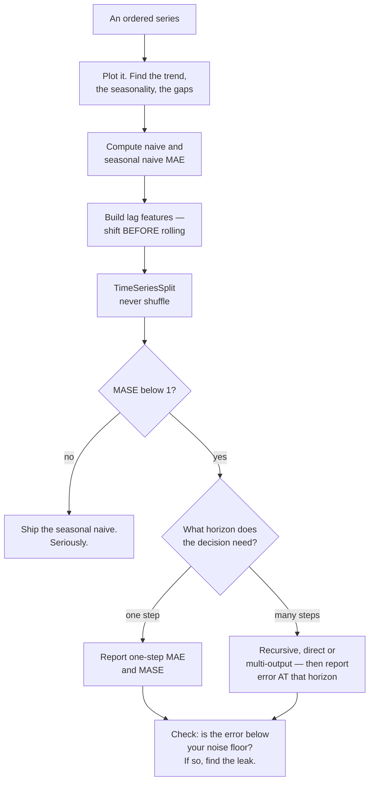

## What you'll learn

- why every baseline comparison must be against **naive** and **seasonal naive**, and what MASE is
- the measured cost of a shuffled split: MAE **6.72** reported against **10.41** honest
- how to build lag features that cannot see their own target
- the leak that looks like a 25% win: **6.852 → 5.147** MAE from `rolling(7, center=True)`
- one-step against multi-step error: **3.73** at horizon 1 and **9.03** at horizon 28
- why $R^2$ is close to meaningless on a trending series

## The series

Three years of daily demand, built from four known components so that we can say exactly how much of
it any model is entitled to explain.

```python title="the_series.py" showLineNumbers{1}
rng = np.random.default_rng(4)
t = np.arange(1096)

trend = 120 + 0.06 * t
weekly = 18 * np.sin(2 * np.pi * (t % 7) / 7 + 0.6)
yearly = 30 * np.sin(2 * np.pi * t / 365.25 - 1.1)

noise = np.zeros(1096)                      # AR(1): today's error remembers yesterday
for i in range(1, 1096):
    noise[i] = 0.55 * noise[i - 1] + rng.normal(0, 7)

y = pd.Series(trend + weekly + yearly + noise,
              index=pd.date_range("2021-01-01", periods=1096, freq="D"))
```

<Figure
  src="/images/ml/phase-10-applied/time-series-forecasting-fundamentals/the-series"
  alt="Top: three years of daily demand oscillating between about 80 and 240 with a rising trend and a vertical line marking the end of training on 2023-06-02. Bottom: the four components centred on zero — trend sd 18.99, weekly sd 12.73, yearly sd 21.22, noise sd 8.43."
  title="1,096 days, and only one of the four components is unpredictable"
  caption="Trend, weekly season and yearly season are all deterministic functions of the date, so a model with the right features should recover them almost exactly. The AR(1) noise has standard deviation 8.43 against the series' 30.91, and it is the only part that resists — though even it is partly predictable, because 0.55 of yesterday's error carries into today."
/>

| Component | Standard deviation |
| --- | --- |
| trend | 18.99 |
| weekly season | 12.73 |
| yearly season | 21.22 |
| AR(1) noise | **8.43** |
| the series | **30.91** |

Those standard deviations do not combine into a tidy variance decomposition — trend and yearly season
are correlated over a three-year window, so the shares would sum to more than 100%. The number that
matters is the last one against the second-to-last: about 8.4 of the series' 30.9 of variation is
noise, and even that is autocorrelated.

The AR(1) structure sets the floor. With innovations of standard deviation 7, a perfect one-step
forecast still has MAE $7\sqrt{2/\pi} \approx 5.59$. No model on this page can beat that, and any
model that appears to has seen the future.

## Baselines first, always

Two forecasts require no model at all:

- **naive**: tomorrow equals today, $\hat{y}_{t+1} = y_t$
- **seasonal naive**: tomorrow equals the same weekday last week, $\hat{y}_{t+1} = y_{t-6}$

On a chronological 80/20 split — 854 training days, then 214 test days from 2023-06-02:

| Forecast | MAE | $R^2$ | MASE |
| --- | --- | --- | --- |
| naive (yesterday) | 12.174 | 0.6371 | 1.000 |
| seasonal naive (last week) | 10.474 | 0.7219 | 0.860 |
| the training mean | 30.200 | **−1.2496** | 2.481 |

**MASE** — mean absolute scaled error — is MAE divided by the naive forecast's MAE. Below 1 means you
beat "tomorrow is like today"; above 1 means you did not. It is the honest headline for a forecasting
model because it is scale-free and it has a meaningful zero point.

Note the training mean's $R^2$ of **−1.2496**. On a trending series the test window's mean is nowhere
near the training window's, so predicting the training mean is worse than useless — and $R^2$, which
compares against the *test* window's own mean, hides how bad a forecast is while flattering anything
that tracks the level. Report MAE and MASE. Use $R^2$ only if someone insists.

## A model on lag features

The standard move is to turn the series into a supervised table, where every column is a shifted copy
of the past:

```python title="lag_frame.py" showLineNumbers{1}
def lag_frame(series, lags=(1, 2, 3, 7, 14), roll=(7, 28)):
    """Every column is shifted before use, so no row can see its own target."""
    df = pd.DataFrame({"y": series})
    for L in lags:
        df[f"lag_{L}"] = series.shift(L)
    for w in roll:
        df[f"roll_{w}"] = series.shift(1).rolling(w).mean()   # shift, THEN roll
    df["dow"] = series.index.dayofweek
    df["t"] = np.arange(len(series))
    return df.dropna()
```

The `shift(1)` before `.rolling()` is the whole trick, and leaving it out is the subject of a later
section. With those nine features:

<Figure
  src="/images/ml/phase-10-applied/time-series-forecasting-fundamentals/baselines-and-models"
  alt="Left: 90 test days of actual demand with the seasonal naive and ridge forecasts overlaid; ridge tracks the weekly oscillation closely. Right: horizontal MASE bars — ridge on lags 0.561, gradient boosting 0.670, seasonal naive 0.860, naive 1.000, train mean 2.481 — with a dashed line at 1.0."
  title="Ridge on lags reaches MASE 0.561; the train mean is 2.5× worse than doing nothing"
  caption="Ridge cuts the naive error nearly in half, which is what a correctly specified linear model should do on a series built from linear components. Gradient boosting, with no way to extrapolate the trend, does worse at 0.670 — the first sign that flexibility is not the binding constraint here."
/>

| Model | MAE | RMSE | $R^2$ | MASE |
| --- | --- | --- | --- | --- |
| **ridge on lags** | **6.824** | 8.491 | 0.8772 | **0.561** |
| gradient boosting | 8.161 | 10.030 | 0.8286 | 0.670 |
| *perfect one-step forecast* | *≈5.59* | *≈7.00* | | *≈0.46* |

Ridge lands at 6.824 against a floor of about 5.59. The remaining gap is mostly the part of the AR(1)
noise that a linear function of past values cannot capture, plus estimation error.

Gradient boosting losing to ridge is worth pausing on. Tree ensembles cannot extrapolate: their
predictions are averages of training targets, so on a series whose level rises by 0.06 per day they
are structurally behind. The usual fix is to model the *difference* rather than the level, or to
detrend first — both of which are decisions about the data, not about the model.

## The shuffled split lies, and it lies more to flexible models

`KFold(shuffle=True)` puts a Tuesday from 2022 in the training set and the Wednesday next to it in
the test set. The model then interpolates between neighbours that in deployment would not exist.

<Figure
  src="/images/ml/phase-10-applied/time-series-forecasting-fundamentals/random-split-lies"
  alt="Left: fold diagrams. TimeSeriesSplit shows five rows of expanding blue training blocks each followed by a contiguous amber test block; shuffled KFold shows amber test points scattered throughout. Right: cross-validated MAE bars — ridge 6.65 shuffled against 7.38 ordered, gradient boosting 6.72 shuffled against 10.41 ordered."
  title="Shuffling costs the boosting model 3.69 MAE of honesty and the ridge 0.73"
  caption="Under shuffling the two models look equivalent — 6.65 against 6.72 — and a team would reasonably pick either. In time order they are not close: 7.38 against 10.41. The flexible model is the one that benefits most from being handed its own neighbours, which is exactly why the wrong split favours the wrong model."
/>

| Model | Shuffled `KFold` | `TimeSeriesSplit` | Chronological holdout | Optimism |
| --- | --- | --- | --- | --- |
| ridge on lags | 6.649 | 7.383 | 6.824 | +0.734 |
| gradient boosting | **6.717** | **10.410** | 8.161 | **+3.693** |

Three observations.

**The ranking flips.** Shuffled cross-validation says the two models are within 0.07 MAE of each
other. Time-ordered says the gap is 3.03. Anyone selecting a model on the shuffled number has a 50%
chance of shipping the worse one, and no way to know.

**Flexible models gain more from leakage.** Boosting can memorise local structure that a linear model
cannot, so handing it adjacent days is worth 3.69 MAE to it and 0.73 to the ridge. Leakage is not a
constant tax; it is a distortion that reorders your candidates.

**`TimeSeriesSplit` is pessimistic on purpose.** Its early folds train on as little as one sixth of
the data, so its 7.383 is worse than the 6.824 the model achieves after training on 80%. That is the
right direction to be wrong in: it under-promises and the holdout over-delivers.

:::caution[The rule]
For ordered data, every split must be a *cut*, never a *sample*. `TimeSeriesSplit` for
cross-validation, a chronological holdout for the final report, and a gap between train and test if
your features use windows longer than one step. Nothing else is defensible.
:::

## The leak that looks like a 25% win

Feature engineering on a series is where leakage becomes invisible, because the offending code looks
like every pandas tutorial ever written.

<Figure
  src="/images/ml/phase-10-applied/time-series-forecasting-fundamentals/centred-rolling-leak"
  alt="Left: thirteen dots representing days, with the middle one highlighted and a shaded band covering days -3 to +3, labelled as the centred rolling window that averages three days of the future. Right: test MAE 6.852 for the honest model against 5.147 with the centred rolling mean, R-squared 0.8769 against 0.9304."
  title="The feature is legal-looking, chronologically impossible, and improves every metric"
  caption="rolling(7, center=True) at row t averages rows t−3 to t+3, so it carries the answer to three future days into today's feature vector. MAE drops from 6.852 to 5.147 — below the 5.59 floor that a perfect one-step forecast allows, which is the tell. Nothing in pandas, scikit-learn or your test set will object."
/>

```python title="the_leak.py" showLineNumbers{1}
# WRONG: center=True averages rows t-3 .. t+3
frame["roll_centred"] = y.rolling(7, center=True).mean()

# RIGHT: shift first, so the window ends yesterday
frame["roll_7"] = y.shift(1).rolling(7).mean()
```

| Features | Test MAE | Test $R^2$ |
| --- | --- | --- |
| lags and past rolling means only | 6.852 | 0.8769 |
| the same **plus** `rolling(7, center=True)` | **5.147** | **0.9304** |

The **5.147** is the diagnostic. A perfect one-step forecast on this series has MAE ≈ 5.59, so any
number below that is impossible and indicates that information from the future has arrived. Knowing
your noise floor is the cheapest leakage detector you will ever build.

Other members of the same family, all of which have shipped to production somewhere:

- `.rolling(...).mean()` without a preceding `.shift(1)` — includes today's value in today's feature.
- Group statistics (mean sales per store) computed over the full history, then used to predict the
  early part of that history.
- Interpolating missing values with `.interpolate()` before splitting, which fills gaps using later
  observations.
- Scaling with a `StandardScaler` fitted on the whole series, so the test period's mean influences the
  training features.
- Any feature derived from a column that is itself recorded *after* the prediction is made — a
  delivery date, a settled amount, a refund flag.

## One step ahead is not a forecast

The 6.824 above answers "given everything up to yesterday, what is today?" — which is only useful if
you genuinely get yesterday's value before predicting today. Planning questions are not like that. To
forecast 28 days you must feed your own predictions back in as inputs.

<Figure
  src="/images/ml/phase-10-applied/time-series-forecasting-fundamentals/horizon-decay"
  alt="Left: 28 days of actual demand with the one-step forecast tracking it closely and the recursive forecast increasingly damped, missing the peaks. Right: cumulative MAE against horizon — one-step rises from 3.7 to 6.9 while recursive rises from 3.7 to 9.03, annotated at 5.29 and 8.34."
  title="Recursive MAE 9.03 against one-step 6.89 over the same 28 days"
  caption="Both start identically at day 1, because at horizon 1 they are the same computation. From there the recursive forecast is compounding its own errors and, more visibly, reverting to the mean — the peaks flatten because a prediction fed back in is smoother than a real observation."
/>

| Horizon | Recursive MAE | One-step MAE |
| --- | --- | --- |
| 1 day | **3.732** | **3.732** |
| 7 days | 5.287 | 3.948 |
| 14 days | 8.340 | 5.815 |
| 28 days | **9.028** | 6.891 |

Two things are happening at once, and only one of them is error accumulation.

**Errors compound.** Each prediction becomes the next row's `lag_1`, so a mistake propagates. For an
AR(1) process with coefficient $\phi$, the $h$-step-ahead forecast variance grows as

$$
\mathrm{Var}\big[\hat{y}_{t+h}\big] = \sigma^2 \frac{1 - \phi^{2h}}{1 - \phi^2}
$$

which for $\phi = 0.55$ saturates at $\sigma^2 / (1 - \phi^2) = 1.43\sigma^2$ — the variance of the
series itself. Beyond about 6 steps the AR(1) part of the forecast has decayed to the unconditional
mean and contributes nothing.

**The forecast flattens.** Feeding predictions back in produces a smoother input series than reality,
so the seasonal amplitude shrinks. This is visible in the left panel: the recursive line's peaks are
consistently short of the actual peaks.

The alternatives, both of which sidestep recursion:

- **Direct multi-step**: fit a separate model per horizon, each predicting $y_{t+h}$ from information
  at $t$. No compounding, $H$ models to maintain, and each one gets less relevant features.
- **Multi-output**: one model, $H$ outputs. Shares structure across horizons; supported natively by
  linear models and by `MultiOutputRegressor`.

Whatever you choose, **report the error at the horizon you will actually forecast at.** A one-step
MAE next to a monthly planning claim is a category error.

## See it move

Forecast uncertainty for an AR(1) process is exactly computable, so the decay of a recursive forecast
can be watched rather than argued about. Drag $\phi$ — the memory of the process — and see how far into
the future the forecast is worth anything.

```p5 title="How fast a forecast decays into its own mean" desc="For an AR(1) process the h-step forecast is phi to the h times the last value, and its error variance grows as sigma squared times one minus phi to the 2h over one minus phi squared. Dragging phi shows both the point forecast and the widening interval saturating at the unconditional variance." height="430"
let phi = 0.55;
const SIGMA = 7, LAST = 22;        // last observed deviation from the mean
function setup() {
  createCanvas(620, 430);
  textFont("monospace");
}
function draw() {
  background(13, 17, 23);
  const ox = 70, w = 490, oy = 55, h = 220, H = 24;

  if (mouseIsPressed && mouseY > 320 && mouseY < 370) {
    phi = constrain((mouseX - ox) / w, 0, 0.98);
  }

  const sat = SIGMA / Math.sqrt(1 - phi * phi);      // long-run sd
  const px = (hh) => ox + (hh / H) * w;
  const py = (v) => oy + h / 2 - (v / 45) * (h / 2);

  // zero line and the unconditional band
  stroke(35, 42, 51);
  strokeWeight(1);
  line(ox, py(0), ox + w, py(0));

  // 1-sd band of the forecast error
  noStroke();
  fill(107, 169, 221, 55);
  beginShape();
  for (let hh = 0; hh <= H; hh++) {
    const sd = SIGMA * Math.sqrt((1 - Math.pow(phi, 2 * hh)) / (1 - phi * phi));
    vertex(px(hh), py(Math.pow(phi, hh) * LAST + sd));
  }
  for (let hh = H; hh >= 0; hh--) {
    const sd = SIGMA * Math.sqrt((1 - Math.pow(phi, 2 * hh)) / (1 - phi * phi));
    vertex(px(hh), py(Math.pow(phi, hh) * LAST - sd));
  }
  endShape(CLOSE);

  // the point forecast
  stroke(255, 211, 67);
  strokeWeight(2.4);
  noFill();
  beginShape();
  for (let hh = 0; hh <= H; hh++) vertex(px(hh), py(Math.pow(phi, hh) * LAST));
  endShape();

  // where the forecast has lost 90% of its signal
  let useful = H;
  for (let hh = 0; hh <= H; hh++) {
    if (Math.abs(Math.pow(phi, hh) * LAST) < 0.1 * Math.abs(LAST)) { useful = hh; break; }
  }
  stroke(232, 110, 110);
  strokeWeight(1.4);
  drawingContext.setLineDash([4, 4]);
  line(px(useful), oy, px(useful), oy + h);
  drawingContext.setLineDash([]);
  noStroke();
  fill(232, 110, 110);
  textSize(10);
  textAlign(LEFT, TOP);
  text("90% of the signal gone", px(useful) + 6, oy + 6);

  fill(118, 131, 144);
  textSize(11);
  textAlign(CENTER, TOP);
  text("horizon (steps ahead)", ox + w / 2, oy + h + 12);
  push();
  translate(ox - 44, oy + h / 2);
  rotate(-HALF_PI);
  textAlign(CENTER, CENTER);
  text("deviation from the mean", 0, 0);
  pop();

  // slider
  const sy = 345;
  stroke(60);
  strokeWeight(3);
  line(ox, sy, ox + w, sy);
  stroke(107, 169, 221);
  line(ox, sy, ox + phi * w, sy);
  noStroke();
  fill(107, 169, 221);
  circle(ox + phi * w, sy, 13);
  fill(118, 131, 144);
  textSize(10);
  textAlign(LEFT, BOTTOM);
  text("phi — how much of yesterday's error carries over  (drag)", ox, sy - 12);

  textAlign(LEFT, TOP);
  fill(255, 211, 67);
  textSize(12);
  text("phi = " + phi.toFixed(2) + "     forecast = phi^h x " + LAST, ox, sy + 14);
  fill(107, 169, 221);
  text("long-run sd = sigma/sqrt(1-phi^2) = " + sat.toFixed(2), ox, sy + 38);
  fill(165, 214, 164);
  text("useful horizon ~ " + useful + " steps", ox, sy + 62);
}
```

At $\phi = 0.55$ the signal is gone after 4 steps: a recursive forecast beyond that point is
predicting the seasonal pattern and the trend, and nothing else. At $\phi = 0.95$ it survives 45
steps, which is why highly persistent series (stock levels, temperatures, populations) forecast much
further than mean-reverting ones (returns, click rates) even when both look equally noisy.

## The workflow



## Pitfalls

| Pitfall | Why it bites | What to do |
| --- | --- | --- |
| `KFold(shuffle=True)` on ordered rows | 6.72 reported against 10.41 honest, and the ranking flips | `TimeSeriesSplit`, always |
| `rolling(...)` without `shift(1)` | MAE 5.147, below the 5.59 noise floor | Shift, then roll; know your floor |
| Reporting one-step error for a multi-step decision | 6.89 against 9.03 over 28 days | Report at the horizon you forecast at |
| Using $R^2$ on a trending series | The training mean scores −1.2496 | MAE and MASE |
| Skipping the naive baseline | A model at MASE 1.05 is worse than one line of code | Compute both naive forecasts first |
| Trees on a trending level | Boosting lost to ridge, 0.670 against 0.561 | Difference the series, or detrend, or use a linear component |
| Fitting the scaler on the whole series | Test-period statistics leak into training features | Fit inside the pipeline, inside the fold |
| Forgetting the AR structure of the residuals | Confidence intervals come out far too narrow | Check residual autocorrelation before trusting any interval |

## Recap

- The series is 1,096 days of trend, weekly and yearly season, plus AR(1) noise of sd **8.43** against
  the series' **30.91**. A perfect one-step forecast still has MAE ≈ **5.59**.
- Naive MAE **12.174**, seasonal naive **10.474**, ridge on lags **6.824** — MASE **0.561**.
- Gradient boosting reached only **0.670**, because trees cannot extrapolate a trend.
- Shuffled cross-validation reported **6.65** and **6.72**, hiding a real gap of **7.38** against
  **10.41** and reversing the ranking.
- `rolling(7, center=True)` improved MAE to **5.147** — below the noise floor, which is how you catch
  it.
- Recursive forecasting decayed from **3.732** at one day to **9.028** at 28; one-step over the same
  window was **6.891**.
- $R^2$ of the training mean on the test window: **−1.2496**. Report MASE.

<Quiz
  questions={[
    {
      q: "Shuffled 5-fold CV gives MAE 6.72 for your boosting model and TimeSeriesSplit gives 10.41. Which number should you report?",
      options: [
        "The average of the two",
        "10.41 — the shuffled split trains on days adjacent to the test days, which cannot happen in deployment",
        "6.72, because it uses more data per fold",
        "Neither; use a random 80/20 holdout",
      ],
      answer: 1,
      explain: "Shuffling hands the model interpolation targets. The distortion is not even uniform: it was worth 3.69 MAE to the boosting model and 0.73 to the ridge, which reversed the ranking between them.",
    },
    {
      q: "A new feature takes your test MAE from 6.85 to 5.15 on a series whose noise floor implies MAE cannot go below about 5.59. What do you conclude?",
      options: [
        "Excellent feature, ship it",
        "It leaks: the score is below what a perfect one-step forecast can achieve, so information about the target's own period has entered the features",
        "The noise floor calculation must be wrong",
        "The test set is too small",
      ],
      answer: 1,
      explain: "That is exactly the measured case: rolling(7, center=True) averages rows t-3 to t+3. Knowing your irreducible error is the cheapest leakage detector available, and it caught a feature that no library would complain about.",
    },
    {
      q: "Your model reports one-step MAE 6.89. Planning asks for a 28-day forecast. What will they actually get?",
      options: [
        "6.89 per day",
        "About 9.03 — recursive forecasting compounds its own errors and reverts to the mean, so the peaks flatten",
        "Better than 6.89, because errors average out",
        "It depends only on the model, not the horizon",
      ],
      answer: 1,
      explain: "Both forecasts are identical at horizon 1 (3.73) and diverge from there. Report error at the horizon the decision needs, or fit direct multi-step models, one per horizon.",
    },
    {
      q: "Gradient boosting scores MASE 0.670 while ridge on the same features scores 0.561. Why?",
      options: [
        "Boosting is overfitting the noise",
        "Trees cannot extrapolate — their predictions are averages of training targets, and this series' level rises 0.06 per day",
        "The learning rate is wrong",
        "Boosting needs more estimators",
      ],
      answer: 1,
      explain: "A tree's output is bounded by the targets it saw, so on a rising series it is structurally behind. The fix is a data decision rather than a hyperparameter one: difference the series, detrend it, or use a model with a linear component.",
    },
    {
      q: "What does MASE 1.00 mean, and why prefer it to R-squared here?",
      options: [
        "Perfect forecast; R-squared is harder to compute",
        "Exactly as good as predicting today's value for tomorrow — and unlike R-squared it has a meaningful zero point on a trending series, where predicting the training mean scores -1.2496",
        "A random forecast",
        "It means the model explains all the variance",
      ],
      answer: 1,
      explain: "MASE is MAE divided by the naive forecast's MAE, so 1.0 is 'no better than one line of code' and 0.561 is 'nearly halved it'. R-squared compares against the test window's own mean, which on a trending series is an arbitrary and shifting reference.",
    },
  ]}
/>

## 🧪 Try It Yourself

### Exercise 1 – Build the series

<DataCampExercise
  lang="python"
  hint={`The AR(1) loop needs the previous value: noise[i] = 0.55 * noise[i - 1] + a fresh normal draw.`}
  code={`# Task: Exercise 1 - Build the series
import numpy as np
import pandas as pd

rng = np.random.default_rng(4)
n = 1096
t = np.arange(n)
trend = 120 + 0.06 * t
weekly = 18 * np.sin(2 * np.pi * (t % 7) / 7 + 0.6)
yearly = 30 * np.sin(2 * np.pi * t / 365.25 - 1.1)

noise = np.zeros(n)
for i in range(1, n):
    noise[i] = 0.55 * noise[___] + rng.normal(0, 7)      # replace ___ with i - 1

y = pd.Series(trend + weekly + yearly + noise,
              index=pd.date_range("2021-01-01", periods=n, freq="D"),
              name="demand")

print(f"{len(y)} days, {y.index[0].date()} to {y.index[-1].date()}")
print(f"level {y.mean():.2f}   sd {y.std():.2f}   "
      f"noise sd {pd.Series(noise).std():.2f}")
print(f"mean |day-to-day change| {np.abs(np.diff(y)).mean():.2f}")

# -- Expected Output -------------------------------------------
# 1096 days, 2021-01-01 to 2024-01-01
# level 152.75   sd 30.91   noise sd 8.43
# mean |day-to-day change| 11.69
# --------------------------------------------------------------`}
  solution={`import numpy as np
import pandas as pd

rng = np.random.default_rng(4)
n = 1096
t = np.arange(n)
trend = 120 + 0.06 * t
weekly = 18 * np.sin(2 * np.pi * (t % 7) / 7 + 0.6)
yearly = 30 * np.sin(2 * np.pi * t / 365.25 - 1.1)
noise = np.zeros(n)
for i in range(1, n):
    noise[i] = 0.55 * noise[i - 1] + rng.normal(0, 7)
y = pd.Series(trend + weekly + yearly + noise,
              index=pd.date_range("2021-01-01", periods=n, freq="D"),
              name="demand")
print(f"{len(y)} days, {y.index[0].date()} to {y.index[-1].date()}")
print(f"level {y.mean():.2f}   sd {y.std():.2f}   "
      f"noise sd {pd.Series(noise).std():.2f}")
print(f"mean |day-to-day change| {np.abs(np.diff(y)).mean():.2f}")`}
  sct={`test_output_contains("noise sd 8.43")
success_msg("Noise sd 8.43 against the series' 30.91 - and the AR(1) coefficient means even the noise is partly predictable.")`}
  height={320}
/>

### Exercise 2 – Beat the baselines, or admit you did not

<DataCampExercise
  lang="python"
  preExerciseCode={`import numpy as np
import pandas as pd

rng = np.random.default_rng(4)
n = 1096
t = np.arange(n)
trend = 120 + 0.06 * t
weekly = 18 * np.sin(2 * np.pi * (t % 7) / 7 + 0.6)
yearly = 30 * np.sin(2 * np.pi * t / 365.25 - 1.1)
noise = np.zeros(n)
for i in range(1, n):
    noise[i] = 0.55 * noise[i - 1] + rng.normal(0, 7)
y = pd.Series(trend + weekly + yearly + noise,
              index=pd.date_range("2021-01-01", periods=n, freq="D"),
              name="demand")`}
  hint={`MASE is MAE divided by the naive forecast's MAE. The naive forecast for the test window is simply the lag_1 column.`}
  code={`# Task: Exercise 2 - Beat the baselines, or admit you did not
from sklearn.metrics import mean_absolute_error, r2_score

def lag_frame(series, lags=(1, 2, 3, 7, 14), roll=(7, 28)):
    df = pd.DataFrame({"y": series})
    for L in lags:
        df[f"lag_{L}"] = series.shift(L)
    for w in roll:
        df[f"roll_{w}"] = series.shift(1).rolling(w).mean()
    df["dow"] = series.index.dayofweek
    df["t"] = np.arange(len(series))
    return df.dropna()

frame = lag_frame(y)
X, target = frame.drop(columns="y"), frame["y"]
split = int(len(frame) * 0.8)
X_tr, X_te = X.iloc[:split], X.iloc[split:]
y_tr, y_te = target.iloc[:split], target.iloc[split:]

mae_naive = mean_absolute_error(y_te, X_te["___"])        # replace ___ with lag_1
print(f"train {len(y_tr)} days   test {len(y_te)} days "
      f"(from {y_te.index[0].date()})")
for name, pred in (("naive (yesterday)", X_te["lag_1"]),
                   ("seasonal naive (lag 7)", X_te["lag_7"]),
                   ("train mean", np.full(len(y_te), y_tr.mean()))):
    mae = mean_absolute_error(y_te, pred)
    print(f"{name:24s} MAE {mae:6.3f}   R2 {r2_score(y_te, pred):7.4f}   "
          f"MASE {mae / mae_naive:.3f}")

# -- Expected Output -------------------------------------------
# train 854 days   test 214 days (from 2023-06-02)
# naive (yesterday)        MAE 12.174   R2  0.6371   MASE 1.000
# seasonal naive (lag 7)   MAE 10.474   R2  0.7219   MASE 0.860
# train mean               MAE 30.200   R2 -1.2496   MASE 2.481
# --------------------------------------------------------------`}
  solution={`from sklearn.metrics import mean_absolute_error, r2_score

def lag_frame(series, lags=(1, 2, 3, 7, 14), roll=(7, 28)):
    df = pd.DataFrame({"y": series})
    for L in lags:
        df[f"lag_{L}"] = series.shift(L)
    for w in roll:
        df[f"roll_{w}"] = series.shift(1).rolling(w).mean()
    df["dow"] = series.index.dayofweek
    df["t"] = np.arange(len(series))
    return df.dropna()

frame = lag_frame(y)
X, target = frame.drop(columns="y"), frame["y"]
split = int(len(frame) * 0.8)
X_tr, X_te = X.iloc[:split], X.iloc[split:]
y_tr, y_te = target.iloc[:split], target.iloc[split:]
mae_naive = mean_absolute_error(y_te, X_te["lag_1"])
print(f"train {len(y_tr)} days   test {len(y_te)} days "
      f"(from {y_te.index[0].date()})")
for name, pred in (("naive (yesterday)", X_te["lag_1"]),
                   ("seasonal naive (lag 7)", X_te["lag_7"]),
                   ("train mean", np.full(len(y_te), y_tr.mean()))):
    mae = mean_absolute_error(y_te, pred)
    print(f"{name:24s} MAE {mae:6.3f}   R2 {r2_score(y_te, pred):7.4f}   "
          f"MASE {mae / mae_naive:.3f}")`}
  sct={`test_output_contains("MASE 2.481")
success_msg("The training mean scores R2 -1.2496 and MASE 2.481 - two and a half times worse than one line of code.")`}
  height={360}
/>

### Exercise 3 – Measure what shuffling costs

> **Note:** The gradient-boosting numbers printed here (shuffled 6.757, TimeSeriesSplit 10.533, optimism +3.775) differ slightly from the lesson's table because of library-version differences; the optimism gap is the same size and direction.

<DataCampExercise
  lang="python"
  preExerciseCode={`import numpy as np
import pandas as pd

rng = np.random.default_rng(4)
n = 1096
t = np.arange(n)
trend = 120 + 0.06 * t
weekly = 18 * np.sin(2 * np.pi * (t % 7) / 7 + 0.6)
yearly = 30 * np.sin(2 * np.pi * t / 365.25 - 1.1)
noise = np.zeros(n)
for i in range(1, n):
    noise[i] = 0.55 * noise[i - 1] + rng.normal(0, 7)
y = pd.Series(trend + weekly + yearly + noise,
              index=pd.date_range("2021-01-01", periods=n, freq="D"),
              name="demand")

from sklearn.metrics import mean_absolute_error, r2_score

def lag_frame(series, lags=(1, 2, 3, 7, 14), roll=(7, 28)):
    df = pd.DataFrame({"y": series})
    for L in lags:
        df[f"lag_{L}"] = series.shift(L)
    for w in roll:
        df[f"roll_{w}"] = series.shift(1).rolling(w).mean()
    df["dow"] = series.index.dayofweek
    df["t"] = np.arange(len(series))
    return df.dropna()

frame = lag_frame(y)
X, target = frame.drop(columns="y"), frame["y"]
split = int(len(frame) * 0.8)
X_tr, X_te = X.iloc[:split], X.iloc[split:]
y_tr, y_te = target.iloc[:split], target.iloc[split:]`}
  hint={`Run cross_val_score twice per model: once with KFold(5, shuffle=True) and once with TimeSeriesSplit(5). Negate the scores, since sklearn maximises.`}
  code={`# Task: Exercise 3 - Measure what shuffling costs
# NOTE: The gradient-boosting numbers printed here (shuffled 6.757, TimeSeriesSplit 10.533, optimism +3.775) differ slightly from the lesson's table because of library-version differences; the optimism gap is the same size and direction.
from sklearn.ensemble import HistGradientBoostingRegressor
from sklearn.linear_model import Ridge
from sklearn.model_selection import KFold, TimeSeriesSplit, cross_val_score
from sklearn.pipeline import make_pipeline
from sklearn.preprocessing import StandardScaler

models = {"ridge on lags": make_pipeline(StandardScaler(), Ridge(alpha=1.0)),
          "gradient boosting": HistGradientBoostingRegressor(random_state=0)}

for name, m in models.items():
    shuffled = -cross_val_score(m, X, target,
                                cv=KFold(5, shuffle=True, random_state=0),
                                scoring="neg_mean_absolute_error").mean()
    ordered = -cross_val_score(m, X, target, cv=___(5),
                               scoring="neg_mean_absolute_error").mean()
    # replace ___ with TimeSeriesSplit
    m.fit(X_tr, y_tr)
    holdout = mean_absolute_error(y_te, m.predict(X_te))
    print(f"{name:18s} shuffled {shuffled:6.3f}   TimeSeriesSplit {ordered:6.3f}   "
          f"holdout {holdout:6.3f}   optimism {ordered - shuffled:+.3f}")

# -- Expected Output -------------------------------------------
# ridge on lags      shuffled  6.649   TimeSeriesSplit  7.383   holdout  6.824   optimism +0.734
# gradient boosting  shuffled  6.757   TimeSeriesSplit 10.533   holdout  8.127   optimism +3.775
# --------------------------------------------------------------`}
  solution={`from sklearn.ensemble import HistGradientBoostingRegressor
from sklearn.linear_model import Ridge
from sklearn.model_selection import KFold, TimeSeriesSplit, cross_val_score
from sklearn.pipeline import make_pipeline
from sklearn.preprocessing import StandardScaler

models = {"ridge on lags": make_pipeline(StandardScaler(), Ridge(alpha=1.0)),
          "gradient boosting": HistGradientBoostingRegressor(random_state=0)}
for name, m in models.items():
    shuffled = -cross_val_score(m, X, target,
                                cv=KFold(5, shuffle=True, random_state=0),
                                scoring="neg_mean_absolute_error").mean()
    ordered = -cross_val_score(m, X, target, cv=TimeSeriesSplit(5),
                               scoring="neg_mean_absolute_error").mean()
    m.fit(X_tr, y_tr)
    holdout = mean_absolute_error(y_te, m.predict(X_te))
    print(f"{name:18s} shuffled {shuffled:6.3f}   TimeSeriesSplit {ordered:6.3f}   "
          f"holdout {holdout:6.3f}   optimism {ordered - shuffled:+.3f}")`}
  sct={`test_output_contains("optimism +3.775")
success_msg("Shuffling flatters the boosting model by 3.78 MAE and the ridge by 0.73 - enough to reverse which model you would ship.")`}
  height={340}
/>

### Exercise 4 – Catch the centred-window leak

<DataCampExercise
  lang="python"
  preExerciseCode={`import numpy as np
import pandas as pd

rng = np.random.default_rng(4)
n = 1096
t = np.arange(n)
trend = 120 + 0.06 * t
weekly = 18 * np.sin(2 * np.pi * (t % 7) / 7 + 0.6)
yearly = 30 * np.sin(2 * np.pi * t / 365.25 - 1.1)
noise = np.zeros(n)
for i in range(1, n):
    noise[i] = 0.55 * noise[i - 1] + rng.normal(0, 7)
y = pd.Series(trend + weekly + yearly + noise,
              index=pd.date_range("2021-01-01", periods=n, freq="D"),
              name="demand")

from sklearn.metrics import mean_absolute_error, r2_score

def lag_frame(series, lags=(1, 2, 3, 7, 14), roll=(7, 28)):
    df = pd.DataFrame({"y": series})
    for L in lags:
        df[f"lag_{L}"] = series.shift(L)
    for w in roll:
        df[f"roll_{w}"] = series.shift(1).rolling(w).mean()
    df["dow"] = series.index.dayofweek
    df["t"] = np.arange(len(series))
    return df.dropna()

frame = lag_frame(y)
X, target = frame.drop(columns="y"), frame["y"]
split = int(len(frame) * 0.8)
X_tr, X_te = X.iloc[:split], X.iloc[split:]
y_tr, y_te = target.iloc[:split], target.iloc[split:]

from sklearn.linear_model import Ridge
from sklearn.pipeline import make_pipeline
from sklearn.preprocessing import StandardScaler`}
  hint={`Add rolling(7, center=True) to a copy of the frame, drop the resulting NaNs, and restrict the honest frame to the same index so the two are scored on identical rows.`}
  code={`# Task: Exercise 4 - Catch the centred-window leak
leaky = frame.copy()
leaky["roll_centred"] = y.rolling(7, center=___).mean()   # replace ___ with True
leaky = leaky.dropna()
honest = frame.loc[leaky.index]           # score both on identical rows

for name, f in (("honest", honest), ("with centred rolling", leaky)):
    Xf, yf = f.drop(columns="y"), f["y"]
    s = int(len(f) * 0.8)
    m = make_pipeline(StandardScaler(), Ridge(alpha=1.0))
    m.fit(Xf.iloc[:s], yf.iloc[:s])
    pred = m.predict(Xf.iloc[s:])
    print(f"{name:22s} MAE {mean_absolute_error(yf.iloc[s:], pred):6.3f}   "
          f"R2 {r2_score(yf.iloc[s:], pred):.4f}")

print(f"a perfect one-step forecast has MAE about {7 * np.sqrt(2 / np.pi):.2f}")

# -- Expected Output -------------------------------------------
# honest                 MAE  6.852   R2 0.8769
# with centred rolling   MAE  5.147   R2 0.9304
# a perfect one-step forecast has MAE about 5.59
# --------------------------------------------------------------`}
  solution={`leaky = frame.copy()
leaky["roll_centred"] = y.rolling(7, center=True).mean()
leaky = leaky.dropna()
honest = frame.loc[leaky.index]
for name, f in (("honest", honest), ("with centred rolling", leaky)):
    Xf, yf = f.drop(columns="y"), f["y"]
    s = int(len(f) * 0.8)
    m = make_pipeline(StandardScaler(), Ridge(alpha=1.0))
    m.fit(Xf.iloc[:s], yf.iloc[:s])
    pred = m.predict(Xf.iloc[s:])
    print(f"{name:22s} MAE {mean_absolute_error(yf.iloc[s:], pred):6.3f}   "
          f"R2 {r2_score(yf.iloc[s:], pred):.4f}")
print(f"a perfect one-step forecast has MAE about {7 * np.sqrt(2 / np.pi):.2f}")`}
  sct={`test_output_contains("MAE  5.147")
success_msg("5.147 is below the 5.59 that a perfect one-step forecast allows. That impossibility is the leak announcing itself.")`}
  height={340}
/>

### Exercise 5 – Forecast 28 days recursively

<DataCampExercise
  lang="python"
  preExerciseCode={`import numpy as np
import pandas as pd

rng = np.random.default_rng(4)
n = 1096
t = np.arange(n)
trend = 120 + 0.06 * t
weekly = 18 * np.sin(2 * np.pi * (t % 7) / 7 + 0.6)
yearly = 30 * np.sin(2 * np.pi * t / 365.25 - 1.1)
noise = np.zeros(n)
for i in range(1, n):
    noise[i] = 0.55 * noise[i - 1] + rng.normal(0, 7)
y = pd.Series(trend + weekly + yearly + noise,
              index=pd.date_range("2021-01-01", periods=n, freq="D"),
              name="demand")

from sklearn.metrics import mean_absolute_error, r2_score

def lag_frame(series, lags=(1, 2, 3, 7, 14), roll=(7, 28)):
    df = pd.DataFrame({"y": series})
    for L in lags:
        df[f"lag_{L}"] = series.shift(L)
    for w in roll:
        df[f"roll_{w}"] = series.shift(1).rolling(w).mean()
    df["dow"] = series.index.dayofweek
    df["t"] = np.arange(len(series))
    return df.dropna()

frame = lag_frame(y)
X, target = frame.drop(columns="y"), frame["y"]
split = int(len(frame) * 0.8)
X_tr, X_te = X.iloc[:split], X.iloc[split:]
y_tr, y_te = target.iloc[:split], target.iloc[split:]

from sklearn.linear_model import Ridge
from sklearn.pipeline import make_pipeline
from sklearn.preprocessing import StandardScaler`}
  hint={`After each prediction, append it to history so the next iteration's lag_1 is the value you just produced.`}
  code={`# Task: Exercise 5 - Forecast 28 days recursively
model = make_pipeline(StandardScaler(), Ridge(alpha=1.0)).fit(X_tr, y_tr)

hist = list(y.loc[:X_tr.index[-1]])
t0 = float(X.loc[X_tr.index[-1], "t"])
forecast = []
for h in range(28):
    stamp = X_tr.index[-1] + pd.Timedelta(days=h + 1)
    row = {"lag_1": hist[-1], "lag_2": hist[-2], "lag_3": hist[-3],
           "lag_7": hist[-7], "lag_14": hist[-14],
           "roll_7": float(np.mean(hist[-7:])),
           "roll_28": float(np.mean(hist[-28:])),
           "dow": stamp.dayofweek, "t": t0 + h + 1}
    value = float(model.predict(pd.DataFrame([row], columns=X.columns))[0])
    forecast.append(value)
    hist.append(___)                       # replace ___ with value

actual = y_te.values[:28]
one_step = model.predict(X_te)[:28]
for h in (1, 7, 14, 28):
    print(f"horizon {h:2d}: recursive MAE "
          f"{np.abs(np.array(forecast[:h]) - actual[:h]).mean():6.3f}   "
          f"one-step MAE {np.abs(one_step[:h] - actual[:h]).mean():6.3f}")

# -- Expected Output -------------------------------------------
# horizon  1: recursive MAE  3.732   one-step MAE  3.732
# horizon  7: recursive MAE  5.287   one-step MAE  3.948
# horizon 14: recursive MAE  8.340   one-step MAE  5.815
# horizon 28: recursive MAE  9.028   one-step MAE  6.891
# --------------------------------------------------------------`}
  solution={`model = make_pipeline(StandardScaler(), Ridge(alpha=1.0)).fit(X_tr, y_tr)
hist = list(y.loc[:X_tr.index[-1]])
t0 = float(X.loc[X_tr.index[-1], "t"])
forecast = []
for h in range(28):
    stamp = X_tr.index[-1] + pd.Timedelta(days=h + 1)
    row = {"lag_1": hist[-1], "lag_2": hist[-2], "lag_3": hist[-3],
           "lag_7": hist[-7], "lag_14": hist[-14],
           "roll_7": float(np.mean(hist[-7:])),
           "roll_28": float(np.mean(hist[-28:])),
           "dow": stamp.dayofweek, "t": t0 + h + 1}
    value = float(model.predict(pd.DataFrame([row], columns=X.columns))[0])
    forecast.append(value)
    hist.append(value)

actual = y_te.values[:28]
one_step = model.predict(X_te)[:28]
for h in (1, 7, 14, 28):
    print(f"horizon {h:2d}: recursive MAE "
          f"{np.abs(np.array(forecast[:h]) - actual[:h]).mean():6.3f}   "
          f"one-step MAE {np.abs(one_step[:h] - actual[:h]).mean():6.3f}")`}
  sct={`test_output_contains("horizon 28: recursive MAE  9.028")
success_msg("3.732 at one day, 9.028 at 28. Identical at horizon 1 and 2.4x apart by the end of the month.")`}
  height={400}
/>

## Next

[Text Classification with TF-IDF](/machine-learning/phase-10---applied-ml-problems/text-classification-with-tf-idf/)
— from ordered numbers to unordered words, where the feature matrix has 30,000 columns, is 99.8%
zeros, and a linear model is once again hard to beat.
