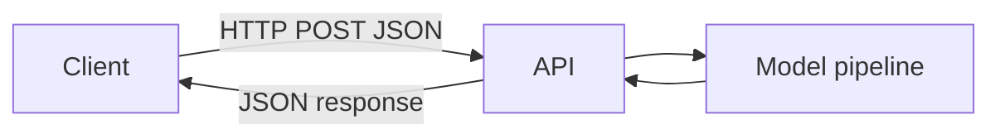

## Why APIs are common for ML deployment

An API lets other services call your model:

- web apps
- mobile apps
- internal tools

## The minimal contract

Inputs:

- JSON payload with features

Outputs:

- prediction (and optionally probability)



## FastAPI example (recommended)

FastAPI is popular because:

- automatic docs
- type hints
- validation

```python title="app.py (FastAPI)" showLineNumbers{1}
# Requires: fastapi, uvicorn, joblib
from fastapi import FastAPI
from pydantic import BaseModel
import joblib

app = FastAPI()
model = joblib.load("model.joblib")

class Features(BaseModel):
    age: int
    income: float
    city: str
    plan: str

@app.post("/predict")
def predict(features: Features):
    X = [features.model_dump()]
    pred = model.predict(X)[0]
    return {"prediction": int(pred)}
```

## Flask example (minimal)

```python title="app.py (Flask)" showLineNumbers{1}
# Requires: flask, joblib
from flask import Flask, request, jsonify
import joblib

app = Flask(__name__)
model = joblib.load("model.joblib")

@app.post("/predict")
def predict():
    payload = request.get_json(force=True)
    pred = model.predict([payload])[0]
    return jsonify({"prediction": int(pred)})
```

## Practical tips

- validate inputs (types, ranges)
- log requests (careful with PII)
- version your model artifact
