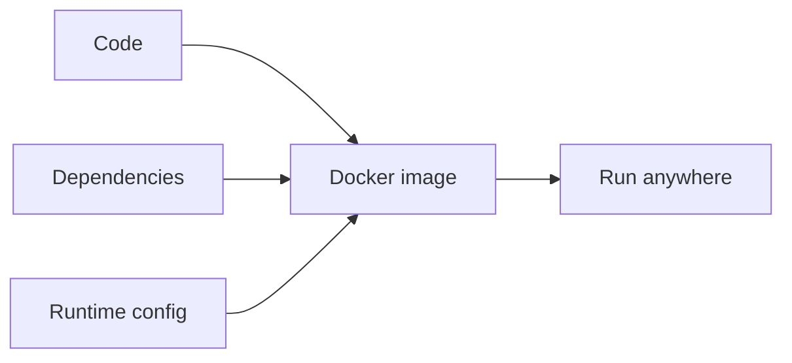

## Why Docker helps

Docker packages:

- code
- dependencies
- runtime environment

So it runs the same everywhere.



## A simple Dockerfile (FastAPI)

```dockerfile title="Dockerfile"
FROM python:3.11-slim

WORKDIR /app

COPY requirements.txt .
RUN pip install --no-cache-dir -r requirements.txt

COPY . .

EXPOSE 8000
CMD ["uvicorn", "app:app", "--host", "0.0.0.0", "--port", "8000"]
```

## tips

- pin versions in `requirements.txt`
- keep images small (`slim` base)
- don’t bake secrets into images

## Mini-checkpoint

Why is Docker useful for ML specifically?

- ML dependencies are often heavy and version-sensitive.
