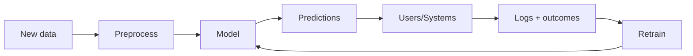

## What "deployment" means in ML

Deployment is the process of making a trained model usable by real users/systems.

This usually includes:

- packaging preprocessing + model together
- exposing predictions via API or batch jobs
- monitoring data quality and model performance

## Phase 10 topics

1. Saving and Loading Models (Pickle, Joblib)
2. Building an ML API with Flask/FastAPI
3. Deploying ML Models to Streamlit
4. Dockerizing an ML Application
5. Monitoring Model Drift

## A production ML loop

