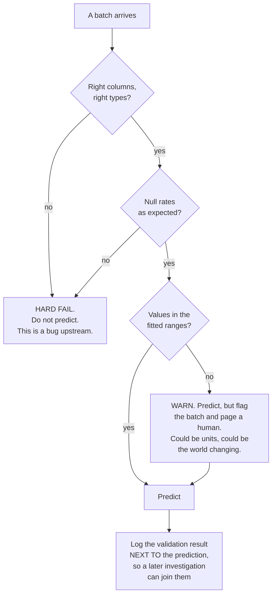

import DataCampExercise from "../../../../components/DataCampExercise.astro";
import Figure from "../../../../components/Figure.astro";
import Quiz from "../../../../components/Quiz.astro";

## What you'll learn

- which data corruptions sklearn catches for you, and which it serves happily: **0.8500 → 0.7125**
- why passing a numpy array instead of a DataFrame disables the only check you were getting
- a schema contract in about forty lines that catches **6 of 6** corruptions in **6.65 ms**
- how to set range and shift thresholds, and why they fire at **+0.75** when accuracy has not moved
- the honest limit: a validation alarm is **not** a performance prediction
- where `pandera`, Great Expectations and `pydantic` fit, and what they do not solve

## Six corruptions, one fitted pipeline

A `StandardScaler` plus logistic regression, fitted once on 2,800 rows and scoring **0.8500** on 1,200
clean test rows. Now hand it the same rows, corrupted six ways that all have production analogues.

<Figure
  src="/images/ml/phase-11-engineering/data-validation-and-schema-contracts/silent-failures"
  alt="Horizontal bars of accuracy per corruption. Clean batch 0.8500. Columns reordered, 150 nulls, f02 dropped and f03 renamed all raise ValueError. f00 times 100 gives 0.7125, f00 plus 3 gives 0.8475, and reordering columns as a numpy array gives 0.7933 silently."
  title="4 corruptions raise. 3 are silent, and the worst costs 0.1375."
  caption="sklearn's feature-name check is doing real work: a dropped column, a renamed column and reordered DataFrame columns all raise before any prediction happens. What it cannot see is a value that is wrong rather than misplaced — a unit change costs 0.1375 accuracy and produces no warning at all — or a numpy array, where names do not exist."
/>

| Corruption | Real-world cause | Outcome |
| --- | --- | --- |
| columns reordered (DataFrame) | a `SELECT *` after a migration | `ValueError` |
| `f02` dropped | upstream table changed | `ValueError` |
| `f03` renamed | a "harmless" rename | `ValueError` |
| 150 nulls in `f01` | a failed join | `ValueError` |
| **`f00` × 100** | cents instead of euros | **0.7125** (silent) |
| **`f00` + 3** | a recalibrated sensor | **0.8475** (silent) |
| **columns reordered, as numpy** | `df.values` in the serving path | **0.7933** (silent) |

Three observations that determine everything below.

**sklearn's DataFrame name check is the cheapest validation you will ever get.** It caught four of
seven. Keep your serving path on DataFrames with real column names for that reason alone.

**`df.to_numpy()` throws it away.** The same reordering that raised a `ValueError` as a DataFrame
silently costs **0.0567** as an array. Every `.values` or `.to_numpy()` between your feature code and
your model is a place where column order becomes a convention rather than a contract.

**Nothing in sklearn checks values.** A column in the wrong units is the right shape, the right dtype
and the right name. Only a comparison against what training looked like can catch it.

:::caution[The models that are worse than logistic here]
`HistGradientBoostingClassifier` accepts `NaN` by design, so the null corruption that raised a
`ValueError` above would have been served silently by a boosting model — measured on this data: 0.9092
clean, 0.9083 with 150 nulls. Tolerance for missing values is a feature at training time and a hazard
at serving time. If your model does not object to nulls, something else has to.
:::

## A schema contract in forty lines

Fit the contract on the training frame, then check every batch against it. Everything below is
`pandas` and nothing else.

```python title="schema.py" showLineNumbers{1}
def fit_schema(df, quantile=0.001):
    """Everything about the training frame a serving batch should still satisfy."""
    return {
        "columns": list(df.columns),
        "dtypes": {c: str(df[c].dtype) for c in df.columns},
        "lower": {c: float(df[c].quantile(quantile)) for c in df.columns},
        "upper": {c: float(df[c].quantile(1 - quantile)) for c in df.columns},
        "mean": {c: float(df[c].mean()) for c in df.columns},
        "std": {c: float(df[c].std()) for c in df.columns},
        "null_rate": {c: float(df[c].isna().mean()) for c in df.columns},
        "rows_fitted": len(df),
    }


def validate(df, schema, max_out_of_range=0.01, max_shift=0.5,
             max_null_increase=0.01):
    """One message per violated expectation. Empty list means the batch is usable."""
    problems = []
    if list(df.columns) != schema["columns"]:
        missing = [c for c in schema["columns"] if c not in df.columns]
        extra = [c for c in df.columns if c not in schema["columns"]]
        if missing:
            problems.append(f"missing columns: {missing}")
        if extra:
            problems.append(f"unexpected columns: {extra}")
        if not missing and not extra:
            problems.append("columns in a different ORDER")

    for c in schema["columns"]:
        if c not in df.columns:
            continue
        if str(df[c].dtype) != schema["dtypes"][c]:
            problems.append(f"{c}: dtype {df[c].dtype} != {schema['dtypes'][c]}")
        nulls = float(df[c].isna().mean())
        if nulls > schema["null_rate"][c] + max_null_increase:
            problems.append(f"{c}: null rate {nulls:.4f} "
                            f"(fitted {schema['null_rate'][c]:.4f})")
        col = df[c].dropna()
        if len(col) == 0:
            continue
        out = float(((col < schema["lower"][c]) | (col > schema["upper"][c])).mean())
        if out > max_out_of_range:
            problems.append(f"{c}: {out:.2%} of values outside the fitted range")
        shift = abs(col.mean() - schema["mean"][c]) / max(schema["std"][c], 1e-12)
        if shift > max_shift:
            problems.append(f"{c}: mean shifted {shift:.2f} sd")
    return problems
```

<Figure
  src="/images/ml/phase-11-engineering/data-validation-and-schema-contracts/schema-catches"
  alt="A grid of six corruptions against five checks. Columns reordered, f02 dropped and f03 renamed are caught by the column-names check; 150 nulls by the null-rate check; f00 times 100 and f00 plus 3 by both the range and mean-shift checks."
  title="6 of 6 corruptions caught, in 6.65 ms per 1,200-row batch"
  caption="Each corruption trips a different check, which is the argument for having all five rather than the one that seems most likely. The two silent value corruptions — the ones sklearn cannot see — are caught by the range and shift checks, and those are precisely the two checks that no library gives you for free."
/>

| Corruption | Which check caught it |
| --- | --- |
| columns reordered | column names & order |
| `f02` dropped | column names & order |
| `f03` renamed | column names & order (missing **and** unexpected) |
| 150 nulls in `f01` | null rate |
| `f00` × 100 | value range **and** mean shift |
| `f00` + 3 | value range **and** mean shift |

**6.65 ms** for 1,200 rows across 25 columns. On a per-request path that is too slow to run on every
call; the pattern that works is to validate **per batch** and, for single-row requests, keep only the
cheap checks — names, dtypes, and per-field ranges, which is exactly what a `pydantic` model gives you.

## Choosing thresholds

The two value checks need numbers, and the numbers determine whether you get useful alarms or noise.

<Figure
  src="/images/ml/phase-11-engineering/data-validation-and-schema-contracts/range-versus-shift"
  alt="Left: fraction of values outside the fitted range and mean shift in standard deviations, both rising with an added shift; the range check crosses its 1% threshold at +0.75. Right: accuracy against the same shift, moving only between 0.8467 and 0.8508."
  title="The alarm fires at +0.75, and this shift never costs more than 0.0033"
  caption="The range check crosses 1% out-of-range at a shift of +0.75, and the mean-shift check crosses 0.5 sd at the same point. Meanwhile accuracy wanders between 0.8467 and 0.8508 — no meaningful degradation at all, even at +4.0. The alarms are correct and the model is fine, which is the situation you must design your on-call process around."
/>

| Check | Threshold used | Why |
| --- | --- | --- |
| `max_out_of_range` | 1% of values outside the fitted 0.1–99.9 percentile | With clean data this is ≈0.2% by construction, so 1% is a real signal |
| `max_shift` | 0.5 sd of the training column | Below this, batch-to-batch sampling noise dominates |
| `max_null_increase` | +1 percentage point | Null rates are usually stable; a jump means a join broke |

And the finding that matters most on this page:

**A validation alarm is not a performance prediction.** The shift of +0.75 that trips both checks costs
essentially nothing (0.8508 against a clean 0.8500), and even +4.0 costs 0.0025. This is the same
result as [input drift monitoring in Phase 08](/machine-learning/phase-08---model-deployment-mlops/monitoring-model-drift/),
where PSI reached 2.0847 with accuracy at 0.9995.

The correct reading is not "these checks are useless". It is:

- Data validation answers **"is this batch like the training data?"** — a question about the *input*,
  answerable immediately, with no labels.
- Model monitoring answers **"is the model still right?"** — a question about the *output*, answerable
  only when labels arrive.
- The first is a **precondition**, not a proxy. Run it because a batch that violates the contract may be
  catastrophic (0.7125) or harmless (0.8475) and **you cannot tell which from the model's output**,
  which will look perfectly normal either way.

Practical policy: **hard-fail** on schema, dtype and null violations, because those are almost always
genuine bugs; **warn and investigate** on range and shift, because those are often legitimate change in
the world.

### See it move

The uncomfortable part of this page is that "alarm fired" and "model broke" are close to independent.
The sketch makes that a two-by-two you can watch fill up: it cycles through the seven batches measured
above, shows which gates catch each one, and plots the resulting accuracy against the alarm state.

```p5 title="Alarms and accuracy are close to independent" desc="Seven corrupted batches cycled one at a time. For each, the four gates light up or stay dark, the resulting accuracy is drawn against the clean baseline of 0.85, and the case is placed into a two-by-two of caught versus harmful. The dangerous quadrant is silent and harmful; the noisy one is caught and harmless." height="440"
// Every number here is measured, from the table above.
const BATCHES = [
  { name: "clean batch", acc: 0.8500, gates: [0, 0, 0, 0], note: "baseline" },
  { name: "columns reordered (DataFrame)", acc: null, gates: [1, 0, 0, 0], note: "ValueError before predict" },
  { name: "f02 dropped", acc: null, gates: [1, 0, 0, 0], note: "ValueError before predict" },
  { name: "f03 renamed", acc: null, gates: [1, 0, 0, 0], note: "ValueError before predict" },
  { name: "150 nulls in f01", acc: null, gates: [0, 0, 1, 0], note: "ValueError before predict" },
  { name: "f00 x 100  (cents for euros)", acc: 0.7125, gates: [0, 1, 0, 1], note: "silent without a range check" },
  { name: "f00 + 3  (recalibrated sensor)", acc: 0.8475, gates: [0, 1, 0, 1], note: "silent, and harmless" },
  { name: "columns reordered, as numpy", acc: 0.7933, gates: [0, 0, 0, 0], note: "no gate sees it at all" },
];
const GATE_NAMES = ["feature names", "range check", "null check", "mean shift"];
const BASE = 0.85;
let idx = 0;
let timer = 0;

function setup() {
  createCanvas(620, 440);
  textFont("monospace");
}
function draw() {
  background(13, 17, 23);
  const b = BATCHES[idx];
  const caught = b.gates.some((g) => g === 1);
  const harmful = b.acc !== null && BASE - b.acc > 0.02;
  const blocked = b.acc === null;

  fill(215);
  textSize(13);
  textAlign(LEFT, TOP);
  text(b.name, 30, 16);
  fill(105);
  textSize(10);
  text(b.note, 30, 36);

  // gates
  fill(150);
  textSize(11);
  textAlign(LEFT, TOP);
  text("validation gates", 30, 66);
  for (let i = 0; i < GATE_NAMES.length; i++) {
    const on = b.gates[i] === 1;
    const y = 88 + i * 28;
    noStroke();
    fill(on ? color(232, 122, 122, 60) : color(26, 32, 40));
    rect(30, y, 250, 22, 3);
    fill(on ? color(232, 122, 122) : color(80, 92, 106));
    textSize(10);
    textAlign(LEFT, CENTER);
    text(on ? "FIRES" : "quiet", 38, y + 11);
    fill(on ? 230 : 120);
    text(GATE_NAMES[i], 92, y + 11);
  }

  // accuracy bar
  fill(150);
  textSize(11);
  textAlign(LEFT, TOP);
  text("accuracy on this batch", 30, 214);
  const bx = 30, bw = 250;
  noStroke();
  fill(28, 34, 42);
  rect(bx, 236, bw, 20);
  if (blocked) {
    fill(110, 122, 138);
    textSize(11);
    textAlign(LEFT, CENTER);
    text("never predicted -- request rejected", bx + 6, 246);
  } else {
    const frac = (b.acc - 0.65) / (0.9 - 0.65);
    fill(harmful ? color(232, 122, 122) : color(120, 200, 120));
    rect(bx, 236, frac * bw, 20);
    fill(235);
    textSize(12);
    textAlign(LEFT, CENTER);
    text(b.acc.toFixed(4), bx + 6, 246);
    // baseline marker
    stroke(200);
    strokeWeight(1.5);
    const bpos = bx + ((BASE - 0.65) / (0.9 - 0.65)) * bw;
    line(bpos, 232, bpos, 260);
    noStroke();
    fill(200);
    textSize(9);
    textAlign(CENTER, TOP);
    text("0.85 clean", bpos, 262);
  }

  // two by two
  const qx = 330, qy = 74, qw = 130, qh = 96;
  const labels = [
    ["caught + harmful", "the gate did its job", 0, 0, [120, 200, 120]],
    ["caught + harmless", "alarm fatigue lives here", 1, 0, [255, 176, 67]],
    ["silent + harmful", "the dangerous quadrant", 0, 1, [232, 122, 122]],
    ["silent + harmless", "fine, and invisible", 1, 1, [110, 122, 138]],
  ];
  const activeCaught = caught || blocked;
  const activeHarmful = blocked ? true : harmful;
  for (const [title, sub, col, row, c] of labels) {
    const x = qx + col * (qw + 8), y = qy + row * (qh + 8);
    const isActive =
      (col === 0 ? activeCaught : !activeCaught) && (row === 0 ? activeHarmful : !activeHarmful);
    noStroke();
    fill(isActive ? color(c[0], c[1], c[2], 70) : color(22, 27, 34));
    rect(x, y, qw, qh, 4);
    fill(isActive ? color(c[0], c[1], c[2]) : color(70, 80, 92));
    textSize(10);
    textAlign(LEFT, TOP);
    text(title, x + 8, y + 10);
    fill(isActive ? 200 : 60);
    textSize(9);
    text(sub, x + 8, y + 28);
    if (isActive) {
      fill(c[0], c[1], c[2]);
      textSize(9);
      text("<- this batch", x + 8, y + qh - 20);
    }
  }
  fill(150);
  textSize(10);
  textAlign(LEFT, TOP);
  text("caught by a gate", qx, qy - 16);
  push();
  translate(qx - 14, qy + qh);
  rotate(-HALF_PI);
  textAlign(CENTER, CENTER);
  text("costs accuracy", 0, 0);
  pop();

  fill(105);
  textSize(10);
  textAlign(LEFT, TOP);
  text("the numpy reordering sits in the dangerous quadrant: 0.7933,", 30, 300);
  text("0.0567 below baseline, and not one gate notices --", 30, 314);
  text("because column order stopped being a contract at .to_numpy()", 30, 328);
  text("f00 + 3 sits in the noisy one: two gates fire, and it costs 0.0025", 30, 350);
  fill(140);
  textSize(10);
  text("click to step through the seven batches", 30, 378);
  text("batch " + (idx + 1) + " of " + BATCHES.length, 30, 396);

  timer += deltaTime;
  if (timer > 2200) { timer = 0; idx = (idx + 1) % BATCHES.length; }
}
function mousePressed() { timer = 0; idx = (idx + 1) % BATCHES.length; }
```

The two off-diagonal quadrants are the whole design problem. `f00 + 3` fires two gates and costs
0.0025, so a team that pages on every alarm learns to ignore them. The numpy reordering fires nothing
and costs 0.0567, so a team that trusts silence ships it. Neither is fixed by tightening a threshold —
the first needs a *severity* policy, and the second needs a contract that survives leaving pandas.

## Where the libraries fit



| Tool | What it gives you | What it still will not do |
| --- | --- | --- |
| **sklearn feature names** | Free, automatic column-name and order checking on DataFrames | Nothing about values; nothing for numpy input |
| **pydantic** | Per-request field types and bounds, fast, great error messages | Statistics across a batch; distribution shift |
| **pandera** | Declarative DataFrame schemas, including statistical checks | Deciding your thresholds for you |
| **Great Expectations** | A large check library, data docs, profiling to seed expectations | Being lightweight; it is a system, not a function |
| **the forty lines above** | All six catches, zero dependencies, one JSON file | A UI, or anyone else maintaining it |

The choice matters much less than the fields you check. A schema that omits value ranges will pass the
unit-change batch no matter which library wrote it.

:::tip[Store the contract with the model]
The schema is a **fitted artefact**, exactly like the scaler: it comes from the training data and it is
meaningless without it. Serialise it beside the model, version it with the model, and load both
together — the same rule as
[saving the pipeline rather than the estimator](/machine-learning/phase-08---model-deployment-mlops/saving-and-loading-models-pickle-joblib/).
A schema fitted on last quarter's data and applied to this quarter's model is its own bug.
:::

## Pitfalls

| Pitfall | Why it bites | What to do |
| --- | --- | --- |
| `to_numpy()` in the serving path | Disables the name check; reordering cost 0.0567 silently | Keep DataFrames end to end |
| No value-range checks | A unit change cost 0.1375 with no error | Fit percentile bounds per column |
| Trusting a NaN-tolerant model | Boosting served 150 nulls without complaint | Check null rates explicitly |
| Treating a validation alarm as a performance alarm | +0.75 fired both checks and cost 0.0000 | Hard-fail on schema, investigate on statistics |
| Thresholds copied from a blog | Your columns have your own variance | Fit them from training data, then tighten with experience |
| Validating only at training time | The corruption happens later, in serving | Same contract, both sides, same code |
| A schema not versioned with the model | Silently checks the wrong expectations | Serialise them together |
| Logging the prediction but not the validation result | You cannot join the two afterwards | Log both, with the same request id |

## Recap

- Of seven corrupted batches, **4 raised** a `ValueError` and **3 were served silently**; the worst
  silent one cost **0.1375** accuracy (0.8500 → 0.7125).
- Reordering columns raised as a DataFrame and cost **0.0567** silently as a numpy array.
- A 40-line schema contract caught **6 of 6** corruptions in **6.65 ms** per 1,200-row batch.
- Each corruption tripped a different check, which is why you need all five.
- The range and shift checks fired at a shift of **+0.75**, where accuracy was **0.8508** against a clean
  **0.8500** — validation is a precondition, not a performance prediction.
- Hard-fail on schema, dtype and nulls; warn and investigate on range and shift.

<Quiz
  questions={[
    {
      q: "Your serving code does model.predict(df.to_numpy()). What have you given up?",
      options: [
        "Nothing, it is faster",
        "sklearn's feature-name check — the same column reordering that raises a ValueError for a DataFrame silently cost 0.0567 accuracy as an array",
        "Only the ability to read error messages",
        "Support for missing values",
      ],
      answer: 1,
      explain: "The name check caught four of seven corruptions for free. Converting to numpy makes column order a convention that no code enforces, and a reordering then produces confident, wrong predictions.",
    },
    {
      q: "A column arrives in cents instead of euros. Which check catches it?",
      options: [
        "The column-name check",
        "A value-range check against the training percentiles — 97% of values fell outside them, while names, dtypes and null rates were all perfect",
        "The dtype check",
        "sklearn raises automatically",
      ],
      answer: 1,
      explain: "The batch is the right shape in every structural sense, which is why it costs 0.1375 accuracy in silence. Range and shift checks are the two that no library gives you by default and the two that catch value corruption.",
    },
    {
      q: "Your range check fires on a batch and accuracy is unchanged. Was the check wrong?",
      options: [
        "Yes, tighten the threshold",
        "No: it answered the question it was asked — 'is this batch like training data?' — and a shift of +0.75 tripped it while accuracy went from 0.8500 to 0.8508",
        "Yes, remove the check",
        "The accuracy measurement must be wrong",
      ],
      answer: 1,
      explain: "Input validation and performance monitoring are different questions. The same +0.75 shift could have been a unit change costing 0.1375 — and from the model's output alone the two look identical, which is exactly why the input check exists.",
    },
    {
      q: "Which violations should hard-fail rather than warn?",
      options: [
        "All of them",
        "Schema, dtype and null-rate violations — those are almost always upstream bugs; range and shift are often legitimate change and deserve investigation instead",
        "None; always predict and log",
        "Only missing columns",
      ],
      answer: 1,
      explain: "A missing or renamed column, a changed dtype or a jump in null rate means something broke in the pipeline, and predicting anyway produces garbage with a normal-looking latency. A distribution shift may just be Tuesday.",
    },
    {
      q: "Where should the fitted schema live?",
      options: [
        "In the repository, hand-written",
        "Serialised beside the model and versioned with it — it is a fitted artefact of the training data, exactly like the scaler",
        "In the monitoring system only",
        "Recomputed from each serving batch",
      ],
      answer: 1,
      explain: "Percentiles, means and null rates come from the training data. A schema fitted on different data than the model checks the wrong expectations, and recomputing it from the serving batch would validate the batch against itself.",
    },
  ]}
/>

## 🧪 Try It Yourself

### Exercise 1 – Corrupt a batch six ways

<DataCampExercise
  lang="python"
  hint={`Wrap each predict in try/except: the interesting output is which corruptions raise and which return a number.`}
  code={`# Task: Exercise 1 - Corrupt a batch six ways
import numpy as np
import pandas as pd
from sklearn.datasets import make_classification
from sklearn.linear_model import LogisticRegression
from sklearn.metrics import accuracy_score
from sklearn.model_selection import train_test_split
from sklearn.pipeline import make_pipeline
from sklearn.preprocessing import StandardScaler

Xa, y = make_classification(n_samples=4000, n_features=25, n_informative=8,
                            n_redundant=4, class_sep=0.9, flip_y=0.05,
                            random_state=0)
X = pd.DataFrame(Xa, columns=[f"f{i:02d}" for i in range(25)])
X_tr, X_te, y_tr, y_te = train_test_split(X, y, test_size=0.3, random_state=0,
                                          stratify=y)
model = make_pipeline(StandardScaler(),
                      LogisticRegression(max_iter=2000)).fit(X_tr, y_tr)

reordered = list(X_te.columns)
reordered[0], reordered[5] = reordered[5], reordered[0]
units = X_te.copy(); units["f00"] = units["f00"] * 100
drift = X_te.copy(); drift["f00"] = drift["f00"] + 3
nulls = X_te.copy(); nulls.loc[nulls.index[:150], "f01"] = np.nan

cases = {
    "clean batch": X_te,
    "columns reordered": X_te[reordered],
    "f00 x100 (units)": units,
    "f00 + 3 (drift)": drift,
    "150 nulls in f01": nulls,
    "f02 dropped": X_te.drop(columns=["f02"]),
    "f03 renamed": X_te.rename(columns={"f03": "feature_3"}),
    "reordered, as numpy": X_te[reordered].to_numpy(),
}

for name, batch in cases.items():
    try:
        acc = accuracy_score(y_te, model.predict(batch))
        print(f"{name:22s} accuracy {acc:.4f}   (served silently)")
    except ___ as exc:                       # replace ___ with Exception
        print(f"{name:22s} raised {type(exc).__name__}")

# -- Expected Output -------------------------------------------
# clean batch            accuracy 0.8500   (served silently)
# columns reordered      raised ValueError
# f00 x100 (units)       accuracy 0.7125   (served silently)
# f00 + 3 (drift)        accuracy 0.8475   (served silently)
# 150 nulls in f01       raised ValueError
# f02 dropped            raised ValueError
# f03 renamed            raised ValueError
# reordered, as numpy    accuracy 0.7933   (served silently)
# --------------------------------------------------------------`}
  solution={`import numpy as np
import pandas as pd
from sklearn.datasets import make_classification
from sklearn.linear_model import LogisticRegression
from sklearn.metrics import accuracy_score
from sklearn.model_selection import train_test_split
from sklearn.pipeline import make_pipeline
from sklearn.preprocessing import StandardScaler

Xa, y = make_classification(n_samples=4000, n_features=25, n_informative=8,
                            n_redundant=4, class_sep=0.9, flip_y=0.05,
                            random_state=0)
X = pd.DataFrame(Xa, columns=[f"f{i:02d}" for i in range(25)])
X_tr, X_te, y_tr, y_te = train_test_split(X, y, test_size=0.3, random_state=0,
                                          stratify=y)
model = make_pipeline(StandardScaler(),
                      LogisticRegression(max_iter=2000)).fit(X_tr, y_tr)

reordered = list(X_te.columns)
reordered[0], reordered[5] = reordered[5], reordered[0]
units = X_te.copy(); units["f00"] = units["f00"] * 100
drift = X_te.copy(); drift["f00"] = drift["f00"] + 3
nulls = X_te.copy(); nulls.loc[nulls.index[:150], "f01"] = np.nan

cases = {
    "clean batch": X_te,
    "columns reordered": X_te[reordered],
    "f00 x100 (units)": units,
    "f00 + 3 (drift)": drift,
    "150 nulls in f01": nulls,
    "f02 dropped": X_te.drop(columns=["f02"]),
    "f03 renamed": X_te.rename(columns={"f03": "feature_3"}),
    "reordered, as numpy": X_te[reordered].to_numpy(),
}
for name, batch in cases.items():
    try:
        acc = accuracy_score(y_te, model.predict(batch))
        print(f"{name:22s} accuracy {acc:.4f}   (served silently)")
    except Exception as exc:
        print(f"{name:22s} raised {type(exc).__name__}")`}
  sct={`test_output_contains("f00 x100 (units)       accuracy 0.7125")
success_msg("A unit change costs 0.1375 accuracy and raises nothing. That is the gap a schema contract fills.")`}
  height={420}
/>

### Exercise 2 – Fit the contract

<DataCampExercise
  lang="python"
  hint={`Use quantile(0.001) and quantile(0.999) for the bounds so that a handful of extreme training rows do not widen them uselessly.`}
  code={`# Task: Exercise 2 - Fit the contract
def fit_schema(df, quantile=0.001):
    return {
        "columns": list(df.columns),
        "dtypes": {c: str(df[c].dtype) for c in df.columns},
        "lower": {c: float(df[c].quantile(quantile)) for c in df.columns},
        "upper": {c: float(df[c].quantile(1 - quantile)) for c in df.columns},
        "mean": {c: float(df[c].mean()) for c in df.columns},
        "std": {c: float(df[c].___()) for c in df.columns},      # replace ___ with std
        "null_rate": {c: float(df[c].isna().mean()) for c in df.columns},
        "rows_fitted": len(df),
    }

schema = fit_schema(X_tr)
print(f"fitted on {schema['rows_fitted']} rows, {len(schema['columns'])} columns")
print(f"f00 range [{schema['lower']['f00']:.4f}, {schema['upper']['f00']:.4f}]  "
      f"mean {schema['mean']['f00']:.4f}  sd {schema['std']['f00']:.4f}")
print(f"null rates all zero: {all(v == 0 for v in schema['null_rate'].values())}")

# -- Expected Output -------------------------------------------
# fitted on 2800 rows, 25 columns
# f00 range [-2.9778, 2.9762]  mean 0.0260  sd 0.9985
# null rates all zero: True
# --------------------------------------------------------------`}
  solution={`def fit_schema(df, quantile=0.001):
    return {
        "columns": list(df.columns),
        "dtypes": {c: str(df[c].dtype) for c in df.columns},
        "lower": {c: float(df[c].quantile(quantile)) for c in df.columns},
        "upper": {c: float(df[c].quantile(1 - quantile)) for c in df.columns},
        "mean": {c: float(df[c].mean()) for c in df.columns},
        "std": {c: float(df[c].std()) for c in df.columns},
        "null_rate": {c: float(df[c].isna().mean()) for c in df.columns},
        "rows_fitted": len(df),
    }

schema = fit_schema(X_tr)
print(f"fitted on {schema['rows_fitted']} rows, {len(schema['columns'])} columns")
print(f"f00 range [{schema['lower']['f00']:.4f}, {schema['upper']['f00']:.4f}]  "
      f"mean {schema['mean']['f00']:.4f}  sd {schema['std']['f00']:.4f}")
print(f"null rates all zero: {all(v == 0 for v in schema['null_rate'].values())}")`}
  sct={`test_output_contains("fitted on 2800 rows, 25 columns")
success_msg("The contract is a dict of numbers derived from the training data - which is why it must be versioned with the model.")`}
  height={320}
/>

### Exercise 3 – Catch all six

<DataCampExercise
  lang="python"
  hint={`Compare list(df.columns) against the fitted list first; a different order with the same members is its own failure mode.`}
  code={`# Task: Exercise 3 - Catch all six
def validate(df, schema, max_out_of_range=0.01, max_shift=0.5,
             max_null_increase=0.01):
    problems = []
    if list(df.columns) != schema["columns"]:
        missing = [c for c in schema["columns"] if c not in df.columns]
        extra = [c for c in df.columns if c not in schema["columns"]]
        if missing:
            problems.append(f"missing columns: {missing}")
        if extra:
            problems.append(f"unexpected columns: {extra}")
        if not missing and not extra:
            problems.append("columns in a different ORDER")
    for c in schema["columns"]:
        if c not in df.columns:
            continue
        nulls = float(df[c].isna().mean())
        if nulls > schema["null_rate"][c] + max_null_increase:
            problems.append(f"{c}: null rate {nulls:.4f}")
        col = df[c].dropna()
        if len(col) == 0:
            continue
        out = float(((col < schema["lower"][c]) | (col > schema["upper"][c])).mean())
        if out > max_out_of_range:
            problems.append(f"{c}: {out:.2%} of values outside the fitted range")
        shift = abs(col.mean() - schema["mean"][c]) / max(schema["___"][c], 1e-12)
        # replace ___ with std
        if shift > max_shift:
            problems.append(f"{c}: mean shifted {shift:.2f} sd")
    return problems

for name, batch in cases.items():
    if not isinstance(batch, pd.DataFrame):
        continue
    problems = validate(batch, schema)
    print(f"{name:22s} {len(problems)} problem(s)  {problems[0] if problems else 'OK'}")

# -- Expected Output -------------------------------------------
# clean batch            0 problem(s)  OK
# columns reordered      1 problem(s)  columns in a different ORDER
# f00 x100 (units)       2 problem(s)  f00: 97.42% of values outside the fitted range
# f00 + 3 (drift)        2 problem(s)  f00: 52.33% of values outside the fitted range
# 150 nulls in f01       1 problem(s)  f01: null rate 0.1250
# f02 dropped            1 problem(s)  missing columns: ['f02']
# f03 renamed            2 problem(s)  missing columns: ['f03']
# --------------------------------------------------------------`}
  solution={`def validate(df, schema, max_out_of_range=0.01, max_shift=0.5,
             max_null_increase=0.01):
    problems = []
    if list(df.columns) != schema["columns"]:
        missing = [c for c in schema["columns"] if c not in df.columns]
        extra = [c for c in df.columns if c not in schema["columns"]]
        if missing:
            problems.append(f"missing columns: {missing}")
        if extra:
            problems.append(f"unexpected columns: {extra}")
        if not missing and not extra:
            problems.append("columns in a different ORDER")
    for c in schema["columns"]:
        if c not in df.columns:
            continue
        nulls = float(df[c].isna().mean())
        if nulls > schema["null_rate"][c] + max_null_increase:
            problems.append(f"{c}: null rate {nulls:.4f}")
        col = df[c].dropna()
        if len(col) == 0:
            continue
        out = float(((col < schema["lower"][c]) | (col > schema["upper"][c])).mean())
        if out > max_out_of_range:
            problems.append(f"{c}: {out:.2%} of values outside the fitted range")
        shift = abs(col.mean() - schema["mean"][c]) / max(schema["std"][c], 1e-12)
        if shift > max_shift:
            problems.append(f"{c}: mean shifted {shift:.2f} sd")
    return problems

for name, batch in cases.items():
    if not isinstance(batch, pd.DataFrame):
        continue
    problems = validate(batch, schema)
    print(f"{name:22s} {len(problems)} problem(s)  {problems[0] if problems else 'OK'}")`}
  sct={`test_output_contains("f00: 97.42% of values outside the fitted range")
success_msg("Six corruptions, six catches, and each one tripped a different check.")`}
  height={440}
/>

### Exercise 4 – Find where the alarm starts

<DataCampExercise
  lang="python"
  hint={`Sweep the shift and record both the fraction out of range and the accuracy. The point of the exercise is that the two do not move together.`}
  code={`# Task: Exercise 4 - Find where the alarm starts
rows = []
for delta in (0.0, 0.5, 0.75, 1.0, 2.0, 4.0):
    batch = X_te.copy()
    batch["f00"] = batch["f00"] + delta
    col = batch["f00"]
    out = float(((col < schema["lower"]["f00"]) |
                 (col > schema["upper"]["f00"])).mean())
    shift = abs(col.mean() - schema["mean"]["f00"]) / schema["std"]["f00"]
    acc = accuracy_score(y_te, model.___(batch))          # replace ___ with predict
    fired = "ALARM" if out > 0.01 or shift > 0.5 else "quiet"
    print(f"+{delta:.2f}   out of range {out:6.2%}   shift {shift:.2f} sd   "
          f"accuracy {acc:.4f}   {fired}")

# -- Expected Output -------------------------------------------
# +0.00   out of range  0.25%   shift 0.02 sd   accuracy 0.8500   quiet
# +0.50   out of range  1.00%   shift 0.48 sd   accuracy 0.8508   quiet
# +0.75   out of range  1.75%   shift 0.74 sd   accuracy 0.8508   ALARM
# +1.00   out of range  2.58%   shift 0.99 sd   accuracy 0.8500   ALARM
# +2.00   out of range 15.17%   shift 1.99 sd   accuracy 0.8483   ALARM
# +4.00   out of range 85.83%   shift 3.99 sd   accuracy 0.8475   ALARM
# --------------------------------------------------------------`}
  solution={`rows = []
for delta in (0.0, 0.5, 0.75, 1.0, 2.0, 4.0):
    batch = X_te.copy()
    batch["f00"] = batch["f00"] + delta
    col = batch["f00"]
    out = float(((col < schema["lower"]["f00"]) |
                 (col > schema["upper"]["f00"])).mean())
    shift = abs(col.mean() - schema["mean"]["f00"]) / schema["std"]["f00"]
    acc = accuracy_score(y_te, model.predict(batch))
    fired = "ALARM" if out > 0.01 or shift > 0.5 else "quiet"
    print(f"+{delta:.2f}   out of range {out:6.2%}   shift {shift:.2f} sd   "
          f"accuracy {acc:.4f}   {fired}")`}
  sct={`test_output_contains("+0.75   out of range  1.75%")
success_msg("The alarm fires at +0.75 while accuracy is 0.8508 against a clean 0.8500. Input checks are preconditions, not predictions.")`}
  height={320}
/>

### Exercise 5 – Serialise the contract with the model

<DataCampExercise
  lang="python"
  hint={`json.dumps the schema and hash it, so a mismatch between the loaded schema and the one the model was trained with is detectable.`}
  code={`# Task: Exercise 5 - Serialise the contract with the model
import hashlib
import json

blob = json.dumps(schema, sort_keys=True)
schema_id = hashlib.sha256(blob.encode()).hexdigest()[:12]
print(f"schema bytes {len(blob):,}   schema_id {schema_id}")

# A model artefact should carry the schema it was trained against.
artefact = {"model_version": "1.4.0", "schema_id": schema_id,
            "schema": json.loads(blob)}

def predict_checked(artefact, df, model):
    if hashlib.sha256(json.dumps(artefact["schema"], sort_keys=True).encode()
                      ).hexdigest()[:12] != artefact["___"]:
        raise RuntimeError("schema does not match the artefact")   # replace ___ with schema_id
    problems = validate(df, artefact["schema"])
    hard = [p for p in problems if "column" in p or "null rate" in p]
    if hard:
        raise ValueError(f"unusable batch: {hard}")
    return model.predict(df), problems

pred, warnings_ = predict_checked(artefact, X_te, model)
print(f"clean batch: {len(pred)} predictions, {len(warnings_)} warning(s)")
try:
    predict_checked(artefact, X_te.drop(columns=["f02"]), model)
except ValueError as exc:
    print(f"dropped column -> {str(exc)[:56]}")
pred, warnings_ = predict_checked(artefact, drift, model)
print(f"drifted batch: predicted anyway, {len(warnings_)} warning(s): "
      f"{warnings_[0][:44]}")

# -- Expected Output -------------------------------------------
# schema bytes 3,763   schema_id c40c883849bd
# clean batch: 1200 predictions, 0 warning(s)
# dropped column -> unusable batch: ["missing columns: ['f02']"]
# drifted batch: predicted anyway, 2 warning(s): f00: 52.33% of values outside t
# --------------------------------------------------------------`}
  solution={`import hashlib
import json

blob = json.dumps(schema, sort_keys=True)
schema_id = hashlib.sha256(blob.encode()).hexdigest()[:12]
print(f"schema bytes {len(blob):,}   schema_id {schema_id}")

artefact = {"model_version": "1.4.0", "schema_id": schema_id,
            "schema": json.loads(blob)}

def predict_checked(artefact, df, model):
    if hashlib.sha256(json.dumps(artefact["schema"], sort_keys=True).encode()
                      ).hexdigest()[:12] != artefact["schema_id"]:
        raise RuntimeError("schema does not match the artefact")
    problems = validate(df, artefact["schema"])
    hard = [p for p in problems if "column" in p or "null rate" in p]
    if hard:
        raise ValueError(f"unusable batch: {hard}")
    return model.predict(df), problems

pred, warnings_ = predict_checked(artefact, X_te, model)
print(f"clean batch: {len(pred)} predictions, {len(warnings_)} warning(s)")
try:
    predict_checked(artefact, X_te.drop(columns=["f02"]), model)
except ValueError as exc:
    print(f"dropped column -> {str(exc)[:56]}")
pred, warnings_ = predict_checked(artefact, drift, model)
print(f"drifted batch: predicted anyway, {len(warnings_)} warning(s): "
      f"{warnings_[0][:44]}")`}
  sct={`test_output_contains("clean batch: 1200 predictions, 0 warning(s)")
success_msg("Hard-fail on structure, warn on statistics, and the schema travels with the model.")`}
  height={420}
/>

## Next

[Feature Stores and Training-Serving Skew](/machine-learning/phase-11---ml-engineering/feature-stores-and-training-serving-skew/)
— the contract above assumes the serving batch is *trying* to look like training data. The next page is
about the case where two different code paths compute the same feature, and quietly disagree.
