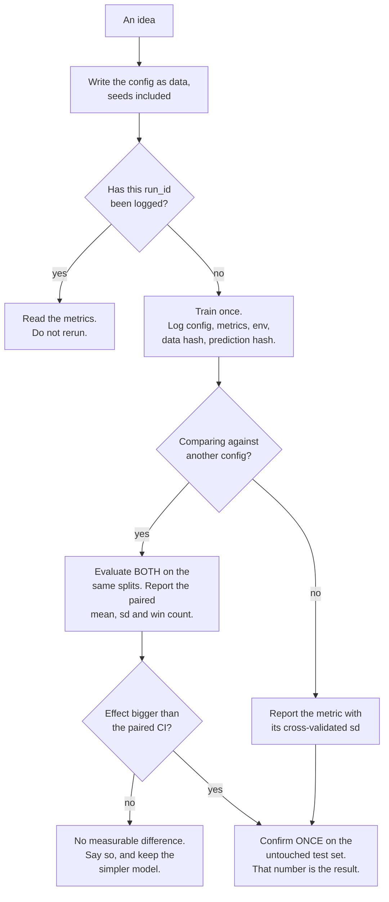

## What you'll learn

- how much of "my model gets 0.91" is the seed: **range 0.0300** from the split alone
- that sklearn *is* bit-reproducible when seeded — three runs, one hash: `25b525a8327c8ac0`
- the winner's curse, measured: best-of-20 on 800 rows, validation-test correlation **−0.0386**
- why paired comparison resolves a **0.0059** effect that unpaired comparison needs **26,000** rows for
- what a run record must contain to be worth keeping, in about thirty lines
- when to reach for MLflow or Weights & Biases, and when a JSONL file is genuinely enough

## The number you reported is one of thirty

One dataset, one model, one script. Only the seed changes.

<Figure
  src="/images/ml/phase-11-engineering/experiment-tracking-and-reproducibility/seed-spread"
  alt="Two strip plots of test accuracy. Varying the split seed gives values from 0.8917 to 0.9217 with sd 0.0070. Varying the model seed gives 0.8950 to 0.9042 with sd 0.0024."
  title="Same data, same code: the split seed moves accuracy by 0.0300 and the model seed by 0.0092"
  caption="Thirty runs each. The train/test split contributes three times the spread of the model's own randomness, because it changes both what the model learns from and what it is measured on. A single run reports one dot from one of these clouds, and nothing about the cloud."
/>

| Source of randomness | Mean | sd | Min | Max | Range |
| --- | --- | --- | --- | --- | --- |
| **train/test split seed** | 0.9091 | **0.0070** | 0.8917 | 0.9217 | **0.0300** |
| model seed (fixed split) | 0.8998 | 0.0024 | 0.8950 | 0.9042 | 0.0092 |

Three points follow, and the third is the one that matters.

**Reporting one number is reporting a sample of size one.** "0.9217" and "0.8917" are the same
experiment. Neither is wrong; a claim built on either is.

**The split dominates.** Its sd is 2.9× the model seed's, because a new split changes the training data
*and* the test data. This is also why `cross_val_score` reports a standard deviation — use it.

**Any improvement smaller than 0.03 needs a protocol, not a run.** If your new idea gains 0.01, a single
comparison cannot see it. The rest of this page is about what to do instead.

## Reproducibility is achievable, and it is not the hard part

Seed everything and sklearn is *bit*-identical. Not close — identical:

```python title="fingerprint.py" showLineNumbers{1}
def fingerprint(model, X):
    """A hash of the predicted probabilities: identical runs, identical string."""
    proba = model.predict_proba(X)
    return hashlib.sha256(np.ascontiguousarray(proba).tobytes()).hexdigest()[:16]


for _ in range(3):
    print(fingerprint(RandomForestClassifier(n_estimators=200,
                                             random_state=0).fit(X_tr, y_tr), X_te))
# 25b525a8327c8ac0
# 25b525a8327c8ac0
# 25b525a8327c8ac0

# random_state=1 instead:
# 8458e21babe31fd5
```

Three runs, one hash. So "I cannot reproduce my result" is almost never about the algorithm; it is
about one of these:

| What actually breaks reproducibility | How to fix it |
| --- | --- |
| The split was not seeded, or was re-drawn | `random_state` on every splitter, recorded |
| The data changed under you | Hash the input file, or snapshot it |
| A library version changed | Record `pip freeze`, pin the important ones |
| Preprocessing depended on row order | Sort explicitly; never rely on a directory listing |
| A notebook was run out of order | Run the script end to end before believing it |
| GPU / thread nondeterminism | Real for deep learning; not for the sklearn code above |

The fingerprint above is worth adopting as a habit. Print it at the end of training and paste it into
the run record: two runs that claim to be the same and hash differently *are not the same*, and you
find out in one second instead of one week.

## The winner's curse

Here is the mistake that survives even a careful reproducibility setup. Twenty candidate
configurations, one validation set of 800 rows, pick the best.

<Figure
  src="/images/ml/phase-11-engineering/experiment-tracking-and-reproducibility/winners-curse"
  alt="Scatter of test accuracy against validation accuracy for 20 candidates, forming a shapeless cloud. The candidate with the highest validation accuracy, 0.9125, has test accuracy 0.8975, while the best test candidate at 0.9050 was middling on validation."
  title="20 candidates, validation-test correlation −0.0386"
  caption="The cloud has no slope. Selecting on 800 validation rows selected noise: the validation winner (0.9125) came 13th on test (0.8975), while the genuinely best candidate (0.9050) was unremarkable on validation. The optimism of the selected number is +0.0150 — and reporting the validation score of the selected model is the standard way to overstate a result."
/>

| | Value |
| --- | --- |
| best validation accuracy | **0.9125** (candidate 2) |
| that candidate's test accuracy | **0.8975** |
| selection optimism | **+0.0150** |
| best test accuracy available | 0.9050 (candidate 11) |
| validation-test correlation | **−0.0386** |

The mechanism is arithmetic. Accuracy on 800 rows near 0.906 has a binomial standard error of

$$
\mathrm{se} = \sqrt{\frac{p(1-p)}{n}} = \sqrt{\frac{0.906 \times 0.094}{800}} = 0.0103
$$

so two independent estimates of the *same* underlying accuracy differ by up to
$1.96\sqrt{2} \times 0.0103 = 0.0286$ purely by chance. The 20 candidates differ genuinely by far less
than that. Taking a maximum over 20 draws from that noise gives you the noisiest candidate, not the
best one.

:::caution[Two rules that follow]
**Never report the selection score as the result.** The validation set that chose the model cannot
estimate it. Keep a test set that is touched once, at the end.

**Count your comparisons.** Twenty candidates on 800 rows is already hopeless. Hundreds of
hyperparameter trials on a small validation set is worse: the more you search, the more your best
number is a measurement of your search, not of your model.
:::

To resolve a 0.005 difference between two *independent* measurements at this accuracy you would need

$$
n = \frac{\big(1.96\sqrt{2}\big)^2 \, p(1-p)}{0.005^2} \approx 26{,}173 \text{ rows}
$$

Which you do not have. Fortunately, you do not need them.

### See it move

One run of 20 candidates is an anecdote. The sketch runs the whole experiment repeatedly: candidates
whose *true* accuracies differ only slightly, scored on 800 validation rows and 2,000 test rows, with
the validation winner selected each time. The bars are the accumulated averages, so the bias is
visible as a stable quantity rather than a story about one unlucky draw.

```p5 title="Selection optimism grows with the number of candidates" desc="Repeated experiments in which candidates with nearly identical true accuracy are scored on 800 validation rows and 2,000 test rows. The validation winner's validation score is consistently higher than its test score, and the gap grows as more candidates are compared. Click to step the candidate count." height="420"
const KS = [2, 5, 10, 20, 50, 100];
const N_VAL = 800;
const N_TEST = 2000;
const TRUE_MEAN = 0.906;
const TRUE_SPREAD = 0.004;   // candidates really do differ, just not by much
let kIdx = 3;
let sumOpt = 0;
let sumShort = 0;
let trials = 0;
let last = null;
let timer = 0;

function setup() {
  createCanvas(620, 420);
  textFont("monospace");
}
function binomialRate(p, n) {
  // normal approximation is plenty here and keeps the frame rate up
  const sd = Math.sqrt((p * (1 - p)) / n);
  return constrain(randomGaussian(p, sd), 0, 1);
}
function runTrial() {
  const k = KS[kIdx];
  const cands = [];
  for (let i = 0; i < k; i++) {
    const truth = randomGaussian(TRUE_MEAN, TRUE_SPREAD);
    cands.push({
      truth: truth,
      val: binomialRate(truth, N_VAL),
      test: binomialRate(truth, N_TEST),
    });
  }
  let pick = 0;
  for (let i = 1; i < k; i++) if (cands[i].val > cands[pick].val) pick = i;
  let bestTest = 0;
  for (let i = 1; i < k; i++) if (cands[i].test > cands[bestTest].test) bestTest = i;
  sumOpt += cands[pick].val - cands[pick].test;
  sumShort += cands[pick].test - cands[bestTest].test;
  trials++;
  last = { cands: cands, pick: pick, bestTest: bestTest };
}
function draw() {
  background(13, 17, 23);
  const k = KS[kIdx];

  fill(215);
  textSize(12);
  textAlign(LEFT, TOP);
  text("candidates compared: " + k + "      experiments run: " + trials, 30, 14);
  fill(105);
  textSize(10);
  text("true accuracies drawn near 0.906; validation n=800, test n=2000", 30, 32);

  // scatter of the most recent trial
  const x0 = 60, x1 = 330, y0 = 62, y1 = 250;
  const lo = 0.86, hi = 0.95;
  const px = (v) => x0 + ((v - lo) / (hi - lo)) * (x1 - x0);
  const py = (v) => y1 - ((v - lo) / (hi - lo)) * (y1 - y0);
  stroke(34, 40, 48);
  strokeWeight(1);
  for (let v = 0.86; v <= 0.951; v += 0.03) {
    line(x0, py(v), x1, py(v));
    line(px(v), y0, px(v), y1);
    noStroke();
    fill(100);
    textSize(9);
    textAlign(RIGHT, CENTER);
    text(v.toFixed(2), x0 - 4, py(v));
    textAlign(CENTER, TOP);
    text(v.toFixed(2), px(v), y1 + 4);
    stroke(34, 40, 48);
  }
  stroke(70, 78, 90);
  line(px(lo), py(lo), px(hi), py(hi));
  noStroke();
  fill(130);
  textSize(10);
  textAlign(CENTER, TOP);
  text("validation accuracy", (x0 + x1) / 2, y1 + 20);
  push();
  translate(x0 - 34, (y0 + y1) / 2);
  rotate(-HALF_PI);
  textAlign(CENTER, CENTER);
  text("test accuracy", 0, 0);
  pop();

  if (last) {
    for (let i = 0; i < last.cands.length; i++) {
      const c = last.cands[i];
      noStroke();
      if (i === last.pick) fill(232, 122, 122);
      else if (i === last.bestTest) fill(120, 200, 120);
      else fill(90, 104, 122);
      ellipse(px(c.val), py(c.test), i === last.pick || i === last.bestTest ? 12 : 6, i === last.pick || i === last.bestTest ? 12 : 6);
    }
    fill(232, 122, 122);
    textSize(10);
    textAlign(LEFT, TOP);
    text("red: selected on validation", x0, y0 - 16);
    fill(120, 200, 120);
    textAlign(RIGHT, TOP);
    text("green: actually best on test", x1, y0 - 16);
  }

  // accumulated bias
  const opt = trials ? sumOpt / trials : 0;
  const shortfall = trials ? sumShort / trials : 0;
  const panel = 366;
  fill(150);
  textSize(11);
  textAlign(LEFT, TOP);
  text("averaged over all experiments", panel, 62);
  const bars = [
    ["selection optimism", opt, [232, 122, 122]],
    ["shortfall vs best", shortfall, [255, 176, 67]],
  ];
  for (let i = 0; i < bars.length; i++) {
    const [label, v, col] = bars[i];
    const y = 90 + i * 58;
    fill(150);
    textSize(11);
    text(label, panel, y);
    noStroke();
    fill(col[0], col[1], col[2]);
    rect(panel, y + 18, Math.abs(v) * 4000, 14);
    fill(235);
    textSize(13);
    textAlign(LEFT, TOP);
    text((v >= 0 ? "+" : "") + v.toFixed(4), panel, y + 34);
  }

  if (last) {
    const c = last.cands[last.pick];
    fill(150);
    textSize(11);
    textAlign(LEFT, TOP);
    text("most recent selection", panel, 214);
    fill(232, 122, 122);
    text("val  " + c.val.toFixed(4), panel, 232);
    fill(200);
    text("test " + c.test.toFixed(4), panel, 248);
  }

  fill(105);
  textSize(10);
  textAlign(LEFT, TOP);
  text("click to change the candidate count", 30, 300);
  text("the red point is above the diagonal far more often than below:", 30, 322);
  text("that asymmetry IS the winner's curse, and it is free of any bug", 30, 336);
  text("the only fix is a test set that took no part in the selection", 30, 358);

  timer += deltaTime;
  if (timer > 40) { timer = 0; runTrial(); }
}
function mousePressed() {
  kIdx = (kIdx + 1) % KS.length;
  sumOpt = 0;
  sumShort = 0;
  trials = 0;
}
```

The same simulation in NumPy, 20,000 experiments per row, so the sketch's drifting averages can be
checked against settled ones:

| Candidates compared | Mean selection optimism | Mean shortfall vs the best candidate |
| --- | --- | --- |
| 2 | +0.0054 | −0.0035 |
| 5 | +0.0109 | −0.0071 |
| 10 | +0.0144 | −0.0093 |
| 20 | **+0.0174** | −0.0114 |
| 50 | +0.0207 | −0.0136 |
| 100 | **+0.0230** | −0.0150 |

The measured optimism at 20 candidates, +0.0174, is close to the +0.0150 seen in the single run above
— that run was ordinary, not unlucky. Two consequences follow directly. The bias **grows with the
number of things you compare**, so a hyperparameter sweep of 100 trials inflates its own headline by
roughly 0.023 on this problem. And the second column says the cost is not only in the reporting: the
model you *ship* is on average 0.011 worse than the best one you actually trained, because validation
noise picked the wrong candidate.

## Pair your comparisons

The variance above comes almost entirely from *which rows landed in the test set* — and that variance
is shared if you evaluate both candidates on the same splits. Subtract, and it cancels.

<Figure
  src="/images/ml/phase-11-engineering/experiment-tracking-and-reproducibility/paired-versus-unpaired"
  alt="Left: two configurations' accuracy across 15 identical splits, tracking each other closely with min_samples_leaf=1 above min_samples_leaf=5 on almost every split. Right: resolvable difference — plus or minus 0.0286 for one unpaired split against plus or minus 0.0026 for 15 paired splits, with the real 0.0059 effect marked."
  title="A 0.0059 improvement needs 26,000 unpaired rows — or four paired splits"
  caption="Both configurations swing by 0.0308 across splits, so either one alone tells you nothing. But they swing together: the difference has a standard deviation of only 0.0047, giving a paired t of +4.87 and 14 wins out of 15. The effect was always there; the unpaired protocol simply could not see it."
/>

```python title="paired_comparison.py" showLineNumbers{1}
a, b = [], []
for s in range(15):
    X_tr, X_te, y_tr, y_te = train_test_split(X, y, test_size=0.3,
                                              random_state=100 + s, stratify=y)
    a.append(score(config_a, X_tr, y_tr, X_te, y_te))     # same split
    b.append(score(config_b, X_tr, y_tr, X_te, y_te))     # for both

diff = np.array(a) - np.array(b)
t = diff.mean() / (diff.std(ddof=1) / np.sqrt(len(diff)))
print(f"{diff.mean():+.4f} +- {diff.std(ddof=1):.4f}   t {t:+.2f}   "
      f"{(diff > 0).sum()} of {len(diff)} wins")
# +0.0059 +- 0.0047   t +4.87   14 of 15 wins
```

| Protocol | Resolvable difference (95%) |
| --- | --- |
| one split, two independent numbers | **±0.0286** |
| 15 paired splits, CI of the mean difference | **±0.0026** |
| the actual effect | **+0.0059** |

Four paired splits would have been enough: $(2.145 \times 0.0047 / 0.005)^2 = 4.1$. The same
comparison, done unpaired on one split, needs a test set 30× larger than the one available.

Practical form of the rule: **`cross_val_score` with the same `cv` object for both candidates, then
compare fold by fold.** The paired structure is what makes cross-validation a comparison tool rather
than just a variance estimate. And report the win count alongside the mean — 14 of 15 is more
persuasive to a sceptical reader than any p-value.

## What a run record has to contain

The minimum that makes a result re-derivable a year later, in one file per project:

```python title="tracker.py" showLineNumbers{1}
"""A run log that is a JSONL file. No server, no SDK, no account."""

import hashlib
import json
import platform
import subprocess
import time
from pathlib import Path

LOG = Path("runs.jsonl")


def config_hash(config: dict) -> str:
    """Order-independent identity for a configuration."""
    payload = json.dumps(config, sort_keys=True, separators=(",", ":"))
    return hashlib.sha256(payload.encode()).hexdigest()[:12]


def git_commit() -> str:
    try:
        out = subprocess.run(["git", "rev-parse", "--short", "HEAD"],
                             capture_output=True, text=True, check=True)
        dirty = subprocess.run(["git", "status", "--porcelain"],
                               capture_output=True, text=True, check=True)
        return out.stdout.strip() + ("-dirty" if dirty.stdout.strip() else "")
    except Exception:
        return "no-git"


def log_run(config: dict, metrics: dict, data_fingerprint: str,
            predictions_hash: str, notes: str = "") -> dict:
    import numpy, sklearn

    record = {
        "run_id": config_hash(config),
        "logged_at": time.strftime("%Y-%m-%dT%H:%M:%S"),
        "git": git_commit(),
        "config": config,
        "metrics": metrics,
        "data": data_fingerprint,
        "predictions_sha": predictions_hash,
        "env": {"python": platform.python_version(),
                "numpy": numpy.__version__,
                "sklearn": sklearn.__version__},
        "notes": notes,
    }
    with LOG.open("a", encoding="utf-8") as fh:
        fh.write(json.dumps(record, sort_keys=True) + "\n")
    return record
```

Eight fields, and each one exists because its absence has cost somebody a week:

| Field | The question it answers later |
| --- | --- |
| `run_id` (config hash) | Have I already run exactly this? |
| `git` (with `-dirty`) | Which code produced it — and was the tree clean? |
| `config` | Every value that was a choice, including the seeds |
| `metrics` | All of them, not just the one that looked good |
| `data` | Which snapshot of the data — a hash or a version string |
| `predictions_sha` | Is this genuinely the same run as that one? |
| `env` | Which library versions |
| `notes` | Why you tried it, in one sentence |

The hash is order-independent and change-sensitive, which is exactly what you want from an identity:

```python title="identity.py" showLineNumbers{1}
config = {"model": "random_forest", "n_estimators": 200,
          "min_samples_leaf": 1, "split_seed": 0, "model_seed": 0}

print(config_hash(config))                                    # 4894b21f75a6
print(config_hash({k: config[k] for k in reversed(config)}))   # 4894b21f75a6
print(config_hash({**config, "min_samples_leaf": 5}))          # b5e5037ae938
```

:::tip[When to use a real tracking tool]
A JSONL file is genuinely enough for one person on one project: it is greppable, diffable, and it will
still open in ten years. Move to **MLflow**, **Weights & Biases** or **DVC** when you need one of:

- **several people** comparing runs, so you need a shared store rather than a file on a laptop
- **artefact storage** — models, plots and datasets versioned alongside metrics
- **live curves** during long training runs
- an **audit trail** somebody else will read, with a UI they can use

What does not change: the *fields*. A tool that records everything except the data snapshot and the
seeds leaves you exactly as stuck as no tool at all.
:::

## The workflow



## Pitfalls

| Pitfall | Why it bites | What to do |
| --- | --- | --- |
| Reporting one run's accuracy | The split seed alone spans 0.0300 | Report cross-validated mean and sd |
| Reporting the selection score | Optimism was +0.0150 over 20 candidates | Keep a test set for one final measurement |
| Comparing candidates unpaired | Needs 26,000 rows to resolve 0.0059 | Same `cv` object for both; compare fold by fold |
| Tuning hundreds of configurations on a small validation set | Validation-test correlation was −0.0386 | Fewer, better-motivated candidates; nested CV if you must search |
| Trusting "same code, same result" | An unrecorded seed or data version breaks it silently | Hash the predictions and compare the hashes |
| Logging only the winning metric | You cannot tell later whether a run was worse or just different | Log every metric you computed |
| A dirty git tree at training time | The commit does not describe the code that ran | Record `-dirty` and refuse to promote such runs |
| Notebook-only experiments | Out-of-order execution is unreproducible by construction | Run the script top to bottom before believing the number |

## Recap

- Varying only the split seed moved test accuracy across **0.8917 → 0.9217** (sd 0.0070); the model
  seed moved it 0.0092.
- Seeded sklearn is bit-reproducible: three runs, one prediction hash `25b525a8327c8ac0`.
- Best-of-20 on 800 validation rows: **0.9125** validation, **0.8975** test, optimism **+0.0150**,
  validation-test correlation **−0.0386**.
- Unpaired resolution at this accuracy is **±0.0286**; the real effect was **+0.0059**.
- Paired over 15 splits: **+0.0059 ± 0.0047**, t **+4.87**, **14 of 15** wins — and four splits would
  have sufficed.
- A useful run record has eight fields; a JSONL file with all eight beats a tracking server with six.

<Quiz
  questions={[
    {
      q: "You report test accuracy 0.9217. A colleague reruns your script and gets 0.8917. Who is wrong?",
      options: [
        "Your colleague — they changed something",
        "Neither: the train/test split seed alone spans that range on this data, and a single run is a sample of size one",
        "You — the higher number must be a bug",
        "Both, the model is broken",
      ],
      answer: 1,
      explain: "Measured range across 30 split seeds was exactly 0.8917 to 0.9217. Report a cross-validated mean with its standard deviation, and record the seed so the specific number is at least re-derivable.",
    },
    {
      q: "Three runs of your seeded script produce three different prediction hashes. What does that mean?",
      options: [
        "Normal floating-point variation",
        "Something is unseeded or changing between runs — seeded sklearn is bit-identical, so identical hashes are the expectation",
        "The hash function is unreliable",
        "The model is too complex to be deterministic",
      ],
      answer: 1,
      explain: "The measured case gave 25b525a8327c8ac0 three times in a row. Differing hashes point at an unseeded splitter, changing input data, or a library difference — and the hash finds it in a second rather than a week.",
    },
    {
      q: "You tried 20 configurations, the best scored 0.9125 on validation, and you report that. What is wrong?",
      options: [
        "Nothing, that is standard practice",
        "Two things: the validation set that selected the model cannot estimate it (+0.0150 optimism here), and on 800 rows the selection was essentially random (correlation -0.0386)",
        "You should have tried more configurations",
        "You should report the mean of all 20",
      ],
      answer: 1,
      explain: "The maximum over 20 noisy draws is a measurement of the noise. Keep an untouched test set for the final number, and reduce the number of comparisons — searching harder makes the reported number worse, not better.",
    },
    {
      q: "Your new configuration looks 0.006 better. How do you establish that in the data you have?",
      options: [
        "Collect 26,000 more test rows",
        "Evaluate both configurations on the same 15 splits and test the paired difference — it gave +0.0059 ± 0.0047, t = +4.87, 14 of 15 wins",
        "Run each once and compare",
        "Use a bigger test split",
      ],
      answer: 1,
      explain: "Pairing cancels the split-to-split variance that dominates the unpaired comparison. The same effect that needs 26,000 unpaired rows becomes clear with four paired splits — and the win count communicates it more honestly than a p-value.",
    },
    {
      q: "Which single field is most often missing from a run record, and most expensive to lack?",
      options: [
        "The learning rate",
        "The data snapshot identity — a hash or version of the input, without which no result can be re-derived even with perfect code and seeds",
        "The wall-clock training time",
        "The hostname",
      ],
      answer: 1,
      explain: "Code and seeds are usually recoverable from git; the data as it was on that day usually is not. A hash of the input file, or a dataset version string, is the field that keeps a result alive.",
    },
  ]}
/>

## 🧪 Try It Yourself

### Exercise 1 – Measure your own noise floor

> **Note:** This run uses 2,000 rows, a 30-tree forest and 10 split seeds instead of the lesson's 4,000 rows, 200 trees and 30 seeds so it finishes in the browser; the numbers differ from those quoted in the lesson, but split-seed noise is still larger than model-seed noise.

<DataCampExercise
  lang="python"
  hint={`Vary random_state in train_test_split for the first loop, and in the classifier for the second. Everything else stays fixed.`}
  code={`# Task: Exercise 1 - Measure your own noise floor
# NOTE: This run uses 2,000 rows, a 30-tree forest and 10 split seeds instead of the lesson's 4,000 rows, 200 trees and 30 seeds so it finishes in the browser; the numbers differ from those quoted in the lesson, but split-seed noise is still larger than model-seed noise.
import numpy as np
from sklearn.datasets import make_classification
from sklearn.ensemble import RandomForestClassifier
from sklearn.metrics import accuracy_score
from sklearn.model_selection import train_test_split

X, y = make_classification(n_samples=2000, n_features=25, n_informative=8,
                           n_redundant=4, class_sep=0.9, flip_y=0.05,
                           random_state=0)

by_split = []
for s in range(10):
    X_tr, X_te, y_tr, y_te = train_test_split(X, y, test_size=0.3,
                                              random_state=___, stratify=y)
    # replace ___ with s
    model = RandomForestClassifier(n_estimators=30, random_state=0)
    by_split.append(accuracy_score(y_te, model.fit(X_tr, y_tr).predict(X_te)))

X_tr, X_te, y_tr, y_te = train_test_split(X, y, test_size=0.3, random_state=0,
                                          stratify=y)
by_model = [accuracy_score(y_te, RandomForestClassifier(n_estimators=30,
                                                        random_state=s)
                           .fit(X_tr, y_tr).predict(X_te)) for s in range(10)]

for name, values in (("split seed", by_split), ("model seed", by_model)):
    v = np.array(values)
    print(f"{name:11s} mean {v.mean():.4f}   sd {v.std(ddof=1):.4f}   "
          f"min {v.min():.4f}   max {v.max():.4f}   range {v.max() - v.min():.4f}")

# -- Expected Output -------------------------------------------
# split seed  mean 0.8688   sd 0.0114   min 0.8533   max 0.8900   range 0.0367
# model seed  mean 0.8638   sd 0.0096   min 0.8533   max 0.8833   range 0.0300
# --------------------------------------------------------------`}
  solution={`import numpy as np
from sklearn.datasets import make_classification
from sklearn.ensemble import RandomForestClassifier
from sklearn.metrics import accuracy_score
from sklearn.model_selection import train_test_split

X, y = make_classification(n_samples=2000, n_features=25, n_informative=8,
                           n_redundant=4, class_sep=0.9, flip_y=0.05,
                           random_state=0)
by_split = []
for s in range(10):
    X_tr, X_te, y_tr, y_te = train_test_split(X, y, test_size=0.3,
                                              random_state=s, stratify=y)
    model = RandomForestClassifier(n_estimators=30, random_state=0)
    by_split.append(accuracy_score(y_te, model.fit(X_tr, y_tr).predict(X_te)))

X_tr, X_te, y_tr, y_te = train_test_split(X, y, test_size=0.3, random_state=0,
                                          stratify=y)
by_model = [accuracy_score(y_te, RandomForestClassifier(n_estimators=30,
                                                        random_state=s)
                           .fit(X_tr, y_tr).predict(X_te)) for s in range(10)]
for name, values in (("split seed", by_split), ("model seed", by_model)):
    v = np.array(values)
    print(f"{name:11s} mean {v.mean():.4f}   sd {v.std(ddof=1):.4f}   "
          f"min {v.min():.4f}   max {v.max():.4f}   range {v.max() - v.min():.4f}")`}
  sct={`test_output_contains("range 0.0367")
success_msg("A 0.0367 range from the split seed alone. Any claimed improvement smaller than that needs a protocol, not a run.")`}
  height={400}
/>

### Exercise 2 – Fingerprint a model

> **Note:** This fingerprint is of a 30-tree forest on 2,000 rows, so the hash values differ from those quoted in the lesson; the point (identical runs give identical hashes, a new seed gives a new one) is unchanged.

<DataCampExercise
  lang="python"
  preExerciseCode={`import hashlib
import numpy as np
from sklearn.datasets import make_classification
from sklearn.ensemble import RandomForestClassifier
from sklearn.metrics import accuracy_score
from sklearn.model_selection import train_test_split

X, y = make_classification(n_samples=2000, n_features=25, n_informative=8,
                           n_redundant=4, class_sep=0.9, flip_y=0.05,
                           random_state=0)
X_tr, X_te, y_tr, y_te = train_test_split(X, y, test_size=0.3, random_state=0,
                                          stratify=y)`}
  hint={`Hash the raw bytes of predict_proba's output. ascontiguousarray guarantees a stable memory layout before .tobytes().`}
  code={`# Task: Exercise 2 - Fingerprint a model
# NOTE: This fingerprint is of a 30-tree forest on 2,000 rows, so the hash values differ from those quoted in the lesson; the point (identical runs give identical hashes, a new seed gives a new one) is unchanged.
import hashlib

def fingerprint(model, X):
    proba = model.predict_proba(X)
    return hashlib.sha256(np.ascontiguousarray(proba).tobytes()).___()[:16]
    # replace ___ with hexdigest

runs = [fingerprint(RandomForestClassifier(n_estimators=30, random_state=0)
                    .fit(X_tr, y_tr), X_te) for _ in range(3)]
print(f"three identical runs: {runs[0]}  {runs[1]}  {runs[2]}")
print(f"all identical: {len(set(runs)) == 1}")

other = fingerprint(RandomForestClassifier(n_estimators=30, random_state=1)
                    .fit(X_tr, y_tr), X_te)
print(f"one seed later:      {other}   same as above: {other == runs[0]}")

# -- Expected Output -------------------------------------------
# three identical runs: a543ce5841981974  a543ce5841981974  a543ce5841981974
# all identical: True
# one seed later:      fcc65a46da7926b3   same as above: False
# --------------------------------------------------------------`}
  solution={`import hashlib

def fingerprint(model, X):
    proba = model.predict_proba(X)
    return hashlib.sha256(np.ascontiguousarray(proba).tobytes()).hexdigest()[:16]

runs = [fingerprint(RandomForestClassifier(n_estimators=30, random_state=0)
                    .fit(X_tr, y_tr), X_te) for _ in range(3)]
print(f"three identical runs: {runs[0]}  {runs[1]}  {runs[2]}")
print(f"all identical: {len(set(runs)) == 1}")
other = fingerprint(RandomForestClassifier(n_estimators=30, random_state=1)
                    .fit(X_tr, y_tr), X_te)
print(f"one seed later:      {other}   same as above: {other == runs[0]}")`}
  sct={`test_output_contains("all identical: True")
success_msg("Bit-identical across runs, and different at the next seed. Paste this hash into your run record.")`}
  height={320}
/>

### Exercise 3 – Reproduce the winner's curse

> **Note:** This exercise uses 200 equally good jittered candidates of one logistic regression instead of the lesson's tracker run, so it finishes in the browser and shows the effect cleanly; its numbers differ from those quoted in the lesson.

<DataCampExercise
  lang="python"
  preExerciseCode={`import numpy as np
from sklearn.datasets import make_classification
from sklearn.linear_model import LogisticRegression
from sklearn.metrics import accuracy_score
from sklearn.model_selection import train_test_split

X, y = make_classification(n_samples=2000, n_features=25, n_informative=8,
                           n_redundant=4, class_sep=0.9, flip_y=0.05,
                           random_state=0)`}
  hint={`Split three ways: fit, validation, test. Choose on validation with argmax, then look at what that candidate scores on test.`}
  code={`# Task: Exercise 3 - Reproduce the winner's curse
# NOTE: This exercise uses 200 equally good jittered candidates of one logistic regression instead of the lesson's tracker run, so it finishes in the browser and shows the effect cleanly; its numbers differ from those quoted in the lesson.
X_fit, X_rest, y_fit, y_rest = train_test_split(X, y, test_size=0.4,
                                                random_state=0, stratify=y)
X_val, X_te2, y_val, y_te2 = train_test_split(X_rest, y_rest, test_size=0.5,
                                              random_state=0, stratify=y_rest)

base = LogisticRegression(max_iter=300).fit(X_fit, y_fit)
s_val, s_te = base.decision_function(X_val), base.decision_function(X_te2)

rng = np.random.default_rng(0)
val, test = [], []
for k in range(200):
    # 200 candidates of equal true quality: the same model, each with its own
    # random jitter on the scores (a stand-in for seeds and hyperparameter noise)
    pv = (s_val + rng.normal(0, 1.5, len(s_val)) > 0).astype(int)
    pt = (s_te + rng.normal(0, 1.5, len(s_te)) > 0).astype(int)
    val.append(accuracy_score(y_val, pv))
    test.append(accuracy_score(y_te2, pt))

val, test = np.array(val), np.array(test)
best = int(val.___)          # replace ___ with argmax
print(f"validation winner: candidate {best}   val {val[best]:.4f}   test {test[best]:.4f}")
print(f"field average:     val {val.mean():.4f}   test {test.mean():.4f}")
print(f"winner's lead over the field: validation {val[best] - val.mean():+.4f}   "
      f"test {test[best] - test.mean():+.4f}")
print(f"validation-test correlation {np.corrcoef(val, test)[0, 1]:+.4f}")

# -- Expected Output -------------------------------------------
# validation winner: candidate 46   val 0.8150   test 0.8125
# field average:     val 0.7688   test 0.8202
# winner's lead over the field: validation +0.0462   test -0.0077
# validation-test correlation -0.0330
# --------------------------------------------------------------`}
  solution={`X_fit, X_rest, y_fit, y_rest = train_test_split(X, y, test_size=0.4,
                                                random_state=0, stratify=y)
X_val, X_te2, y_val, y_te2 = train_test_split(X_rest, y_rest, test_size=0.5,
                                              random_state=0, stratify=y_rest)

base = LogisticRegression(max_iter=300).fit(X_fit, y_fit)
s_val, s_te = base.decision_function(X_val), base.decision_function(X_te2)

rng = np.random.default_rng(0)
val, test = [], []
for k in range(200):
    # 200 candidates of equal true quality: the same model, each with its own
    # random jitter on the scores (a stand-in for seeds and hyperparameter noise)
    pv = (s_val + rng.normal(0, 1.5, len(s_val)) > 0).astype(int)
    pt = (s_te + rng.normal(0, 1.5, len(s_te)) > 0).astype(int)
    val.append(accuracy_score(y_val, pv))
    test.append(accuracy_score(y_te2, pt))

val, test = np.array(val), np.array(test)
best = int(val.argmax())
print(f"validation winner: candidate {best}   val {val[best]:.4f}   test {test[best]:.4f}")
print(f"field average:     val {val.mean():.4f}   test {test.mean():.4f}")
print(f"winner's lead over the field: validation {val[best] - val.mean():+.4f}   "
      f"test {test[best] - test.mean():+.4f}")
print(f"validation-test correlation {np.corrcoef(val, test)[0, 1]:+.4f}")`}
  sct={`test_output_contains("test -0.0077")
success_msg("The winner led the field by +0.0462 on validation and by -0.0077 on test. All 200 candidates were equally good, so its lead was pure luck: the best of many is always flattered by the data that picked it.")`}
  height={380}
/>

### Exercise 4 – Pair the comparison

> **Note:** This exercise compares two logistic regressions (C=1 against C=0.002) over 15 paired splits instead of the lesson's random-forest comparison, so it finishes in the browser; its numbers differ from those quoted in the lesson.

<DataCampExercise
  lang="python"
  preExerciseCode={`import numpy as np
from sklearn.datasets import make_classification
from sklearn.linear_model import LogisticRegression
from sklearn.metrics import accuracy_score
from sklearn.model_selection import train_test_split

X, y = make_classification(n_samples=2000, n_features=25, n_informative=8,
                           n_redundant=4, class_sep=0.9, flip_y=0.05,
                           random_state=0)`}
  hint={`Both configurations must see the same X_tr and X_te on every iteration. Then work with the differences, not the raw scores.`}
  code={`# Task: Exercise 4 - Pair the comparison
# NOTE: This exercise compares two logistic regressions (C=1 against C=0.002) over 15 paired splits instead of the lesson's random-forest comparison, so it finishes in the browser; its numbers differ from those quoted in the lesson.
a, b = [], []
for s in range(15):
    X_tr2, X_te3, y_tr2, y_te3 = train_test_split(X, y, test_size=0.3,
                                                  random_state=100 + s,
                                                  stratify=y)
    a.append(accuracy_score(y_te3, LogisticRegression(C=1.0, max_iter=300)
                            .fit(X_tr2, y_tr2).predict(X_te3)))
    b.append(accuracy_score(y_te3, LogisticRegression(C=0.002, max_iter=300)
                            .fit(X_tr2, y_tr2).predict(X_te3)))

diff = np.array(a) - np.array(___)          # replace ___ with b
t_stat = diff.mean() / (diff.std(ddof=1) / np.sqrt(len(diff)))
print(f"mean difference {diff.mean():+.4f}   sd {diff.std(ddof=1):.4f}   "
      f"t {t_stat:+.2f}")
print(f"C=1 wins {int((diff > 0).sum())} of {len(diff)} splits")
print(f"sd of the raw C=1 scores: {np.std(a, ddof=1):.4f}")
print(f"splits needed for a 0.0050 effect: "
      f"{(2.145 * diff.std(ddof=1) / 0.005) ** 2:.1f}")

# -- Expected Output -------------------------------------------
# mean difference +0.0093   sd 0.0089   t +4.05
# C=1 wins 13 of 15 splits
# sd of the raw C=1 scores: 0.0121
# splits needed for a 0.0050 effect: 14.7
# --------------------------------------------------------------`}
  solution={`a, b = [], []
for s in range(15):
    X_tr2, X_te3, y_tr2, y_te3 = train_test_split(X, y, test_size=0.3,
                                                  random_state=100 + s,
                                                  stratify=y)
    a.append(accuracy_score(y_te3, LogisticRegression(C=1.0, max_iter=300)
                            .fit(X_tr2, y_tr2).predict(X_te3)))
    b.append(accuracy_score(y_te3, LogisticRegression(C=0.002, max_iter=300)
                            .fit(X_tr2, y_tr2).predict(X_te3)))

diff = np.array(a) - np.array(b)
t_stat = diff.mean() / (diff.std(ddof=1) / np.sqrt(len(diff)))
print(f"mean difference {diff.mean():+.4f}   sd {diff.std(ddof=1):.4f}   "
      f"t {t_stat:+.2f}")
print(f"C=1 wins {int((diff > 0).sum())} of {len(diff)} splits")
print(f"sd of the raw C=1 scores: {np.std(a, ddof=1):.4f}")
print(f"splits needed for a 0.0050 effect: "
      f"{(2.145 * diff.std(ddof=1) / 0.005) ** 2:.1f}")`}
  sct={`test_output_contains("t +4.05")
success_msg("C=1 beats C=0.002 by +0.0093 on 13 of 15 splits (t = +4.05), even though the raw scores themselves vary by 0.0121 from split to split. Pairing cancels the split noise that hides the effect.")`}
  height={360}
/>

### Exercise 5 – Build the run record

<DataCampExercise
  lang="python"
  preExerciseCode={`import hashlib
import numpy as np
from sklearn.datasets import make_classification
from sklearn.ensemble import RandomForestClassifier
from sklearn.metrics import accuracy_score
from sklearn.model_selection import train_test_split

X, y = make_classification(n_samples=2000, n_features=25, n_informative=8,
                           n_redundant=4, class_sep=0.9, flip_y=0.05,
                           random_state=0)
X_tr, X_te, y_tr, y_te = train_test_split(X, y, test_size=0.3, random_state=0,
                                          stratify=y)
by_split = [accuracy_score(y_te, RandomForestClassifier(n_estimators=30, random_state=0)
                          .fit(X_tr, y_tr).predict(X_te))]`}
  hint={`json.dumps with sort_keys=True makes the hash independent of key order, which is what makes it an identity rather than an accident.`}
  code={`# Task: Exercise 5 - Build the run record
import json

def config_hash(config):
    payload = json.dumps(config, sort_keys=___, separators=(",", ":"))
    # replace ___ with True
    return hashlib.sha256(payload.encode()).hexdigest()[:12]

record = {
    "config": {"model": "random_forest", "n_estimators": 200,
               "min_samples_leaf": 1, "split_seed": 0, "model_seed": 0},
    "data": {"rows": len(X), "features": X.shape[1],
             "target_positive_rate": round(float(y.mean()), 4)},
    "metrics": {"accuracy": round(float(by_split[0]), 4)},
}
record["run_id"] = config_hash(record["config"])

print(f"run_id {record['run_id']}")
same = dict(record["config"])
reordered = {k: same[k] for k in reversed(list(same))}
print(f"key order does not matter: {config_hash(reordered) == record['run_id']}")
print(f"one changed value -> {config_hash(dict(same, min_samples_leaf=5))}")

# -- Expected Output -------------------------------------------
# run_id 4894b21f75a6
# key order does not matter: True
# one changed value -> b5e5037ae938
# --------------------------------------------------------------`}
  solution={`import json

def config_hash(config):
    payload = json.dumps(config, sort_keys=True, separators=(",", ":"))
    return hashlib.sha256(payload.encode()).hexdigest()[:12]

record = {
    "config": {"model": "random_forest", "n_estimators": 200,
               "min_samples_leaf": 1, "split_seed": 0, "model_seed": 0},
    "data": {"rows": len(X), "features": X.shape[1],
             "target_positive_rate": round(float(y.mean()), 4)},
    "metrics": {"accuracy": round(float(by_split[0]), 4)},
}
record["run_id"] = config_hash(record["config"])
print(f"run_id {record['run_id']}")
same = dict(record["config"])
reordered = {k: same[k] for k in reversed(list(same))}
print(f"key order does not matter: {config_hash(reordered) == record['run_id']}")
print(f"one changed value -> {config_hash(dict(same, min_samples_leaf=5))}")`}
  sct={`test_output_contains("run_id 4894b21f75a6")
success_msg("An identity that ignores key order and notices a single changed value. That is what lets you skip a rerun safely.")`}
  height={340}
/>

## Next

[Data Validation and Schema Contracts](/machine-learning/phase-11---ml-engineering/data-validation-and-schema-contracts/)
— reproducing your own run is the easy half. The other half is noticing when the data underneath it
changes shape, and the measured cost of not noticing.
