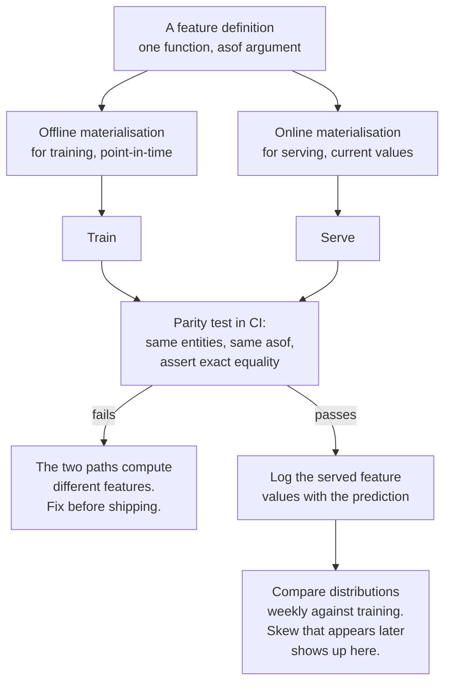

## What you'll learn

- point-in-time correctness, measured: **0.7060** honest against **0.9564** when the window ends late
- six ways a serving path computes "the same" feature differently, and what each one costs
- why accuracy can fall **0.0891** while AUC falls only **0.0207** — and which one production feels
- the parity test that catches skew before a model is involved at all
- what a feature store actually buys you, and what it does not
- the one-function rule, and where it has to be enforced

## The setup

An event log — 4,000 customers, **51,965** events over the 120 days before a cutoff, and **9,351**
events in the 30 days after it. The label is churn in that following month, and **41.60%** of customers
churn. Three features, all aggregates over a 30-day window ending at the cutoff:

```python title="features.py" showLineNumbers{1}
def window_features(events, window_days, asof, customer_ids):
    """Aggregate the log over (asof - window, asof]. One function, both paths."""
    lower = asof - pd.Timedelta(days=window_days)
    window = events[(events["ts"] > lower) & (events["ts"] <= asof)]
    grouped = window.groupby("customer").agg(events=("amount", "size"),
                                             mean_amount=("amount", "mean"),
                                             last=("ts", "max"))
    grouped["days_since"] = (asof - grouped["last"]).dt.days

    frame = grouped.drop(columns="last").reindex(customer_ids)
    frame["events"] = frame["events"].fillna(0)          # no events in the window
    frame["mean_amount"] = frame["mean_amount"].fillna(0)
    frame["days_since"] = frame["days_since"].fillna(999)  # the "never" sentinel
    return frame
```

**568 of 4,000** customers have no events in the window, which is why the fill values are part of the
feature definition rather than an implementation detail. A serving path that fills `days_since` with 0
instead of 999 has changed the feature, not the plumbing.

## Point-in-time correctness

The `asof` argument is the whole of point-in-time correctness. Move it 30 days forward — so the window
covers the month the label is about — and the model becomes spectacular:

<Figure
  src="/images/ml/phase-11-engineering/feature-stores-and-training-serving-skew/point-in-time"
  alt="Left: a timeline with the 30 days before the cutoff shaded blue and the 30 days after shaded red; the correct window covers only the blue period, the late window straddles both. Right: test AUC 0.7060 for the point-in-time features against 0.9564 for the late window."
  title="+0.2504 of pure leakage"
  caption="Both feature frames come from the same function with the same window length. The only difference is the asof timestamp. The late window counts events from the month the label describes — a churned customer has none — so the model is reading the answer, and reports AUC 0.9564 for it."
/>

| Features | Test AUC |
| --- | --- |
| point-in-time, window ends at the cutoff | **0.7060** |
| window ends 30 days after the cutoff | **0.9564** |
| difference | **+0.2504** |

This is the most expensive bug in applied ML, and it is almost never written as `asof = cutoff + 30`.
It arrives as:

- a feature table rebuilt nightly from the *current* state of a customer, then joined to old labels
- `df.groupby("customer")["amount"].mean()` over the whole history, with no window at all
- an aggregate maintained by the application, read at training time from the live database
- a "days since last login" column that was computed when the training set was assembled, not as of the
  prediction moment

Every one of these produces a number that cannot exist at prediction time. The defence is structural:
**compute features with a function that takes `asof` as an argument, and pass the prediction timestamp
into it.** A feature pipeline that cannot answer "as of when?" is not a feature pipeline.

## Six serving paths, one model

Now assume the training features are correct and the *serving* implementation differs. Same model, same
test customers, six variants of the feature computation:

<Figure
  src="/images/ml/phase-11-engineering/feature-stores-and-training-serving-skew/skew-table"
  alt="Grouped horizontal bars of AUC and accuracy for seven serving paths. Point-in-time 0.7060 / 0.6558. Cache 3 days stale 0.7048 / 0.6600. Cache 7 days stale 0.7055 / 0.6625. 7-day window 0.6150 / 0.5567. 90-day window 0.7176 / 0.6192. days_since in hours 0.7058 / 0.6558. Events per day 0.6853 / 0.5667."
  title="One trained model, seven serving paths: accuracy 0.6558 down to 0.5567"
  caption="Staleness of a few days costs nothing here. Changing the window length costs 0.0991 accuracy. Dividing the event count by 30 — a units decision that looks harmless — costs 0.0891 accuracy while AUC falls only 0.0207. And the 90-day window has a HIGHER AUC than the model was trained with, which is the most confusing failure of the set."
/>

| Serving path | AUC | Accuracy | vs correct (accuracy) |
| --- | --- | --- | --- |
| point-in-time (correct) | 0.7060 | 0.6558 | — |
| cache 3 days stale | 0.7048 | 0.6600 | +0.0042 |
| cache 7 days stale | 0.7055 | 0.6625 | +0.0067 |
| **7-day window, not 30** | **0.6150** | **0.5567** | **−0.0991** |
| 90-day window, not 30 | **0.7176** | 0.6192 | −0.0366 |
| `days_since` in hours | 0.7058 | 0.6558 | 0.0000 |
| **events per day, not per window** | 0.6853 | **0.5667** | **−0.0891** |

Four things worth extracting.

**Staleness was harmless — here.** A cache three or seven days behind changed accuracy by less than
0.007, because a 30-day count barely moves in a week. That is a property of *this* feature, not a
general result: a "transactions in the last hour" feature served from a daily batch would be
catastrophic. The test is whether the window is long relative to the staleness.

**Window length is the dangerous parameter.** Serving a 7-day count to a model trained on 30-day counts
cost **0.0991** accuracy — a bigger loss than most modelling changes will ever gain. And nothing errors:
the column is present, numeric, non-null and plausible.

**A monotone rescaling can be nearly invisible in AUC and expensive in accuracy.** Dividing `events` by
30 moved AUC by 0.0207 and accuracy by 0.0891. AUC only cares about the ranking; the *threshold* is
calibrated to the original scale, so a rescaled input moves every prediction across it. If your
monitoring watches AUC only, this class of bug is close to undetectable.

**`days_since` in hours cost exactly nothing.** With three features and a linear model, that particular
rescaling happened to preserve both ranking and the decision. Not a reason to relax: the same change on
a tree ensemble, or interacting with a regularisation penalty, need not be benign. It is a reminder that
the *size* of a skew's damage is not predictable from the size of the code change.

:::caution[The 90-day case is the one that ruins an afternoon]
Serving a 90-day window to a 30-day model gave **higher AUC (0.7176)** and **lower accuracy (0.6192)**.
A dashboard tracking AUC would show an improvement, a dashboard tracking accuracy would show a
regression, and both would be correct. This is what skew looks like from the outside: metrics that
disagree with each other for no reason anyone can find, because the reason is not in the model.
:::

### See it move

The sketch is the dashboard that would have been on the wall. It cycles the seven serving paths from
the table and plots each one as a point in AUC–accuracy space, keeping the correct path marked. What
you are looking for is how often the two axes disagree — because a monitoring setup that watches one
of them is blind to a whole class of skew.

```p5 title="The same model on seven serving paths" desc="Each measured serving path plotted as a point in AUC versus accuracy space, with the correct point-in-time path marked. Two paths raise AUC while lowering accuracy, and two lower accuracy by roughly 0.09 while looking entirely plausible. The panel names what code change produced each one." height="440"
// Measured values from the table above.
const PATHS = [
  { name: "point-in-time (correct)", auc: 0.7060, acc: 0.6558, cause: "the reference implementation" },
  { name: "cache 3 days stale", auc: 0.7048, acc: 0.6600, cause: "batch job runs every 3 days" },
  { name: "cache 7 days stale", auc: 0.7055, acc: 0.6625, cause: "weekly batch job" },
  { name: "7-day window, not 30", auc: 0.6150, acc: 0.5567, cause: "someone wrote days=7" },
  { name: "90-day window, not 30", auc: 0.7176, acc: 0.6192, cause: "someone wrote days=90" },
  { name: "days_since in hours", auc: 0.7058, acc: 0.6558, cause: "unit mismatch, harmless here" },
  { name: "events per day, not per window", auc: 0.6853, acc: 0.5667, cause: "divided the count by 30" },
];
let idx = 0;
let timer = 0;

function setup() {
  createCanvas(620, 440);
  textFont("monospace");
}
function draw() {
  background(13, 17, 23);
  const x0 = 70, x1 = 380, y0 = 70, y1 = 300;
  const aucLo = 0.60, aucHi = 0.73;
  const accLo = 0.54, accHi = 0.68;
  const px = (v) => x0 + ((v - aucLo) / (aucHi - aucLo)) * (x1 - x0);
  const py = (v) => y1 - ((v - accLo) / (accHi - accLo)) * (y1 - y0);

  stroke(34, 40, 48);
  strokeWeight(1);
  for (let v = 0.60; v <= 0.731; v += 0.02) {
    line(px(v), y0, px(v), y1);
    noStroke();
    fill(100);
    textSize(9);
    textAlign(CENTER, TOP);
    text(v.toFixed(2), px(v), y1 + 5);
    stroke(34, 40, 48);
  }
  for (let v = 0.54; v <= 0.681; v += 0.02) {
    line(x0, py(v), x1, py(v));
    noStroke();
    fill(100);
    textSize(9);
    textAlign(RIGHT, CENTER);
    text(v.toFixed(2), x0 - 5, py(v));
    stroke(34, 40, 48);
  }
  noStroke();
  fill(130);
  textSize(10);
  textAlign(CENTER, TOP);
  text("ROC-AUC", (x0 + x1) / 2, y1 + 22);
  push();
  translate(x0 - 36, (y0 + y1) / 2);
  rotate(-HALF_PI);
  textAlign(CENTER, CENTER);
  text("accuracy", 0, 0);
  pop();

  // quadrant guides through the correct path
  const ref = PATHS[0];
  stroke(120, 200, 120, 90);
  strokeWeight(1);
  line(px(ref.auc), y0, px(ref.auc), y1);
  line(x0, py(ref.acc), x1, py(ref.acc));
  noStroke();
  fill(120, 200, 120);
  textSize(9);
  textAlign(LEFT, TOP);
  text("correct", px(ref.auc) + 4, y0 + 2);

  // all points, current one highlighted
  for (let i = 0; i < PATHS.length; i++) {
    const p = PATHS[i];
    const aucUp = p.auc > ref.auc;
    const accDown = p.acc < ref.acc - 0.005;
    const disagree = aucUp && accDown;
    noStroke();
    if (i === 0) fill(120, 200, 120);
    else if (disagree) fill(150, 120, 200);
    else if (accDown) fill(232, 122, 122);
    else fill(110, 140, 180);
    const r = i === idx ? 15 : 8;
    ellipse(px(p.auc), py(p.acc), r, r);
    if (i === idx) {
      noFill();
      stroke(235);
      strokeWeight(2);
      ellipse(px(p.auc), py(p.acc), r + 8, r + 8);
      noStroke();
    }
  }

  // panel
  const p = PATHS[idx];
  const dAcc = p.acc - ref.acc;
  const dAuc = p.auc - ref.auc;
  fill(215);
  textSize(12);
  textAlign(LEFT, TOP);
  text(p.name, 30, 16);
  fill(105);
  textSize(10);
  text(p.cause, 30, 36);

  const px0 = 410;
  fill(150);
  textSize(11);
  textAlign(LEFT, TOP);
  text("vs the correct path", px0, 70);
  fill(Math.abs(dAuc) < 0.005 ? color(150) : dAuc > 0 ? color(150, 120, 200) : color(232, 122, 122));
  textSize(13);
  text("AUC  " + (dAuc >= 0 ? "+" : "") + dAuc.toFixed(4), px0, 94);
  fill(Math.abs(dAcc) < 0.005 ? color(150) : dAcc > 0 ? color(120, 200, 120) : color(232, 122, 122));
  text("acc  " + (dAcc >= 0 ? "+" : "") + dAcc.toFixed(4), px0, 116);

  let verdict, vcol;
  if (dAuc > 0.005 && dAcc < -0.005) { verdict = "AUC says better,\naccuracy says worse.\nBoth are right."; vcol = [150, 120, 200]; }
  else if (dAcc < -0.05) { verdict = "expensive, and\nnothing errors"; vcol = [232, 122, 122]; }
  else if (Math.abs(dAcc) < 0.008) { verdict = "harmless here --\nnot in general"; vcol = [120, 200, 120]; }
  else { verdict = "measurable loss"; vcol = [255, 176, 67]; }
  fill(vcol[0], vcol[1], vcol[2]);
  textSize(10);
  textAlign(LEFT, TOP);
  text(verdict, px0, 152);

  fill(140);
  textSize(10);
  text("purple points:", px0, 226);
  fill(150, 120, 200);
  text("AUC up, acc down", px0, 240);
  fill(140);
  text("red points:", px0, 262);
  fill(232, 122, 122);
  text("acc down", px0, 276);

  fill(105);
  textSize(10);
  textAlign(LEFT, TOP);
  text("every one of these seven paths returns a plausible number for every", 30, 330);
  text("customer: present, numeric, non-null, in range. The model is identical.", 30, 344);
  text("Only a row-by-row comparison against the training implementation", 30, 358);
  text("distinguishes them -- which is what the parity test below does.", 30, 372);
  fill(140);
  text("click to step through the paths   (" + (idx + 1) + " / " + PATHS.length + ")", 30, 400);

  timer += deltaTime;
  if (timer > 2400) { timer = 0; idx = (idx + 1) % PATHS.length; }
}
function mousePressed() { timer = 0; idx = (idx + 1) % PATHS.length; }
```

The purple point is the whole argument for parity testing rather than metric monitoring. If your alert
threshold is on AUC, the 90-day window looks like an improvement of 0.0116 while it quietly costs
0.0366 of accuracy; if your alert is on accuracy, you see a regression with no cause anywhere in the
model, the data volumes, or the label distribution — because the cause is a number `30` that became a
`90` in a different repository.

## The parity test

The fix is not cleverness, it is a test. Compute the features both ways and compare them **row by row**,
before any model is involved:

<Figure
  src="/images/ml/phase-11-engineering/feature-stores-and-training-serving-skew/parity-check"
  alt="Bars of the fraction of customers whose features differ. Same function with the same arguments: 0%. Cache 3 days stale: 87.8%. 7-day window: 79.8%. Events per day: 85.8%."
  title="A parity test compares the two paths row by row, before any model is involved"
  caption="The correct implementation matches itself exactly — 0% of rows differ, max absolute difference 0.0000. Every skew variant differs on 80-88% of customers, and would have failed this test in milliseconds. No labels, no metrics and no production traffic are required to catch any of these."
/>

```python title="test_parity.py" showLineNumbers{1}
def test_offline_online_parity():
    """The two feature paths must agree exactly on a sample of real entities."""
    ids = sample_customer_ids(500)
    asof = pd.Timestamp("2024-04-01")

    offline = window_features(events_warehouse, 30, asof, ids)   # training path
    online = fetch_features_from_service(ids, asof)              # serving path

    assert list(offline.columns) == list(online.columns)
    mismatch = ~np.isclose(offline.to_numpy(float), online.to_numpy(float),
                           rtol=1e-9, atol=1e-9)
    offenders = offline.index[mismatch.any(axis=1)]
    assert len(offenders) == 0, (
        f"{len(offenders)} of {len(ids)} entities differ; "
        f"first: {offenders[:5].tolist()}")
```

| Serving variant | Rows that differ | Max abs difference |
| --- | --- | --- |
| same function, same arguments | **0.00%** | 0.0000 |
| cache 3 days stale | 87.80% | 999.0000 |
| 7-day window | 79.77% | 992.0000 |
| events per day | 85.80% | 35.7667 |

Two design notes that make this test practical:

**Run it on real entity ids, not synthetic ones.** The interesting disagreements are in the awkward
cases — the 568 customers with no events, the ones with a single event on the boundary, the ones
created yesterday.

**Assert exact equality, not "close enough".** A tolerance of 1e-9 catches a changed fill value; a
tolerance of 0.01 hides it. If the two paths cannot agree to floating-point noise, they are computing
different features and you want to know why.

## What a feature store is, minus the marketing

A feature store is three things, and only the first is conceptually interesting:

| Component | What it does | Could you do it yourself? |
| --- | --- | --- |
| **One definition** | The feature is declared once and materialised for both paths | Yes — a shared function is exactly this |
| **Offline store** | Historical values with point-in-time joins for training | Yes, with effort: a warehouse table plus `asof` joins |
| **Online store** | Low-latency lookup of current values for serving | Yes, with more effort: Redis, DynamoDB, a cache |
| Registry / discovery | Which features exist, who owns them, what they mean | Mostly a wiki problem |

The single-definition property is the one that removes the failures on this page. A feature store gives
it to you by construction, but **so does a function in a shared library that both paths import** — which
is the right answer for most teams, and stays the right answer until you have enough features and enough
consumers that discovery becomes the bottleneck.

What a feature store does *not* do:

- It does not stop you writing a leaky definition. `asof` correctness is still yours to get right; the
  store just makes the point-in-time join available.
- It does not remove the need for a parity test. Materialisation paths can still diverge — and the
  point-in-time join is itself code that can be wrong.
- It does not fix staleness. A TTL is a decision about how wrong you are willing to be, and it has to be
  set per feature: 30-day counts tolerated a week here, a one-hour count would not.



The last box matters as much as the test: **log the feature values you actually served**. Given those,
skew is a query rather than an investigation — you can compare served values against the training
distribution, and re-score old requests with the offline path to find the divergence. Without them, a
metric regression caused by skew is nearly impossible to attribute.

## Pitfalls

| Pitfall | Why it bites | What to do |
| --- | --- | --- |
| Features computed from "current state" | Window ending 30 days late gave AUC 0.9564 against 0.7060 | Every feature function takes `asof` |
| Two implementations of one feature | 80–88% of rows differed in every variant | One shared function, two materialisations |
| No parity test | The 7-day/30-day mix cost 0.0991 accuracy silently | Assert exact equality on real ids in CI |
| Monitoring AUC only | Events-per-day cost 0.0891 accuracy with AUC −0.0207 | Watch the metric your decision uses |
| Assuming staleness is harmless | True here (0.007), catastrophic for short windows | Compare the TTL to the window length |
| Fill values treated as plumbing | 568 customers depend on the 999 sentinel | Fill values are part of the definition; test them |
| Not logging served feature values | Skew becomes unattributable after the fact | Log features next to predictions |
| Believing a feature store removes the problem | It gives one definition, not a correct one | Keep the `asof` discipline and the parity test |

## Recap

- 4,000 customers, **51,965** events before the cutoff and **9,351** after; churn rate **0.4160**; **568**
  customers with no events in the 30-day window.
- Moving the window 30 days later inflated AUC from **0.7060 to 0.9564** — **+0.2504** of pure leakage.
- Serving a 7-day window to a 30-day model cost **0.0991** accuracy; nothing raised.
- Dividing `events` by 30 cost **0.0891** accuracy while AUC moved only **0.0207**.
- A 90-day window *raised* AUC to 0.7176 and *lowered* accuracy to 0.6192 — metrics disagreeing is a
  skew signature.
- A parity test found every variant: 0.00% of rows differ for the correct path, 79.77–87.80% for the
  others.

<Quiz
  questions={[
    {
      q: "Your churn model scores AUC 0.9564 in offline evaluation and 0.71 in production. What is the first thing to check?",
      options: [
        "Whether the model is overfitting",
        "Whether the training features were computed as of the prediction time — a window ending 30 days late gave exactly this gap, +0.2504",
        "Whether production traffic has drifted",
        "The random seed",
      ],
      answer: 1,
      explain: "That size of gap is almost always point-in-time leakage rather than overfitting. Look for aggregates built from current state, or a groupby over the whole history, and make every feature function take an asof argument.",
    },
    {
      q: "Serving computes a 7-day event count; the model was trained on 30-day counts. What happens?",
      options: [
        "The model adapts, since the feature is still informative",
        "Accuracy falls 0.0991 and nothing errors: the column is present, numeric, non-null and plausible",
        "A ValueError is raised on the first prediction",
        "AUC falls to chance",
      ],
      answer: 1,
      explain: "Window length is part of the feature's definition, and no type or schema check can see it. Only a parity test comparing the two implementations row by row catches it — 79.77% of customers differed.",
    },
    {
      q: "A serving bug divides one feature by 30. AUC falls by 0.0207, accuracy by 0.0891. Why the difference?",
      options: [
        "Accuracy is a noisier metric",
        "AUC only depends on the ranking, which a monotone rescaling barely changes, while the decision threshold was calibrated to the original scale",
        "The test set is too small",
        "The model is miscalibrated to begin with",
      ],
      answer: 1,
      explain: "This is why the metric you monitor should be the one your decision uses. A dashboard watching AUC would have shown a 0.02 wobble for a bug that cost nearly nine points of accuracy.",
    },
    {
      q: "What does a parity test assert, and on what data?",
      options: [
        "That the model's accuracy is the same offline and online",
        "That the offline and online feature computations produce identical values for the same real entities at the same asof — to floating-point tolerance, before any model runs",
        "That the schemas match",
        "That predictions are within 1% of each other",
      ],
      answer: 1,
      explain: "It needs no labels, no metrics and no traffic: 0.00% of rows differed for the correct path against 79.77-87.80% for each skewed variant. Use real ids, including the awkward ones like the 568 customers with no events.",
    },
    {
      q: "Your team is considering a feature store. What will it definitely NOT fix?",
      options: [
        "Duplicate feature definitions",
        "A leaky feature definition — asof correctness is still yours, and the point-in-time join is itself code that can be wrong",
        "Low-latency lookups at serving time",
        "Feature discovery across teams",
      ],
      answer: 1,
      explain: "The store's real gift is one definition materialised two ways, which a shared function also gives you. It cannot know that your window should end at the prediction moment, and it does not remove the need for the parity test.",
    },
  ]}
/>

## 🧪 Try It Yourself

### Exercise 1 – Build the event log and the features

<DataCampExercise
  lang="python"
  hint={`The window is half-open: strictly after asof - window_days, up to and including asof. Fill values are part of the feature definition.`}
  code={`# Task: Exercise 1 - Build the event log and the features
import numpy as np
import pandas as pd

CUTOFF = pd.Timestamp("2024-04-01")

def event_log(n_customers=4000, days=120, seed=21):
    rng = np.random.default_rng(seed)
    engagement = rng.normal(0, 1, n_customers)
    rate = np.exp(0.9 + 0.75 * engagement) / 30.0
    rows = []
    for c in range(n_customers):
        n_events = rng.poisson(rate[c] * days)
        if n_events == 0:
            continue
        for offset, amount in zip(
                rng.uniform(0, days, n_events),
                np.exp(rng.normal(2.5 + 0.3 * engagement[c], 0.6, n_events))):
            rows.append((c, CUTOFF - pd.Timedelta(days=float(offset)), float(amount)))
    events = pd.DataFrame(rows, columns=["customer", "ts", "amount"])
    churn = (rng.random(n_customers)
             < 1 / (1 + np.exp(1.1 * engagement + 0.4))).astype(int)
    post = []
    for c in range(n_customers):
        if churn[c]:
            continue
        for _ in range(rng.poisson(rate[c] * 30)):
            post.append((c, CUTOFF + pd.Timedelta(days=float(rng.uniform(0, 30))),
                         float(np.exp(rng.normal(2.5 + 0.3 * engagement[c], 0.6)))))
    return events, pd.DataFrame(post, columns=["customer", "ts", "amount"]), churn

def window_features(events, window_days, asof, customer_ids):
    lower = asof - pd.Timedelta(days=window_days)
    window = events[(events["ts"] > lower) & (events["ts"] <= ___)]  # replace ___ with asof
    grouped = window.groupby("customer").agg(events=("amount", "size"),
                                             mean_amount=("amount", "mean"),
                                             last=("ts", "max"))
    grouped["days_since"] = (asof - grouped["last"]).dt.days
    frame = grouped.drop(columns="last").reindex(customer_ids)
    frame["events"] = frame["events"].fillna(0)
    frame["mean_amount"] = frame["mean_amount"].fillna(0)
    frame["days_since"] = frame["days_since"].fillna(999)
    return frame

events, future, churn = event_log()
ids = np.arange(len(churn))
features = window_features(events, 30, CUTOFF, ids)
print(f"customers {len(churn):,}   events before the cutoff {len(events):,}   "
      f"after {len(future):,}")
print(f"churn rate {churn.mean():.4f}")
print(f"customers with no events in the 30-day window: "
      f"{int((features['events'] == 0).sum())}")

# -- Expected Output -------------------------------------------
# customers 4,000   events before the cutoff 51,965   after 9,351
# churn rate 0.4160
# customers with no events in the 30-day window: 568
# --------------------------------------------------------------`}
  solution={`import numpy as np
import pandas as pd

CUTOFF = pd.Timestamp("2024-04-01")

def event_log(n_customers=4000, days=120, seed=21):
    rng = np.random.default_rng(seed)
    engagement = rng.normal(0, 1, n_customers)
    rate = np.exp(0.9 + 0.75 * engagement) / 30.0
    rows = []
    for c in range(n_customers):
        n_events = rng.poisson(rate[c] * days)
        if n_events == 0:
            continue
        for offset, amount in zip(
                rng.uniform(0, days, n_events),
                np.exp(rng.normal(2.5 + 0.3 * engagement[c], 0.6, n_events))):
            rows.append((c, CUTOFF - pd.Timedelta(days=float(offset)), float(amount)))
    events = pd.DataFrame(rows, columns=["customer", "ts", "amount"])
    churn = (rng.random(n_customers)
             < 1 / (1 + np.exp(1.1 * engagement + 0.4))).astype(int)
    post = []
    for c in range(n_customers):
        if churn[c]:
            continue
        for _ in range(rng.poisson(rate[c] * 30)):
            post.append((c, CUTOFF + pd.Timedelta(days=float(rng.uniform(0, 30))),
                         float(np.exp(rng.normal(2.5 + 0.3 * engagement[c], 0.6)))))
    return events, pd.DataFrame(post, columns=["customer", "ts", "amount"]), churn

def window_features(events, window_days, asof, customer_ids):
    lower = asof - pd.Timedelta(days=window_days)
    window = events[(events["ts"] > lower) & (events["ts"] <= asof)]
    grouped = window.groupby("customer").agg(events=("amount", "size"),
                                             mean_amount=("amount", "mean"),
                                             last=("ts", "max"))
    grouped["days_since"] = (asof - grouped["last"]).dt.days
    frame = grouped.drop(columns="last").reindex(customer_ids)
    frame["events"] = frame["events"].fillna(0)
    frame["mean_amount"] = frame["mean_amount"].fillna(0)
    frame["days_since"] = frame["days_since"].fillna(999)
    return frame

events, future, churn = event_log()
ids = np.arange(len(churn))
features = window_features(events, 30, CUTOFF, ids)
print(f"customers {len(churn):,}   events before the cutoff {len(events):,}   "
      f"after {len(future):,}")
print(f"churn rate {churn.mean():.4f}")
print(f"customers with no events in the 30-day window: "
      f"{int((features['events'] == 0).sum())}")`}
  sct={`test_output_contains("events before the cutoff 51,965")
success_msg("568 of 4,000 customers have no events in the window - which is why the fill values are part of the feature definition.")`}
  height={440}
/>

### Exercise 2 – Train on point-in-time features

<DataCampExercise
  lang="python"
  preExerciseCode={`import numpy as np
import pandas as pd

CUTOFF = pd.Timestamp("2024-04-01")

def event_log(n_customers=4000, days=120, seed=21):
    rng = np.random.default_rng(seed)
    engagement = rng.normal(0, 1, n_customers)
    rate = np.exp(0.9 + 0.75 * engagement) / 30.0
    rows = []
    for c in range(n_customers):
        n_events = rng.poisson(rate[c] * days)
        if n_events == 0:
            continue
        for offset, amount in zip(
                rng.uniform(0, days, n_events),
                np.exp(rng.normal(2.5 + 0.3 * engagement[c], 0.6, n_events))):
            rows.append((c, CUTOFF - pd.Timedelta(days=float(offset)), float(amount)))
    events = pd.DataFrame(rows, columns=["customer", "ts", "amount"])
    churn = (rng.random(n_customers)
             < 1 / (1 + np.exp(1.1 * engagement + 0.4))).astype(int)
    post = []
    for c in range(n_customers):
        if churn[c]:
            continue
        for _ in range(rng.poisson(rate[c] * 30)):
            post.append((c, CUTOFF + pd.Timedelta(days=float(rng.uniform(0, 30))),
                         float(np.exp(rng.normal(2.5 + 0.3 * engagement[c], 0.6)))))
    return events, pd.DataFrame(post, columns=["customer", "ts", "amount"]), churn

def window_features(events, window_days, asof, customer_ids):
    lower = asof - pd.Timedelta(days=window_days)
    window = events[(events["ts"] > lower) & (events["ts"] <= asof)]
    grouped = window.groupby("customer").agg(events=("amount", "size"),
                                             mean_amount=("amount", "mean"),
                                             last=("ts", "max"))
    grouped["days_since"] = (asof - grouped["last"]).dt.days
    frame = grouped.drop(columns="last").reindex(customer_ids)
    frame["events"] = frame["events"].fillna(0)
    frame["mean_amount"] = frame["mean_amount"].fillna(0)
    frame["days_since"] = frame["days_since"].fillna(999)
    return frame

events, future, churn = event_log()
ids = np.arange(len(churn))
features = window_features(events, 30, CUTOFF, ids)`}
  hint={`Split by customer, fit on the correct features, and keep the report() helper — every later exercise reuses it.`}
  code={`# Task: Exercise 2 - Train on point-in-time features
from sklearn.linear_model import LogisticRegression
from sklearn.metrics import accuracy_score, roc_auc_score
from sklearn.pipeline import make_pipeline
from sklearn.preprocessing import StandardScaler

rng = np.random.default_rng(21)
train = np.zeros(len(churn), dtype=bool)
train[rng.permutation(len(churn))[:int(0.7 * len(churn))]] = True

model = make_pipeline(StandardScaler(), LogisticRegression(max_iter=2000))
model.fit(features[train], churn[___])                  # replace ___ with train

def report(name, frame):
    proba = model.predict_proba(frame[~train])[:, 1]
    print(f"{name:32s} AUC {roc_auc_score(churn[~train], proba):.4f}   "
          f"accuracy {accuracy_score(churn[~train], model.predict(frame[~train])):.4f}")

report("point-in-time (correct)", features)

# -- Expected Output -------------------------------------------
# point-in-time (correct)          AUC 0.7060   accuracy 0.6558
# --------------------------------------------------------------`}
  solution={`from sklearn.linear_model import LogisticRegression
from sklearn.metrics import accuracy_score, roc_auc_score
from sklearn.pipeline import make_pipeline
from sklearn.preprocessing import StandardScaler

rng = np.random.default_rng(21)
train = np.zeros(len(churn), dtype=bool)
train[rng.permutation(len(churn))[:int(0.7 * len(churn))]] = True
model = make_pipeline(StandardScaler(), LogisticRegression(max_iter=2000))
model.fit(features[train], churn[train])

def report(name, frame):
    proba = model.predict_proba(frame[~train])[:, 1]
    print(f"{name:32s} AUC {roc_auc_score(churn[~train], proba):.4f}   "
          f"accuracy {accuracy_score(churn[~train], model.predict(frame[~train])):.4f}")

report("point-in-time (correct)", features)`}
  sct={`test_output_contains("AUC 0.7060")
success_msg("0.7060 AUC on an honest churn task. Remember the number - the next exercise breaks it upwards.")`}
  height={300}
/>

### Exercise 3 – Leak the future, on purpose

<DataCampExercise
  lang="python"
  preExerciseCode={`import numpy as np
import pandas as pd

CUTOFF = pd.Timestamp("2024-04-01")

def event_log(n_customers=4000, days=120, seed=21):
    rng = np.random.default_rng(seed)
    engagement = rng.normal(0, 1, n_customers)
    rate = np.exp(0.9 + 0.75 * engagement) / 30.0
    rows = []
    for c in range(n_customers):
        n_events = rng.poisson(rate[c] * days)
        if n_events == 0:
            continue
        for offset, amount in zip(
                rng.uniform(0, days, n_events),
                np.exp(rng.normal(2.5 + 0.3 * engagement[c], 0.6, n_events))):
            rows.append((c, CUTOFF - pd.Timedelta(days=float(offset)), float(amount)))
    events = pd.DataFrame(rows, columns=["customer", "ts", "amount"])
    churn = (rng.random(n_customers)
             < 1 / (1 + np.exp(1.1 * engagement + 0.4))).astype(int)
    post = []
    for c in range(n_customers):
        if churn[c]:
            continue
        for _ in range(rng.poisson(rate[c] * 30)):
            post.append((c, CUTOFF + pd.Timedelta(days=float(rng.uniform(0, 30))),
                         float(np.exp(rng.normal(2.5 + 0.3 * engagement[c], 0.6)))))
    return events, pd.DataFrame(post, columns=["customer", "ts", "amount"]), churn

def window_features(events, window_days, asof, customer_ids):
    lower = asof - pd.Timedelta(days=window_days)
    window = events[(events["ts"] > lower) & (events["ts"] <= asof)]
    grouped = window.groupby("customer").agg(events=("amount", "size"),
                                             mean_amount=("amount", "mean"),
                                             last=("ts", "max"))
    grouped["days_since"] = (asof - grouped["last"]).dt.days
    frame = grouped.drop(columns="last").reindex(customer_ids)
    frame["events"] = frame["events"].fillna(0)
    frame["mean_amount"] = frame["mean_amount"].fillna(0)
    frame["days_since"] = frame["days_since"].fillna(999)
    return frame

events, future, churn = event_log()
ids = np.arange(len(churn))
features = window_features(events, 30, CUTOFF, ids)

from sklearn.linear_model import LogisticRegression
from sklearn.metrics import accuracy_score, roc_auc_score
from sklearn.pipeline import make_pipeline
from sklearn.preprocessing import StandardScaler

rng = np.random.default_rng(21)
train = np.zeros(len(churn), dtype=bool)
train[rng.permutation(len(churn))[:int(0.7 * len(churn))]] = True
model = make_pipeline(StandardScaler(), LogisticRegression(max_iter=2000))
model.fit(features[train], churn[train])

def report(name, frame):
    proba = model.predict_proba(frame[~train])[:, 1]
    print(f"{name:32s} AUC {roc_auc_score(churn[~train], proba):.4f}   "
          f"accuracy {accuracy_score(churn[~train], model.predict(frame[~train])):.4f}")`}
  hint={`Concatenate the post-cutoff events and move asof forward by 30 days. Nothing else changes.`}
  code={`# Task: Exercise 3 - Leak the future, on purpose
everything = pd.concat([events, future], ignore_index=True)
late = window_features(everything, 30, CUTOFF + pd.Timedelta(days=___), ids)
# replace ___ with 30

leaky = make_pipeline(StandardScaler(), LogisticRegression(max_iter=2000))
leaky.fit(late[train], churn[train])

honest_auc = roc_auc_score(churn[~train], model.predict_proba(features[~train])[:, 1])
leaky_auc = roc_auc_score(churn[~train], leaky.predict_proba(late[~train])[:, 1])
print(f"point-in-time AUC   {honest_auc:.4f}")
print(f"window 30 days late {leaky_auc:.4f}")
print(f"leakage             {leaky_auc - honest_auc:+.4f}")

# -- Expected Output -------------------------------------------
# point-in-time AUC   0.7060
# window 30 days late 0.9564
# leakage             +0.2504
# --------------------------------------------------------------`}
  solution={`everything = pd.concat([events, future], ignore_index=True)
late = window_features(everything, 30, CUTOFF + pd.Timedelta(days=30), ids)
leaky = make_pipeline(StandardScaler(), LogisticRegression(max_iter=2000))
leaky.fit(late[train], churn[train])
honest_auc = roc_auc_score(churn[~train], model.predict_proba(features[~train])[:, 1])
leaky_auc = roc_auc_score(churn[~train], leaky.predict_proba(late[~train])[:, 1])
print(f"point-in-time AUC   {honest_auc:.4f}")
print(f"window 30 days late {leaky_auc:.4f}")
print(f"leakage             {leaky_auc - honest_auc:+.4f}")`}
  sct={`test_output_contains("leakage             +0.2504")
success_msg("+0.2504 from one argument. This is the single most expensive bug in applied ML.")`}
  height={300}
/>

### Exercise 4 – Serve five different features

<DataCampExercise
  lang="python"
  preExerciseCode={`import numpy as np
import pandas as pd

CUTOFF = pd.Timestamp("2024-04-01")

def event_log(n_customers=4000, days=120, seed=21):
    rng = np.random.default_rng(seed)
    engagement = rng.normal(0, 1, n_customers)
    rate = np.exp(0.9 + 0.75 * engagement) / 30.0
    rows = []
    for c in range(n_customers):
        n_events = rng.poisson(rate[c] * days)
        if n_events == 0:
            continue
        for offset, amount in zip(
                rng.uniform(0, days, n_events),
                np.exp(rng.normal(2.5 + 0.3 * engagement[c], 0.6, n_events))):
            rows.append((c, CUTOFF - pd.Timedelta(days=float(offset)), float(amount)))
    events = pd.DataFrame(rows, columns=["customer", "ts", "amount"])
    churn = (rng.random(n_customers)
             < 1 / (1 + np.exp(1.1 * engagement + 0.4))).astype(int)
    post = []
    for c in range(n_customers):
        if churn[c]:
            continue
        for _ in range(rng.poisson(rate[c] * 30)):
            post.append((c, CUTOFF + pd.Timedelta(days=float(rng.uniform(0, 30))),
                         float(np.exp(rng.normal(2.5 + 0.3 * engagement[c], 0.6)))))
    return events, pd.DataFrame(post, columns=["customer", "ts", "amount"]), churn

def window_features(events, window_days, asof, customer_ids):
    lower = asof - pd.Timedelta(days=window_days)
    window = events[(events["ts"] > lower) & (events["ts"] <= asof)]
    grouped = window.groupby("customer").agg(events=("amount", "size"),
                                             mean_amount=("amount", "mean"),
                                             last=("ts", "max"))
    grouped["days_since"] = (asof - grouped["last"]).dt.days
    frame = grouped.drop(columns="last").reindex(customer_ids)
    frame["events"] = frame["events"].fillna(0)
    frame["mean_amount"] = frame["mean_amount"].fillna(0)
    frame["days_since"] = frame["days_since"].fillna(999)
    return frame

events, future, churn = event_log()
ids = np.arange(len(churn))
features = window_features(events, 30, CUTOFF, ids)

from sklearn.linear_model import LogisticRegression
from sklearn.metrics import accuracy_score, roc_auc_score
from sklearn.pipeline import make_pipeline
from sklearn.preprocessing import StandardScaler

rng = np.random.default_rng(21)
train = np.zeros(len(churn), dtype=bool)
train[rng.permutation(len(churn))[:int(0.7 * len(churn))]] = True
model = make_pipeline(StandardScaler(), LogisticRegression(max_iter=2000))
model.fit(features[train], churn[train])

def report(name, frame):
    proba = model.predict_proba(frame[~train])[:, 1]
    print(f"{name:32s} AUC {roc_auc_score(churn[~train], proba):.4f}   "
          f"accuracy {accuracy_score(churn[~train], model.predict(frame[~train])):.4f}")`}
  hint={`Reuse report() from Exercise 2 — the model is fixed, only the frame changes.`}
  code={`# Task: Exercise 4 - Serve five different features
hours = features.copy()
hours["days_since"] = hours["days_since"] * 24
per_day = features.copy()
per_day["events"] = per_day["events"] / ___          # replace ___ with 30

report("cache 3 days stale",
       window_features(events, 30, CUTOFF - pd.Timedelta(days=3), ids))
report("7-day window, not 30", window_features(events, 7, CUTOFF, ids))
report("90-day window, not 30", window_features(events, 90, CUTOFF, ids))
report("days_since in hours", hours)
report("events per day, not per window", per_day)

# -- Expected Output -------------------------------------------
# cache 3 days stale               AUC 0.7048   accuracy 0.6600
# 7-day window, not 30             AUC 0.6150   accuracy 0.5567
# 90-day window, not 30            AUC 0.7176   accuracy 0.6192
# days_since in hours              AUC 0.7058   accuracy 0.6558
# events per day, not per window   AUC 0.6853   accuracy 0.5667
# --------------------------------------------------------------`}
  solution={`hours = features.copy()
hours["days_since"] = hours["days_since"] * 24
per_day = features.copy()
per_day["events"] = per_day["events"] / 30

report("cache 3 days stale",
       window_features(events, 30, CUTOFF - pd.Timedelta(days=3), ids))
report("7-day window, not 30", window_features(events, 7, CUTOFF, ids))
report("90-day window, not 30", window_features(events, 90, CUTOFF, ids))
report("days_since in hours", hours)
report("events per day, not per window", per_day)`}
  sct={`test_output_contains("7-day window, not 30             AUC 0.6150   accuracy 0.5567")
success_msg("The 90-day window RAISED AUC and lowered accuracy. Metrics disagreeing with each other is a skew signature.")`}
  height={320}
/>

### Exercise 5 – Write the parity test

<DataCampExercise
  lang="python"
  preExerciseCode={`import numpy as np
import pandas as pd

CUTOFF = pd.Timestamp("2024-04-01")

def event_log(n_customers=4000, days=120, seed=21):
    rng = np.random.default_rng(seed)
    engagement = rng.normal(0, 1, n_customers)
    rate = np.exp(0.9 + 0.75 * engagement) / 30.0
    rows = []
    for c in range(n_customers):
        n_events = rng.poisson(rate[c] * days)
        if n_events == 0:
            continue
        for offset, amount in zip(
                rng.uniform(0, days, n_events),
                np.exp(rng.normal(2.5 + 0.3 * engagement[c], 0.6, n_events))):
            rows.append((c, CUTOFF - pd.Timedelta(days=float(offset)), float(amount)))
    events = pd.DataFrame(rows, columns=["customer", "ts", "amount"])
    churn = (rng.random(n_customers)
             < 1 / (1 + np.exp(1.1 * engagement + 0.4))).astype(int)
    post = []
    for c in range(n_customers):
        if churn[c]:
            continue
        for _ in range(rng.poisson(rate[c] * 30)):
            post.append((c, CUTOFF + pd.Timedelta(days=float(rng.uniform(0, 30))),
                         float(np.exp(rng.normal(2.5 + 0.3 * engagement[c], 0.6)))))
    return events, pd.DataFrame(post, columns=["customer", "ts", "amount"]), churn

def window_features(events, window_days, asof, customer_ids):
    lower = asof - pd.Timedelta(days=window_days)
    window = events[(events["ts"] > lower) & (events["ts"] <= asof)]
    grouped = window.groupby("customer").agg(events=("amount", "size"),
                                             mean_amount=("amount", "mean"),
                                             last=("ts", "max"))
    grouped["days_since"] = (asof - grouped["last"]).dt.days
    frame = grouped.drop(columns="last").reindex(customer_ids)
    frame["events"] = frame["events"].fillna(0)
    frame["mean_amount"] = frame["mean_amount"].fillna(0)
    frame["days_since"] = frame["days_since"].fillna(999)
    return frame

events, future, churn = event_log()
ids = np.arange(len(churn))
features = window_features(events, 30, CUTOFF, ids)

from sklearn.linear_model import LogisticRegression
from sklearn.metrics import accuracy_score, roc_auc_score
from sklearn.pipeline import make_pipeline
from sklearn.preprocessing import StandardScaler

rng = np.random.default_rng(21)
train = np.zeros(len(churn), dtype=bool)
train[rng.permutation(len(churn))[:int(0.7 * len(churn))]] = True
model = make_pipeline(StandardScaler(), LogisticRegression(max_iter=2000))
model.fit(features[train], churn[train])

def report(name, frame):
    proba = model.predict_proba(frame[~train])[:, 1]
    print(f"{name:32s} AUC {roc_auc_score(churn[~train], proba):.4f}   "
          f"accuracy {accuracy_score(churn[~train], model.predict(frame[~train])):.4f}")

per_day = features.copy()
per_day["events"] = per_day["events"] / 30`}
  hint={`np.isclose with a tight tolerance, then .any(axis=1) to find the offending rows. Exact equality is the point.`}
  code={`# Task: Exercise 5 - Write the parity test
def parity(a, b):
    differs = ~np.isclose(a.to_numpy(dtype=float), b.to_numpy(dtype=float),
                          rtol=1e-9, atol=1e-9)
    rows = differs.any(axis=___).mean()          # replace ___ with 1
    worst = float(np.abs(a.to_numpy(dtype=float) - b.to_numpy(dtype=float)).max())
    verdict = "PARITY" if rows == 0 else "SKEW"
    return f"{verdict}: {rows:.2%} of rows differ, max |diff| {worst:.4f}"

print(f"same function, same args   "
      f"{parity(features, window_features(events, 30, CUTOFF, ids))}")
print(f"cache 3 days stale         "
      f"{parity(features, window_features(events, 30, CUTOFF - pd.Timedelta(days=3), ids))}")
print(f"7-day window               "
      f"{parity(features, window_features(events, 7, CUTOFF, ids))}")
print(f"events per day             {parity(features, per_day)}")

# -- Expected Output -------------------------------------------
# same function, same args   PARITY: 0.00% of rows differ, max |diff| 0.0000
# cache 3 days stale         SKEW: 87.80% of rows differ, max |diff| 999.0000
# 7-day window               SKEW: 79.77% of rows differ, max |diff| 992.0000
# events per day             SKEW: 85.80% of rows differ, max |diff| 35.7667
# --------------------------------------------------------------`}
  solution={`def parity(a, b):
    differs = ~np.isclose(a.to_numpy(dtype=float), b.to_numpy(dtype=float),
                          rtol=1e-9, atol=1e-9)
    rows = differs.any(axis=1).mean()
    worst = float(np.abs(a.to_numpy(dtype=float) - b.to_numpy(dtype=float)).max())
    verdict = "PARITY" if rows == 0 else "SKEW"
    return f"{verdict}: {rows:.2%} of rows differ, max |diff| {worst:.4f}"

print(f"same function, same args   "
      f"{parity(features, window_features(events, 30, CUTOFF, ids))}")
print(f"cache 3 days stale         "
      f"{parity(features, window_features(events, 30, CUTOFF - pd.Timedelta(days=3), ids))}")
print(f"7-day window               "
      f"{parity(features, window_features(events, 7, CUTOFF, ids))}")
print(f"events per day             {parity(features, per_day)}")`}
  sct={`test_output_contains("PARITY: 0.00% of rows differ")
success_msg("Every skew caught in milliseconds, with no labels, no metrics and no production traffic.")`}
  height={340}
/>

## Next

[Testing ML Code](/machine-learning/phase-11---ml-engineering/testing-ml-code/)
— the parity test above is one of six kinds of test that catch ML bugs. The next page writes the other
five, and measures which bugs each one catches.
