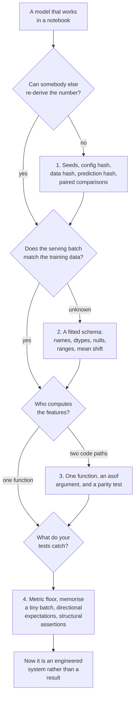

import Quiz from "../../../../components/Quiz.astro";

Every earlier phase assumed a model is a thing you fit and score. This phase treats it as a thing other
code calls, in a repository other people change, on data that arrives from somewhere else. Each of the
four failures below is invisible to any metric you have computed so far.

## What this phase covers

| # | Page | The failure | The measurement |
| --- | --- | --- | --- |
| 1 | [Experiment Tracking and Reproducibility](/machine-learning/phase-11---ml-engineering/experiment-tracking-and-reproducibility/) | Nobody can re-derive the number | Split seed alone spans **0.0300** |
| 2 | [Data Validation and Schema Contracts](/machine-learning/phase-11---ml-engineering/data-validation-and-schema-contracts/) | The batch is not what the model expects | 3 of 7 corruptions served silently, worst **−0.1375** |
| 3 | [Feature Stores and Training-Serving Skew](/machine-learning/phase-11---ml-engineering/feature-stores-and-training-serving-skew/) | Two code paths, one feature name | A 30-day window ending late: **+0.2504** AUC |
| 4 | [Testing ML Code](/machine-learning/phase-11---ml-engineering/testing-ml-code/) | The tests pass and the model is broken | Contract and invariance tests caught **0 of 6** bugs |

## The four measurements

**A single reported number is a sample of size one.** Holding the model, the code and the data fixed and
varying only the train/test split seed moved test accuracy across **0.8917–0.9217** (sd 0.0070). The
model seed moved it 0.0092. Meanwhile a seeded pipeline is genuinely *bit*-reproducible — three runs, one
prediction hash `25b525a8327c8ac0` — so irreproducibility is always about seeds, data versions or
environments, never about the algorithm.

**Choosing between candidates is where the reported number goes wrong.** Picking the best of 20
configurations on 800 validation rows gave a validation-test correlation of **−0.0386** and **+0.0150** of
optimism: the selection was noise. Pairing fixes it — the same 0.0059 improvement that needs 26,000
unpaired rows is clear from **15 paired splits** (t = +4.87, 14 wins of 15), and four splits would have
done.

**Half of the ways a batch can be wrong are silent.** Of seven corrupted serving batches, sklearn's
feature-name check raised on four; the other three were served, and the worst — one column in cents
instead of euros — cost **0.1375** accuracy. A 40-line fitted schema caught **6 of 6** in **6.65 ms** per
1,200-row batch. It also fired at a shift that cost nothing (accuracy 0.8508 against 0.8500), which is
the honest limit: validation is a precondition, not a performance prediction.

**Features computed twice are computed differently.** Moving the aggregation window 30 days later —
one argument — inflated AUC from **0.7060 to 0.9564**. Serving a 7-day window to a 30-day model cost
**0.0991** accuracy silently, and dividing a count by 30 cost **0.0891** accuracy while AUC moved only
0.0207. A row-by-row parity test found every variant: **0.00%** of rows differ for the correct path
against **79.77–87.80%** for the skewed ones.

**Most ML tests test nothing.** Against six injected bugs, the output-contract and row-order-invariance
tests caught **zero**. A metric floor caught **5 of 6**; memorising 24 rows caught **4 of 6** in 5.6 ms and
localised the fault to the training loop; and the leaky scaler — accuracy **0.8500**, identical to the
correct pipeline — was caught only by a **structural** assertion that every transformer sits inside the
`Pipeline`.

## The pattern

| Failure | Why the metric cannot see it |
| --- | --- |
| an unrecorded seed | the metric is *a* valid value, just not reproducible |
| selection on a small validation set | the metric is optimistic by construction |
| a batch in the wrong units | the metric on old test data is unchanged |
| a leaky feature window | the metric *improves* |
| a leaky scaler | the metric is bit-identical |
| training-serving skew | the metric moves in production, days later |

Every one of these is a **process** defect rather than a modelling one, and the defences are all cheap:
a JSONL run log, a fitted schema, one feature function, four assertions. None of them require a
platform, and all of them are worth more than the next 0.003 of accuracy.

## Before you start

- **[Saving and Loading Models](/machine-learning/phase-08---model-deployment-mlops/saving-and-loading-models-pickle-joblib/)** —
  the schema and the model are both fitted artefacts, versioned together.
- **[Monitoring Model Drift](/machine-learning/phase-08---model-deployment-mlops/monitoring-model-drift/)** —
  page 2's "an alarm is not a performance prediction" is that page's PSI result again.
- **[K-Fold Cross-Validation](/machine-learning/phase-07---model-optimization--tuning/k-fold-cross-validation/)** —
  page 1 turns it from a variance estimate into a comparison tool.
- **[Why Interpretability Matters](/machine-learning/phase-09---interpretability--responsible-ml/why-interpretability-matters/)** —
  reading top coefficients is how you catch the artefacts that pages 3 and 4 measure.

No new libraries. The run tracker, the schema, the parity test and the test suite are all standard
library plus pandas.

## What you'll be able to do afterwards

1. State a result as a distribution rather than a number, and re-derive any run a year later.
2. Compare two candidates with a paired protocol, and say how big an effect your data can resolve.
3. Fit a schema from training data and hard-fail the batches that violate its structure.
4. Explain why a validation alarm and a performance alarm are different questions.
5. Write feature code that takes `asof` and cannot see the future.
6. Write a parity test between the offline and online feature paths.
7. Choose ML tests by what they catch, and arrange them so CI stays fast.
8. Catch the class of bug whose symptom is a *better* number.

## How long it takes

| Activity | Time |
| --- | --- |
| Reading the four pages | 4–5 hours |
| Running the code and the 20 exercises | 4–5 hours |
| The practice project below | 8–12 hours |
| **Total** | **16–22 hours** |

## Practice project

**Take one model you have already built and make it survive being a system.**

**Part 1 — Make it re-derivable.** Add the JSONL run log: config hash, git commit with a `-dirty` flag,
data hash, prediction fingerprint, library versions, every metric. Re-run yesterday's experiment from
its record alone and check the fingerprint matches.

**Part 2 — Quantify your noise floor.** Report your headline metric across 20 split seeds: mean, sd and
range. Then write the sentence you will use in future: "improvements smaller than X on this dataset are
not measurable without a paired protocol."

**Part 3 — Fit a schema.** Names, dtypes, null rates, percentile ranges, means and sds. Serialise it
beside the model with a hash. Then corrupt a batch six ways and confirm each corruption is caught, with
hard-fail for structure and warn for statistics.

**Part 4 — Find your skew.** If any feature is computed in more than one place, write the parity test and
run it on 500 real ids. If every feature comes from one function, prove it: grep for the aggregations and
show they all route through it.

**Part 5 — Inject three bugs.** Shuffle the labels, drop the preprocessing at serving time, and fit a
transformer outside the pipeline. For each, record which of your tests fires. Add tests until all three
are caught, then check that the fast tier still runs in seconds.

**Part 6 — One page.** The noise floor, the schema, the parity result, and the bug × test matrix for your
own suite.

Part 5 is the part that changes behaviour: a test suite you have *attacked* is the only kind you can
trust.

<Quiz
  questions={[
    {
      q: "What do the four failures in this phase have in common?",
      options: [
        "They are all caused by bad modelling choices",
        "They are process defects that no metric on your current test set can see — one of them even improves the metric",
        "They only occur at large scale",
        "They are all caught by cross-validation",
      ],
      answer: 1,
      explain: "An unrecorded seed produces a valid number; a leaky window produces a better one; a leaky scaler produces an identical one. That is why the defences are records, contracts, shared functions and structural assertions rather than better models.",
    },
    {
      q: "Your team wants to know whether a change helped. What is the minimum protocol?",
      options: [
        "One train/test split, compare the two numbers",
        "Both candidates on the same several splits, then the paired mean difference, its confidence interval and the win count",
        "Cross-validate each candidate separately and compare the means",
        "Compare on the test set once each",
      ],
      answer: 1,
      explain: "Split-to-split variance dominates and is shared, so pairing cancels it: the measured effect of +0.0059 was invisible unpaired (needing 26,000 rows) and clear across 15 paired splits at t = +4.87.",
    },
    {
      q: "Which single artefact should be versioned with the model file?",
      options: [
        "The training notebook",
        "The fitted schema — column names, dtypes, null rates and value ranges derived from the training data",
        "The hyperparameter grid",
        "The confusion matrix",
      ],
      answer: 1,
      explain: "It is a fitted artefact exactly like the scaler, and it is what turns three silent corruptions into three hard failures. A schema fitted on different data than the model checks the wrong expectations.",
    },
    {
      q: "Which test would have caught a scaler fitted before the train/test split?",
      options: [
        "A metric floor",
        "A structural assertion that all preprocessing lives inside the Pipeline",
        "An output-contract test",
        "A row-order invariance test",
      ],
      answer: 1,
      explain: "That bug scored an identical 0.8500, so no behavioural test could see it — and leakage bugs frequently improve the metric, which makes floors actively useless against them.",
    },
  ]}
/>

## Next

Start with
[Experiment Tracking and Reproducibility](/machine-learning/phase-11---ml-engineering/experiment-tracking-and-reproducibility/)
— the 0.0300 spread that decides whether any later comparison on this page means anything.
