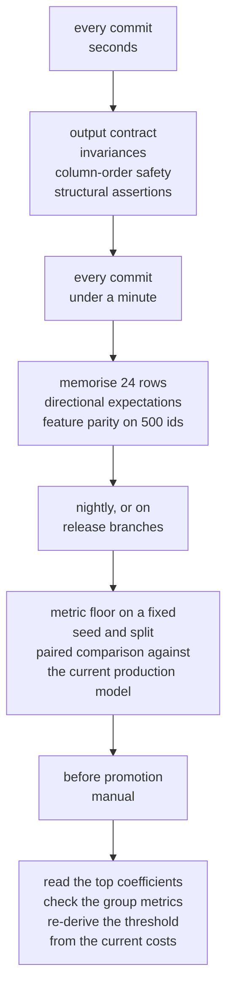

import DataCampExercise from "../../../../components/DataCampExercise.astro";
import Figure from "../../../../components/Figure.astro";
import Quiz from "../../../../components/Quiz.astro";

## What you'll learn

- the six kinds of test that apply to ML code, written out, not described
- which bugs each one actually catches — a measured **7 × 7 matrix**, not an opinion
- why two of the most commonly written ML tests caught **zero** of the six bugs
- the one-second test that caught 4 of 6 and localises the failure to the training loop
- why the leaky scaler (accuracy **0.8500**, identical to correct) needed a **structural** test
- how to arrange these tests so CI stays fast enough to actually run

## Seven bugs

Each one is a plausible single-line mistake, and each produces a model that runs, returns
well-formed probabilities and reports a number.

| Injected bug | What it stands for | Test accuracy |
| --- | --- | --- |
| *(none — correct)* | | **0.8500** |
| scaler fitted on all data | `StandardScaler().fit(X)` before the split | **0.8500** |
| labels shuffled | a join that lost its ordering | 0.4833 |
| target leaked as a feature | a helper column absent at serving time | 0.5092 |
| scaler missing at serving | trained on scaled input, served raw | 0.5000 |
| one class in training | a filter that removed the positives | 0.5000 |
| feature rows permuted | `X.iloc[order]` without reordering `y` | 0.4592 |

Note the second row. **Leakage through the scaler changed the test accuracy by 0.0000.** That is not a
mistake in the experiment; on this data, scaling statistics estimated from 4,000 rows instead of 2,800
are almost identical, so the bug is real, undetectable by any metric, and would become dangerous the
day the test distribution differs. Hold onto it — it is why the last test in the matrix exists.

## Seven tests, measured

<Figure
  src="/images/ml/phase-11-engineering/testing-ml-code/bug-test-matrix"
  alt="A 7 by 7 grid of bugs against tests. The output-contract and row-order-invariance columns are entirely 'pass'. The metric floor column catches five bugs, memorise-24-rows catches four, directional expectation catches four, column-order safety catches one, and 'everything in a Pipeline' catches four including the leaky scaler."
  title="Test accuracy in brackets. The 'metric floor (0.75)' test caught 5 of 6 bugs."
  caption="Two whole columns caught nothing: the output contract and row-order invariance passed for every bug, including the ones that reduced accuracy to 0.4592. They are regression guards, not bug detectors. The metric floor caught the most — but it needs a full training run and tells you nothing about where the fault is."
/>

| Test | Bugs caught (of 6) | Cost | What it localises |
| --- | --- | --- | --- |
| output contract | **0** | 1.1 ms | shape/range regressions only |
| row-order invariance | **0** | 2.1 ms | order-dependent inference |
| column-order safety | 1 | under 1 ms | positional serving paths |
| **metric floor (0.75)** | **5** | 10.3 ms (a full fit) | nothing — just "something is wrong" |
| **memorise 24 rows** | 4 | **5.6 ms** | the training loop |
| directional expectation | 4 | 2.1 ms | the learned relationship |
| **everything in a `Pipeline`** | 4 | 10.3 ms | preprocessing structure |

Timings are on this small dataset, where a full fit is 10.3 ms. The ratios are what transfer: a fit on
**24 rows** costs a fraction of a fit on 2,800, and on a model that takes twenty minutes to train that
difference is the whole argument for the memorisation test.

### 1. The output contract

```python title="test_contract.py" showLineNumbers{1}
def test_output_contract(model, X):
    proba = model.predict_proba(X)
    assert proba.shape == (len(X), 2)
    assert np.all((proba >= 0) & (proba <= 1))
    assert np.allclose(proba.sum(axis=1), 1.0)
    assert set(np.unique(model.predict(X))) <= {0, 1}
```

**Caught 0 of 6.** Every broken model above produced perfectly valid probabilities. This test is still
worth having — it catches the day someone returns log-odds instead of probabilities, or a column order
flip in a multiclass output — but it is a *contract*, not a bug detector, and writing it should not feel
like having tested the model.

### 2. Invariance tests

```python title="test_invariance.py" showLineNumbers{1}
def test_row_order_invariance(model, X):
    """Predictions must not depend on the order rows arrive in."""
    base = model.predict_proba(X)[:, 1]
    order = np.random.default_rng(7).permutation(len(X))
    assert np.allclose(base[order], model.predict_proba(X.iloc[order])[:, 1])


def test_column_order_safety(model, X):
    """Reordering columns must either raise or produce identical predictions."""
    columns = list(X.columns)
    columns[0], columns[7] = columns[7], columns[0]
    try:
        other = model.predict_proba(X[columns])[:, 1]
    except Exception:
        return                                   # raising is the correct behaviour
    assert np.allclose(model.predict_proba(X)[:, 1], other)
```

Row-order invariance **caught 0 of 6**. Column-order safety **caught 1** — the serving path that
converted to numpy and therefore indexed positionally, which is exactly the failure from
[the previous page](/machine-learning/phase-11---ml-engineering/feature-stores-and-training-serving-skew/).
Note the shape of that assertion: *raising is a pass*. A test that demands no exception would have
rewarded the buggy implementation.

### 3. The metric floor

```python title="test_metric.py" showLineNumbers{1}
def test_beats_floor(seed=0, floor=0.75):
    """A fixed seed, a fixed split, and a number the model must clear."""
    model = train(X_train, y_train)
    assert accuracy_score(y_test, model.predict(X_test)) >= floor
```

**Caught 5 of 6** — everything except the leaky scaler. It is the single most valuable test on the list
and also the least diagnostic: a failure tells you the pipeline is broken and nothing about where. Two
practical notes:

- **Set the floor from a baseline, not from your best run.** "Beats the majority class by 15 points" is
  a floor that survives; "at least 0.9187" is a floor that fails every time the seed changes.
- **It cannot catch a bug that makes the metric better.** Leakage is the whole family of such bugs,
  which is why the structural test below exists.

### 4. Memorise a tiny batch

```python title="test_memorise.py" showLineNumbers{1}
def test_can_memorise_small_batch(n=24):
    """A correct training path fits 24 rows almost perfectly. A broken one cannot."""
    small_X, small_y = X_train.iloc[:n], y_train[:n]
    model = train(small_X, small_y)
    assert accuracy_score(small_y, model.predict(small_X)) >= 0.95
```

**Caught 4 of 6**, in 5.6 ms, and it is the only test that points at the *training loop* specifically:
shuffled labels, permuted rows, a single class and a missing transform all make memorisation
impossible. This is the ML equivalent of a smoke test, it is standard practice in deep learning
("overfit one batch first"), and it is under-used everywhere else.

### 5. Directional expectations

```python title="test_direction.py" showLineNumbers{1}
def test_directional_expectation(model, X, feature, sign):
    """Pushing a feature in its known direction must raise the predicted probability."""
    base = model.predict_proba(X)[:, 1]
    nudged = X.copy()
    nudged[feature] = nudged[feature] + sign * 2 * X[feature].std()
    assert np.median(model.predict_proba(nudged)[:, 1] - base) > 0.01
```

**Caught 4 of 6.** This is the test that encodes domain knowledge: more income raises approval, more
failed logins raises fraud risk, more tenure lowers churn. Two cautions:

- Assert a **median increase**, not "no decrease". The weaker version passed for the shuffled-label
  model, whose coefficients were noise, because noise does not systematically decrease anything either.
- A *violated* directional expectation is not automatically a bug — it may be a real interaction, as on
  [the PDP page](/machine-learning/phase-09---interpretability--responsible-ml/partial-dependence-and-ice-plots/).
  Treat a failure as a question, not a verdict.

### 6. The structural test

```python title="test_structure.py" showLineNumbers{1}
def test_all_preprocessing_inside_the_pipeline():
    """The returned object must be a Pipeline, so CV cannot leak through a transform."""
    model = train(X_train, y_train)
    assert isinstance(model, Pipeline)
    assert not isinstance(model[-1], TransformerMixin)      # last step predicts
```

**Caught 4 of 6, including the leaky scaler that no behavioural test could see.** This is the only test
in the set that checks *how* the model was built rather than what it does, and it is the answer to the
class of bug that improves your metrics. It generalises:

- assert that every transformer is a pipeline step, so `cross_val_score` refits it per fold
- assert that the fitted feature names match the schema artefact
- assert that no code path calls `fit` on data outside the training fold

Structural tests feel like cheating because they inspect the code rather than the results. They are the
only defence against a bug whose symptom is a better number.

## Arranging them so CI stays usable



Two rules make the difference between a suite people keep and one they delete:

**Fast tests must not need a trained model.** Contract, invariance, column-order and structural tests
can all run against a model fitted on 24 rows, or a stub. If your test suite trains a real model, it
will be moved to nightly, and then it will not run.

**One test per bug class, not per metric.** Seven assertions that all fail when accuracy drops are one
test. The suite above is small because each entry catches something the others cannot: the matrix has no
duplicate columns.

### See it move

The matrix is a coverage problem, so it can be played with directly. Click a test to add or remove it
from the suite; the sketch shows which of the six bugs the suite catches, which slip through, and what
the suite costs. Every cell is the measured matrix from the figure above, not an estimate.

```p5 title="Build a CI suite from the measured matrix" desc="Seven tests that can be toggled on and off, with the six injected bugs shown as caught or escaped. The panel tracks coverage and total runtime, so you can find the cheapest suite that catches everything and see which single test is irreplaceable." height="460"
// Measured matrix: rows are bugs, columns are tests. 1 = that test caught that bug.
const TESTS = [
  { name: "output contract", ms: 1.1 },
  { name: "row-order invariance", ms: 2.1 },
  { name: "column-order safety", ms: 0.9 },
  { name: "metric floor (0.75)", ms: 10.3 },
  { name: "memorise 24 rows", ms: 5.6 },
  { name: "directional expectation", ms: 2.1 },
  { name: "everything in a Pipeline", ms: 10.3 },
];
const BUGS = [
  { name: "scaler fitted on all data", acc: 0.8500, row: [0, 0, 0, 0, 0, 0, 1] },
  { name: "labels shuffled", acc: 0.4833, row: [0, 0, 0, 1, 1, 1, 0] },
  { name: "target leaked as a feature", acc: 0.5092, row: [0, 0, 0, 1, 0, 1, 1] },
  { name: "scaler missing at serving", acc: 0.5000, row: [0, 0, 1, 1, 1, 1, 1] },
  { name: "one class in training", acc: 0.5000, row: [0, 0, 0, 1, 1, 1, 1] },
  { name: "feature rows permuted", acc: 0.4592, row: [0, 0, 0, 1, 1, 0, 0] },
];
let on = [true, true, true, true, true, true, true];

function setup() {
  createCanvas(620, 460);
  textFont("monospace");
}
function draw() {
  background(13, 17, 23);

  const caught = BUGS.map((b) => b.row.some((v, j) => v === 1 && on[j]));
  const nCaught = caught.filter(Boolean).length;
  const ms = TESTS.reduce((s, t, j) => s + (on[j] ? t.ms : 0), 0);

  fill(215);
  textSize(12);
  textAlign(LEFT, TOP);
  text("click a test to toggle it", 24, 14);

  // tests column
  for (let j = 0; j < TESTS.length; j++) {
    const y = 44 + j * 30;
    noStroke();
    fill(on[j] ? color(75, 139, 190, 70) : color(24, 29, 36));
    rect(24, y, 250, 24, 3);
    fill(on[j] ? color(120, 190, 255) : color(74, 84, 96));
    textSize(10);
    textAlign(LEFT, CENTER);
    text(on[j] ? "[x]" : "[ ]", 32, y + 12);
    fill(on[j] ? 225 : 96);
    text(TESTS[j].name, 58, y + 12);
    fill(on[j] ? color(150) : color(70));
    textAlign(RIGHT, CENTER);
    text(TESTS[j].ms.toFixed(1) + "ms", 266, y + 12);
  }

  // bugs column
  fill(150);
  textSize(11);
  textAlign(LEFT, TOP);
  text("the six injected bugs", 310, 24);
  for (let i = 0; i < BUGS.length; i++) {
    const y = 44 + i * 30;
    const ok = caught[i];
    noStroke();
    fill(ok ? color(120, 200, 120, 55) : color(232, 122, 122, 55));
    rect(310, y, 286, 24, 3);
    fill(ok ? color(120, 200, 120) : color(232, 122, 122));
    textSize(9);
    textAlign(LEFT, CENTER);
    text(ok ? "CAUGHT " : "ESCAPES", 318, y + 12);
    fill(ok ? 215 : 235);
    textSize(10);
    text(BUGS[i].name, 386, y + 12);
    fill(150);
    textAlign(RIGHT, CENTER);
    text(BUGS[i].acc.toFixed(4), 590, y + 12);
  }

  // summary
  const y0 = 258;
  fill(nCaught === 6 ? color(120, 200, 120) : color(232, 122, 122));
  textSize(15);
  textAlign(LEFT, TOP);
  text(nCaught + " of 6 bugs caught", 24, y0);
  fill(200);
  textSize(13);
  text("suite cost " + ms.toFixed(1) + " ms", 250, y0 + 2);

  // per-test contribution: what breaks if you remove this one test
  fill(150);
  textSize(11);
  textAlign(LEFT, TOP);
  text("remove one test from the current suite and coverage becomes:", 24, y0 + 32);
  for (let j = 0; j < TESTS.length; j++) {
    if (!on[j]) continue;
    const without = BUGS.filter((b) => b.row.some((v, k) => v === 1 && on[k] && k !== j)).length;
    const y = y0 + 52 + j * 17;
    const lost = nCaught - without;
    fill(lost > 0 ? color(255, 176, 67) : color(110, 122, 138));
    textSize(10);
    textAlign(LEFT, TOP);
    text(
      "without " + TESTS[j].name.padEnd(26, " ") + " -> " + without + " of 6" +
        (lost > 0 ? "   (irreplaceable here)" : "   (redundant here)"),
      24,
      y
    );
  }

  fill(105);
  textSize(10);
  textAlign(LEFT, TOP);
  text("try: metric floor + everything in a Pipeline = 6 of 6 for 20.6 ms", 24, 430);
  text("try: turning off 'everything in a Pipeline' -- the leaky scaler escapes", 24, 444);
}
function mousePressed() {
  for (let j = 0; j < TESTS.length; j++) {
    const y = 44 + j * 30;
    if (mouseX > 24 && mouseX < 274 && mouseY > y && mouseY < y + 24) on[j] = !on[j];
  }
}
```

Two results fall out of the matrix as soon as you can toggle it. **The cheapest suite that catches all
six is `metric floor` + `everything in a Pipeline`, 20.6 ms** — five bugs from the floor and the leaky
scaler from the structural check. And **`everything in a Pipeline` is irreplaceable**: turn it off and
the leaky scaler escapes every remaining test, however many you enable, because its symptom is a
*better* number. The other five tests are redundant on this particular bug set — which is not an
argument for deleting them, since each exists to catch a bug class this experiment did not inject, but
it is an argument for knowing which of your tests are load-bearing and which are habits.

:::tip[The test that catches your next bug]
Every incident should end with a test. When the leaky scaler ships, you add the structural assertion;
when the 7-day window ships, you add the parity test. The suite above is not a checklist to adopt whole,
it is what somebody else's incidents produced — and a matrix is the honest way to decide which entries
are worth their runtime on *your* codebase.
:::

## Pitfalls

| Pitfall | Why it bites | What to do |
| --- | --- | --- |
| Only writing contract tests | Caught 0 of 6 bugs | Add a metric floor and a memorisation test |
| A metric floor pinned to your best run | Fails on every seed change | Set it relative to a baseline |
| Assuming a metric floor catches leakage | The leaky scaler scored an identical 0.8500 | Structural assertions |
| Asserting "no decrease" in a directional test | Passed for a model trained on shuffled labels | Assert a median increase of a real size |
| Demanding no exception on reordered columns | Rewards the positional serving path | Raising is a pass |
| Tests that need a full training run | They get moved to nightly and then deleted | Fit on 24 rows in the fast tier |
| Testing metrics but never the training loop | Four bugs live there | `test_can_memorise_small_batch` |
| No test after an incident | The same bug returns | Every postmortem adds one assertion |

## Recap

- Seven realistic bugs; accuracy from **0.8500** (leaky scaler, indistinguishable from correct) down to
  **0.4592**.
- The **output contract** and **row-order invariance** tests caught **0 of 6**.
- The **metric floor** caught **5 of 6** and localises nothing.
- **Memorising 24 rows** caught **4 of 6** in 5.6 ms and points straight at the training loop.
- **Directional expectations** caught 4 of 6 — with a median-increase assertion, not "no decrease".
- The **structural** test was the only one that caught the leaky scaler, because that bug does not change
  any metric.
- Column-order safety caught the positional serving path, and only because *raising* counts as a pass.

<Quiz
  questions={[
    {
      q: "Your ML test suite asserts output shapes, probability ranges and row-order invariance. What did those catch in the measured matrix?",
      options: [
        "Most of the bugs",
        "None of the six — every broken model produced well-formed probabilities and was order-invariant",
        "Only the shuffled-label bug",
        "The leaky scaler",
      ],
      answer: 1,
      explain: "They are contracts and regression guards, worth having and not evidence that the model works. The bugs that mattered were caught by the metric floor, the memorisation test, directional expectations and a structural assertion.",
    },
    {
      q: "Which single test would you add first to a suite that has none?",
      options: [
        "An output contract test",
        "A metric floor on a fixed seed and split — it caught 5 of the 6 bugs",
        "A row-order invariance test",
        "A test that the model file is under 100 MB",
      ],
      answer: 1,
      explain: "It is the most sensitive single test available, at the cost of a full training run and no diagnostic value. Add the memorisation test second: 4 of 6 at a fraction of the cost, and it localises the fault to the training loop.",
    },
    {
      q: "A scaler fitted on all rows before the split gave test accuracy 0.8500 — identical to the correct pipeline. Which test catches it?",
      options: [
        "The metric floor",
        "A structural assertion that every transformer is a Pipeline step, so cross-validation refits it per fold",
        "Row-order invariance",
        "None; the bug is harmless",
      ],
      answer: 1,
      explain: "No behavioural test can catch a bug that does not change behaviour on this data — and leakage bugs often improve the metric, which makes floors useless against them. Structural tests are the defence against bugs whose symptom is a better number.",
    },
    {
      q: "Why must a directional-expectation test assert a median increase rather than 'no decrease'?",
      options: [
        "It reads better",
        "Because 'no decrease' passed for a model trained on shuffled labels: its coefficients were noise, and noise does not systematically decrease anything either",
        "Because medians are more robust to outliers",
        "Because probabilities are bounded",
      ],
      answer: 1,
      explain: "The weak form is satisfied by any model that has learned nothing at all. Requiring a median increase of a specific size turns the assertion into a claim about the learned relationship.",
    },
    {
      q: "Your column-order test asserts that predicting on reordered columns does not raise. What is wrong with it?",
      options: [
        "Nothing",
        "It rewards the bug: sklearn raising on reordered DataFrame columns is the desired behaviour, and the positional serving path that silently returns different predictions is what you want to fail",
        "It should reorder rows instead",
        "It needs a tolerance",
      ],
      answer: 1,
      explain: "The correct assertion is 'either raise, or return identical predictions'. Written that way it caught the serving path that called to_numpy() and indexed positionally — the one bug in the matrix that no other test found.",
    },
  ]}
/>

## 🧪 Try It Yourself

### Exercise 1 – Build the correct pipeline and two bugs

<DataCampExercise
  lang="python"
  hint={`Each "pipeline" is a function (X, y) -> fitted object. That uniform shape is what lets you run every test against every variant.`}
  code={`# Task: Exercise 1 - Build the correct pipeline and two bugs
import numpy as np
import pandas as pd
from sklearn.datasets import make_classification
from sklearn.linear_model import LogisticRegression
from sklearn.metrics import accuracy_score
from sklearn.model_selection import train_test_split
from sklearn.pipeline import Pipeline, make_pipeline
from sklearn.preprocessing import StandardScaler

Xa, y = make_classification(n_samples=4000, n_features=25, n_informative=8,
                            n_redundant=4, class_sep=0.9, flip_y=0.05,
                            random_state=0)
X = pd.DataFrame(Xa, columns=[f"f{i:02d}" for i in range(25)])
X["f00"] = X["f00"] * 1000 + 50000            # an amount in cents
X["f01"] = X["f01"] * 0.001                   # a rate
X_tr, X_te, y_tr, y_te = train_test_split(X, y, test_size=0.3, random_state=0,
                                          stratify=y)

def correct(a, b):
    return make_pipeline(StandardScaler(),
                         LogisticRegression(max_iter=2000)).fit(a, b)

def shuffled_labels(a, b):
    return correct(a, np.random.default_rng(3).permutation(___))   # replace ___ with b

def rows_permuted(a, b):
    order = np.random.default_rng(5).permutation(len(a))
    return correct(a.iloc[order], b)

for name, fit in (("correct", correct), ("labels shuffled", shuffled_labels),
                  ("feature rows permuted", rows_permuted)):
    acc = accuracy_score(y_te, fit(X_tr, y_tr).predict(X_te))
    print(f"{name:22s} accuracy {acc:.4f}")

# -- Expected Output -------------------------------------------
# correct                accuracy 0.8500
# labels shuffled        accuracy 0.4833
# feature rows permuted  accuracy 0.4592
# --------------------------------------------------------------`}
  solution={`import numpy as np
import pandas as pd
from sklearn.datasets import make_classification
from sklearn.linear_model import LogisticRegression
from sklearn.metrics import accuracy_score
from sklearn.model_selection import train_test_split
from sklearn.pipeline import Pipeline, make_pipeline
from sklearn.preprocessing import StandardScaler

Xa, y = make_classification(n_samples=4000, n_features=25, n_informative=8,
                            n_redundant=4, class_sep=0.9, flip_y=0.05,
                            random_state=0)
X = pd.DataFrame(Xa, columns=[f"f{i:02d}" for i in range(25)])
X["f00"] = X["f00"] * 1000 + 50000
X["f01"] = X["f01"] * 0.001
X_tr, X_te, y_tr, y_te = train_test_split(X, y, test_size=0.3, random_state=0,
                                          stratify=y)

def correct(a, b):
    return make_pipeline(StandardScaler(),
                         LogisticRegression(max_iter=2000)).fit(a, b)

def shuffled_labels(a, b):
    return correct(a, np.random.default_rng(3).permutation(b))

def rows_permuted(a, b):
    order = np.random.default_rng(5).permutation(len(a))
    return correct(a.iloc[order], b)

for name, fit in (("correct", correct), ("labels shuffled", shuffled_labels),
                  ("feature rows permuted", rows_permuted)):
    acc = accuracy_score(y_te, fit(X_tr, y_tr).predict(X_te))
    print(f"{name:22s} accuracy {acc:.4f}")`}
  sct={`test_output_contains("correct                accuracy 0.8500")
success_msg("0.8500 against 0.4833 and 0.4592. Now write the tests that would have caught the last two.")`}
  height={420}
/>

### Exercise 2 – The tests that catch nothing

<DataCampExercise
  lang="python"
  hint={`Both tests should pass for all three pipelines — that is the result, not a mistake in your code.`}
  code={`# Task: Exercise 2 - The tests that catch nothing
def t_contract(fit):
    proba = fit(X_tr, y_tr).predict_proba(X_te)
    return (proba.shape == (len(X_te), 2)
            and np.all((proba >= 0) & (proba <= 1))
            and np.allclose(proba.sum(axis=1), 1.0))

def t_row_order(fit):
    model = fit(X_tr, y_tr)
    base = model.predict_proba(X_te)[:, 1]
    order = np.random.default_rng(7).permutation(len(X_te))
    return np.allclose(base[order],
                       model.predict_proba(X_te.iloc[___])[:, 1], atol=1e-12)
    # replace ___ with order

for name, fit in (("correct", correct), ("labels shuffled", shuffled_labels),
                  ("feature rows permuted", rows_permuted)):
    print(f"{name:22s} contract {'pass' if t_contract(fit) else 'CAUGHT'}   "
          f"row order {'pass' if t_row_order(fit) else 'CAUGHT'}")

# -- Expected Output -------------------------------------------
# correct                contract pass   row order pass
# labels shuffled        contract pass   row order pass
# feature rows permuted  contract pass   row order pass
# --------------------------------------------------------------`}
  solution={`def t_contract(fit):
    proba = fit(X_tr, y_tr).predict_proba(X_te)
    return (proba.shape == (len(X_te), 2)
            and np.all((proba >= 0) & (proba <= 1))
            and np.allclose(proba.sum(axis=1), 1.0))

def t_row_order(fit):
    model = fit(X_tr, y_tr)
    base = model.predict_proba(X_te)[:, 1]
    order = np.random.default_rng(7).permutation(len(X_te))
    return np.allclose(base[order],
                       model.predict_proba(X_te.iloc[order])[:, 1], atol=1e-12)

for name, fit in (("correct", correct), ("labels shuffled", shuffled_labels),
                  ("feature rows permuted", rows_permuted)):
    print(f"{name:22s} contract {'pass' if t_contract(fit) else 'CAUGHT'}   "
          f"row order {'pass' if t_row_order(fit) else 'CAUGHT'}")`}
  sct={`test_output_contains("labels shuffled        contract pass   row order pass")
success_msg("Two tests, three pipelines, zero catches - including the model trained on shuffled labels.")`}
  height={320}
/>

### Exercise 3 – Memorise twenty-four rows

<DataCampExercise
  lang="python"
  hint={`Fit on the first 24 training rows and score on those same rows. A correct pipeline gets essentially 1.0; a broken training path cannot.`}
  code={`# Task: Exercise 3 - Memorise twenty-four rows
def t_memorise(fit, n=24):
    small_X, small_y = X_tr.iloc[:n], y_tr[:n]
    if len(np.unique(small_y)) < 2:
        small_X, small_y = X_tr.iloc[:n * 4], y_tr[:n * 4]
    fitted = fit(small_X, small_y)
    return accuracy_score(small_y, fitted.predict(___)) >= 0.95
    # replace ___ with small_X

for name, fit in (("correct", correct), ("labels shuffled", shuffled_labels),
                  ("feature rows permuted", rows_permuted)):
    fitted = fit(X_tr.iloc[:24], y_tr[:24])
    train_acc = accuracy_score(y_tr[:24], fitted.predict(X_tr.iloc[:24]))
    print(f"{name:22s} train accuracy on 24 rows {train_acc:.4f}   "
          f"{'pass' if t_memorise(fit) else 'CAUGHT'}")

# -- Expected Output -------------------------------------------
# correct                train accuracy on 24 rows 1.0000   pass
# labels shuffled        train accuracy on 24 rows 0.5833   CAUGHT
# feature rows permuted  train accuracy on 24 rows 0.5000   CAUGHT
# --------------------------------------------------------------`}
  solution={`def t_memorise(fit, n=24):
    small_X, small_y = X_tr.iloc[:n], y_tr[:n]
    if len(np.unique(small_y)) < 2:
        small_X, small_y = X_tr.iloc[:n * 4], y_tr[:n * 4]
    fitted = fit(small_X, small_y)
    return accuracy_score(small_y, fitted.predict(small_X)) >= 0.95

for name, fit in (("correct", correct), ("labels shuffled", shuffled_labels),
                  ("feature rows permuted", rows_permuted)):
    fitted = fit(X_tr.iloc[:24], y_tr[:24])
    train_acc = accuracy_score(y_tr[:24], fitted.predict(X_tr.iloc[:24]))
    print(f"{name:22s} train accuracy on 24 rows {train_acc:.4f}   "
          f"{'pass' if t_memorise(fit) else 'CAUGHT'}")`}
  sct={`test_output_contains("labels shuffled        train accuracy on 24 rows 0.5833")
success_msg("1.0000 for the correct path, 0.58 and 0.50 for the broken ones - in 5.6 ms, pointing straight at the training loop.")`}
  height={340}
/>

### Exercise 4 – Find the batch size where the test breaks

<DataCampExercise
  lang="python"
  hint={`Try the same test with 400 rows. Watch what happens to the CORRECT pipeline, not just the broken ones.`}
  code={`# Task: Exercise 4 - Find the batch size where the test breaks
def t_memorise_bigger(fit, n=___):            # replace ___ with 400
    small_X, small_y = X_tr.iloc[:n], y_tr[:n]
    if len(np.unique(small_y)) < 2:
        small_X, small_y = X_tr.iloc[:n * 2], y_tr[:n * 2]
    fitted = fit(small_X, small_y)
    return accuracy_score(small_y, fitted.predict(small_X)) >= 0.95

for name, fit in (("correct", correct), ("labels shuffled", shuffled_labels),
                  ("feature rows permuted", rows_permuted)):
    fitted = fit(X_tr.iloc[:400], y_tr[:400])
    train_acc = accuracy_score(y_tr[:400], fitted.predict(X_tr.iloc[:400]))
    print(f"{name:22s} train accuracy on 400 rows {train_acc:.4f}   "
          f"{'pass' if t_memorise_bigger(fit) else 'CAUGHT'}")

# -- Expected Output -------------------------------------------
# correct                train accuracy on 400 rows 0.8750   CAUGHT
# labels shuffled        train accuracy on 400 rows 0.3825   CAUGHT
# feature rows permuted  train accuracy on 400 rows 0.4875   CAUGHT
# --------------------------------------------------------------`}
  solution={`def t_memorise_bigger(fit, n=400):
    small_X, small_y = X_tr.iloc[:n], y_tr[:n]
    if len(np.unique(small_y)) < 2:
        small_X, small_y = X_tr.iloc[:n * 2], y_tr[:n * 2]
    fitted = fit(small_X, small_y)
    return accuracy_score(small_y, fitted.predict(small_X)) >= 0.95

for name, fit in (("correct", correct), ("labels shuffled", shuffled_labels),
                  ("feature rows permuted", rows_permuted)):
    fitted = fit(X_tr.iloc[:400], y_tr[:400])
    train_acc = accuracy_score(y_tr[:400], fitted.predict(X_tr.iloc[:400]))
    print(f"{name:22s} train accuracy on 400 rows {train_acc:.4f}   "
          f"{'pass' if t_memorise_bigger(fit) else 'CAUGHT'}")`}
  sct={`test_output_contains("correct                train accuracy on 400 rows 0.8750   CAUGHT")
success_msg("At 400 rows the CORRECT pipeline fails too - a false alarm. The batch must be small enough that a working model can memorise it: 24 rows discriminated perfectly, 400 does not.")`}
  height={340}
/>

### Exercise 5 – The structural test

<DataCampExercise
  lang="python"
  hint={`isinstance against Pipeline. The leaky version returns a hand-rolled wrapper, which is exactly the smell the test is looking for.`}
  code={`# Task: Exercise 5 - The structural test
def leaky_scaler(a, b):
    """Fits the scaler on EVERY row, then hides it behind a wrapper."""
    scaler = StandardScaler().fit(X)
    inner = LogisticRegression(max_iter=2000).fit(
        pd.DataFrame(scaler.transform(a), columns=a.columns, index=a.index), b)

    class Wrapped:
        def _t(self, df):
            return pd.DataFrame(scaler.transform(df), columns=df.columns,
                                index=df.index)
        def predict(self, df):
            return inner.predict(self._t(df))
        def predict_proba(self, df):
            return inner.predict_proba(self._t(df))
    return Wrapped()

def t_is_pipeline(fit):
    return isinstance(fit(X_tr, y_tr), ___)          # replace ___ with Pipeline

for name, fit in (("correct", correct), ("scaler fitted on all data", leaky_scaler)):
    acc = accuracy_score(y_te, fit(X_tr, y_tr).predict(X_te))
    print(f"{name:26s} accuracy {acc:.4f}   "
          f"structural {'pass' if t_is_pipeline(fit) else 'CAUGHT'}")

# -- Expected Output -------------------------------------------
# correct                    accuracy 0.8500   structural pass
# scaler fitted on all data  accuracy 0.8500   structural CAUGHT
# --------------------------------------------------------------`}
  solution={`def leaky_scaler(a, b):
    scaler = StandardScaler().fit(X)
    inner = LogisticRegression(max_iter=2000).fit(
        pd.DataFrame(scaler.transform(a), columns=a.columns, index=a.index), b)

    class Wrapped:
        def _t(self, df):
            return pd.DataFrame(scaler.transform(df), columns=df.columns,
                                index=df.index)
        def predict(self, df):
            return inner.predict(self._t(df))
        def predict_proba(self, df):
            return inner.predict_proba(self._t(df))
    return Wrapped()

def t_is_pipeline(fit):
    return isinstance(fit(X_tr, y_tr), Pipeline)

for name, fit in (("correct", correct), ("scaler fitted on all data", leaky_scaler)):
    acc = accuracy_score(y_te, fit(X_tr, y_tr).predict(X_te))
    print(f"{name:26s} accuracy {acc:.4f}   "
          f"structural {'pass' if t_is_pipeline(fit) else 'CAUGHT'}")`}
  sct={`test_output_contains("scaler fitted on all data  accuracy 0.8500   structural CAUGHT")
success_msg("Identical accuracy, and only a test about code structure could tell them apart. That is the defence against bugs that improve your metrics.")`}
  height={400}
/>

## Next

[Phase 11 - ML Engineering](/machine-learning/phase-11---ml-engineering/phase-11---ml-engineering/)
— the phase overview, with the four measurements that decide whether a model survives contact with a
production codebase.
