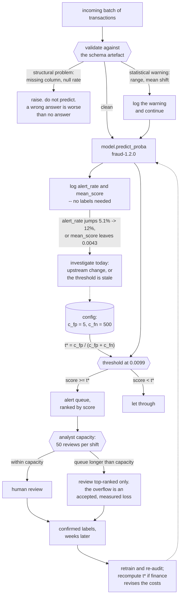

import DataCampExercise from "../../../../components/DataCampExercise.astro";
import Figure from "../../../../components/Figure.astro";
import Quiz from "../../../../components/Quiz.astro";

## The decision

A payments team screens transactions. Flagged ones go to a human reviewer; unflagged ones settle.

| | |
| --- | --- |
| **Who acts** | Six analysts, each reviewing about 50 alerts a shift |
| **Cost of a review** | **EUR 5** |
| **Cost of a missed fraud** | **EUR 500** on average, or the transaction amount when known |
| **Base rate** | 0.43% of transactions |

The deliverable is not a model. It is a **threshold, an alert volume, and an expected loss per
transaction** — three numbers the business can act on, plus the evidence that the model reads what a
fraud analyst would expect it to read.

This capstone composes five earlier pages: the
[metric choice](/machine-learning/phase-10---applied-ml-problems/imbalanced-classification-and-fraud-detection/),
the [cost-derived threshold](/machine-learning/phase-10---applied-ml-problems/cost-sensitive-learning-and-decision-thresholds/),
the [importance audit](/machine-learning/phase-09---interpretability--responsible-ml/feature-importance-and-its-traps/),
the [segment check](/machine-learning/phase-09---interpretability--responsible-ml/fairness-metrics-and-bias-auditing/)
and the [schema contract](/machine-learning/phase-11---ml-engineering/data-validation-and-schema-contracts/).

## Step 1 — split three ways, and pick the metric first

```python title="split.py" showLineNumbers{1}
# 50% to fit, 20% to choose operating points, 30% to report once
X_fit, X_rest, y_fit, y_rest, a_fit, a_rest = train_test_split(
    X, y, amount, test_size=0.5, random_state=0, stratify=y)
X_val, X_te, y_val, y_te, a_val, a_te = train_test_split(
    X_rest, y_rest, a_rest, test_size=0.6, random_state=0, stratify=y_rest)
# fit 10,000 / 44 frauds   val 4,000 / 17   test 6,000 / 26
```

| Metric | Value | Why it is here |
| --- | --- | --- |
| accuracy | *not reported* | 0.9958 here, and 0.9957 for a model that does nothing |
| **average precision** | **0.4387** | chance is the base rate, **0.0043** — a **101×** lift |
| Brier score | 0.003160 | the threshold rule needs calibrated probabilities |
| ROC-AUC | *secondary* | flattering under imbalance |

Average precision is the headline because the review workload scales with alerts, and Brier is on the
list because the next step consumes probabilities rather than a ranking.

## Step 2 — turn the costs into a policy

<Figure
  src="/images/ml/phase-12-capstones/capstone-1-fraud-screening-end-to-end/policies"
  alt="Stacked bars of cost over 6,000 transactions for four policies. Do nothing: 13,000 EUR, 0 alerts, 26 missed. Default 0.50: 12,005 EUR, 3 alerts, 24 missed. Top 50 alerts: 4,665 EUR, 50 alerts, 9 missed. Cost-optimal t* = 0.0099: 3,410 EUR, 304 alerts, 4 missed."
  title="Cheapest policy: cost-optimal t* = 0.0099 at EUR 3,410 — EUR 0.5683 per transaction"
  caption="The default threshold is barely better than doing nothing: 12,005 against 13,000, because it flags three transactions in six thousand. The cost-optimal threshold flags 304 and misses four. The capacity-limited policy — the top 50 scores, which is what one analyst can actually review — costs 4,665, and that gap of 1,255 is the price of the staffing constraint."
/>

| Policy | Alerts | False alerts | Missed | Precision | Recall | Total cost |
| --- | --- | --- | --- | --- | --- | --- |
| do nothing | 0 | 0 | 26 | — | 0.0000 | EUR 13,000 |
| default 0.50 | 3 | 1 | 24 | 0.6667 | 0.0769 | EUR 12,005 |
| top 50 by score (capacity) | 50 | 33 | 9 | 0.3400 | 0.6538 | EUR 4,665 |
| **cost-optimal $t^* = 0.0099$** | **304** | 282 | **4** | 0.0724 | **0.8462** | **EUR 3,410** |
| per-row $t^*_i$, loss = the amount | 80 | 64 | 10 | 0.2000 | 0.6154 | EUR 853 † |

† The last row is priced against the transaction *amount* rather than a flat EUR 500, so its total is
not comparable with the rows above it. Within that costing it is the cheapest policy available.

Three numbers to carry into the meeting:

- **Expected loss per transaction: EUR 0.5683** at $t^*$, against **EUR 2.1667** doing nothing. That is
  the business case, and it is a per-unit number so it scales.
- **304 alerts per 6,000 transactions** — 5.1% of volume. At six analysts × 50 alerts that is a hard
  constraint, and the model does not get to ignore it.
- **The capacity policy costs EUR 1,255 more than the unconstrained optimum.** That difference is the
  value of hiring the seventh analyst, expressed in the same units as their salary.

:::caution[Precision 0.0724 is not a bug]
At the cost-optimal threshold, **93%** of alerts are false. That is the correct policy when a missed
fraud costs 100 reviews, and it is also the number most likely to get the project cancelled by someone
reading precision alone. Present it as "we spend EUR 1,410 on reviews to avoid EUR 11,000 of losses",
never as a precision figure.
:::

### See it move

The four policies in that table are four points on one curve. The sketch is that curve, measured on the
same 6,000 test transactions at 43 thresholds — drag the threshold and read the alert count, the misses
and the bill. The analyst-capacity line at 50 alerts is drawn where operations actually sits.

```p5 title="The whole cost curve, and the four policies on it" desc="Total cost in euros against decision threshold on a log axis, measured on the 6,000 held-out transactions. Markers show the default 0.50, the cost-optimal t* of 0.0099, the empirical minimum on this sample, and the 50-alert capacity limit. Drag the vertical line to read alerts, misses and cost at any threshold." height="440"
// Measured on the held-out 6,000: threshold, alerts, false alerts, missed, total EUR.
const CURVE = [
  [0.00010, 2392, 2366, 0, 11830], [0.00013, 2227, 2201, 0, 11005],
  [0.00016, 2052, 2026, 0, 10130], [0.00020, 1884, 1858, 0, 9290],
  [0.00026, 1759, 1733, 0, 8665], [0.00033, 1625, 1599, 0, 7995],
  [0.00041, 1472, 1446, 0, 7230], [0.00052, 1342, 1316, 0, 6580],
  [0.00066, 1230, 1204, 0, 6020], [0.00084, 1103, 1077, 0, 5385],
  [0.00106, 991, 965, 0, 4825], [0.00134, 900, 874, 0, 4370],
  [0.00170, 809, 783, 0, 3915], [0.00215, 722, 696, 0, 3480],
  [0.00273, 630, 604, 0, 3020], [0.00346, 561, 535, 0, 2675],
  [0.00438, 499, 474, 1, 2870], [0.00554, 437, 413, 2, 3065],
  [0.00702, 380, 358, 4, 3790], [0.00889, 329, 307, 4, 3535],
  [0.00990, 304, 282, 4, 3410], [0.01125, 276, 254, 4, 3270],
  [0.01425, 234, 213, 5, 3565], [0.01805, 198, 177, 5, 3385],
  [0.02286, 167, 147, 6, 3735], [0.02894, 146, 126, 6, 3630],
  [0.03665, 132, 112, 6, 3560], [0.04642, 106, 87, 7, 3935],
  [0.05878, 86, 67, 7, 3835], [0.07444, 69, 51, 8, 4255],
  [0.09427, 54, 37, 9, 4685], [0.11938, 43, 27, 10, 5135],
  [0.15118, 36, 22, 12, 6110], [0.19145, 23, 12, 15, 7560],
  [0.24245, 18, 8, 16, 8040], [0.30703, 12, 4, 18, 9020],
  [0.38882, 8, 2, 20, 10010], [0.49239, 3, 1, 24, 12005],
  [0.62355, 1, 0, 25, 12500], [1.00000, 0, 0, 26, 13000],
];
const T_STAR = 0.00990;
const CAPACITY = 50;
let cursor = 0.0099;
let dragging = false;

function setup() {
  createCanvas(620, 440);
  textFont("monospace");
}
function lx(t) {
  const lo = Math.log(0.0001), hi = Math.log(1);
  return 66 + ((Math.log(t) - lo) / (hi - lo)) * (width - 200);
}
function ly(c) { return 300 - (c / 13500) * 230; }
function at(t) {
  let i = 0;
  while (i < CURVE.length - 2 && CURVE[i + 1][0] < t) i++;
  const [t0, a0, f0, m0, c0] = CURVE[i];
  const [t1, a1, f1, m1, c1] = CURVE[i + 1];
  const u = (Math.log(t) - Math.log(t0)) / (Math.log(t1) - Math.log(t0));
  return {
    alerts: Math.round(a0 + u * (a1 - a0)),
    fp: Math.round(f0 + u * (f1 - f0)),
    missed: Math.round(m0 + u * (m1 - m0)),
    cost: c0 + u * (c1 - c0),
  };
}
function draw() {
  background(13, 17, 23);

  stroke(34, 40, 48);
  strokeWeight(1);
  for (let c = 0; c <= 13000; c += 2500) {
    line(66, ly(c), width - 134, ly(c));
    noStroke();
    fill(100);
    textSize(9);
    textAlign(RIGHT, CENTER);
    text(c === 0 ? "0" : (c / 1000).toFixed(1) + "k", 60, ly(c));
    stroke(34, 40, 48);
  }
  for (const t of [0.0001, 0.001, 0.01, 0.1, 1]) {
    line(lx(t), 70, lx(t), 300);
    noStroke();
    fill(100);
    textSize(9);
    textAlign(CENTER, TOP);
    text(t + "", lx(t), 306);
    stroke(34, 40, 48);
  }
  noStroke();
  fill(130);
  textSize(10);
  textAlign(CENTER, TOP);
  text("decision threshold (log scale)", (66 + width - 134) / 2, 322);
  fill(130);
  textAlign(LEFT, TOP);
  text("total cost, EUR", 66, 54);

  // the curve
  stroke(255, 176, 67);
  strokeWeight(2.2);
  noFill();
  beginShape();
  for (const [t, , , , c] of CURVE) vertex(lx(t), ly(c));
  endShape();

  // named policies
  const marks = [
    [T_STAR, "t* = 0.0099", [120, 200, 120]],
    [0.49239, "default 0.50", [232, 122, 122]],
    [0.00346, "empirical min", [150, 120, 200]],
  ];
  for (const [t, label, col] of marks) {
    const p = at(t);
    noStroke();
    fill(col[0], col[1], col[2]);
    ellipse(lx(t), ly(p.cost), 11, 11);
    textSize(9);
    textAlign(CENTER, BOTTOM);
    text(label, lx(t), ly(p.cost) - 9);
  }

  // capacity band: thresholds whose alert count exceeds what 1 analyst can review
  let capT = 1;
  for (const [t, a] of CURVE) if (a > CAPACITY) capT = t;
  stroke(110, 140, 180, 120);
  strokeWeight(1);
  drawingContext.setLineDash([4, 4]);
  line(lx(capT), 70, lx(capT), 300);
  drawingContext.setLineDash([]);
  noStroke();
  fill(110, 140, 180);
  textSize(9);
  textAlign(LEFT, TOP);
  text("50 alerts", lx(capT) + 4, 74);

  // cursor
  const p = at(cursor);
  stroke(235);
  strokeWeight(1.6);
  line(lx(cursor), 70, lx(cursor), 300);
  noStroke();
  fill(235);
  ellipse(lx(cursor), ly(p.cost), 9, 9);

  // readout
  const px0 = width - 124;
  const rows = [
    ["threshold", cursor.toFixed(5), [215, 215, 215]],
    ["alerts", p.alerts + "", p.alerts > CAPACITY ? [255, 176, 67] : [120, 200, 120]],
    ["false alerts", p.fp + "", [180, 180, 180]],
    ["missed frauds", p.missed + " of 26", p.missed > 8 ? [232, 122, 122] : [180, 180, 180]],
    ["review cost", "EUR " + (p.fp * 5).toFixed(0), [180, 180, 180]],
    ["fraud loss", "EUR " + (p.missed * 500).toFixed(0), [180, 180, 180]],
    ["total", "EUR " + p.cost.toFixed(0), [255, 176, 67]],
    ["per transaction", "EUR " + (p.cost / 6000).toFixed(4), [180, 180, 180]],
  ];
  for (let i = 0; i < rows.length; i++) {
    const [label, value, col] = rows[i];
    const y = 74 + i * 28;
    fill(130);
    textSize(9);
    textAlign(LEFT, TOP);
    text(label, px0, y);
    fill(col[0], col[1], col[2]);
    textSize(11);
    text(value, px0, y + 12);
  }

  fill(105);
  textSize(10);
  textAlign(LEFT, TOP);
  text("drag the white line. costs: EUR 5 per review, EUR 500 per missed fraud.", 66, 348);
  text("the curve is flat-bottomed between about 0.003 and 0.04 -- anywhere in", 66, 366);
  text("there costs under EUR 4,000, while 0.50 costs EUR 12,005.", 66, 380);
  text("above the dashed line one analyst cannot review the queue, whatever", 66, 402);
  text("the arithmetic says is optimal.", 66, 416);
}
function mousePressed() { if (mouseY > 60 && mouseY < 310 && mouseX < width - 130) dragging = true; }
function mouseDragged() {
  if (dragging) {
    const u = constrain((mouseX - 66) / (width - 200), 0, 1);
    cursor = Math.exp(Math.log(0.0001) + u * (Math.log(1) - Math.log(0.0001)));
  }
}
function mouseReleased() { dragging = false; }
```

One honest wrinkle the curve exposes: on this particular test set the cheapest threshold measured is
**0.00346 at EUR 2,675**, not $t^*$ at EUR 3,410. That is not evidence that the formula is wrong — with
26 frauds, the realised cost of any threshold has a standard error of hundreds of euros, and the
empirical argmin is itself a selected number with exactly the
[winner's curse](/machine-learning/phase-11---ml-engineering/experiment-tracking-and-reproducibility/)
built in. $t^*$ minimises *expected* cost from the cost ratio alone and needs no tuning; the empirical
minimum minimises this sample and would move on the next one. Ship the formula, and note the flat
bottom: anything from roughly 0.003 to 0.04 costs under EUR 4,000, so the decision is robust even
though the argmin is not.

## Step 3 — audit what the model reads

Permutation importance on the test set, scored by average precision, 20 repeats:

| Feature | Δ average precision |
| --- | --- |
| `geo_mismatch` | **+0.3887 ± 0.0138** |
| `velocity` | +0.3374 ± 0.0242 |
| `amount_z` | +0.2557 ± 0.0423 |
| `device_age` | +0.2500 ± 0.0346 |
| `hour_z` | +0.1499 ± 0.0542 |
| `noise` | **−0.0011 ± 0.0052** |

Two checks pass here. The five features a fraud analyst would name are the five that matter, in a
plausible order. And the deliberately uninformative column scores **−0.0011 ± 0.0052** — indistinguishable
from zero, which is what a column of noise should score. Had `noise` ranked third, the correct response
would be to stop and find out why, exactly as on
[the shortcut page](/machine-learning/phase-09---interpretability--responsible-ml/why-interpretability-matters/).

## Step 4 — check the segments before shipping

The model never sees the channel a transaction arrived through. Slice the results by it anyway:

| Channel | n | Frauds | Alerts | Precision | Recall |
| --- | --- | --- | --- | --- | --- |
| web | 3,268 | 13 | 172 | 0.0698 | **0.9231** |
| app | 2,128 | 9 | 103 | 0.0680 | 0.7778 |
| phone | 604 | 4 | 29 | 0.1034 | 0.7500 |

Recall ranges from 0.7500 to 0.9231 across channels. Before treating that as a finding, note the
denominators: **4 frauds** in the phone segment. One fraud either way moves that recall by 0.25, so the
honest statement is "no measurable difference between channels, and the phone segment is too small to
tell" — the
[same discipline as any fairness slice](/machine-learning/phase-09---interpretability--responsible-ml/fairness-metrics-and-bias-auditing/).
What you *can* commit to is monitoring it monthly, when the counts accumulate.

## Step 5 — the engineering that makes it a system

```python title="screen.py" showLineNumbers{1}
CONFIG = {"c_fp": 5.0, "c_fn": 500.0, "model_version": "fraud-1.2.0"}


def screen(batch, artefact, config):
    """One batch: validate, score, threshold, and log everything an audit needs."""
    problems = validate(batch, artefact["schema"])
    hard = [p for p in problems if "column" in p or "null rate" in p]
    if hard:
        raise ValueError(f"unusable batch: {hard}")          # do not predict

    proba = artefact["model"].predict_proba(batch)[:, 1]
    threshold = config["c_fp"] / (config["c_fp"] + config["c_fn"])
    flagged = proba >= threshold

    return {
        "model_version": config["model_version"],
        "schema_id": artefact["schema_id"],
        "threshold": threshold,
        "rows": len(batch),
        "alerts": int(flagged.sum()),
        "alert_rate": round(float(flagged.mean()), 4),
        "mean_score": round(float(proba.mean()), 6),
        "warnings": problems,                                # statistics, not structure
        "scores": proba,                                     # logged per row
    }
```

Four things this earns:

- **Hard-fail on structure, warn on statistics** — the policy from
  [the validation page](/machine-learning/phase-11---ml-engineering/data-validation-and-schema-contracts/).
- **`alert_rate` is the operational canary.** It is available immediately, needs no labels, and a jump
  from 5.1% to 12% means something changed today, whatever the labels eventually say.
- **`mean_score` catches recalibration.** The model's mean predicted probability should track the base
  rate (0.0043 here). A drift in it invalidates the threshold, because $t^*$ assumes calibration.
- **The threshold is derived from config, never hard-coded.** When finance revises the fraud cost, one
  number changes and nothing retrains.

The test suite, from [Testing ML Code](/machine-learning/phase-11---ml-engineering/testing-ml-code/):
a metric floor (average precision ≥ 0.30 on the fixed split), memorisation of 24 rows, a directional
expectation on `velocity`, a structural assertion that the scaler is inside the `Pipeline`, and a schema
round-trip.

The system those pieces add up to, with the two feedback paths that make it survive contact with
production:



Note what is *not* in the model: the capacity constraint, the cost ratio and the review workflow all
live in configuration and operations. That separation is what lets finance change `c_fn` on a Tuesday
without a retraining run, and it is the difference between a model and a system.

## What this project does not solve

- **The 26 test frauds.** Every number here has a wide confidence interval; the
  [bootstrap on this data](/machine-learning/phase-10---applied-ml-problems/imbalanced-classification-and-fraud-detection/)
  spanned 0.37 of average precision. Treat model comparisons as inconclusive until far more positives
  accumulate.
- **Label delay.** Chargebacks arrive weeks later, so today's recall is unknowable today. The alert rate
  and score distribution are the only same-day signals.
- **Adversarial drift.** Fraud patterns react to the screening policy. Nothing on this page models an
  adversary who learns your threshold.
- **The review process.** A 93%-false-alert queue has a human cost — fatigue, inconsistency — that the
  EUR 5 does not capture.

## Recap

- 6,000 test transactions, **26** frauds (0.43%); average precision **0.4387** against a **0.0043**
  chance line.
- The default threshold cost **EUR 12,005** against **EUR 13,000** for doing nothing.
- $t^* = C_{FP}/(C_{FP}+C_{FN}) = 0.0099$ cost **EUR 3,410**: 304 alerts, 4 missed, precision 0.0724,
  recall 0.8462.
- Expected loss per transaction: **EUR 0.5683** against **EUR 2.1667**.
- A 50-alert capacity limit cost **EUR 4,665** — **EUR 1,255** more than the unconstrained optimum.
- The audit passed: the five plausible features led, and `noise` scored **−0.0011 ± 0.0052**.
- Channel recall ranged 0.7500–0.9231 on 4–13 frauds per segment: no measurable difference.

<Quiz
  questions={[
    {
      q: "Your fraud screener has precision 0.0724 at the cost-optimal threshold. How do you present it?",
      options: [
        "As a precision figure, with an apology",
        "As money: EUR 1,410 of reviews avoids EUR 11,000 of losses, and expected loss per transaction falls from 2.1667 to 0.5683",
        "Report recall instead and omit precision",
        "Raise the threshold until precision looks acceptable",
      ],
      answer: 1,
      explain: "93% false alerts is the correct policy when a missed fraud costs 100 reviews, and it is also the number most likely to get the project cancelled. Per-transaction expected loss is the unit the business already thinks in.",
    },
    {
      q: "Analysts can review 50 alerts a shift; the cost-optimal policy produces 304. What is the useful thing to compute?",
      options: [
        "A higher threshold that produces exactly 50",
        "Both: the top-50 policy costs EUR 4,665 against EUR 3,410 unconstrained, so the EUR 1,255 gap is the value of additional review capacity",
        "Nothing — capacity is fixed",
        "Retrain with class_weight to reduce alerts",
      ],
      answer: 1,
      explain: "You will ship the capacity-limited policy either way. Quantifying the constraint in euros turns 'the model is noisy' into 'a seventh analyst pays for themselves', which is a decision someone can make.",
    },
    {
      q: "The 'noise' feature scores -0.0011 ± 0.0052 in the permutation audit. What does that establish?",
      options: [
        "That the feature should be removed to improve the model",
        "That the audit is working: a column with no information scores indistinguishably from zero, which is what makes the five leading features credible",
        "That permutation importance is unreliable at this sample size",
        "That the model is underfitted",
      ],
      answer: 1,
      explain: "The point of including a known-useless column is to calibrate your reading of the others. Had it ranked third, the deployment would stop until someone explained why.",
    },
    {
      q: "Recall by channel is 0.9231 (web), 0.7778 (app), 0.7500 (phone). Is the model worse for phone customers?",
      options: [
        "Yes, and it should be retrained per channel",
        "Unknown: the phone segment contains 4 frauds, so one either way moves recall by 0.25 — report 'no measurable difference' and monitor monthly",
        "Yes, and the threshold should be lowered for phone",
        "No, the differences are impossible",
      ],
      answer: 1,
      explain: "Segment metrics need denominators printed next to them. With 4, 9 and 13 positives these three numbers are compatible with identical underlying performance, and acting on them would be acting on noise.",
    },
    {
      q: "Which same-day signal tells you the screener has broken, before any chargeback arrives?",
      options: [
        "Recall on today's transactions",
        "The alert rate and the mean predicted score — both available immediately and both invalidated by the changes that matter",
        "The confusion matrix",
        "Average precision on the last 24 hours",
      ],
      answer: 1,
      explain: "Labels arrive weeks late, so every label-based metric is stale by construction. A jump in alert rate from 5.1% to 12%, or a mean score that stops tracking the base rate, is actionable today — and a drifting mean score also invalidates the threshold, which assumes calibration.",
    },
  ]}
/>

## 🧪 Try It Yourself

### Exercise 1 – Build the screening dataset and split it three ways

<DataCampExercise
  lang="python"
  hint={`Amounts are lognormal and correlated with amount_z. Split 50 / 20 / 30 so that operating points are chosen without touching the test set.`}
  code={`# Task: Exercise 1 - Build the screening dataset and split it three ways
import numpy as np
import pandas as pd
from sklearn.model_selection import train_test_split

rng = np.random.default_rng(0)
n = 20000
names = ["amount_z", "hour_z", "device_age", "velocity", "geo_mismatch", "noise"]
w = np.array([1.4, 0.9, -1.1, 1.6, 2.0, 0.0])
X = pd.DataFrame(rng.normal(0, 1, (n, len(w))), columns=names)
score = X.to_numpy() @ w
sigmoid = lambda z: 1 / (1 + np.exp(-z))
lo, hi = -30.0, 10.0
for _ in range(200):
    mid = (lo + hi) / 2
    if sigmoid(score + mid).mean() > 0.005:
        hi = mid
    else:
        lo = mid
y = (rng.random(n) < sigmoid(score + (lo + hi) / 2)).astype(int)

amt_rng = np.random.default_rng(5)
amount = np.exp(3.2 + 0.85 * X["amount_z"].to_numpy()
                + amt_rng.normal(0, 0.45, n))

X_fit, X_rest, y_fit, y_rest, a_fit, a_rest = train_test_split(
    X, y, amount, test_size=0.5, random_state=0, stratify=y)
X_val, X_te, y_val, y_te, a_val, a_te = train_test_split(
    X_rest, y_rest, a_rest, test_size=0.6, random_state=0, stratify=___)
# replace ___ with y_rest

print(f"fit {len(y_fit):,}/{y_fit.sum()}   val {len(y_val):,}/{y_val.sum()}   "
      f"test {len(y_te):,}/{y_te.sum()}")
print(f"test base rate {y_te.mean():.4f}   mean amount EUR {a_te.mean():.2f}")

# -- Expected Output -------------------------------------------
# fit 10,000/44   val 4,000/17   test 6,000/26
# test base rate 0.0043   mean amount EUR 39.97
# --------------------------------------------------------------`}
  solution={`# identical, with y_rest in place of ___
print(f"fit {len(y_fit):,}/{y_fit.sum()}   val {len(y_val):,}/{y_val.sum()}   "
      f"test {len(y_te):,}/{y_te.sum()}")
print(f"test base rate {y_te.mean():.4f}   mean amount EUR {a_te.mean():.2f}")`}
  sct={`test_output_contains("test 6,000/26")
success_msg("26 frauds to be judged on. Every number that follows carries that denominator.")`}
  height={420}
/>

### Exercise 2 – Report the right metric

<DataCampExercise
  lang="python"
  hint={`average_precision_score against the base rate as chance, and brier_score_loss because the next step consumes probabilities.`}
  code={`# Task: Exercise 2 - Report the right metric
from sklearn.linear_model import LogisticRegression
from sklearn.metrics import (accuracy_score, average_precision_score,
                             brier_score_loss, roc_auc_score)
from sklearn.pipeline import make_pipeline
from sklearn.preprocessing import StandardScaler

model = make_pipeline(StandardScaler(),
                      LogisticRegression(max_iter=3000)).fit(X_fit, y_fit)
proba = model.predict_proba(X_te)[:, ___]                # replace ___ with 1

print(f"accuracy (do not report)  {accuracy_score(y_te, model.predict(X_te)):.4f}")
print(f"average precision         {average_precision_score(y_te, proba):.4f}")
print(f"chance (the base rate)    {y_te.mean():.4f}")
print(f"lift over chance          {average_precision_score(y_te, proba) / y_te.mean():.0f}x")
print(f"ROC-AUC (secondary)       {roc_auc_score(y_te, proba):.4f}")
print(f"Brier score               {brier_score_loss(y_te, proba):.6f}")

# -- Expected Output -------------------------------------------
# accuracy (do not report)  0.9958
# average precision         0.4387
# chance (the base rate)    0.0043
# lift over chance          101x
# ROC-AUC (secondary)       0.9839
# Brier score               0.003160
# --------------------------------------------------------------`}
  solution={`from sklearn.linear_model import LogisticRegression
from sklearn.metrics import (accuracy_score, average_precision_score,
                             brier_score_loss, roc_auc_score)
from sklearn.pipeline import make_pipeline
from sklearn.preprocessing import StandardScaler

model = make_pipeline(StandardScaler(),
                      LogisticRegression(max_iter=3000)).fit(X_fit, y_fit)
proba = model.predict_proba(X_te)[:, 1]
print(f"accuracy (do not report)  {accuracy_score(y_te, model.predict(X_te)):.4f}")
print(f"average precision         {average_precision_score(y_te, proba):.4f}")
print(f"chance (the base rate)    {y_te.mean():.4f}")
print(f"lift over chance          {average_precision_score(y_te, proba) / y_te.mean():.0f}x")
print(f"ROC-AUC (secondary)       {roc_auc_score(y_te, proba):.4f}")
print(f"Brier score               {brier_score_loss(y_te, proba):.6f}")`}
  sct={`test_output_contains("average precision         0.4387")
success_msg("0.4387 against a 0.0043 chance line - a 101x lift, and an accuracy of 0.9957 that means nothing at all.")`}
  height={340}
/>

### Exercise 3 – Price four policies

<DataCampExercise
  lang="python"
  hint={`Build each policy as a 0/1 array over the test rows, then price it. The capacity policy is argsort on the scores.`}
  code={`# Task: Exercise 3 - Price four policies
C_FP, C_FN = 5.0, 500.0
t_star = C_FP / (C_FP + C_FN)

def cost(pred):
    fp = int(((pred == 1) & (y_te == 0)).sum())
    missed = int(((pred == 0) & (y_te == 1)).sum())
    return fp * C_FP + missed * C_FN, fp, missed

top50 = np.zeros(len(proba), dtype=int)
top50[np.argsort(-proba)[:50]] = 1

policies = {
    "do nothing": np.zeros(len(proba), dtype=int),
    "default 0.50": (proba >= 0.5).astype(int),
    "top 50 by score": top50,
    f"cost-optimal {t_star:.4f}": (proba >= ___).astype(int),   # replace ___ with t_star
}
for name, pred in policies.items():
    total, fp, missed = cost(pred)
    print(f"{name:22s} alerts {int(pred.sum()):4d}  fp {fp:4d}  missed {missed:2d}  "
          f"cost EUR {total:7,.0f}  per txn EUR {total / len(y_te):.4f}")

# -- Expected Output -------------------------------------------
# do nothing             alerts    0  fp    0  missed 26  cost EUR  13,000  per txn EUR 2.1667
# default 0.50           alerts    3  fp    1  missed 24  cost EUR  12,005  per txn EUR 2.0008
# top 50 by score        alerts   50  fp   33  missed  9  cost EUR   4,665  per txn EUR 0.7775
# cost-optimal 0.0099    alerts  304  fp  282  missed  4  cost EUR   3,410  per txn EUR 0.5683
# --------------------------------------------------------------`}
  solution={`C_FP, C_FN = 5.0, 500.0
t_star = C_FP / (C_FP + C_FN)

def cost(pred):
    fp = int(((pred == 1) & (y_te == 0)).sum())
    missed = int(((pred == 0) & (y_te == 1)).sum())
    return fp * C_FP + missed * C_FN, fp, missed

top50 = np.zeros(len(proba), dtype=int)
top50[np.argsort(-proba)[:50]] = 1
policies = {
    "do nothing": np.zeros(len(proba), dtype=int),
    "default 0.50": (proba >= 0.5).astype(int),
    "top 50 by score": top50,
    f"cost-optimal {t_star:.4f}": (proba >= t_star).astype(int),
}
for name, pred in policies.items():
    total, fp, missed = cost(pred)
    print(f"{name:22s} alerts {int(pred.sum()):4d}  fp {fp:4d}  missed {missed:2d}  "
          f"cost EUR {total:7,.0f}  per txn EUR {total / len(y_te):.4f}")`}
  sct={`test_output_contains("cost EUR   3,410  per txn EUR 0.5683")
success_msg("EUR 2.1667 to EUR 0.5683 per transaction, and the capacity limit costs EUR 1,255 of that saving.")`}
  height={400}
/>

### Exercise 4 – Audit what the model reads

<DataCampExercise
  lang="python"
  hint={`Score the permutation importance with average_precision, not accuracy — accuracy barely moves at this base rate.`}
  code={`# Task: Exercise 4 - Audit what the model reads
from sklearn.inspection import permutation_importance

pi = permutation_importance(model, X_te, y_te, n_repeats=20, random_state=0,
                            scoring="___")            # replace ___ with average_precision

for name, mean, sd in sorted(zip(X.columns, pi.importances_mean,
                                 pi.importances_std), key=lambda r: -r[1]):
    flag = "  <- noise column" if name == "noise" else ""
    print(f"{name:14s} {mean:+.4f} +- {sd:.4f}{flag}")

# -- Expected Output -------------------------------------------
# geo_mismatch   +0.3887 +- 0.0138
# velocity       +0.3374 +- 0.0242
# amount_z       +0.2557 +- 0.0423
# device_age     +0.2500 +- 0.0346
# hour_z         +0.1499 +- 0.0542
# noise          -0.0011 +- 0.0052  <- noise column
# --------------------------------------------------------------`}
  solution={`from sklearn.inspection import permutation_importance

pi = permutation_importance(model, X_te, y_te, n_repeats=20, random_state=0,
                            scoring="average_precision")
for name, mean, sd in sorted(zip(X.columns, pi.importances_mean,
                                 pi.importances_std), key=lambda r: -r[1]):
    flag = "  <- noise column" if name == "noise" else ""
    print(f"{name:14s} {mean:+.4f} +- {sd:.4f}{flag}")`}
  sct={`test_output_contains("noise          -0.0011")
success_msg("The five plausible features lead and the noise column scores indistinguishably from zero. That is what makes the ranking credible.")`}
  height={320}
/>

### Exercise 5 – Slice by a segment the model never saw

<DataCampExercise
  lang="python"
  hint={`Print the denominators next to the rates. With four frauds in a segment, one either way moves recall by 0.25.`}
  code={`# Task: Exercise 5 - Slice by a segment the model never saw
from sklearn.metrics import precision_score, recall_score

ch_rng = np.random.default_rng(31)
channel = ch_rng.choice(["web", "app", "phone"], size=n, p=[0.55, 0.35, 0.10])
ch_te = channel[X_te.index]

pred = (proba >= t_star).astype(int)
for ch in ("web", "app", "phone"):
    m = ch_te == ch
    print(f"{ch:6s} n {m.sum():4d}  frauds {int(y_te[m].sum()):3d}  "
          f"alerts {int(pred[m].sum()):4d}  "
          f"precision {precision_score(y_te[m], pred[m], zero_division=0):.4f}  "
          f"recall {recall_score(y_te[m], pred[m]):.4f}")
print("one fraud either way moves the phone recall by "
      f"{1 / max(int(y_te[ch_te == 'phone'].sum()), 1):.2f}")

# -- Expected Output -------------------------------------------
# web    n 3268  frauds  13  alerts  172  precision 0.0698  recall 0.9231
# app    n 2128  frauds   9  alerts  103  precision 0.0680  recall 0.7778
# phone  n  604  frauds   4  alerts   29  precision 0.1034  recall 0.7500
# one fraud either way moves the phone recall by 0.25
# --------------------------------------------------------------`}
  solution={`from sklearn.metrics import precision_score, recall_score

ch_rng = np.random.default_rng(31)
channel = ch_rng.choice(["web", "app", "phone"], size=n, p=[0.55, 0.35, 0.10])
ch_te = channel[X_te.index]
pred = (proba >= t_star).astype(int)
for ch in ("web", "app", "phone"):
    m = ch_te == ch
    print(f"{ch:6s} n {m.sum():4d}  frauds {int(y_te[m].sum()):3d}  "
          f"alerts {int(pred[m].sum()):4d}  "
          f"precision {precision_score(y_te[m], pred[m], zero_division=0):.4f}  "
          f"recall {recall_score(y_te[m], pred[m]):.4f}")
print("one fraud either way moves the phone recall by "
      f"{1 / max(int(y_te[ch_te == 'phone'].sum()), 1):.2f}")`}
  sct={`test_output_contains("phone  n  604  frauds   4")
success_msg("Recall 0.75 against 0.92 on four frauds against thirteen. Report 'no measurable difference' and monitor monthly.")`}
  height={340}
/>

## Next

[Capstone 2 - Churn with Point-in-Time Features](/machine-learning/phase-12---capstone-projects/capstone-2---churn-with-point-in-time-features/)
— the same decision structure on an event log, where the hard part is not the model but making sure the
features could have existed when the prediction was made.
