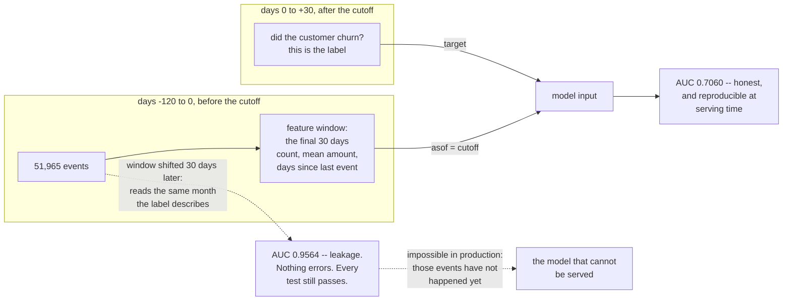

## The decision

A subscription business wants to spend a retention budget well. Every month, for each customer, it can
send a **retention offer** or do nothing.

| | |
| --- | --- |
| **Cost of an offer** | EUR 4 to EUR 32, depending on what marketing chooses |
| **Probability the offer retains a would-be churner** | 0.30 |
| **Value of a retained customer** | EUR 120 |
| **Churn rate** | 41.75% of customers in the following month |

Contacting a customer is worth it when the expected saving exceeds the cost:

$$
p_{\text{churn}} \cdot 0.30 \cdot 120 \;>\; \text{offer}
\;\Longleftrightarrow\;
p_{\text{churn}} \;>\; \frac{\text{offer}}{0.30 \times 120}
$$

which is the [same threshold derivation](/machine-learning/phase-10---applied-ml-problems/cost-sensitive-learning-and-decision-thresholds/)
in a different costume. At an EUR 8 offer, contact anyone above **0.2222**.

This capstone composes the [point-in-time features](/machine-learning/phase-11---ml-engineering/feature-stores-and-training-serving-skew/),
that threshold rule, and the honest-evaluation discipline from
[Phase 11](/machine-learning/phase-11---ml-engineering/experiment-tracking-and-reproducibility/).

## Step 1 — the features could have existed

4,000 customers, 51,965 events in the 120 days before the cutoff, three features aggregated over the
final 30 days: event count, mean amount, and days since the last event. Every one computed by a function
that takes `asof` and never looks past it.

| Model | Test AUC | Test AP | Brier |
| --- | --- | --- | --- |
| **point-in-time features** | **0.7060** | 0.6010 | 0.2131 |
| the same window, ending 30 days *later* | **0.9564** | — | — |

The second row is the number this project exists to avoid. Moving the window to cover the month the
label describes gives **+0.2504** of AUC, and every part of the pipeline still runs. The defence is that
`window_features(events, 30, asof, ids)` is called with `asof = cutoff` at training time and
`asof = today` at serving time — one function, one argument, and a
[parity test](/machine-learning/phase-11---ml-engineering/feature-stores-and-training-serving-skew/)
that proves the serving path agrees to floating-point tolerance.

Drawn on a timeline, the legal and illegal windows are one shift apart:



The dotted path is the only difference between the two rows of that table: one argument to one function.
This is why `asof` is a parameter rather than an implicit "now" — a function that reads the clock cannot
be tested for point-in-time correctness, because there is no way to ask it what it *would* have known.

An AUC of 0.7060 is not impressive, and that is the point of the next step: **the question is not whether
0.7060 is good, it is whether 0.7060 is worth anything.**

## Step 2 — price the campaign

<Figure
  src="/images/ml/phase-12-capstones/capstone-2-churn-with-point-in-time-features/value-of-targeting"
  alt="Left: grouped bars of campaign value for five offer costs, comparing contact-everybody, random targeting at the same volume, and model targeting. At EUR 4 all three are near 13,000; at EUR 16 contact-everybody is minus 1,164 while the model earns 2,676; at EUR 24 and EUR 32 the model contacts nobody and earns zero while contact-everybody loses 10,764 and 20,364. Right: value of the model over random targeting, rising from 576 at EUR 4 to 3,060 at EUR 16 and falling to zero at EUR 24."
  title="Same model (AUC 0.7060), five sets of economics"
  caption="At an EUR 4 offer the campaign is profitable for almost everyone, so targeting adds only EUR 576 — the model is nearly worthless because the decision is easy. At EUR 16 an untargeted campaign LOSES EUR 1,164 while the targeted one earns EUR 2,676, and the model is worth EUR 3,060. Above EUR 24 the threshold exceeds every predicted probability, so the correct action is to run no campaign at all."
/>

| Offer | Threshold $t^*$ | Contacted | Contact everybody | Random, same volume | **Model** | Model − random |
| --- | --- | --- | --- | --- | --- | --- |
| EUR 4 | 0.1111 | 1,158 | EUR 13,236 | EUR 12,720 | **EUR 13,296** | +576 |
| EUR 8 | 0.2222 | 1,037 | EUR 8,436 | EUR 7,112 | **EUR 8,876** | +1,764 |
| **EUR 16** | 0.4444 | 546 | **−EUR 1,164** | −EUR 384 | **EUR 2,676** | **+3,060** |
| EUR 24 | 0.6667 | 0 | −EUR 10,764 | EUR 0 | **EUR 0** | 0 |
| EUR 32 | 0.8889 | 0 | −EUR 20,364 | EUR 0 | **EUR 0** | 0 |

Four conclusions, none of which are visible in an AUC.

**A mediocre model can be very valuable — or worthless — depending on the economics.** The same 0.7060
is worth EUR 576 at a cheap offer and EUR 3,060 at an expensive one. Report the value, not just the
metric.

**When the offer is cheap, do not build a model.** At EUR 4, contacting everybody earns EUR 13,236
against the model's EUR 13,296 — a 0.5% difference. The correct engineering decision is to send the
offer to everyone and spend the modelling effort elsewhere.

**The model's value peaks where the decision is genuinely hard.** At EUR 16 targeting is the difference
between losing EUR 1,164 and making EUR 2,676. This is where a churn model earns its maintenance cost.

**Above EUR 24 the honest answer is "no campaign".** The threshold 0.6667 exceeds every predicted
probability the model produces, so it contacts nobody and returns exactly zero — which beats every
alternative, including the untargeted campaign's EUR 20,364 loss. A model that recommends inaction is
doing its job.

:::caution[The threshold exposes the model's calibration ceiling]
The reason the campaign dies above EUR 24 is that this model's probabilities never exceed 0.6583.
A better model — sharper probabilities, more separation — would keep the campaign viable at higher offer
costs. That is a *concrete* specification for model improvement: not "raise AUC" but "produce
well-calibrated probabilities above 0.7 for the customers who really do churn".
:::

### See it move

Three numbers set the whole policy: the offer cost, the save rate marketing promised, and what a
customer is worth. The sketch puts all three on sliders and recomputes the threshold
$t^* = \text{offer} / (\text{save rate} \times \text{value})$, the contacted set, and the campaign's
value — against contacting everybody and against no campaign at all.

```p5 title="Three business inputs, one policy" desc="Offer cost, save rate and customer value as draggable sliders. The threshold, the contacted count, the expected value and the comparison against contacting everybody all recompute from the model's real score distribution over 1,200 held-out customers. Above an offer of about EUR 24 the threshold passes the model's maximum score and the campaign correctly contacts nobody." height="460"
// The real held-out score distribution, grouped into 32 bins:
// [bin start, customers, mean predicted probability, observed churn rate].
// Binning shifts counts by a handful against the exact table, which is why 546 reads as 556 here.
const BINS = [
  [0.00, 8, 0.0095, 0.0000], [0.02, 7, 0.0328, 0.0000], [0.04, 9, 0.0503, 0.0000],
  [0.06, 10, 0.0662, 0.2000], [0.08, 4, 0.0896, 0.2500], [0.10, 14, 0.1121, 0.2143],
  [0.12, 21, 0.1279, 0.0952], [0.14, 16, 0.1516, 0.1250], [0.16, 21, 0.1689, 0.1905],
  [0.18, 32, 0.1896, 0.1562], [0.20, 18, 0.2121, 0.1667], [0.22, 22, 0.2320, 0.3182],
  [0.24, 31, 0.2503, 0.1290], [0.26, 25, 0.2709, 0.2400], [0.28, 46, 0.2902, 0.4130],
  [0.30, 42, 0.3111, 0.1667], [0.32, 52, 0.3296, 0.3077], [0.34, 49, 0.3479, 0.2245],
  [0.36, 45, 0.3714, 0.4000], [0.38, 49, 0.3887, 0.4286], [0.40, 61, 0.4103, 0.4754],
  [0.42, 62, 0.4311, 0.3387], [0.44, 62, 0.4509, 0.4194], [0.46, 49, 0.4696, 0.5306],
  [0.48, 51, 0.4900, 0.5294], [0.50, 66, 0.5093, 0.4394], [0.52, 39, 0.5302, 0.5641],
  [0.54, 47, 0.5506, 0.6170], [0.56, 43, 0.5698, 0.6047], [0.58, 14, 0.5869, 0.6429],
  [0.60, 1, 0.6064, 1.0000], [0.64, 184, 0.6583, 0.6793],
];
const TOTAL = 1200;
let offer = 16;
let saveRate = 0.30;
let value = 120;
let drag = -1;

function setup() {
  createCanvas(620, 460);
  textFont("monospace");
}
function policy(t) {
  let n = 0, saved = 0, churners = 0;
  for (const [, count, meanP, churn] of BINS) {
    if (meanP >= t) {
      n += count;
      saved += count * churn * saveRate * value;
      churners += count * churn;
    }
  }
  return { n: n, saved: saved, spend: n * offer, net: saved - n * offer, churners: churners };
}
function slider(i, label, val, lo, hi, fmt) {
  const y = 44 + i * 44;
  fill(150);
  textSize(11);
  textAlign(LEFT, TOP);
  text(label, 24, y);
  fill(235);
  textAlign(RIGHT, TOP);
  text(fmt, 250, y);
  noStroke();
  fill(30, 36, 44);
  rect(24, y + 18, 226, 8, 4);
  fill(75, 139, 190);
  const u = (val - lo) / (hi - lo);
  rect(24, y + 18, u * 226, 8, 4);
  fill(235);
  ellipse(24 + u * 226, y + 22, 14, 14);
  return y;
}
function draw() {
  background(13, 17, 23);
  const t = offer / (saveRate * value);
  const p = policy(t);
  const all = policy(0);
  const everybody = all.saved - TOTAL * offer;

  fill(215);
  textSize(12);
  textAlign(LEFT, TOP);
  text("1,200 held-out customers, 41.75% of them churn", 24, 14);

  slider(0, "offer cost", offer, 2, 40, "EUR " + offer.toFixed(0));
  slider(1, "save rate", saveRate, 0.05, 0.6, (100 * saveRate).toFixed(0) + "%");
  slider(2, "customer value", value, 40, 300, "EUR " + value.toFixed(0));

  // threshold readout
  fill(150);
  textSize(11);
  textAlign(LEFT, TOP);
  text("t* = offer / (save rate x value)", 24, 182);
  fill(t > 0.6583 ? color(232, 122, 122) : color(120, 200, 120));
  textSize(20);
  text(t.toFixed(4), 24, 200);
  if (t > 0.6583) {
    fill(232, 122, 122);
    textSize(10);
    text("above the model's highest score (0.6583):", 24, 228);
    text("contacts nobody, which is the right answer", 24, 242);
  }

  // score distribution with the threshold marked
  const gx = 300, gw = 296, gy = 60, gh = 130;
  const maxN = Math.max(...BINS.map((b) => b[1]));
  fill(150);
  textSize(10);
  textAlign(LEFT, TOP);
  text("predicted churn probability", gx, gy - 18);
  for (const [start, count, meanP] of BINS) {
    const x = gx + (start / 0.70) * gw;
    const h = (count / maxN) * gh;
    noStroke();
    fill(meanP >= t ? color(120, 200, 120) : color(60, 70, 82));
    rect(x, gy + gh - h, (0.02 / 0.70) * gw - 1, h);
  }
  stroke(235);
  strokeWeight(1.5);
  const tx = gx + (constrain(t, 0, 0.70) / 0.70) * gw;
  line(tx, gy - 4, tx, gy + gh);
  noStroke();
  fill(105);
  textSize(9);
  textAlign(CENTER, TOP);
  for (let v = 0; v <= 0.7001; v += 0.1) text(v.toFixed(1), gx + (v / 0.70) * gw, gy + gh + 4);
  fill(120, 200, 120);
  textSize(9);
  textAlign(LEFT, TOP);
  text("green = contacted", gx, gy + gh + 20);

  // outcomes
  const rows = [
    ["contacted", p.n + " of 1,200  (" + ((100 * p.n) / TOTAL).toFixed(1) + "%)", [215, 215, 215]],
    ["spend", "EUR " + p.spend.toFixed(0), [180, 180, 180]],
    ["expected value saved", "EUR " + p.saved.toFixed(0), [180, 180, 180]],
    ["model campaign net", "EUR " + p.net.toFixed(0), p.net > 0 ? [120, 200, 120] : [232, 122, 122]],
    ["contact everybody", "EUR " + everybody.toFixed(0), everybody > 0 ? [120, 200, 120] : [232, 122, 122]],
    ["no campaign", "EUR 0", [140, 140, 140]],
  ];
  for (let i = 0; i < rows.length; i++) {
    const [label, v, col] = rows[i];
    const y = 276 + i * 22;
    fill(140);
    textSize(11);
    textAlign(LEFT, TOP);
    text(label, 24, y);
    fill(col[0], col[1], col[2]);
    text(v, 250, y);
  }

  const best = Math.max(p.net, everybody, 0);
  const winner = best === 0 && p.net <= 0 && everybody <= 0 ? "run no campaign" :
    p.net >= everybody ? "target with the model" : "contact everybody";
  fill(255, 176, 67);
  textSize(12);
  textAlign(LEFT, TOP);
  text("best action: " + winner, 24, 414);
  fill(105);
  textSize(10);
  const edge = p.net - Math.max(everybody, 0);
  text("the model is worth EUR " + edge.toFixed(0) + " over the best alternative", 24, 436);
}
function mousePressed() {
  for (let i = 0; i < 3; i++) {
    const y = 44 + i * 44 + 22;
    if (mouseX > 16 && mouseX < 258 && Math.abs(mouseY - y) < 14) drag = i;
  }
}
function mouseDragged() {
  if (drag < 0) return;
  const u = constrain((mouseX - 24) / 226, 0, 1);
  if (drag === 0) offer = Math.round(2 + u * 38);
  if (drag === 1) saveRate = Math.round((0.05 + u * 0.55) * 100) / 100;
  if (drag === 2) value = Math.round(40 + u * 260);
}
function mouseReleased() { drag = -1; }
```

Push the save-rate slider and watch what happens to "the model is worth". At a 30% save rate and an
EUR 16 offer the model earns its keep; drop the save rate to 15% and the threshold doubles to 0.8889,
the campaign contacts nobody, and the model's value becomes exactly zero — not because the model got
worse but because the *offer* stopped working. **The single most valuable experiment on this project is
therefore a holdout group that measures the save rate**, and it costs no data science at all. That is
the finding worth taking to the campaign owner, and it is invisible in any model metric.

## Step 3 — the numbers a campaign owner needs

```python title="campaign.py" showLineNumbers{1}
CONFIG = {"offer_cost": 16.0, "save_rate": 0.30, "customer_value": 120.0}


def campaign(scores, config):
    """Everything the owner of the retention budget has to sign off."""
    t = config["offer_cost"] / (config["save_rate"] * config["customer_value"])
    contact = scores >= t
    expected_saved = float((scores[contact] * config["save_rate"]
                            * config["customer_value"]).sum())
    spend = float(contact.sum()) * config["offer_cost"]
    return {
        "threshold": round(t, 4),
        "contacted": int(contact.sum()),
        "share_of_base": round(float(contact.mean()), 4),
        "spend": round(spend, 2),
        "expected_value_saved": round(expected_saved, 2),
        "expected_net": round(expected_saved - spend, 2),
        "break_even_save_rate": round(config["offer_cost"]
                                      / (config["customer_value"]
                                         * float(scores[contact].mean())), 4),
    }
```

`break_even_save_rate` is the field that survives contact with a sceptical stakeholder: it answers
"how effective does the offer have to be for this to pay for itself?" — and unlike the 0.30 assumption,
it is a number derived from the model's own scores.

## Step 4 — what to monitor, given the labels are 30 days late

Churn is only observable a month after the prediction, so nothing label-based is available on the day.
What is available immediately:

| Signal | Why it matters | Where it comes from |
| --- | --- | --- |
| contacted share (0.4550 at EUR 16) | budget consumption, today | the policy itself |
| mean predicted probability | drifts when the population or the pipeline changes | the scores |
| feature parity against the offline path | catches skew before performance moves | [the parity test](/machine-learning/phase-11---ml-engineering/feature-stores-and-training-serving-skew/) |
| schema violations per batch | a broken join changes features silently | [the schema contract](/machine-learning/phase-11---ml-engineering/data-validation-and-schema-contracts/) |
| realised save rate, when it arrives | the 0.30 assumption is the biggest lever in the model | the campaign's own A/B test |

The last row deserves emphasis: **the save rate is not a model parameter and nobody measured it.** It
came from marketing's estimate, it appears in the threshold, and the whole business case is
proportional to it. A holdout group that receives no offer is worth more than any modelling improvement
on this page, because it turns 0.30 from an assumption into a measurement.

## What this project does not solve

- **The offer's effect is assumed, not estimated.** Predicting *who will churn* is not the same as
  predicting *who will be retained by an offer* — that is uplift modelling, and it requires
  randomised holdouts to train on.
- **A single cutoff.** Real churn scoring runs monthly, so a customer appears many times; rows are not
  independent and a random split would leak across months.
- **Censoring.** Customers who churn after the 30-day window are labelled as staying, which biases the
  target towards imminent churn.
- **The 41.75% base rate is unrealistic.** Real monthly churn is a few percent, which makes the problem
  much more like [the fraud capstone](/machine-learning/phase-12---capstone-projects/capstone-1---fraud-screening-end-to-end/):
  average precision rather than AUC, and a threshold far from 0.5.

## Recap

- Point-in-time features gave test **AUC 0.7060**, AP 0.6010, Brier 0.2131; the same window ending 30
  days later reported **0.9564**.
- Contact when $p > \text{offer} / (\text{save rate} \times \text{customer value})$ — 0.2222 at an EUR 8
  offer.
- At EUR 4 the model is worth **EUR 576** over random and 0.5% over contacting everybody.
- At EUR 16 an untargeted campaign **loses EUR 1,164**; the targeted one earns **EUR 2,676**, and the
  model is worth **EUR 3,060**.
- Above EUR 24 the correct action is **no campaign**, and the model says so by contacting nobody.
- The campaign's value is proportional to an unmeasured save rate of 0.30; a holdout group is worth
  more than any modelling change here.

<Quiz
  questions={[
    {
      q: "Your churn model has AUC 0.7060. Is it good enough to deploy?",
      options: [
        "No, anything below 0.8 is unusable",
        "The question is incomplete: the same model is worth EUR 576 at a cheap offer and EUR 3,060 at an expensive one, so value depends on the economics rather than the metric",
        "Yes, 0.7 is the industry standard",
        "Only with more features",
      ],
      answer: 1,
      explain: "AUC is a property of the ranking; value is a property of the decision. At an EUR 4 offer, contacting everybody earns 99.5% of what the model earns, and the honest recommendation is to skip the model entirely.",
    },
    {
      q: "The retention offer costs EUR 16, and the untargeted campaign loses EUR 1,164. What does the model contribute?",
      options: [
        "A small improvement over contacting everyone",
        "It turns a loss into a profit: EUR 2,676 against minus EUR 1,164, and EUR 3,060 more than random targeting at the same volume",
        "Nothing, because the campaign is unprofitable",
        "It reduces the number of offers only",
      ],
      answer: 1,
      explain: "This is where targeting earns its keep — the decision is genuinely hard, and the model's ranking is what separates the customers worth EUR 16 from the ones who are not.",
    },
    {
      q: "At an EUR 24 offer the model contacts nobody. Is that a failure?",
      options: [
        "Yes, the threshold should be lowered until it contacts someone",
        "No: t* = 0.6667 exceeds every probability the model produces, so no customer's expected saving covers the offer, and zero beats the untargeted campaign's EUR 10,764 loss",
        "Yes, the model is broken",
        "No, but the offer cost should be ignored",
      ],
      answer: 1,
      explain: "A model that recommends inaction is doing its job. It also gives you a concrete improvement target: to keep the campaign viable at EUR 24 you need calibrated probabilities above 0.67, not a higher AUC.",
    },
    {
      q: "Which single investment would most improve this project's business case?",
      options: [
        "A gradient-boosted model instead of logistic regression",
        "A randomised holdout that receives no offer, turning the assumed 0.30 save rate into a measurement",
        "More features from the event log",
        "Hyperparameter tuning",
      ],
      answer: 1,
      explain: "The save rate multiplies the entire value calculation and nobody measured it. It is also the gateway to uplift modelling — predicting who responds to the offer rather than who churns.",
    },
    {
      q: "Why is a random train/test split wrong for a monthly churn scoring job?",
      options: [
        "It is not; the rows are independent",
        "Because each customer appears at many cutoffs, so a random split puts the same customer's adjacent months on both sides and leaks",
        "Because churn is imbalanced",
        "Because the features are aggregates",
      ],
      answer: 1,
      explain: "The version on this page uses one cutoff and splits by customer, which is defensible. As soon as you score monthly, you need grouped, time-ordered splits — customers grouped, months ordered.",
    },
  ]}
/>

## 🧪 Try It Yourself

### Exercise 1 – Build point-in-time features and the model

<DataCampExercise
  lang="python"
  hint={`window_features aggregates the log over (asof - window, asof]. Everything the model sees must come from before the cutoff.`}
  code={`# Task: Exercise 1 - Build point-in-time features and the model
import numpy as np
import pandas as pd
from sklearn.linear_model import LogisticRegression
from sklearn.metrics import average_precision_score, brier_score_loss, roc_auc_score
from sklearn.pipeline import make_pipeline
from sklearn.preprocessing import StandardScaler

CUTOFF = pd.Timestamp("2024-04-01")

def event_log(n_customers=4000, days=120, seed=21):
    rng = np.random.default_rng(seed)
    engagement = rng.normal(0, 1, n_customers)
    rate = np.exp(0.9 + 0.75 * engagement) / 30.0
    rows = []
    for c in range(n_customers):
        n_events = rng.poisson(rate[c] * days)
        if n_events == 0:
            continue
        for offset, amount in zip(
                rng.uniform(0, days, n_events),
                np.exp(rng.normal(2.5 + 0.3 * engagement[c], 0.6, n_events))):
            rows.append((c, CUTOFF - pd.Timedelta(days=float(offset)), float(amount)))
    events = pd.DataFrame(rows, columns=["customer", "ts", "amount"])
    churn = (rng.random(n_customers)
             < 1 / (1 + np.exp(1.1 * engagement + 0.4))).astype(int)
    post = []
    for c in range(n_customers):
        if churn[c]:
            continue
        for _ in range(rng.poisson(rate[c] * 30)):
            post.append((c, CUTOFF + pd.Timedelta(days=float(rng.uniform(0, 30))),
                         float(np.exp(rng.normal(2.5 + 0.3 * engagement[c], 0.6)))))
    return events, pd.DataFrame(post, columns=["customer", "ts", "amount"]), churn

def window_features(events, window_days, asof, customer_ids):
    lower = asof - pd.Timedelta(days=window_days)
    window = events[(events["ts"] > lower) & (events["ts"] <= asof)]
    grouped = window.groupby("customer").agg(events=("amount", "size"),
                                             mean_amount=("amount", "mean"),
                                             last=("ts", "max"))
    grouped["days_since"] = (asof - grouped["last"]).dt.days
    frame = grouped.drop(columns="last").reindex(customer_ids)
    frame["events"] = frame["events"].fillna(0)
    frame["mean_amount"] = frame["mean_amount"].fillna(0)
    frame["days_since"] = frame["days_since"].fillna(999)
    return frame

events, future, churn = event_log()
ids = np.arange(len(churn))
features = window_features(events, 30, ___, ids)          # replace ___ with CUTOFF

rng = np.random.default_rng(21)
train = np.zeros(len(churn), dtype=bool)
train[rng.permutation(len(churn))[:int(0.7 * len(churn))]] = True
model = make_pipeline(StandardScaler(),
                      LogisticRegression(max_iter=2000)).fit(features[train],
                                                            churn[train])
proba = model.predict_proba(features[~train])[:, 1]
y = churn[~train]

print(f"test customers {len(y):,}   churn rate {y.mean():.4f}")
print(f"AUC {roc_auc_score(y, proba):.4f}   AP {average_precision_score(y, proba):.4f}   "
      f"Brier {brier_score_loss(y, proba):.4f}")
print(f"highest predicted probability {proba.max():.4f}")

# -- Expected Output -------------------------------------------
# test customers 1,200   churn rate 0.4175
# AUC 0.7060   AP 0.6010   Brier 0.2131
# highest predicted probability 0.6583
# --------------------------------------------------------------`}
  solution={`import numpy as np
import pandas as pd
from sklearn.linear_model import LogisticRegression
from sklearn.metrics import average_precision_score, brier_score_loss, roc_auc_score
from sklearn.pipeline import make_pipeline
from sklearn.preprocessing import StandardScaler

CUTOFF = pd.Timestamp("2024-04-01")

def event_log(n_customers=4000, days=120, seed=21):
    rng = np.random.default_rng(seed)
    engagement = rng.normal(0, 1, n_customers)
    rate = np.exp(0.9 + 0.75 * engagement) / 30.0
    rows = []
    for c in range(n_customers):
        n_events = rng.poisson(rate[c] * days)
        if n_events == 0:
            continue
        for offset, amount in zip(
                rng.uniform(0, days, n_events),
                np.exp(rng.normal(2.5 + 0.3 * engagement[c], 0.6, n_events))):
            rows.append((c, CUTOFF - pd.Timedelta(days=float(offset)), float(amount)))
    events = pd.DataFrame(rows, columns=["customer", "ts", "amount"])
    churn = (rng.random(n_customers)
             < 1 / (1 + np.exp(1.1 * engagement + 0.4))).astype(int)
    post = []
    for c in range(n_customers):
        if churn[c]:
            continue
        for _ in range(rng.poisson(rate[c] * 30)):
            post.append((c, CUTOFF + pd.Timedelta(days=float(rng.uniform(0, 30))),
                         float(np.exp(rng.normal(2.5 + 0.3 * engagement[c], 0.6)))))
    return events, pd.DataFrame(post, columns=["customer", "ts", "amount"]), churn

def window_features(events, window_days, asof, customer_ids):
    lower = asof - pd.Timedelta(days=window_days)
    window = events[(events["ts"] > lower) & (events["ts"] <= asof)]
    grouped = window.groupby("customer").agg(events=("amount", "size"),
                                             mean_amount=("amount", "mean"),
                                             last=("ts", "max"))
    grouped["days_since"] = (asof - grouped["last"]).dt.days
    frame = grouped.drop(columns="last").reindex(customer_ids)
    frame["events"] = frame["events"].fillna(0)
    frame["mean_amount"] = frame["mean_amount"].fillna(0)
    frame["days_since"] = frame["days_since"].fillna(999)
    return frame

events, future, churn = event_log()
ids = np.arange(len(churn))
features = window_features(events, 30, CUTOFF, ids)

rng = np.random.default_rng(21)
train = np.zeros(len(churn), dtype=bool)
train[rng.permutation(len(churn))[:int(0.7 * len(churn))]] = True
model = make_pipeline(StandardScaler(),
                      LogisticRegression(max_iter=2000)).fit(features[train],
                                                            churn[train])
proba = model.predict_proba(features[~train])[:, 1]
y = churn[~train]

print(f"test customers {len(y):,}   churn rate {y.mean():.4f}")
print(f"AUC {roc_auc_score(y, proba):.4f}   AP {average_precision_score(y, proba):.4f}   "
      f"Brier {brier_score_loss(y, proba):.4f}")
print(f"highest predicted probability {proba.max():.4f}")`}
  sct={`test_output_contains("AUC 0.7060")
success_msg("0.7060 AUC, and a maximum predicted probability of 0.6924 - remember that ceiling, it decides which campaigns are viable.")`}
  height={460}
/>

### Exercise 2 – Derive the contact threshold

<DataCampExercise
  lang="python"
  preExerciseCode={`import numpy as np
import pandas as pd
from sklearn.linear_model import LogisticRegression
from sklearn.metrics import average_precision_score, brier_score_loss, roc_auc_score
from sklearn.pipeline import make_pipeline
from sklearn.preprocessing import StandardScaler

CUTOFF = pd.Timestamp("2024-04-01")

def event_log(n_customers=4000, days=120, seed=21):
    rng = np.random.default_rng(seed)
    engagement = rng.normal(0, 1, n_customers)
    rate = np.exp(0.9 + 0.75 * engagement) / 30.0
    rows = []
    for c in range(n_customers):
        n_events = rng.poisson(rate[c] * days)
        if n_events == 0:
            continue
        for offset, amount in zip(
                rng.uniform(0, days, n_events),
                np.exp(rng.normal(2.5 + 0.3 * engagement[c], 0.6, n_events))):
            rows.append((c, CUTOFF - pd.Timedelta(days=float(offset)), float(amount)))
    events = pd.DataFrame(rows, columns=["customer", "ts", "amount"])
    churn = (rng.random(n_customers)
             < 1 / (1 + np.exp(1.1 * engagement + 0.4))).astype(int)
    post = []
    for c in range(n_customers):
        if churn[c]:
            continue
        for _ in range(rng.poisson(rate[c] * 30)):
            post.append((c, CUTOFF + pd.Timedelta(days=float(rng.uniform(0, 30))),
                         float(np.exp(rng.normal(2.5 + 0.3 * engagement[c], 0.6)))))
    return events, pd.DataFrame(post, columns=["customer", "ts", "amount"]), churn

def window_features(events, window_days, asof, customer_ids):
    lower = asof - pd.Timedelta(days=window_days)
    window = events[(events["ts"] > lower) & (events["ts"] <= asof)]
    grouped = window.groupby("customer").agg(events=("amount", "size"),
                                             mean_amount=("amount", "mean"),
                                             last=("ts", "max"))
    grouped["days_since"] = (asof - grouped["last"]).dt.days
    frame = grouped.drop(columns="last").reindex(customer_ids)
    frame["events"] = frame["events"].fillna(0)
    frame["mean_amount"] = frame["mean_amount"].fillna(0)
    frame["days_since"] = frame["days_since"].fillna(999)
    return frame

events, future, churn = event_log()
ids = np.arange(len(churn))
features = window_features(events, 30, CUTOFF, ids)

rng = np.random.default_rng(21)
train = np.zeros(len(churn), dtype=bool)
train[rng.permutation(len(churn))[:int(0.7 * len(churn))]] = True
model = make_pipeline(StandardScaler(),
                      LogisticRegression(max_iter=2000)).fit(features[train],
                                                            churn[train])
proba = model.predict_proba(features[~train])[:, 1]
y = churn[~train]`}
  hint={`Contact when the expected saving, p * save_rate * customer_value, exceeds the offer cost.`}
  code={`# Task: Exercise 2 - Derive the contact threshold
SAVE_RATE, CUSTOMER_VALUE = 0.30, 120.0

def contact_threshold(offer):
    return offer / (SAVE_RATE * ___)              # replace ___ with CUSTOMER_VALUE

def campaign_value(contact, offer):
    retained = (contact & (y == 1)).sum() * SAVE_RATE * CUSTOMER_VALUE
    return retained - contact.sum() * offer

for offer in (4, 8, 16, 24, 32):
    t = contact_threshold(offer)
    contact = proba >= t
    print(f"offer EUR {offer:2d}   t* {t:.4f}   contacted {int(contact.sum()):4d}   "
          f"value EUR {campaign_value(contact, offer):8,.0f}")

# -- Expected Output -------------------------------------------
# offer EUR  4   t* 0.1111   contacted 1158   value EUR   13,296
# offer EUR  8   t* 0.2222   contacted 1037   value EUR    8,876
# offer EUR 16   t* 0.4444   contacted  546   value EUR    2,676
# offer EUR 24   t* 0.6667   contacted    0   value EUR        0
# offer EUR 32   t* 0.8889   contacted    0   value EUR        0
# --------------------------------------------------------------`}
  solution={`SAVE_RATE, CUSTOMER_VALUE = 0.30, 120.0

def contact_threshold(offer):
    return offer / (SAVE_RATE * CUSTOMER_VALUE)

def campaign_value(contact, offer):
    retained = (contact & (y == 1)).sum() * SAVE_RATE * CUSTOMER_VALUE
    return retained - contact.sum() * offer

for offer in (4, 8, 16, 24, 32):
    t = contact_threshold(offer)
    contact = proba >= t
    print(f"offer EUR {offer:2d}   t* {t:.4f}   contacted {int(contact.sum()):4d}   "
          f"value EUR {campaign_value(contact, offer):8,.0f}")`}
  sct={`test_output_contains("offer EUR 24   t* 0.6667   contacted    0")
success_msg("At EUR 24 the threshold exceeds every probability the model produces, so the correct campaign is no campaign.")`}
  height={320}
/>

### Exercise 3 – Price the model against two baselines

<DataCampExercise
  lang="python"
  preExerciseCode={`import numpy as np
import pandas as pd
from sklearn.linear_model import LogisticRegression
from sklearn.metrics import average_precision_score, brier_score_loss, roc_auc_score
from sklearn.pipeline import make_pipeline
from sklearn.preprocessing import StandardScaler

CUTOFF = pd.Timestamp("2024-04-01")

def event_log(n_customers=4000, days=120, seed=21):
    rng = np.random.default_rng(seed)
    engagement = rng.normal(0, 1, n_customers)
    rate = np.exp(0.9 + 0.75 * engagement) / 30.0
    rows = []
    for c in range(n_customers):
        n_events = rng.poisson(rate[c] * days)
        if n_events == 0:
            continue
        for offset, amount in zip(
                rng.uniform(0, days, n_events),
                np.exp(rng.normal(2.5 + 0.3 * engagement[c], 0.6, n_events))):
            rows.append((c, CUTOFF - pd.Timedelta(days=float(offset)), float(amount)))
    events = pd.DataFrame(rows, columns=["customer", "ts", "amount"])
    churn = (rng.random(n_customers)
             < 1 / (1 + np.exp(1.1 * engagement + 0.4))).astype(int)
    post = []
    for c in range(n_customers):
        if churn[c]:
            continue
        for _ in range(rng.poisson(rate[c] * 30)):
            post.append((c, CUTOFF + pd.Timedelta(days=float(rng.uniform(0, 30))),
                         float(np.exp(rng.normal(2.5 + 0.3 * engagement[c], 0.6)))))
    return events, pd.DataFrame(post, columns=["customer", "ts", "amount"]), churn

def window_features(events, window_days, asof, customer_ids):
    lower = asof - pd.Timedelta(days=window_days)
    window = events[(events["ts"] > lower) & (events["ts"] <= asof)]
    grouped = window.groupby("customer").agg(events=("amount", "size"),
                                             mean_amount=("amount", "mean"),
                                             last=("ts", "max"))
    grouped["days_since"] = (asof - grouped["last"]).dt.days
    frame = grouped.drop(columns="last").reindex(customer_ids)
    frame["events"] = frame["events"].fillna(0)
    frame["mean_amount"] = frame["mean_amount"].fillna(0)
    frame["days_since"] = frame["days_since"].fillna(999)
    return frame

events, future, churn = event_log()
ids = np.arange(len(churn))
features = window_features(events, 30, CUTOFF, ids)

rng = np.random.default_rng(21)
train = np.zeros(len(churn), dtype=bool)
train[rng.permutation(len(churn))[:int(0.7 * len(churn))]] = True
model = make_pipeline(StandardScaler(),
                      LogisticRegression(max_iter=2000)).fit(features[train],
                                                            churn[train])
proba = model.predict_proba(features[~train])[:, 1]
y = churn[~train]

SAVE_RATE, CUSTOMER_VALUE = 0.30, 120.0

def contact_threshold(offer):
    return offer / (SAVE_RATE * CUSTOMER_VALUE)

def campaign_value(contact, offer):
    retained = (contact & (y == 1)).sum() * SAVE_RATE * CUSTOMER_VALUE
    return retained - contact.sum() * offer`}
  hint={`Random targeting must contact the same NUMBER of customers as the model, or the comparison is about volume rather than about ranking.`}
  code={`# Task: Exercise 3 - Price the model against two baselines
rr = np.random.default_rng(5)

for offer in (4, 8, 16, 24, 32):
    t = contact_threshold(offer)
    chosen = proba >= t
    everybody = campaign_value(np.ones(len(y), dtype=bool), offer)
    draw = np.zeros(len(y), dtype=bool)
    draw[rr.permutation(len(y))[:int(chosen.___())]] = True     # replace ___ with sum
    print(f"offer EUR {offer:2d}   model {campaign_value(chosen, offer):8,.0f}   "
          f"everybody {everybody:8,.0f}   random {campaign_value(draw, offer):8,.0f}   "
          f"model-random {campaign_value(chosen, offer) - campaign_value(draw, offer):7,.0f}")

# -- Expected Output -------------------------------------------
# offer EUR  4   model   13,296   everybody   13,236   random   12,720   model-random     576
# offer EUR  8   model    8,876   everybody    8,436   random    7,112   model-random   1,764
# offer EUR 16   model    2,676   everybody   -1,164   random     -384   model-random   3,060
# offer EUR 24   model        0   everybody  -10,764   random        0   model-random       0
# offer EUR 32   model        0   everybody  -20,364   random        0   model-random       0
# --------------------------------------------------------------`}
  solution={`rr = np.random.default_rng(5)
for offer in (4, 8, 16, 24, 32):
    t = contact_threshold(offer)
    chosen = proba >= t
    everybody = campaign_value(np.ones(len(y), dtype=bool), offer)
    draw = np.zeros(len(y), dtype=bool)
    draw[rr.permutation(len(y))[:int(chosen.sum())]] = True
    print(f"offer EUR {offer:2d}   model {campaign_value(chosen, offer):8,.0f}   "
          f"everybody {everybody:8,.0f}   random {campaign_value(draw, offer):8,.0f}   "
          f"model-random {campaign_value(chosen, offer) - campaign_value(draw, offer):7,.0f}")`}
  sct={`test_output_contains("model-random   3,060")
success_msg("At EUR 4 the model is worth 576; at EUR 16 it is worth 3,060 and turns a loss into a profit. Same model, same AUC.")`}
  height={320}
/>

### Exercise 4 – Reproduce the leakage you are avoiding

<DataCampExercise
  lang="python"
  preExerciseCode={`import numpy as np
import pandas as pd
from sklearn.linear_model import LogisticRegression
from sklearn.metrics import average_precision_score, brier_score_loss, roc_auc_score
from sklearn.pipeline import make_pipeline
from sklearn.preprocessing import StandardScaler

CUTOFF = pd.Timestamp("2024-04-01")

def event_log(n_customers=4000, days=120, seed=21):
    rng = np.random.default_rng(seed)
    engagement = rng.normal(0, 1, n_customers)
    rate = np.exp(0.9 + 0.75 * engagement) / 30.0
    rows = []
    for c in range(n_customers):
        n_events = rng.poisson(rate[c] * days)
        if n_events == 0:
            continue
        for offset, amount in zip(
                rng.uniform(0, days, n_events),
                np.exp(rng.normal(2.5 + 0.3 * engagement[c], 0.6, n_events))):
            rows.append((c, CUTOFF - pd.Timedelta(days=float(offset)), float(amount)))
    events = pd.DataFrame(rows, columns=["customer", "ts", "amount"])
    churn = (rng.random(n_customers)
             < 1 / (1 + np.exp(1.1 * engagement + 0.4))).astype(int)
    post = []
    for c in range(n_customers):
        if churn[c]:
            continue
        for _ in range(rng.poisson(rate[c] * 30)):
            post.append((c, CUTOFF + pd.Timedelta(days=float(rng.uniform(0, 30))),
                         float(np.exp(rng.normal(2.5 + 0.3 * engagement[c], 0.6)))))
    return events, pd.DataFrame(post, columns=["customer", "ts", "amount"]), churn

def window_features(events, window_days, asof, customer_ids):
    lower = asof - pd.Timedelta(days=window_days)
    window = events[(events["ts"] > lower) & (events["ts"] <= asof)]
    grouped = window.groupby("customer").agg(events=("amount", "size"),
                                             mean_amount=("amount", "mean"),
                                             last=("ts", "max"))
    grouped["days_since"] = (asof - grouped["last"]).dt.days
    frame = grouped.drop(columns="last").reindex(customer_ids)
    frame["events"] = frame["events"].fillna(0)
    frame["mean_amount"] = frame["mean_amount"].fillna(0)
    frame["days_since"] = frame["days_since"].fillna(999)
    return frame

events, future, churn = event_log()
ids = np.arange(len(churn))
features = window_features(events, 30, CUTOFF, ids)

rng = np.random.default_rng(21)
train = np.zeros(len(churn), dtype=bool)
train[rng.permutation(len(churn))[:int(0.7 * len(churn))]] = True
model = make_pipeline(StandardScaler(),
                      LogisticRegression(max_iter=2000)).fit(features[train],
                                                            churn[train])
proba = model.predict_proba(features[~train])[:, 1]
y = churn[~train]`}
  hint={`Concatenate the post-cutoff events and move asof forward by 30 days. Nothing else changes.`}
  code={`# Task: Exercise 4 - Reproduce the leakage you are avoiding
everything = pd.concat([events, future], ignore_index=True)
late = window_features(everything, 30, CUTOFF + pd.Timedelta(days=30), ___)
# replace ___ with ids

leaky = make_pipeline(StandardScaler(),
                      LogisticRegression(max_iter=2000)).fit(late[train],
                                                             churn[train])
leaky_auc = roc_auc_score(y, leaky.predict_proba(late[~train])[:, 1])
honest_auc = roc_auc_score(y, proba)
print(f"point-in-time AUC     {honest_auc:.4f}")
print(f"window 30 days late   {leaky_auc:.4f}")
print(f"leakage               {leaky_auc - honest_auc:+.4f}")

# -- Expected Output -------------------------------------------
# point-in-time AUC     0.7060
# window 30 days late   0.9564
# leakage               +0.2504
# --------------------------------------------------------------`}
  solution={`everything = pd.concat([events, future], ignore_index=True)
late = window_features(everything, 30, CUTOFF + pd.Timedelta(days=30), ids)
leaky = make_pipeline(StandardScaler(),
                      LogisticRegression(max_iter=2000)).fit(late[train],
                                                             churn[train])
leaky_auc = roc_auc_score(y, leaky.predict_proba(late[~train])[:, 1])
honest_auc = roc_auc_score(y, proba)
print(f"point-in-time AUC     {honest_auc:.4f}")
print(f"window 30 days late   {leaky_auc:.4f}")
print(f"leakage               {leaky_auc - honest_auc:+.4f}")`}
  sct={`test_output_contains("leakage               +0.2504")
success_msg("+0.2504 from one argument. Everything else about the pipeline is identical.")`}
  height={300}
/>

### Exercise 5 – Report what the campaign owner signs off

<DataCampExercise
  lang="python"
  preExerciseCode={`import numpy as np
import pandas as pd
from sklearn.linear_model import LogisticRegression
from sklearn.metrics import average_precision_score, brier_score_loss, roc_auc_score
from sklearn.pipeline import make_pipeline
from sklearn.preprocessing import StandardScaler

CUTOFF = pd.Timestamp("2024-04-01")

def event_log(n_customers=4000, days=120, seed=21):
    rng = np.random.default_rng(seed)
    engagement = rng.normal(0, 1, n_customers)
    rate = np.exp(0.9 + 0.75 * engagement) / 30.0
    rows = []
    for c in range(n_customers):
        n_events = rng.poisson(rate[c] * days)
        if n_events == 0:
            continue
        for offset, amount in zip(
                rng.uniform(0, days, n_events),
                np.exp(rng.normal(2.5 + 0.3 * engagement[c], 0.6, n_events))):
            rows.append((c, CUTOFF - pd.Timedelta(days=float(offset)), float(amount)))
    events = pd.DataFrame(rows, columns=["customer", "ts", "amount"])
    churn = (rng.random(n_customers)
             < 1 / (1 + np.exp(1.1 * engagement + 0.4))).astype(int)
    post = []
    for c in range(n_customers):
        if churn[c]:
            continue
        for _ in range(rng.poisson(rate[c] * 30)):
            post.append((c, CUTOFF + pd.Timedelta(days=float(rng.uniform(0, 30))),
                         float(np.exp(rng.normal(2.5 + 0.3 * engagement[c], 0.6)))))
    return events, pd.DataFrame(post, columns=["customer", "ts", "amount"]), churn

def window_features(events, window_days, asof, customer_ids):
    lower = asof - pd.Timedelta(days=window_days)
    window = events[(events["ts"] > lower) & (events["ts"] <= asof)]
    grouped = window.groupby("customer").agg(events=("amount", "size"),
                                             mean_amount=("amount", "mean"),
                                             last=("ts", "max"))
    grouped["days_since"] = (asof - grouped["last"]).dt.days
    frame = grouped.drop(columns="last").reindex(customer_ids)
    frame["events"] = frame["events"].fillna(0)
    frame["mean_amount"] = frame["mean_amount"].fillna(0)
    frame["days_since"] = frame["days_since"].fillna(999)
    return frame

events, future, churn = event_log()
ids = np.arange(len(churn))
features = window_features(events, 30, CUTOFF, ids)

rng = np.random.default_rng(21)
train = np.zeros(len(churn), dtype=bool)
train[rng.permutation(len(churn))[:int(0.7 * len(churn))]] = True
model = make_pipeline(StandardScaler(),
                      LogisticRegression(max_iter=2000)).fit(features[train],
                                                            churn[train])
proba = model.predict_proba(features[~train])[:, 1]
y = churn[~train]

SAVE_RATE, CUSTOMER_VALUE = 0.30, 120.0

def contact_threshold(offer):
    return offer / (SAVE_RATE * CUSTOMER_VALUE)

def campaign_value(contact, offer):
    retained = (contact & (y == 1)).sum() * SAVE_RATE * CUSTOMER_VALUE
    return retained - contact.sum() * offer`}
  hint={`break_even_save_rate = offer / (customer_value * mean score among contacted). It answers 'how good does the offer have to be?'`}
  code={`# Task: Exercise 5 - Report what the campaign owner signs off
def campaign_report(scores, offer):
    t = offer / (SAVE_RATE * CUSTOMER_VALUE)
    contact = scores >= t
    expected_saved = float((scores[contact] * SAVE_RATE * CUSTOMER_VALUE).sum())
    spend = float(contact.sum()) * offer
    return {
        "threshold": round(t, 4),
        "contacted": int(contact.sum()),
        "share_of_base": round(float(contact.mean()), 4),
        "spend": round(spend, 2),
        "expected_value_saved": round(expected_saved, 2),
        "expected_net": round(expected_saved - spend, 2),
        "break_even_save_rate": round(offer / (CUSTOMER_VALUE
                                               * float(scores[contact].___())), 4),
        # replace ___ with mean
    }

for offer in (8, 16):
    print(f"offer EUR {offer}:")
    for key, value in campaign_report(proba, offer).items():
        print(f"    {key:22s} {value}")

# -- Expected Output -------------------------------------------
# offer EUR 8:
#     threshold              0.2222
#     contacted              1037
#     share_of_base          0.8642
#     spend                  8296.0
#     expected_value_saved   17196.28
#     expected_net           8900.28
#     break_even_save_rate   0.1447
# offer EUR 16:
#     threshold              0.4444
#     contacted              546
#     share_of_base          0.455
#     spend                  8736.0
#     expected_value_saved   11021.72
#     expected_net           2285.72
#     break_even_save_rate   0.2378
# --------------------------------------------------------------`}
  solution={`def campaign_report(scores, offer):
    t = offer / (SAVE_RATE * CUSTOMER_VALUE)
    contact = scores >= t
    expected_saved = float((scores[contact] * SAVE_RATE * CUSTOMER_VALUE).sum())
    spend = float(contact.sum()) * offer
    return {
        "threshold": round(t, 4),
        "contacted": int(contact.sum()),
        "share_of_base": round(float(contact.mean()), 4),
        "spend": round(spend, 2),
        "expected_value_saved": round(expected_saved, 2),
        "expected_net": round(expected_saved - spend, 2),
        "break_even_save_rate": round(offer / (CUSTOMER_VALUE
                                               * float(scores[contact].mean())), 4),
    }

for offer in (8, 16):
    print(f"offer EUR {offer}:")
    for key, value in campaign_report(proba, offer).items():
        print(f"    {key:22s} {value}")`}
  sct={`test_output_contains("break_even_save_rate   0.2378")
success_msg("At EUR 16 the offer must retain 23.8% of contacted churners to break even - a claim marketing can be held to, derived from the model's own scores.")`}
  height={420}
/>

## Next

[Capstone 3 - Demand Forecasting for Ordering](/machine-learning/phase-12---capstone-projects/capstone-3---demand-forecasting-for-ordering/)
— from a contact decision to a quantity decision, where the asymmetry moves from the threshold into the
loss function.
