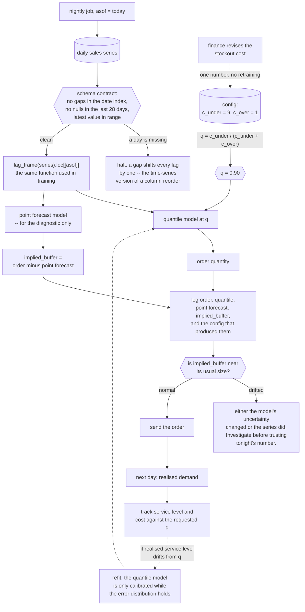

import DataCampExercise from "../../../../components/DataCampExercise.astro";
import Figure from "../../../../components/Figure.astro";
import Quiz from "../../../../components/Quiz.astro";

## The decision

A warehouse orders tomorrow's stock tonight. Two things can go wrong:

- **Understock.** A unit of unmet demand costs **9** — a lost sale plus the expedited replacement.
- **Overstock.** A unit held overnight costs **1** — space, capital and spoilage risk.

Nobody in this problem wants a forecast. They want a **quantity**, and the forecast is an intermediate
value on the way to it. That distinction is the whole capstone, and it changes both the model and the
metric.

This project composes:

- the series and lag features from [Time Series Forecasting Fundamentals](/machine-learning/phase-10---applied-ml-problems/time-series-forecasting-fundamentals/)
- the cost-derived operating point from [Cost-Sensitive Learning](/machine-learning/phase-10---applied-ml-problems/cost-sensitive-learning-and-decision-thresholds/)
- the honest-baseline discipline from [Experiment Tracking](/machine-learning/phase-11---ml-engineering/experiment-tracking-and-reproducibility/)

## The data and the baseline

The same 1,096-day series: trend, weekly and yearly seasonality, and AR(1) noise with sd 8.43 against
the series' 30.91. A chronological 80/20 split gives 854 training days and **214 test days**.

The features are lags 1, 2, 3, 7 and 14, rolling means of the past 7 and 28 days, day of week, and a
time index — every one shifted so that no row sees its own target. Ridge on those features had MASE
**0.561** on that page, which is where this capstone starts.

## Ordering the forecast is the expensive option

The obvious policy is *order what you expect to sell*:

```python title="naive_policy.py" showLineNumbers{1}
order = ridge.predict(X_test)                     # order the point forecast

short = np.maximum(actual - order, 0)
over = np.maximum(order - actual, 0)
cost = 9 * short.sum() + 1 * over.sum()
print(f"{cost:,.0f}")                             # 6,382
```

| Policy | Units short | Units over | Total cost |
| --- | --- | --- | --- |
| order = point forecast | **615** | 845 | **6,382** |

A point forecast is (approximately) the conditional *mean*, so it is above demand about half the time
and below it about half the time. When the two errors cost 9 and 1, being below half the time is a
catastrophe: those 615 short units cost 5,537 of the 6,382 total.

## The newsvendor result

The fix is the same derivation as the classification threshold, one page over. Order $Q$; the marginal
unit is worth ordering while the expected cost of *not* having it exceeds the expected cost of holding
it:

$$
c_u \, P(D > Q) \;>\; c_o \, P(D \le Q)
\;\Longleftrightarrow\;
P(D \le Q) \;<\; \frac{c_u}{c_u + c_o}
$$

so the optimal order is the **quantile** of the demand distribution at

$$
q^* = \frac{c_u}{c_u + c_o} = \frac{9}{9 + 1} = 0.90
$$

This is the classical newsvendor solution, and it says something useful about modelling: you do not
need a distribution, you need **one quantile of it**, and quantile regression estimates exactly that by
minimising the pinball loss

$$
L_q(y, \hat{y}) = \max\big(q\,(y - \hat{y}),\; (q - 1)(y - \hat{y})\big)
$$

<Figure
  src="/images/ml/phase-12-capstones/capstone-3-demand-forecasting-for-ordering/newsvendor"
  alt="Left: total cost against ordering quantile, a U-shape falling from 6,207 at q=0.5 to about 3,174 near q=0.85-0.90 and rising to 4,058 at q=0.99, with horizontal lines for the point forecast at 6,382 and point-plus-safety-stock at 3,184. Right: realised days without a stockout against requested quantile, tracking the diagonal, with q=0.90 delivering 0.9159."
  title="Stockout costs 9× holding, so order the 90% quantile — not the forecast"
  caption="Ordering the 0.90 quantile costs 3,212 against 6,382 for ordering the forecast — the same model, the same features, a different question asked of them. The empirical minimum sits at 0.85 (3,174), a 1.2% difference from the theoretical 0.90 and well inside sampling noise on 214 days. The right panel is the sanity check: the quantile you request is the service level you receive."
/>

| Policy | Units short | Units over | Total cost |
| --- | --- | --- | --- |
| order = point forecast | 615 | 845 | 6,382 |
| point forecast + safety stock of 10.5 | 71 | 2,548 | **3,184** |
| **linear quantile regression at $q^* = 0.90$** | **75** | 2,538 | **3,212** |
| quantile gradient boosting at $q^* = 0.90$ | 153 | 2,889 | 4,267 |
| *oracle: order exactly the demand* | *0* | *0* | *0* |

Four readings.

**Asking the right question halved the cost.** 6,382 → 3,212 with no change to the features, the model
family or the amount of data. The improvement came from replacing "predict demand" with "predict the
0.90 quantile of demand".

**A tuned safety stock is just as good here — and needs data to tune.** The buffer of 10.5 units was
chosen by minimising cost on the last 20% of the training window, and it landed at 3,184, within 1% of
the quantile model. That is an honest result and a useful one: on a series with roughly constant
forecast error, `forecast + constant` is a fine policy. The quantile model earns its keep when the error
is **heteroscedastic** — busier days are less predictable — because it can widen the buffer where the
uncertainty is, and it needs no separate tuning step.

**Trees lose again, for the same reason as before.** Quantile gradient boosting reached only 4,267,
because a tree's prediction is bounded by the training targets and this series trends upward at 0.06 per
day. The [same finding appeared in Phase 10](/machine-learning/phase-10---applied-ml-problems/time-series-forecasting-fundamentals/):
extrapolation is a model-class property, and no loss function fixes it.

**The service level is the deliverable.** Requesting the 0.90 quantile produced stockout-free days on
**0.9159** of the test window. That number — not MAE, not MASE — is what an operations team will hold you
to, and it comes out of the model calibrated because the pinball loss is what was minimised.

:::tip[The cost ratio is a business input, and it is stable]
Nobody has to know that a stockout costs exactly 9. The cost curve is flat-bottomed — 0.85 and 0.90 are
within 1.2% — so an order-of-magnitude estimate of the ratio lands you within noise of the optimum. This
is the same damping as the
[classification threshold](/machine-learning/phase-10---applied-ml-problems/cost-sensitive-learning-and-decision-thresholds/),
where any assumed ratio between 21 and 535 stayed within 1.4×.
:::

### See it move

Two things move together here and it is worth watching them do it: the cost ratio you assume, and the
quantile it implies. Drag the stockout cost and the sketch recomputes $q^*$, snaps to the nearest
measured quantile model, and shows the realised cost, the units short and over, and the service level
you would have received across the 214 test days.

```p5 title="The cost ratio you assume picks the quantile you order" desc="Thirteen quantile regression models measured on the same 214 test days. Dragging the stockout cost moves q* and the sketch reports that policy's cost, shortfall, overstock and service level, against ordering the point forecast and against the tuned safety stock. The cost curve is visibly flat between about 0.80 and 0.93." height="440"
// Measured: [quantile, total cost, units short, units over, service level]
const CURVE = [
  [0.50, 6207, 594, 859, 0.5467], [0.55, 5673, 523, 968, 0.5981],
  [0.60, 4518, 363, 1248, 0.6776], [0.65, 4295, 331, 1312, 0.6963],
  [0.70, 3805, 254, 1522, 0.7804], [0.75, 3607, 221, 1620, 0.7944],
  [0.80, 3361, 167, 1854, 0.8131], [0.85, 3174, 113, 2156, 0.8832],
  [0.90, 3212, 75, 2538, 0.9159], [0.93, 3339, 39, 2987, 0.9486],
  [0.95, 3612, 26, 3379, 0.9626], [0.97, 3559, 26, 3326, 0.9626],
  [0.99, 4058, 3, 4034, 0.9907],
];
const POINT_COST = 6382;
const BUFFER_COST = 3184;
let cUnder = 9;
let cOver = 1;
let drag = -1;

function setup() {
  createCanvas(620, 440);
  textFont("monospace");
}
function nearest(q) {
  let best = 0;
  for (let i = 1; i < CURVE.length; i++) {
    if (Math.abs(CURVE[i][0] - q) < Math.abs(CURVE[best][0] - q)) best = i;
  }
  return CURVE[best];
}
function draw() {
  background(13, 17, 23);
  const qStar = cUnder / (cUnder + cOver);
  const row = nearest(qStar);

  fill(215);
  textSize(12);
  textAlign(LEFT, TOP);
  text("214 test days.  q* = c_under / (c_under + c_over)", 24, 14);

  // sliders
  const labels = [
    ["stockout cost per unit", cUnder, 1, 40],
    ["holding cost per unit", cOver, 0.5, 10],
  ];
  for (let i = 0; i < labels.length; i++) {
    const [label, val, lo, hi] = labels[i];
    const y = 46 + i * 42;
    fill(150);
    textSize(11);
    textAlign(LEFT, TOP);
    text(label, 24, y);
    fill(235);
    textAlign(RIGHT, TOP);
    text(val.toFixed(1), 246, y);
    noStroke();
    fill(30, 36, 44);
    rect(24, y + 18, 222, 8, 4);
    fill(75, 139, 190);
    rect(24, y + 18, ((val - lo) / (hi - lo)) * 222, 8, 4);
    fill(235);
    ellipse(24 + ((val - lo) / (hi - lo)) * 222, y + 22, 13, 13);
  }
  fill(150);
  textSize(11);
  textAlign(LEFT, TOP);
  text("ratio " + (cUnder / cOver).toFixed(1) + " : 1", 24, 136);
  fill(120, 200, 120);
  textSize(20);
  text("q* = " + qStar.toFixed(4), 24, 156);
  fill(105);
  textSize(10);
  text("nearest fitted model: q = " + row[0].toFixed(2), 24, 186);

  // cost curve
  const gx = 300, gw = 292, gy = 46, gh = 190;
  const px = (q) => gx + ((q - 0.5) / 0.5) * gw;
  const py = (c) => gy + gh - (c / 7000) * gh;
  stroke(34, 40, 48);
  strokeWeight(1);
  for (let c = 0; c <= 7000; c += 1750) {
    line(gx, py(c), gx + gw, py(c));
    noStroke();
    fill(100);
    textSize(9);
    textAlign(RIGHT, CENTER);
    text((c / 1000).toFixed(1) + "k", gx - 4, py(c));
    stroke(34, 40, 48);
  }
  // reference policies
  stroke(232, 122, 122);
  drawingContext.setLineDash([5, 5]);
  line(gx, py(POINT_COST), gx + gw, py(POINT_COST));
  stroke(140, 150, 165);
  drawingContext.setLineDash([2, 4]);
  line(gx, py(BUFFER_COST), gx + gw, py(BUFFER_COST));
  drawingContext.setLineDash([]);
  noStroke();
  fill(232, 122, 122);
  textSize(9);
  textAlign(LEFT, BOTTOM);
  text("order = point forecast  6,382", gx + 2, py(POINT_COST) - 2);
  fill(140, 150, 165);
  text("point + 10.5 safety stock  3,184", gx + 2, py(BUFFER_COST) - 2);

  stroke(75, 139, 190);
  strokeWeight(2.2);
  noFill();
  beginShape();
  for (const [q, c] of CURVE) vertex(px(q), py(c));
  endShape();
  noStroke();
  for (const [q, c] of CURVE) {
    fill(q === row[0] ? color(120, 200, 120) : color(75, 139, 190));
    ellipse(px(q), py(c), q === row[0] ? 13 : 6, q === row[0] ? 13 : 6);
  }
  fill(105);
  textSize(9);
  textAlign(CENTER, TOP);
  for (const q of [0.5, 0.6, 0.7, 0.8, 0.9, 1.0]) text(q.toFixed(1), px(q), gy + gh + 5);
  fill(130);
  textSize(10);
  text("ordering quantile", gx + gw / 2, gy + gh + 20);

  // readout
  const rows = [
    ["total cost", row[1].toLocaleString() + " units of cost", row[1] < BUFFER_COST ? [120, 200, 120] : [255, 176, 67]],
    ["units short", row[2] + "", [232, 122, 122]],
    ["units over", row[3] + "", [140, 150, 165]],
    ["service level", (100 * row[4]).toFixed(2) + "% of days stockout-free", [120, 200, 120]],
    ["vs point forecast", (100 * (1 - row[1] / POINT_COST)).toFixed(1) + "% cheaper", [120, 200, 120]],
  ];
  for (let i = 0; i < rows.length; i++) {
    const [label, v, col] = rows[i];
    const y = 264 + i * 24;
    fill(140);
    textSize(11);
    textAlign(LEFT, TOP);
    text(label, 24, y);
    fill(col[0], col[1], col[2]);
    text(v, 190, y);
  }
  fill(105);
  textSize(10);
  textAlign(LEFT, TOP);
  text("drag either cost. the curve barely moves between q = 0.80 and 0.93,", 24, 396);
  text("so a rough guess at the ratio still lands within noise of the optimum.", 24, 410);
  text("the service level you receive is the quantile you requested.", 24, 424);
}
function mousePressed() {
  for (let i = 0; i < 2; i++) {
    const y = 46 + i * 42 + 22;
    if (mouseX > 16 && mouseX < 254 && Math.abs(mouseY - y) < 14) drag = i;
  }
}
function mouseDragged() {
  if (drag < 0) return;
  const u = constrain((mouseX - 24) / 222, 0, 1);
  if (drag === 0) cUnder = Math.round((1 + u * 39) * 2) / 2;
  if (drag === 1) cOver = Math.round((0.5 + u * 9.5) * 2) / 2;
}
function mouseReleased() { drag = -1; }
```

Set the ratio to 4:1 and $q^*$ becomes 0.80, costing 3,361; set it to 19:1 and $q^*$ is 0.95, costing
3,612. Both are worse than the 0.85–0.90 region, and both are still roughly **half** the 6,382 you pay
for ordering the point forecast. That is the practical shape of this result: getting the cost ratio
approximately right is worth far more than getting it exactly right, and getting the *question* right —
a quantile rather than a mean — is worth more than either.

## The engineering around it

Three things this project needs before it can run every night, all from
[Phase 11](/machine-learning/phase-11---ml-engineering/phase-11---ml-engineering/):

**A point-in-time feature function.** `lag_frame` shifts every column before use, so a row cannot see
its own target. Tonight's order uses features as of tonight, which means the serving path must call the
same function with `asof = today` — and a parity test must prove it does.

**A schema contract on the incoming series.** The features are lags of one column, so the corruption
that matters is a missing or late day. Assert: no gaps in the date index, no nulls in the last 28 days,
and the latest value inside the fitted range. A missing day silently shifts every lag by one, which is
the time-series version of a column reorder.

**A cost-parameterised config, not a hard-coded quantile.** `q = c_under / (c_under + c_over)` belongs in
the config next to the two costs, so that when finance revises the stockout cost the change is one
number and no retraining.

```python title="nightly_order.py" showLineNumbers{1}
CONFIG = {"c_under": 9.0, "c_over": 1.0, "window": 28, "model": "quantile_linear"}


def nightly_order(series, model, config, asof):
    """Tonight's order quantity, plus everything an audit would ask for."""
    q = config["c_under"] / (config["c_under"] + config["c_over"])
    features = lag_frame(series).loc[[asof]]          # same function as training
    order = float(model.predict(features)[0])
    return {
        "asof": str(asof.date()),
        "order": round(order, 1),
        "quantile": q,
        "point_forecast": round(float(point_model.predict(features)[0]), 1),
        "implied_buffer": round(order - float(point_model.predict(features)[0]), 1),
        "config": config,
    }
```

Logging `implied_buffer` is the operational tell: if it drifts from its usual size, either the model's
uncertainty estimate has changed or the input series has.

The nightly job, with the two guards that stop it ordering nonsense:



The dotted edge on the right is the one that distinguishes this from a forecasting project. The
deliverable is not the forecast, it is the *order*, and the feedback loop that keeps it honest compares
the realised service level with the quantile that was requested — a check available every single day,
with no model metric involved.

## What this project does not solve

- **Lead time.** The problem as posed is one day ahead. A three-day lead time needs the quantile of
  *cumulative* demand over three days, which is not three times the daily quantile.
- **Perishability and multi-period effects.** Overstock here is charged once. Real overstock either
  carries forward (reducing tomorrow's order) or expires.
- **Censored demand.** The series records demand. Real data records *sales*, which are demand truncated
  by whatever was on the shelf, so training on sales after a stockout teaches the model that demand was
  lower than it was.
- **Heteroscedastic gains, unmeasured.** The argument that quantile regression beats a constant buffer
  when variance varies is a claim this dataset cannot support: its noise is homoscedastic by
  construction, and here the two policies tie at 3,212 against 3,184.

The last one is the honest headline for this capstone: **on this series, a tuned constant buffer is as
good as the quantile model.** What the quantile model gives you is one fewer tuning step, a directly
interpretable service level, and a policy that will still be right when the variance stops being
constant.

## Recap

- Ordering the point forecast cost **6,382** over 214 days: 615 units short, 845 over.
- The newsvendor quantile is $q^* = c_u/(c_u + c_o) = 0.90$.
- Ordering that quantile cost **3,212** — 75 short, 2,538 over — a **1.99×** improvement from asking a
  different question of the same features.
- A tuned safety stock of 10.5 units cost **3,184**: statistically the same, with an extra tuning step.
- Quantile gradient boosting reached only **4,267**, because trees cannot extrapolate a trend.
- The realised service level was **0.9159** against the 0.9000 requested.
- The cost curve is flat between 0.85 and 0.90, so the cost ratio only needs to be roughly right.

<Quiz
  questions={[
    {
      q: "A stockout costs 9 and a day of holding costs 1. What should tonight's order be?",
      options: [
        "The point forecast",
        "The 0.90 quantile of the demand distribution — c_under / (c_under + c_over)",
        "The point forecast times 9",
        "The 0.99 quantile, since stockouts are much worse",
      ],
      answer: 1,
      explain: "The newsvendor solution. Measured here: 6,382 for the point forecast against 3,212 for the 0.90 quantile. Going further to 0.99 costs 4,058 — over-ordering has a price too.",
    },
    {
      q: "Why is ordering the point forecast so expensive when the two errors cost 9 and 1?",
      options: [
        "The forecast is biased",
        "A point forecast is roughly the conditional mean, so it is below demand about half the time — and those 615 short units account for 5,535 of the 6,382 total cost",
        "The model is underfitted",
        "MAE is the wrong training loss",
      ],
      answer: 1,
      explain: "Nothing is wrong with the forecast; it answers a question nobody asked. Under asymmetric costs the useful output is a quantile, and quantile regression estimates it directly by minimising the pinball loss.",
    },
    {
      q: "Your quantile model at q = 0.90 and a tuned constant safety stock cost 3,212 and 3,184. What do you conclude?",
      options: [
        "The safety stock is better; drop the quantile model",
        "They are statistically indistinguishable on this series, whose noise is homoscedastic — the quantile model's advantages are one fewer tuning step and a directly interpretable service level",
        "The quantile model is misconfigured",
        "Both are worse than the point forecast",
      ],
      answer: 1,
      explain: "A 1% difference over 214 days is noise. Reporting the tie honestly is the right move; the quantile approach earns its keep when forecast error varies with the level, which this series does not test.",
    },
    {
      q: "You requested the 0.90 quantile and 91.59% of test days had no stockout. What does that tell you?",
      options: [
        "The model is over-ordering",
        "The quantile estimate is calibrated: the service level you request is the one you receive, which is the number operations actually cares about",
        "The quantile should be lowered to 0.88",
        "Nothing, service level is not a model metric",
      ],
      answer: 1,
      explain: "That agreement is what makes a quantile forecast operationally useful. MAE and MASE describe the middle of the distribution; the service level describes the promise you are making.",
    },
    {
      q: "Quantile gradient boosting cost 4,267 against linear quantile regression's 3,212. Why?",
      options: [
        "The learning rate was too high",
        "Trees cannot extrapolate: their predictions are bounded by the training targets, and this series' level rises 0.06 per day",
        "Boosting cannot optimise the pinball loss",
        "Too few estimators",
      ],
      answer: 1,
      explain: "It is the same finding as in Phase 10, where boosting reached MASE 0.670 against ridge's 0.561. Changing the loss function does not give a tree the ability to predict outside the range it has seen; differencing the series or adding a linear component does.",
    },
  ]}
/>

## 🧪 Try It Yourself

### Exercise 1 – Price the naive policy

<DataCampExercise
  lang="python"
  hint={`Short units are max(actual - order, 0) and overstocked units are max(order - actual, 0). Multiply each by its cost and sum.`}
  code={`# Task: Exercise 1 - Price the naive policy
import numpy as np
import pandas as pd
from sklearn.linear_model import Ridge
from sklearn.pipeline import make_pipeline
from sklearn.preprocessing import StandardScaler

rng = np.random.default_rng(4)
n = 1096
t = np.arange(n)
trend = 120 + 0.06 * t
weekly = 18 * np.sin(2 * np.pi * (t % 7) / 7 + 0.6)
yearly = 30 * np.sin(2 * np.pi * t / 365.25 - 1.1)
noise = np.zeros(n)
for i in range(1, n):
    noise[i] = 0.55 * noise[i - 1] + rng.normal(0, 7)
y = pd.Series(trend + weekly + yearly + noise,
              index=pd.date_range("2021-01-01", periods=n, freq="D"))

def lag_frame(series, lags=(1, 2, 3, 7, 14), roll=(7, 28)):
    df = pd.DataFrame({"y": series})
    for L in lags:
        df[f"lag_{L}"] = series.shift(L)
    for w in roll:
        df[f"roll_{w}"] = series.shift(1).rolling(w).mean()
    df["dow"] = series.index.dayofweek
    df["t"] = np.arange(len(series))
    return df.dropna()

frame = lag_frame(y)
X, target = frame.drop(columns="y"), frame["y"]
split = int(len(frame) * 0.8)
X_tr, X_te = X.iloc[:split], X.iloc[split:]
y_tr, y_te = target.iloc[:split], target.iloc[split:]

C_UNDER, C_OVER = 9.0, 1.0

def order_cost(order, actual):
    short = np.maximum(actual - order, 0.0)
    over = np.maximum(order - actual, 0.0)
    return (C_UNDER * short.sum() + C_OVER * over.sum(),
            short.sum(), over.sum())

ridge = make_pipeline(StandardScaler(), Ridge(alpha=1.0)).fit(X_tr, y_tr)
point = ridge.predict(X_te)
total, short, over = order_cost(point, y_te.___)          # replace ___ with values

print(f"test days {len(y_te)}")
print(f"order = point forecast   cost {total:8,.0f}   short {short:6,.0f}   "
      f"over {over:6,.0f}")
print(f"cost of the shortfalls alone: {C_UNDER * short:,.0f}")

# -- Expected Output -------------------------------------------
# test days 214
# order = point forecast   cost    6,382   short    615   over    845
# cost of the shortfalls alone: 5,537
# --------------------------------------------------------------`}
  solution={`# identical, with y_te.values in place of ___
total, short, over = order_cost(point, y_te.values)
print(f"test days {len(y_te)}")
print(f"order = point forecast   cost {total:8,.0f}   short {short:6,.0f}   "
      f"over {over:6,.0f}")
print(f"cost of the shortfalls alone: {C_UNDER * short:,.0f}")`}
  sct={`test_output_contains("cost    6,382")
success_msg("5,535 of the 6,382 is unmet demand. A forecast that is right on average is wrong for this decision.")`}
  height={440}
/>

### Exercise 2 – Order the newsvendor quantile

<DataCampExercise
  lang="python"
  hint={`QuantileRegressor(quantile=q, alpha=1e-4, solver="highs") minimises the pinball loss at q.`}
  code={`# Task: Exercise 2 - Order the newsvendor quantile
from sklearn.linear_model import QuantileRegressor

q_star = C_UNDER / (C_UNDER + ___)                # replace ___ with C_OVER
print(f"q* = {q_star:.4f}")

def quantile_order(q):
    model = make_pipeline(
        StandardScaler(),
        QuantileRegressor(quantile=q, alpha=1e-4, solver="highs")).fit(X_tr, y_tr)
    return model.predict(X_te)

order = quantile_order(q_star)
total, short, over = order_cost(order, y_te.values)
print(f"order = q* quantile      cost {total:8,.0f}   short {short:6,.0f}   "
      f"over {over:6,.0f}")
service = 1 - (y_te.values > order).mean()
print(f"days without a stockout  {service:.4f}   (requested {q_star:.4f})")

# -- Expected Output -------------------------------------------
# q* = 0.9000
# order = q* quantile      cost    3,212   short     75   over  2,538
# days without a stockout  0.9159   (requested 0.9000)
# --------------------------------------------------------------`}
  solution={`from sklearn.linear_model import QuantileRegressor

q_star = C_UNDER / (C_UNDER + C_OVER)
print(f"q* = {q_star:.4f}")

def quantile_order(q):
    model = make_pipeline(
        StandardScaler(),
        QuantileRegressor(quantile=q, alpha=1e-4, solver="highs")).fit(X_tr, y_tr)
    return model.predict(X_te)

order = quantile_order(q_star)
total, short, over = order_cost(order, y_te.values)
print(f"order = q* quantile      cost {total:8,.0f}   short {short:6,.0f}   "
      f"over {over:6,.0f}")
service = 1 - (y_te.values > order).mean()
print(f"days without a stockout  {service:.4f}   (requested {q_star:.4f})")`}
  sct={`test_output_contains("cost    3,212")
success_msg("6,382 to 3,212 from asking for a quantile instead of a mean - and the service level came out at 0.9159.")`}
  height={320}
/>

### Exercise 3 – Sweep the quantile

<DataCampExercise
  lang="python"
  hint={`Fit one model per quantile. The minimum should land near q*, and the curve should be visibly flat around it.`}
  code={`# Task: Exercise 3 - Sweep the quantile
for q in (0.50, 0.70, 0.80, 0.85, 0.90, 0.95, 0.99):
    order = quantile_order(___)                   # replace ___ with q
    total, short, over = order_cost(order, y_te.values)
    service = 1 - (y_te.values > order).mean()
    print(f"q={q:.2f}   cost {total:8,.0f}   short {short:6,.0f}   "
          f"over {over:6,.0f}   service {service:.4f}")

# -- Expected Output -------------------------------------------
# q=0.50   cost    6,207   short    594   over    859   service 0.5467
# q=0.70   cost    3,805   short    254   over  1,522   service 0.7804
# q=0.80   cost    3,361   short    167   over  1,854   service 0.8131
# q=0.85   cost    3,174   short    113   over  2,156   service 0.8832
# q=0.90   cost    3,212   short     75   over  2,538   service 0.9159
# q=0.95   cost    3,612   short     26   over  3,379   service 0.9626
# q=0.99   cost    4,058   short      3   over  4,034   service 0.9907
# --------------------------------------------------------------`}
  solution={`for q in (0.50, 0.70, 0.80, 0.85, 0.90, 0.95, 0.99):
    order = quantile_order(q)
    total, short, over = order_cost(order, y_te.values)
    service = 1 - (y_te.values > order).mean()
    print(f"q={q:.2f}   cost {total:8,.0f}   short {short:6,.0f}   "
          f"over {over:6,.0f}   service {service:.4f}")`}
  sct={`test_output_contains("q=0.90   cost    3,212")
success_msg("Flat between 0.85 and 0.90 - so an approximate cost ratio is enough, exactly as with the classification threshold.")`}
  height={340}
/>

### Exercise 4 – Compare against a tuned safety stock

<DataCampExercise
  lang="python"
  hint={`Tune the buffer on the last 20% of the TRAINING window, never on the test set, then apply it unchanged.`}
  code={`# Task: Exercise 4 - Compare against a tuned safety stock
v = int(split * 0.8)
val_pred = ridge.predict(X.iloc[v:split])
val_actual = target.iloc[v:split].values

buffers = np.arange(0, 30.5, 0.5)
costs = [order_cost(val_pred + b, val_actual)[0] for b in buffers]
buffer = buffers[int(np.___(costs))]              # replace ___ with argmin
print(f"buffer chosen on validation: {buffer:.1f}")

total, short, over = order_cost(point + buffer, y_te.values)
print(f"point + buffer   cost {total:8,.0f}   short {short:6,.0f}   over {over:6,.0f}")
q_total, q_short, q_over = order_cost(quantile_order(0.90), y_te.values)
print(f"quantile at 0.90 cost {q_total:8,.0f}   short {q_short:6,.0f}   "
      f"over {q_over:6,.0f}")
print(f"difference: {abs(total - q_total):,.0f} "
      f"({abs(total - q_total) / q_total:.2%})")

# -- Expected Output -------------------------------------------
# buffer chosen on validation: 10.5
# point + buffer   cost    3,184   short     71   over  2,548
# quantile at 0.90 cost    3,212   short     75   over  2,538
# difference: 28 (0.87%)
# --------------------------------------------------------------`}
  solution={`v = int(split * 0.8)
val_pred = ridge.predict(X.iloc[v:split])
val_actual = target.iloc[v:split].values
buffers = np.arange(0, 30.5, 0.5)
costs = [order_cost(val_pred + b, val_actual)[0] for b in buffers]
buffer = buffers[int(np.argmin(costs))]
print(f"buffer chosen on validation: {buffer:.1f}")
total, short, over = order_cost(point + buffer, y_te.values)
print(f"point + buffer   cost {total:8,.0f}   short {short:6,.0f}   over {over:6,.0f}")
q_total, q_short, q_over = order_cost(quantile_order(0.90), y_te.values)
print(f"quantile at 0.90 cost {q_total:8,.0f}   short {q_short:6,.0f}   "
      f"over {q_over:6,.0f}")
print(f"difference: {abs(total - q_total):,.0f} "
      f"({abs(total - q_total) / q_total:.2%})")`}
  sct={`test_output_contains("buffer chosen on validation: 10.5")
success_msg("A tie. Report it as one: on homoscedastic noise a constant buffer is as good, and the quantile model's advantage is that it needs no tuning data.")`}
  height={340}
/>

### Exercise 5 – Try the tree, and see it lose

<DataCampExercise
  lang="python"
  hint={`GradientBoostingRegressor(loss="quantile", alpha=q) optimises the same pinball loss. Watch what the trend does to it.`}
  code={`# Task: Exercise 5 - Try the tree, and see it lose
from sklearn.ensemble import GradientBoostingRegressor

gbr = GradientBoostingRegressor(loss="quantile", alpha=0.90,
                                random_state=0).fit(X_tr, ___)   # replace ___ with y_tr
g_total, g_short, g_over = order_cost(gbr.predict(X_te), y_te.values)
print(f"quantile GBR      cost {g_total:8,.0f}   short {g_short:6,.0f}   "
      f"over {g_over:6,.0f}")
print(f"linear quantile   cost {q_total:8,.0f}   short {q_short:6,.0f}   "
      f"over {q_over:6,.0f}")
print(f"the tree's orders top out at {gbr.predict(X_te).max():.1f}; "
      f"demand reaches {y_te.max():.1f}")

# -- Expected Output -------------------------------------------
# quantile GBR      cost    4,267   short    153   over  2,889
# linear quantile   cost    3,212   short     75   over  2,538
# the tree's orders top out at 215.9; demand reaches 241.4
# --------------------------------------------------------------`}
  solution={`from sklearn.ensemble import GradientBoostingRegressor

gbr = GradientBoostingRegressor(loss="quantile", alpha=0.90,
                                random_state=0).fit(X_tr, y_tr)
g_total, g_short, g_over = order_cost(gbr.predict(X_te), y_te.values)
print(f"quantile GBR      cost {g_total:8,.0f}   short {g_short:6,.0f}   "
      f"over {g_over:6,.0f}")
print(f"linear quantile   cost {q_total:8,.0f}   short {q_short:6,.0f}   "
      f"over {q_over:6,.0f}")
print(f"the tree's orders top out at {gbr.predict(X_te).max():.1f}; "
      f"demand reaches {y_te.max():.1f}")`}
  sct={`test_output_contains("quantile GBR      cost    4,267")
success_msg("The tree cannot order more than it has seen, and the series trends upward. Changing the loss does not change that.")`}
  height={320}
/>

## Next

[Capstone 4 - Ticket Triage with Text](/machine-learning/phase-12---capstone-projects/capstone-4---ticket-triage-with-text/)
— from a quantity to a routing decision, where the model is allowed to abstain and the interesting
metric is how much work it can take on at a given accuracy.
