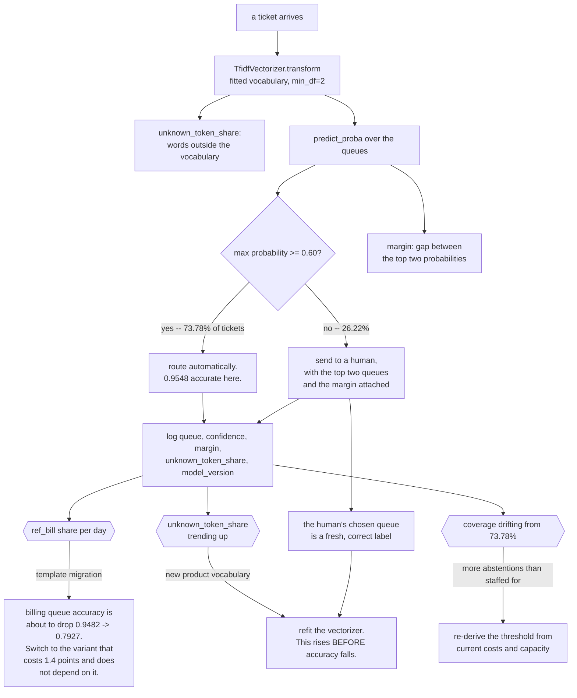

import DataCampExercise from "../../../../components/DataCampExercise.astro";
import Figure from "../../../../components/Figure.astro";
import Quiz from "../../../../components/Quiz.astro";

## The decision

Support tickets arrive as free text and have to reach one of three queues: billing, shipping or
technical. Today a person reads each one.

| | |
| --- | --- |
| **Cost of triaging by hand** | EUR 2 per ticket |
| **Cost of a misrouted ticket** | EUR 12 — it sits in the wrong queue, then gets re-triaged |
| **Volume** | 1,800 tickets in the test window |

The model is allowed a third option: **abstain**. Route the ticket automatically when confident, hand it
to a person otherwise. So the deliverable is not an accuracy — it is a **confidence threshold, a coverage
figure, and the accuracy on the covered portion**.

This capstone composes [the text pipeline](/machine-learning/phase-10---applied-ml-problems/text-classification-with-tf-idf/),
the [coefficient audit](/machine-learning/phase-09---interpretability--responsible-ml/why-interpretability-matters/)
and the cost reasoning from
[Capstone 1](/machine-learning/phase-12---capstone-projects/capstone-1---fraud-screening-end-to-end/).

## Step 1 — the classifier, and its ceiling

`TfidfVectorizer(min_df=2)` plus multinomial logistic regression on 4,200 training tickets:

| | Value |
| --- | --- |
| test tickets | 1,800 |
| overall accuracy | **0.8672** |
| label noise in the data | 6% of tickets are filed in the wrong queue |
| confidence (max predicted probability) | min 0.3386, median 0.7816, max 0.9994 |

The 6% label noise matters more than any modelling choice here: a ticket whose recorded queue is wrong
cannot be predicted correctly, so **no threshold and no model can reach 1.0**. Knowing that number is
what makes the next step honest.

## Step 2 — let the model abstain

<Figure
  src="/images/ml/phase-12-capstones/capstone-4-ticket-triage-with-text/selective-prediction"
  alt="Left: accuracy on routed tickets against coverage, falling from 0.9623 at 14.7% coverage to 0.8672 at full coverage, with a 95% target line crossed at 73.8% coverage. Right: total cost against coverage, a U-shape with a minimum of EUR 1,664 at 73.8% coverage, against EUR 3,600 for all-human and EUR 2,868 for all-automatic."
  title="Triage by hand costs EUR 2; a misrouted ticket costs EUR 12. Neither extreme is optimal."
  caption="Routing everything automatically costs EUR 2,868 in misroutes; routing nothing costs EUR 3,600 in human time. Routing the 73.78% of tickets the model is at least 0.60 confident about costs EUR 1,664 — a 54% saving against all-human — and the automatically routed tickets are 0.9548 accurate. Above 0.70 confidence accuracy plateaus at about 0.96, because the remaining errors are confident ones."
/>

| Confidence threshold | Coverage | Accuracy on routed | Misrouted | To human | Total cost |
| --- | --- | --- | --- | --- | --- |
| 0.00 (route everything) | 1.0000 | 0.8672 | 239 | 0 | EUR 2,868 |
| 0.40 | 0.9561 | 0.8902 | 189 | 79 | EUR 2,426 |
| 0.50 | 0.8400 | 0.9392 | 92 | 288 | EUR 1,680 |
| **0.60** | **0.7378** | **0.9548** | 60 | 472 | **EUR 1,664** |
| 0.70 | 0.6128 | 0.9610 | 43 | 697 | EUR 1,910 |
| 0.80 | 0.4717 | 0.9600 | 34 | 951 | EUR 2,310 |
| 0.90 | 0.2717 | 0.9611 | 19 | 1,311 | EUR 2,850 |
| 1.01 (route nothing) | 0.0000 | — | 0 | 1,800 | EUR 3,600 |

Four things to take from this table.

**Abstention is worth more than a better model.** The classifier's accuracy is 0.8672 and nothing about
it changed. Allowing it to decline the hard 26% took cost from EUR 2,868 to **EUR 1,664** — a saving
larger than any plausible modelling improvement on this corpus.

**The operating point is a cost question, not an accuracy question.** At 0.50 the model covers 84.00% at
0.9392; at 0.60 it covers 73.78% at 0.9548. Their costs are EUR 1,680 and EUR 1,664 — a tie. Choose
between them on operational grounds: how many tickets your team can absorb, and whether a misroute has
a reputational cost the EUR 12 does not capture.

**Accuracy on the routed portion plateaus at about 0.96.** Beyond a 0.70 threshold, raising the bar
buys almost nothing: 0.9610 at 61% coverage, 0.9611 at 27% coverage. The remaining errors are
**confident** errors, which is what 6% label noise produces — the model is confidently right and the
recorded label is wrong. No amount of abstention fixes a mislabelled ticket.

**The cost curve is flat between 50% and 84% coverage.** Costs are EUR 1,664–1,910 across that whole
band, which is good news operationally: you can set the threshold from staffing capacity and lose very
little.

:::tip[Report coverage and selective accuracy together]
"95% accurate" and "73.78% coverage at 95% accuracy" are very different claims, and only the second one
is actionable. The standard way to communicate a selective classifier is a **risk–coverage curve** —
exactly the left panel above — plus the operating point you chose and why.
:::

### See it move

The table has eight rows; the decision has two independent inputs. The sketch lets you move the
confidence threshold along the measured curve *and* re-price the two costs, so you can see the operating
point move for reasons that have nothing to do with the model.

```p5 title="Where to stop trusting the model" desc="Measured coverage and selective accuracy at eight confidence thresholds on 1,800 test tickets. Drag the threshold to move along the curve; drag the two cost sliders to re-price human triage and misroutes. The cheapest operating point moves with the costs while the model stays identical." height="460"
// Measured: [threshold, coverage, accuracy on routed, misrouted, sent to human]
const CURVE = [
  [0.00, 1.0000, 0.8672, 239, 0],
  [0.40, 0.9561, 0.8902, 189, 79],
  [0.50, 0.8400, 0.9392, 92, 288],
  [0.60, 0.7378, 0.9548, 60, 472],
  [0.70, 0.6128, 0.9610, 43, 697],
  [0.80, 0.4717, 0.9600, 34, 951],
  [0.90, 0.2717, 0.9611, 19, 1311],
  [1.01, 0.0000, 0.0000, 0, 1800],
];
let idx = 3;
let cHuman = 2;
let cMisroute = 12;
let drag = -1;

function setup() {
  createCanvas(620, 460);
  textFont("monospace");
}
function cost(i, human, mis) {
  const [, , , misrouted, toHuman] = CURVE[i];
  return misrouted * mis + toHuman * human;
}
function draw() {
  background(13, 17, 23);
  const [thr, cov, acc, misrouted, toHuman] = CURVE[idx];
  const costs = CURVE.map((_, i) => cost(i, cHuman, cMisroute));
  let bestI = 0;
  for (let i = 1; i < costs.length; i++) if (costs[i] < costs[bestI]) bestI = i;

  fill(215);
  textSize(12);
  textAlign(LEFT, TOP);
  text("1,800 test tickets, model accuracy 0.8672, label noise 6%", 24, 14);

  // risk-coverage curve
  const gx = 60, gw = 250, gy = 56, gh = 150;
  const px = (c) => gx + c * gw;
  const py = (a) => gy + gh - ((a - 0.85) / 0.13) * gh;
  stroke(34, 40, 48);
  strokeWeight(1);
  for (let a = 0.86; a <= 0.98; a += 0.03) {
    line(gx, py(a), gx + gw, py(a));
    noStroke();
    fill(100);
    textSize(9);
    textAlign(RIGHT, CENTER);
    text(a.toFixed(2), gx - 4, py(a));
    stroke(34, 40, 48);
  }
  stroke(120, 200, 120, 110);
  line(gx, py(0.95), gx + gw, py(0.95));
  noStroke();
  fill(120, 200, 120);
  textSize(9);
  textAlign(LEFT, BOTTOM);
  text("95% target", gx + 2, py(0.95) - 2);

  stroke(75, 139, 190);
  strokeWeight(2.2);
  noFill();
  beginShape();
  for (let i = 0; i < CURVE.length - 1; i++) vertex(px(CURVE[i][1]), py(CURVE[i][2]));
  endShape();
  noStroke();
  for (let i = 0; i < CURVE.length - 1; i++) {
    fill(i === idx ? color(235) : i === bestI ? color(120, 200, 120) : color(75, 139, 190));
    ellipse(px(CURVE[i][1]), py(CURVE[i][2]), i === idx ? 13 : 7, i === idx ? 13 : 7);
  }
  fill(105);
  textSize(9);
  textAlign(CENTER, TOP);
  for (let c = 0; c <= 1.001; c += 0.25) text((100 * c).toFixed(0) + "%", px(c), gy + gh + 5);
  fill(130);
  textSize(10);
  text("coverage -- share routed automatically", gx + gw / 2, gy + gh + 20);
  textAlign(LEFT, TOP);
  text("accuracy on routed tickets", gx, gy - 16);

  // cost curve
  const hx = 350, hw = 240;
  const maxCost = Math.max(...costs);
  fill(150);
  textSize(10);
  textAlign(LEFT, TOP);
  text("total cost by threshold", hx, gy - 16);
  for (let i = 0; i < CURVE.length; i++) {
    const y = gy + i * 22;
    const w = (costs[i] / maxCost) * hw;
    noStroke();
    fill(i === bestI ? color(120, 200, 120) : i === idx ? color(235) : color(70, 82, 96));
    rect(hx, y, w, 16, 2);
    fill(200);
    textSize(9);
    textAlign(LEFT, CENTER);
    text("t=" + CURVE[i][0].toFixed(2) + "  EUR " + costs[i].toFixed(0), hx + 4, y + 8);
  }

  // sliders
  const sliders = [
    ["human triage, EUR per ticket", cHuman, 0.5, 8],
    ["misroute, EUR per ticket", cMisroute, 2, 40],
  ];
  for (let i = 0; i < sliders.length; i++) {
    const [label, val, lo, hi] = sliders[i];
    const y = 250 + i * 44;
    fill(150);
    textSize(11);
    textAlign(LEFT, TOP);
    text(label, 24, y);
    fill(235);
    textAlign(RIGHT, TOP);
    text("EUR " + val.toFixed(1), 290, y);
    noStroke();
    fill(30, 36, 44);
    rect(24, y + 18, 266, 8, 4);
    fill(75, 139, 190);
    rect(24, y + 18, ((val - lo) / (hi - lo)) * 266, 8, 4);
    fill(235);
    ellipse(24 + ((val - lo) / (hi - lo)) * 266, y + 22, 13, 13);
  }
  fill(105);
  textSize(10);
  textAlign(LEFT, TOP);
  text("click a bar or a point to change the threshold", 24, 344);

  // readout
  const rows = [
    ["threshold", thr.toFixed(2), [235, 235, 235]],
    ["coverage", (100 * cov).toFixed(2) + "%", [180, 180, 180]],
    ["accuracy on routed", idx === CURVE.length - 1 ? "n/a" : acc.toFixed(4), acc >= 0.95 ? [120, 200, 120] : [255, 176, 67]],
    ["misrouted / to human", misrouted + " / " + toHuman, [180, 180, 180]],
    ["total cost", "EUR " + costs[idx].toFixed(0), idx === bestI ? [120, 200, 120] : [255, 176, 67]],
    ["cheapest threshold", CURVE[bestI][0].toFixed(2) + "  (EUR " + costs[bestI].toFixed(0) + ")", [120, 200, 120]],
  ];
  for (let i = 0; i < rows.length; i++) {
    const [label, v, col] = rows[i];
    const y = 366 + i * 16;
    fill(140);
    textSize(10);
    textAlign(LEFT, TOP);
    text(label, 24, y);
    fill(col[0], col[1], col[2]);
    text(v, 200, y);
  }
}
function mousePressed() {
  for (let i = 0; i < 2; i++) {
    const y = 250 + i * 44 + 22;
    if (mouseX > 16 && mouseX < 298 && Math.abs(mouseY - y) < 14) { drag = i; return; }
  }
  for (let i = 0; i < CURVE.length; i++) {
    const y = 56 + i * 22;
    if (mouseX > 350 && mouseX < 600 && mouseY > y && mouseY < y + 16) { idx = i; return; }
  }
}
function mouseDragged() {
  if (drag < 0) return;
  const u = constrain((mouseX - 24) / 266, 0, 1);
  if (drag === 0) cHuman = Math.round((0.5 + u * 7.5) * 2) / 2;
  if (drag === 1) cMisroute = Math.round(2 + u * 38);
}
function mouseReleased() { drag = -1; }
```

Two experiments worth running in it, both leaving the classifier untouched:

| Costs (human / misroute) | Cheapest threshold | Cost there | Coverage |
| --- | --- | --- | --- |
| EUR 2 / EUR 12 (the project's numbers) | 0.60 | EUR 1,664 | 73.78% |
| EUR 2 / EUR 30 | **0.70** | EUR 2,684 | 61.28% |
| EUR 6 / EUR 12 | **0.40** | EUR 2,742 | 95.61% |
| EUR 2 / EUR 4 | 0.40 | EUR 914 | 95.61% |

Make misroutes more expensive and the model is trusted with less; make human triage more expensive and
it is trusted with more — coverage swings from 61% to 96% across those rows. Same accuracy, same
confidence scores, four different systems. The operating point is an economic quantity that happens to
be implemented as a number compared against `predict_proba`.

## Step 3 — audit the tokens before trusting the routing

The [text page](/machine-learning/phase-10---applied-ml-problems/text-classification-with-tf-idf/) found
that this corpus contains `ref_bill`, a template artefact carried by 30% of billing tickets. Its
coefficient is **+5.459** — larger than any real billing word — and the model's accuracy on those tickets
drops from **0.9482 to 0.7927** if the ticketing system stops emitting it.

For a triage system that is a specific, dated risk: the next migration of the ticket template silently
degrades one queue's routing. Two mitigations, both cheap:

- **Put the artefact on a watchlist.** Log the share of tickets containing `ref_bill` per day. When it
  changes, the routing accuracy for billing is about to change too.
- **Train a variant without it** and keep the measurement. Removing `ref_bill` from the vocabulary and
  refitting scores **0.8528** against **0.8672** — a cost of **1.4 points** of accuracy. That prices the
  dependency exactly: the artefact buys 1.4 points today and owes you one migration-shaped outage.

## Step 4 — the routing service

```python title="triage.py" showLineNumbers{1}
CONFIG = {"min_confidence": 0.60, "human_cost": 2.0, "misroute_cost": 12.0,
          "model_version": "triage-2.1.0"}


def triage(ticket_text, artefact, config):
    """Route automatically when confident, otherwise send to a human."""
    features = artefact["vectorizer"].transform([ticket_text])
    proba = artefact["model"].predict_proba(features)[0]
    queue = artefact["classes"][int(proba.argmax())]
    confidence = float(proba.max())

    decision = "auto" if confidence >= config["min_confidence"] else "human"
    return {
        "queue": queue if decision == "auto" else None,
        "decision": decision,
        "confidence": round(confidence, 4),
        "runner_up": artefact["classes"][int(proba.argsort()[-2])],
        "margin": round(float(np.diff(np.sort(proba)[-2:])[0]), 4),
        "unknown_token_share": artefact["unknown_share"](ticket_text),
        "model_version": config["model_version"],
    }
```

Two fields earn their place beyond the obvious ones. **`margin`** — the gap between the top two
probabilities — is a better abstention signal than the maximum alone when the classes are unbalanced, and
it is what a reviewer wants to see next to a borderline decision. **`unknown_token_share`** is the
fraction of the ticket's words that were not in the training vocabulary: it rises when the product
launches a new feature, and it rises *before* accuracy falls, which makes it the earliest available
warning on a text model.

One ticket's path through the service, with the three signals that get logged whether or not a human
ever sees it:



The bottom edge is the part that compounds. Every abstention produces a human decision on exactly the
tickets the model found hardest, which is the highest-value training data available — so a selective
classifier is also a labelling pipeline, provided somebody wires the corrections back.

## Step 5 — what to monitor

| Signal | Available | What it catches |
| --- | --- | --- |
| coverage (share auto-routed) | immediately | vocabulary drift, template changes |
| mean confidence | immediately | the same, earlier |
| unknown-token share | immediately | new products, new jargon, a new locale |
| `ref_bill` frequency | immediately | the template migration on the watchlist |
| re-triage rate (a human moves the ticket) | days | the real misroute rate |

The re-triage rate is the only ground truth, and it arrives late — so the first four are what you page
on. A drop in coverage from 73.78% to 55% means the model is seeing tickets it does not recognise, and it
means it **today**, not after the labels arrive.

## What this project does not solve

- **The 6% label noise is the ceiling and nobody has measured it in production.** Estimating it — by
  double-labelling a sample of tickets — would tell you whether 0.96 is the ceiling or 0.99 is.
- **Word order carries no information in this corpus by construction**, so the finding that bigrams add
  nothing does not transfer to real tickets.
- **Three queues, single-label.** Real triage is hierarchical (queue → team → skill) and often
  multi-label, and abstention interacts with that in ways not modelled here.
- **The EUR 12 is an average.** A misrouted billing dispute and a misrouted password reset do not cost
  the same, and per-class costs would give per-class thresholds — exactly like the
  [per-row thresholds](/machine-learning/phase-10---applied-ml-problems/cost-sensitive-learning-and-decision-thresholds/)
  in Phase 10.

## Recap

- 1,800 test tickets, three queues, overall accuracy **0.8672**, with **6%** of labels wrong by
  construction.
- Routing everything costs **EUR 2,868**; routing nothing costs **EUR 3,600**.
- Routing the **73.78%** above 0.60 confidence costs **EUR 1,664** at **0.9548** accuracy — a 54% saving
  against all-human.
- Selective accuracy plateaus near **0.96** above a 0.70 threshold: the remaining errors are confident
  ones caused by label noise.
- The cost curve is flat between 50% and 84% coverage, so the threshold can follow staffing capacity.
- The `ref_bill` template token has coefficient **+5.459** and costs **0.9482 → 0.7927** on affected
  tickets when it disappears; it belongs on a watchlist.

<Quiz
  questions={[
    {
      q: "Your triage model is 0.8672 accurate. What is the cheapest way to make the system useful?",
      options: [
        "Train a bigger model",
        "Let it abstain: routing the 73.78% of tickets above 0.60 confidence at 0.9548 accuracy costs EUR 1,664 against EUR 2,868 for routing everything",
        "Raise the accuracy target to 0.95 and retrain",
        "Add more training data",
      ],
      answer: 1,
      explain: "Nothing about the classifier changed. Selective prediction converts a mediocre model into a useful one by matching the decision to the confidence, and the saving is larger than any plausible modelling gain on this corpus.",
    },
    {
      q: "Accuracy on the auto-routed tickets stops improving above a 0.70 confidence threshold — 0.9610 at 61% coverage, 0.9611 at 27%. Why?",
      options: [
        "The confidence estimates are miscalibrated",
        "The remaining errors are confident errors: with 6% of labels recorded wrong, the model is sometimes confidently right about a ticket whose recorded queue is wrong",
        "The test set is too small",
        "The threshold grid is too coarse",
      ],
      answer: 1,
      explain: "Label noise sets a ceiling that abstention cannot raise. Knowing the noise rate tells you whether 0.96 is the ceiling or whether there is room, which is why measuring it — by double-labelling a sample — is worth more than more modelling.",
    },
    {
      q: "How should a selective classifier's performance be reported?",
      options: [
        "As accuracy on the covered portion",
        "As a coverage and accuracy pair, ideally the whole risk-coverage curve, plus the chosen operating point and why",
        "As overall accuracy including abstentions as errors",
        "As the confidence threshold",
      ],
      answer: 1,
      explain: "'95% accurate' and '73.78% coverage at 95% accuracy' describe very different systems. The curve also shows the reader that the cost is flat between 50% and 84% coverage, which is the fact that lets operations pick the threshold.",
    },
    {
      q: "The largest coefficient in the billing class is a template token worth +5.459. What do you do before shipping?",
      options: [
        "Remove the token and accept the accuracy loss",
        "Both measure the dependency (0.9482 to 0.7927 on affected tickets when it disappears) and put the token's daily frequency on a monitoring watchlist",
        "Nothing — it predicts well",
        "Retrain with the token as the only feature",
      ],
      answer: 1,
      explain: "Deleting it costs about 1.7 points of overall accuracy; keeping it costs a migration-shaped outage. Pricing both and watching the token's frequency is the response that survives either decision.",
    },
    {
      q: "Which signal warns you earliest that a text triage model is degrading?",
      options: [
        "The re-triage rate",
        "The share of tokens in each ticket that were absent from the training vocabulary — it rises when new jargon appears, before accuracy moves",
        "Overall accuracy on last week's tickets",
        "The confusion matrix",
      ],
      answer: 1,
      explain: "The re-triage rate is ground truth and arrives days late. Unknown-token share, mean confidence and coverage are all available on the first ticket of a new vocabulary, which is when you want to know.",
    },
  ]}
/>

## 🧪 Try It Yourself

### Exercise 1 – Fit the triage classifier

<DataCampExercise
  lang="python"
  hint={`min_df=2 drops the tokens that appear in a single ticket. predict_proba gives you the confidence you will threshold on.`}
  code={`# Task: Exercise 1 - Fit the triage classifier
import numpy as np
from sklearn.feature_extraction.text import TfidfVectorizer
from sklearn.linear_model import LogisticRegression
from sklearn.metrics import accuracy_score
from sklearn.model_selection import train_test_split

# docs, y, names come from the Phase 10 support-ticket generator
d_tr, d_te, y_tr, y_te = train_test_split(docs, y, test_size=0.3,
                                          random_state=0, stratify=y)
vec = TfidfVectorizer(min_df=2)
A, B = vec.fit_transform(d_tr), vec.transform(d_te)
model = LogisticRegression(max_iter=2000).fit(A, y_tr)

proba = model.predict_proba(B)
pred = proba.argmax(axis=1)
conf = proba.___(axis=1)                      # replace ___ with max

print(f"test tickets {len(y_te):,}   queues {len(names)}   "
      f"accuracy {accuracy_score(y_te, pred):.4f}")
print(f"confidence: min {conf.min():.4f}   median {np.median(conf):.4f}   "
      f"max {conf.max():.4f}")

# -- Expected Output -------------------------------------------
# test tickets 1,800   queues 3   accuracy 0.8672
# confidence: min 0.3386   median 0.7816   max 0.9994
# --------------------------------------------------------------`}
  solution={`import numpy as np
from sklearn.feature_extraction.text import TfidfVectorizer
from sklearn.linear_model import LogisticRegression
from sklearn.metrics import accuracy_score
from sklearn.model_selection import train_test_split

d_tr, d_te, y_tr, y_te = train_test_split(docs, y, test_size=0.3,
                                          random_state=0, stratify=y)
vec = TfidfVectorizer(min_df=2)
A, B = vec.fit_transform(d_tr), vec.transform(d_te)
model = LogisticRegression(max_iter=2000).fit(A, y_tr)
proba = model.predict_proba(B)
pred = proba.argmax(axis=1)
conf = proba.max(axis=1)
print(f"test tickets {len(y_te):,}   queues {len(names)}   "
      f"accuracy {accuracy_score(y_te, pred):.4f}")
print(f"confidence: min {conf.min():.4f}   median {np.median(conf):.4f}   "
      f"max {conf.max():.4f}")`}
  sct={`test_output_contains("accuracy 0.8672")
success_msg("0.8672 overall, and a confidence that ranges from 0.3386 to 0.9994 - that spread is what makes abstention possible.")`}
  height={340}
/>

### Exercise 2 – Build the risk–coverage curve

<DataCampExercise
  lang="python"
  hint={`Coverage is the share above the threshold; selective accuracy is measured only on that subset.`}
  code={`# Task: Exercise 2 - Build the risk-coverage curve
for thr in (0.0, 0.4, 0.5, 0.6, 0.7, 0.8, 0.9):
    auto = conf >= thr
    coverage = auto.mean()
    accuracy = accuracy_score(y_te[auto], pred[___]) if auto.any() else float("nan")
    # replace ___ with auto
    print(f"threshold {thr:.2f}   coverage {coverage:.4f}   "
          f"accuracy on routed {accuracy:.4f}   to human {int((~auto).sum()):4d}")

# -- Expected Output -------------------------------------------
# threshold 0.00   coverage 1.0000   accuracy on routed 0.8672   to human    0
# threshold 0.40   coverage 0.9561   accuracy on routed 0.8902   to human   79
# threshold 0.50   coverage 0.8400   accuracy on routed 0.9392   to human  288
# threshold 0.60   coverage 0.7378   accuracy on routed 0.9548   to human  472
# threshold 0.70   coverage 0.6128   accuracy on routed 0.9610   to human  697
# threshold 0.80   coverage 0.4717   accuracy on routed 0.9600   to human  951
# threshold 0.90   coverage 0.2717   accuracy on routed 0.9611   to human 1311
# --------------------------------------------------------------`}
  solution={`for thr in (0.0, 0.4, 0.5, 0.6, 0.7, 0.8, 0.9):
    auto = conf >= thr
    coverage = auto.mean()
    accuracy = accuracy_score(y_te[auto], pred[auto]) if auto.any() else float("nan")
    print(f"threshold {thr:.2f}   coverage {coverage:.4f}   "
          f"accuracy on routed {accuracy:.4f}   to human {int((~auto).sum()):4d}")`}
  sct={`test_output_contains("coverage 0.7378   accuracy on routed 0.9548")
success_msg("73.78% of tickets at 0.9548 accuracy. Above 0.70 the accuracy stops improving - those are confident errors.")`}
  height={340}
/>

### Exercise 3 – Price each operating point

<DataCampExercise
  lang="python"
  hint={`Cost = misrouted x 12 + sent-to-human x 2. Compare against routing everything and routing nothing.`}
  code={`# Task: Exercise 3 - Price each operating point
HUMAN, MISROUTE = 2.0, 12.0

def policy_cost(thr):
    auto = conf >= thr
    misrouted = int((pred[auto] != y_te[auto]).sum())
    to_human = int((~auto).sum())
    return misrouted * MISROUTE + to_human * ___, misrouted, to_human
    # replace ___ with HUMAN

rows = []
for thr in (0.0, 0.4, 0.5, 0.6, 0.7, 0.8, 0.9):
    cost, misrouted, to_human = policy_cost(thr)
    rows.append((thr, cost))
    print(f"threshold {thr:.2f}   misrouted {misrouted:4d}   to human {to_human:4d}   "
          f"cost EUR {cost:7,.0f}")

best = min(rows, key=lambda r: r[1])
print(f"cheapest threshold {best[0]:.2f} at EUR {best[1]:,.0f}")
print(f"all human EUR {len(y_te) * HUMAN:,.0f}   "
      f"all automatic EUR {int((pred != y_te).sum()) * MISROUTE:,.0f}")

# -- Expected Output -------------------------------------------
# threshold 0.00   misrouted  239   to human    0   cost EUR   2,868
# threshold 0.40   misrouted  189   to human   79   cost EUR   2,426
# threshold 0.50   misrouted   92   to human  288   cost EUR   1,680
# threshold 0.60   misrouted   60   to human  472   cost EUR   1,664
# threshold 0.70   misrouted   43   to human  697   cost EUR   1,910
# threshold 0.80   misrouted   34   to human  951   cost EUR   2,310
# threshold 0.90   misrouted   19   to human 1311   cost EUR   2,850
# cheapest threshold 0.60 at EUR 1,664
# all human EUR 3,600   all automatic EUR 2,868
# --------------------------------------------------------------`}
  solution={`HUMAN, MISROUTE = 2.0, 12.0

def policy_cost(thr):
    auto = conf >= thr
    misrouted = int((pred[auto] != y_te[auto]).sum())
    to_human = int((~auto).sum())
    return misrouted * MISROUTE + to_human * HUMAN, misrouted, to_human

rows = []
for thr in (0.0, 0.4, 0.5, 0.6, 0.7, 0.8, 0.9):
    cost, misrouted, to_human = policy_cost(thr)
    rows.append((thr, cost))
    print(f"threshold {thr:.2f}   misrouted {misrouted:4d}   to human {to_human:4d}   "
          f"cost EUR {cost:7,.0f}")
best = min(rows, key=lambda r: r[1])
print(f"cheapest threshold {best[0]:.2f} at EUR {best[1]:,.0f}")
print(f"all human EUR {len(y_te) * HUMAN:,.0f}   "
      f"all automatic EUR {int((pred != y_te).sum()) * MISROUTE:,.0f}")`}
  sct={`test_output_contains("cheapest threshold 0.60 at EUR 1,664")
success_msg("EUR 1,664 against EUR 3,600 all-human and EUR 2,868 all-automatic. Neither extreme was ever the answer.")`}
  height={400}
/>

### Exercise 4 – Find the coverage at a required accuracy

<DataCampExercise
  lang="python"
  hint={`Scan a fine grid of thresholds and keep the lowest one whose selective accuracy still meets the target — that maximises coverage.`}
  code={`# Task: Exercise 4 - Find the coverage at a required accuracy
grid = np.linspace(0.34, 0.99, 66)

for target in (0.90, 0.95, 0.98):
    feasible = []
    for thr in grid:
        auto = conf >= thr
        if auto.sum() < 50:
            continue
        acc = accuracy_score(y_te[auto], pred[auto])
        if acc >= target:
            feasible.append((thr, auto.mean(), acc))
    if feasible:
        thr, coverage, acc = ___(feasible, key=lambda r: r[1])   # replace ___ with max
        print(f"accuracy >= {target:.2f}: threshold {thr:.4f} covers "
              f"{coverage:.4f} at {acc:.4f}")
    else:
        print(f"accuracy >= {target:.2f}: not achievable at any coverage")

# -- Expected Output -------------------------------------------
# accuracy >= 0.90: threshold 0.4200 covers 0.9311 at 0.9033
# accuracy >= 0.95: threshold 0.5400 covers 0.7939 at 0.9503
# accuracy >= 0.98: not achievable at any coverage
# --------------------------------------------------------------`}
  solution={`grid = np.linspace(0.34, 0.99, 66)
for target in (0.90, 0.95, 0.98):
    feasible = []
    for thr in grid:
        auto = conf >= thr
        if auto.sum() < 50:
            continue
        acc = accuracy_score(y_te[auto], pred[auto])
        if acc >= target:
            feasible.append((thr, auto.mean(), acc))
    if feasible:
        thr, coverage, acc = max(feasible, key=lambda r: r[1])
        print(f"accuracy >= {target:.2f}: threshold {thr:.4f} covers "
              f"{coverage:.4f} at {acc:.4f}")
    else:
        print(f"accuracy >= {target:.2f}: not achievable at any coverage")`}
  sct={`test_output_contains("accuracy >= 0.98: not achievable at any coverage")
success_msg("0.95 is reachable at 78% coverage; 0.98 is not reachable at all, because 6% of the labels are wrong.")`}
  height={340}
/>

### Exercise 5 – Add the abstention signals a reviewer needs

<DataCampExercise
  lang="python"
  hint={`The margin is the difference between the top two probabilities. The unknown-token share needs the vectorizer's vocabulary.`}
  code={`# Task: Exercise 5 - Add the abstention signals a reviewer needs
vocabulary = set(vec.vocabulary_)
analyzer = vec.build_analyzer()

def unknown_share(text):
    tokens = analyzer(text)
    if not tokens:
        return 0.0
    return sum(1 for tok in tokens if tok not in vocabulary) / len(tokens)

margin = np.sort(proba, axis=1)[:, -1] - np.sort(proba, axis=1)[:, ___]
# replace ___ with -2

print(f"margin: median {np.median(margin):.4f}   "
      f"10th percentile {np.percentile(margin, 10):.4f}")
print(f"unknown-token share on test tickets: "
      f"mean {np.mean([unknown_share(t) for t in d_te]):.4f}")
new_jargon = "my quantumwidget subscription failed to autorenew after the upgrade"
print(f"a ticket with new jargon: unknown share {unknown_share(new_jargon):.4f}")

low_margin = margin < 0.1
print(f"tickets with margin < 0.10: {int(low_margin.sum())}   "
      f"accuracy on them {accuracy_score(y_te[low_margin], pred[low_margin]):.4f}")

# -- Expected Output -------------------------------------------
# margin: median 0.6464   10th percentile 0.1048
# unknown-token share on test tickets: mean 0.0227
# a ticket with new jargon: unknown share 0.4444
# tickets with margin < 0.10: 175   accuracy on them 0.4229
# --------------------------------------------------------------`}
  solution={`vocabulary = set(vec.vocabulary_)
analyzer = vec.build_analyzer()

def unknown_share(text):
    tokens = analyzer(text)
    if not tokens:
        return 0.0
    return sum(1 for tok in tokens if tok not in vocabulary) / len(tokens)

margin = np.sort(proba, axis=1)[:, -1] - np.sort(proba, axis=1)[:, -2]
print(f"margin: median {np.median(margin):.4f}   "
      f"10th percentile {np.percentile(margin, 10):.4f}")
print(f"unknown-token share on test tickets: "
      f"mean {np.mean([unknown_share(t) for t in d_te]):.4f}")
new_jargon = "my quantumwidget subscription failed to autorenew after the upgrade"
print(f"a ticket with new jargon: unknown share {unknown_share(new_jargon):.4f}")
low_margin = margin < 0.1
print(f"tickets with margin < 0.10: {int(low_margin.sum())}   "
      f"accuracy on them {accuracy_score(y_te[low_margin], pred[low_margin]):.4f}")`}
  sct={`test_output_contains("tickets with margin < 0.10")
success_msg("Tickets with a margin below 0.10 are 0.4229 accurate - worse than guessing between two queues. That is exactly the population to hand to a person.")`}
  height={380}
/>

## Next

[Capstone 5 - A Recommender with an Honest Evaluation](/machine-learning/phase-12---capstone-projects/capstone-5---a-recommender-with-an-honest-evaluation/)
— the last project, where the hardest engineering is not the model but the measurement.
