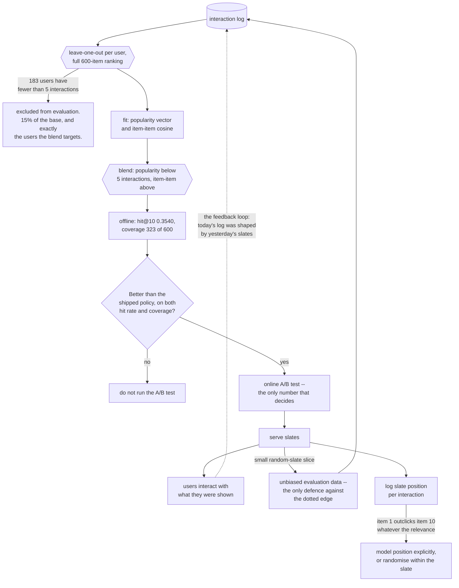

## The decision

A catalogue of 600 items, 1,200 users, and a slot on the home page showing **ten recommendations**. The
questions the team actually has to answer:

1. Is a personalised recommender worth building at all, against showing the most popular items?
2. Which users should it be applied to?
3. How do we know the offline number is not a fantasy?

The third question is the hard one, and it is why this capstone exists. The
[recommender page](/machine-learning/phase-10---applied-ml-problems/recommender-systems-from-scratch/)
measured that evaluating against 100 sampled negatives instead of the full catalogue inflates every hit
rate by **1.90× to 2.14×**. Every number below is a **full-catalogue** number.

## Step 1 — the protocol, decided before the model

| Choice | Decision | Why |
| --- | --- | --- |
| split | leave-one-out per user with ≥5 interactions | matches "predict the next thing" |
| evaluable users | **1,017** of 1,200 | 183 users have too little history |
| candidates | **all 600 items**, minus the ones the user already has | sampling inflates by ~2× |
| metric | hit rate at 5, 10 and 20 | 10 is the slot size; the others show sensitivity |
| second metric | **catalogue coverage** | a recommender that shows 20 items is not a recommender |
| baseline | most popular items | it must be beaten before anything ships |

Writing this table first is the whole trick. Every reported improvement in recommender systems is
negotiable if the protocol is chosen after the results.

## Step 2 — the results

<Figure
  src="/images/ml/phase-12-capstones/capstone-5-a-recommender-with-an-honest-evaluation/hits-and-coverage"
  alt="Left: grouped bars of hit rate at 5, 10 and 20 for popularity (0.1131, 0.1976, 0.2812), item-item (0.2409, 0.3481, 0.4779) and blend (0.2419, 0.3540, 0.4818). Right: distinct items ever recommended in a top-10 list — popularity 20 of 600, item-item 339, blend 323."
  title="Popularity reaches hit@10 0.1976 by recommending 20 items to everybody"
  caption="Personalisation nearly doubles the hit rate at every k. The right panel is the part a metrics dashboard usually omits: the popularity baseline achieves its 0.1976 while ever showing only 20 distinct items — 3.3% of the catalogue — so 580 items are unreachable and the merchandising team has no idea."
/>

| Policy | hit@5 | hit@10 | hit@20 | Catalogue coverage (top 10) |
| --- | --- | --- | --- | --- |
| popularity | 0.1131 | 0.1976 | 0.2812 | **20 of 600 (3.3%)** |
| item-item cosine | 0.2409 | 0.3481 | 0.4779 | **339 of 600 (56.5%)** |
| **blend** | **0.2419** | **0.3540** | **0.4818** | 323 of 600 (53.8%) |

**Personalisation is worth building here.** hit@10 goes from 0.1976 to 0.3481 — a 1.76× improvement,
measured against the full catalogue, using six lines of numpy.

**Catalogue coverage is the finding nobody asks for.** Popularity's 0.1976 comes from recommending the
same **20** items to all 1,017 users. As an accuracy metric that is fine; as a product it means 96.7% of
the catalogue is never seen, new items can never be discovered, and every user's home page looks
identical. Report coverage next to hit rate, always.

## Step 3 — the blend, and where it comes from

The [cold-start measurement](/machine-learning/phase-10---applied-ml-problems/recommender-systems-from-scratch/)
showed that personalisation *loses* on users with almost no history. So the policy is two lines:

```python title="blend.py" showLineNumbers{1}
def scores_for(user):
    """Popularity for cold users, collaborative filtering for everyone else."""
    if interactions_in_training[user] < MIN_HISTORY:      # 5
        return popularity
    return train[user] @ item_similarity
```

| Interactions in training | n | popularity | item-item | **blend** |
| --- | --- | --- | --- | --- |
| 4 | 81 | **0.2469** | 0.1728 | **0.2469** |
| 5–7 | 252 | 0.2421 | **0.3135** | 0.3135 |
| 8–10 | 199 | 0.2060 | **0.3266** | 0.3266 |
| 11–15 | 203 | 0.2118 | **0.4138** | 0.4138 |
| 16–61 | 282 | 0.1277 | **0.3972** | 0.3972 |
| **all** | **1,017** | 0.1976 | 0.3481 | **0.3540** |

The blend gains **+0.0059** overall, and all of it comes from the 81 users where item-item scored 0.1728
and popularity scored 0.2469. That is a small aggregate number produced by a large segment-level one —
**+0.0741 for the users it affects** — which is the shape most good production changes have.

:::caution[The aggregate number hides the decision]
If you had only looked at hit@10 you would see 0.3481 against 0.3540 and reasonably decide the blend is
not worth the code. Segmenting by activity shows that it fixes a 0.0741 deficit for 8% of users — the
newest ones, who are also the ones most likely to leave. Segment before you decide.
:::

### See it move

`MIN_HISTORY` is the only parameter in that policy, and it is a *routing* parameter rather than a model
one — so its effect can be computed exactly from the segment table. Drag it and watch each segment
switch strategy and the aggregate follow.

```p5 title="One routing parameter, five segments" desc="The measured per-segment hit rates for popularity and item-item, with a draggable MIN_HISTORY cutoff. Each segment is routed to whichever strategy the cutoff selects and the aggregate hit rate is recomputed as a weighted average. The optimum is 5, which is exactly where the per-segment lines cross." height="440"
// Measured: [label, users, popularity hit@10, item-item hit@10, lowest interactions, highest]
const SEGS = [
  ["4", 81, 0.2469, 0.1728, 4, 4],
  ["5-7", 252, 0.2421, 0.3135, 5, 7],
  ["8-10", 199, 0.2060, 0.3266, 8, 10],
  ["11-15", 203, 0.2118, 0.4138, 11, 15],
  ["16-61", 282, 0.1277, 0.3972, 16, 61],
];
const TOTAL = 1017;
let minHistory = 5;
let dragging = false;

function setup() {
  createCanvas(620, 440);
  textFont("monospace");
}
function aggregate(mh) {
  let sum = 0;
  for (const [, n, pop, ii, , hi] of SEGS) sum += n * (hi < mh ? pop : ii);
  return sum / TOTAL;
}
function draw() {
  background(13, 17, 23);
  const agg = aggregate(minHistory);
  const allII = aggregate(0);
  const allPop = aggregate(62);
  let bestMh = 0, bestVal = 0;
  for (let mh = 0; mh <= 62; mh++) {
    const v = aggregate(mh);
    if (v > bestVal) { bestVal = v; bestMh = mh; }
  }

  fill(215);
  textSize(12);
  textAlign(LEFT, TOP);
  text("MIN_HISTORY = " + minHistory + "   -> users with fewer interactions get popularity", 24, 14);

  // slider
  noStroke();
  fill(30, 36, 44);
  rect(24, 44, 480, 8, 4);
  fill(75, 139, 190);
  rect(24, 44, (minHistory / 20) * 480, 8, 4);
  fill(235);
  ellipse(24 + (minHistory / 20) * 480, 48, 15, 15);
  fill(105);
  textSize(9);
  textAlign(CENTER, TOP);
  for (let v = 0; v <= 20; v += 5) text(v, 24 + (v / 20) * 480, 58);

  // segments
  for (let i = 0; i < SEGS.length; i++) {
    const [label, n, pop, ii, , hi] = SEGS[i];
    const usePop = hi < minHistory;
    const chosen = usePop ? pop : ii;
    const y = 92 + i * 46;
    fill(150);
    textSize(11);
    textAlign(LEFT, TOP);
    text(label.padEnd(6, " ") + n + " users", 24, y);
    // two bars
    const bx = 190, scale = 700;
    fill(usePop ? color(255, 176, 67) : color(70, 80, 92));
    rect(bx, y, pop * scale, 14, 2);
    fill(!usePop ? color(120, 200, 120) : color(70, 80, 92));
    rect(bx, y + 18, ii * scale, 14, 2);
    fill(usePop ? 235 : 120);
    textSize(10);
    textAlign(LEFT, CENTER);
    text("popularity " + pop.toFixed(4), bx + pop * scale + 6, y + 7);
    fill(!usePop ? 235 : 120);
    text("item-item  " + ii.toFixed(4), bx + ii * scale + 6, y + 25);
    fill(usePop ? color(255, 176, 67) : color(120, 200, 120));
    textSize(9);
    textAlign(LEFT, TOP);
    text(usePop ? "-> popularity" : "-> item-item", 108, y + 8);
  }

  // aggregate
  const y0 = 332;
  fill(150);
  textSize(11);
  textAlign(LEFT, TOP);
  text("aggregate hit@10 over all 1,017 users", 24, y0);
  fill(agg >= bestVal - 1e-9 ? color(120, 200, 120) : color(255, 176, 67));
  textSize(24);
  text(agg.toFixed(4), 24, y0 + 18);
  fill(140);
  textSize(10);
  textAlign(LEFT, TOP);
  text("item-item everywhere: " + allII.toFixed(4), 200, y0 + 20);
  text("popularity everywhere: " + allPop.toFixed(4), 200, y0 + 34);
  fill(120, 200, 120);
  text("best cutoff: " + bestMh + " -> " + bestVal.toFixed(4), 200, y0 + 52);

  fill(105);
  textSize(10);
  textAlign(LEFT, TOP);
  text("the aggregate moves by only +0.0059 between cutoff 0 and 5,", 24, 400);
  text("and that entire gain belongs to the 81 users in the first row,", 24, 414);
  text("for whom it is +0.0741. Aggregates hide segment-level wins.", 24, 428);
}
function mousePressed() { if (Math.abs(mouseY - 48) < 16) dragging = true; }
function mouseDragged() {
  if (dragging) minHistory = Math.round(constrain((mouseX - 24) / 480, 0, 1) * 20);
}
function mouseReleased() { dragging = false; }
```

The weighted average reproduces the published numbers exactly, which is a useful check that the blend is
arithmetic rather than magic: cutoff 0 gives **0.3481** (item-item everywhere), cutoff 5 gives **0.3540**
(the blend), and cutoff 62 gives **0.1976** (popularity everywhere). Push the cutoff past 5 and the
aggregate *falls* — 0.3363 at 8, 0.3127 at 11, 0.2724 at 16 — because you are now handing popularity to
users who have enough history for personalisation to win. The optimum sits exactly where the two
per-segment bars cross, and nowhere else.

## Step 4 — what the online system needs

```python title="recommend.py" showLineNumbers{1}
CONFIG = {"slate_size": 10, "min_history": 5, "model_version": "reco-3.0.1"}


def recommend(user_id, artefact, config):
    """A slate, plus the fields that make an offline/online comparison possible."""
    history = artefact["history"](user_id)
    cold = len(history) < config["min_history"]
    scores = (artefact["popularity"] if cold
              else artefact["similarity_scores"](history))

    ranked = [item for item in np.argsort(-scores) if item not in history]
    slate = ranked[:config["slate_size"]]
    return {
        "user_id": user_id,
        "slate": slate,
        "strategy": "popularity" if cold else "item_item",
        "history_size": len(history),
        "score_span": round(float(scores[slate[0]] - scores[slate[-1]]), 6),
        "model_version": config["model_version"],
        "catalogue_share_today": artefact["coverage_counter"].add(slate),
    }
```

Three of those fields exist because of what this phase measured. **`strategy`** makes the blend auditable
— when the cold-user share moves, the aggregate hit rate moves with it and you need to know which. **
`score_span`** is near zero when the model has nothing to say, which is a better abstention signal than a
threshold on the raw score. **`catalogue_share_today`** is coverage as a live metric rather than an
offline curiosity.

## Step 5 — the honest limits of the offline number

| Problem | Why the offline number is optimistic | What to do |
| --- | --- | --- |
| **Feedback loops** | Yesterday's recommendations created today's interactions, so the model is scored on data it shaped | Log which slate produced each interaction; hold out a random-slate slice |
| **Position bias** | Item 1 is clicked more than item 10 regardless of relevance | Model position explicitly, or randomise within the slate |
| **Only one relevant item** | Leave-one-out treats the other 599 as irrelevant, which is false | Report it as a lower bound; run an online test |
| **183 excluded users** | 15% of the base has too little history to evaluate at all | Their metric is a product question: what does a new user see? |
| **No timestamps** | A random held-out item can predate the training interactions | Use a temporal split for a production estimate |

The last two are the ones with teeth. A leave-one-out benchmark **excludes exactly the users the blend
was built for**, and it can leak the future by holding out an early interaction. A temporal split fixes
the second; nothing fixes the first except deciding, as a product, what a brand-new user sees.

**Offline evaluation ranks candidate policies; it does not predict online performance.** The purpose of
the protocol above is to shortlist honestly, cheaply and reproducibly. The number that matters comes from
an A/B test, and the offline number's job is to make sure the A/B test is worth running.

The loop that number lives inside, with the leak that makes it optimistic drawn explicitly:



The dotted edge is why an offline hit rate cannot be a forecast: the data it is measured on was produced
by the policy it is being compared against. The random-slate slice is the cheap structural fix — a few
percent of traffic showing unranked items buys you an evaluation set that no policy has contaminated,
and without it every future offline comparison inherits the same bias.

## Recap

- **1,017** evaluable users of 1,200; every number computed against the **full 600-item catalogue**.
- Popularity: hit@10 **0.1976** while showing only **20 distinct items** (3.3% of the catalogue).
- Item-item cosine: hit@10 **0.3481** across **339** items — a **1.76×** improvement, in six lines.
- The blend (popularity below five interactions) reaches **0.3540**, gaining **+0.0741** for the 81
  cold users and +0.0059 overall.
- Catalogue coverage belongs next to hit rate in every report.
- Offline numbers shortlist policies. Feedback loops, position bias and the 183 excluded users mean the
  decision belongs to an online test.

<Quiz
  questions={[
    {
      q: "Your recommender reaches hit rate 0.1976 at 10. What must you check before calling it a success?",
      options: [
        "Whether the model is overfitting",
        "Whether that number was measured against the full catalogue, and how many distinct items the policy ever recommends — the popularity baseline hits 0.1976 while showing only 20 of 600 items",
        "Whether NDCG agrees",
        "Whether the training loss converged",
      ],
      answer: 1,
      explain: "Two protocol facts decide the interpretation: sampled negatives inflate hit rates by about 2x, and a policy can reach a respectable hit rate while making 96.7% of the catalogue unreachable.",
    },
    {
      q: "The blend lifts hit@10 from 0.3481 to 0.3540. Is it worth shipping?",
      options: [
        "No, 0.0059 is noise",
        "Yes: the aggregate is small because the blend only affects 81 users, and for them it is worth +0.0741 — the newest users, who are also the most likely to leave",
        "Only if it also improves catalogue coverage",
        "No, popularity should never be used",
      ],
      answer: 1,
      explain: "Segmenting by activity turns an ignorable aggregate into a clear decision. This is the usual shape of a good production change: a large effect on a small, important segment.",
    },
    {
      q: "Why report catalogue coverage alongside hit rate?",
      options: [
        "It is a proxy for accuracy",
        "Because a policy can score well while showing everyone the same few items — 20 of 600 here — which makes new items undiscoverable and every home page identical",
        "Because regulators require it",
        "Because it correlates with NDCG",
      ],
      answer: 1,
      explain: "Coverage is a product constraint that accuracy metrics are blind to. It is also cheap: count the distinct items appearing in top-10 slates, offline and in production.",
    },
    {
      q: "Which limitation of the offline evaluation is least fixable by a better protocol?",
      options: [
        "Sampled negatives",
        "The feedback loop: the interactions you evaluate on were themselves produced by earlier recommendations, so the model is scored on data it shaped",
        "Position bias",
        "Only one relevant item per user",
      ],
      answer: 1,
      explain: "Full-catalogue ranking fixes sampling, randomisation-within-slate mitigates position bias, and treating leave-one-out as a lower bound handles the single-relevant-item problem. Breaking the feedback loop requires deliberately logging random slates.",
    },
    {
      q: "What is the correct role of the offline hit rate?",
      options: [
        "To predict the online click-through rate",
        "To shortlist candidate policies cheaply and reproducibly, so that the A/B test is worth running",
        "To replace online testing entirely",
        "To tune the slate size",
      ],
      answer: 1,
      explain: "It cannot predict online performance — feedback loops and position bias make the mapping unknown. It can rank policies honestly, which is what decides where to spend a limited number of experiment slots.",
    },
  ]}
/>

## 🧪 Try It Yourself

### Exercise 1 – Set up the protocol

<DataCampExercise
  lang="python"
  preExerciseCode={`import numpy as np

rng = np.random.default_rng(11)
n_users, n_items, n_factors = 1200, 600, 6
U = rng.normal(0, 1, (n_users, n_factors))
V = rng.normal(0, 1, (n_items, n_factors))
popularity = -0.9 * np.log1p(np.arange(n_items))
rng.shuffle(popularity)
sigmoid = lambda z: 1 / (1 + np.exp(-z))
logits = U @ V.T * 0.9 + popularity
lo, hi = -30.0, 30.0
for _ in range(40):
    mid = (lo + hi) / 2
    if sigmoid(logits + mid).mean() > 0.02:
        hi = mid
    else:
        lo = mid
R = (rng.random(logits.shape) < sigmoid(logits + (lo + hi) / 2)).astype(np.int8)`}
  hint={`Hold out one interaction per user with at least five, and mask known items before ranking.`}
  code={`# Task: Exercise 1 - Set up the protocol
import numpy as np

# R, the 1,200 x 600 interaction matrix from the Phase 10 generator, is set up for you
rng = np.random.default_rng(0)
train = R.copy()
held = {}
for u in range(R.shape[0]):
    seen = np.flatnonzero(R[u])
    if len(seen) >= 5:
        pick = int(rng.choice(seen))
        train[u, pick] = 0
        held[u] = pick

activity = {u: int(train[u].sum()) for u in held}
print(f"users {R.shape[0]:,}   items {R.shape[1]}   density {R.mean():.4f}")
print(f"evaluable users {len(held):,}   excluded {R.shape[0] - len(___):,}")
# replace ___ with held
print(f"cold users (fewer than 5 interactions left) "
      f"{sum(1 for u in held if activity[u] < 5)}")

# -- Expected Output -------------------------------------------
# users 1,200   items 600   density 0.0202
# evaluable users 1,017   excluded 183
# cold users (fewer than 5 interactions left) 81
# --------------------------------------------------------------`}
  solution={`import numpy as np

rng = np.random.default_rng(0)
train = R.copy()
held = {}
for u in range(R.shape[0]):
    seen = np.flatnonzero(R[u])
    if len(seen) >= 5:
        pick = int(rng.choice(seen))
        train[u, pick] = 0
        held[u] = pick

activity = {u: int(train[u].sum()) for u in held}
print(f"users {R.shape[0]:,}   items {R.shape[1]}   density {R.mean():.4f}")
print(f"evaluable users {len(held):,}   excluded {R.shape[0] - len(held):,}")
print(f"cold users (fewer than 5 interactions left) "
      f"{sum(1 for u in held if activity[u] < 5)}")`}
  sct={`test_output_contains("evaluable users 1,017   excluded 183")
success_msg("183 users cannot be evaluated at all - and they are exactly the ones the blend will be built for.")`}
  height={320}
/>

### Exercise 2 – Score three policies at three cut-offs

<DataCampExercise
  lang="python"
  preExerciseCode={`import numpy as np

rng = np.random.default_rng(11)
n_users, n_items, n_factors = 1200, 600, 6
U = rng.normal(0, 1, (n_users, n_factors))
V = rng.normal(0, 1, (n_items, n_factors))
popularity = -0.9 * np.log1p(np.arange(n_items))
rng.shuffle(popularity)
sigmoid = lambda z: 1 / (1 + np.exp(-z))
logits = U @ V.T * 0.9 + popularity
lo, hi = -30.0, 30.0
for _ in range(40):
    mid = (lo + hi) / 2
    if sigmoid(logits + mid).mean() > 0.02:
        hi = mid
    else:
        lo = mid
R = (rng.random(logits.shape) < sigmoid(logits + (lo + hi) / 2)).astype(np.int8)

import numpy as np

rng = np.random.default_rng(0)
train = R.copy()
held = {}
for u in range(R.shape[0]):
    seen = np.flatnonzero(R[u])
    if len(seen) >= 5:
        pick = int(rng.choice(seen))
        train[u, pick] = 0
        held[u] = pick

activity = {u: int(train[u].sum()) for u in held}`}
  hint={`Mask the user's known items with -inf, take the top k, and check whether the held-out item is in it.`}
  code={`# Task: Exercise 2 - Score three policies at three cut-offs
popularity = train.sum(0).astype(float)
norms = np.linalg.norm(train, axis=0)
norms[norms == 0] = 1.0
unit = train / norms
similarity = unit.T @ unit
np.fill_diagonal(similarity, 0.0)

scorers = {
    "popularity": lambda u: popularity,
    "item-item": lambda u: train[u] @ similarity,
    "blend": lambda u: popularity if activity[u] < 5 else train[u] @ similarity,
}

def top_k(scorer, user, k):
    scores = np.asarray(scorer(user), dtype=float).copy()
    scores[np.flatnonzero(train[user])] = -np.___              # replace ___ with inf
    return np.argsort(-scores)[:k]

for name, scorer in scorers.items():
    hits = []
    for k in (5, 10, 20):
        hits.append(sum(1 for u, item in held.items()
                        if item in top_k(scorer, u, k)) / len(held))
    print(f"{name:12s} hit@5 {hits[0]:.4f}   hit@10 {hits[1]:.4f}   "
          f"hit@20 {hits[2]:.4f}")

# -- Expected Output -------------------------------------------
# popularity   hit@5 0.1131   hit@10 0.1976   hit@20 0.2812
# item-item    hit@5 0.2409   hit@10 0.3481   hit@20 0.4779
# blend        hit@5 0.2419   hit@10 0.3540   hit@20 0.4818
# --------------------------------------------------------------`}
  solution={`popularity = train.sum(0).astype(float)
norms = np.linalg.norm(train, axis=0)
norms[norms == 0] = 1.0
unit = train / norms
similarity = unit.T @ unit
np.fill_diagonal(similarity, 0.0)

scorers = {
    "popularity": lambda u: popularity,
    "item-item": lambda u: train[u] @ similarity,
    "blend": lambda u: popularity if activity[u] < 5 else train[u] @ similarity,
}

def top_k(scorer, user, k):
    scores = np.asarray(scorer(user), dtype=float).copy()
    scores[np.flatnonzero(train[user])] = -np.inf
    return np.argsort(-scores)[:k]

for name, scorer in scorers.items():
    hits = []
    for k in (5, 10, 20):
        hits.append(sum(1 for u, item in held.items()
                        if item in top_k(scorer, u, k)) / len(held))
    print(f"{name:12s} hit@5 {hits[0]:.4f}   hit@10 {hits[1]:.4f}   "
          f"hit@20 {hits[2]:.4f}")`}
  sct={`test_output_contains("blend        hit@5 0.2419   hit@10 0.3540")
success_msg("Personalisation nearly doubles the hit rate at every cut-off, and the blend adds a little more.")`}
  height={380}
/>

### Exercise 3 – Count the catalogue

<DataCampExercise
  lang="python"
  preExerciseCode={`import numpy as np

rng = np.random.default_rng(11)
n_users, n_items, n_factors = 1200, 600, 6
U = rng.normal(0, 1, (n_users, n_factors))
V = rng.normal(0, 1, (n_items, n_factors))
popularity = -0.9 * np.log1p(np.arange(n_items))
rng.shuffle(popularity)
sigmoid = lambda z: 1 / (1 + np.exp(-z))
logits = U @ V.T * 0.9 + popularity
lo, hi = -30.0, 30.0
for _ in range(40):
    mid = (lo + hi) / 2
    if sigmoid(logits + mid).mean() > 0.02:
        hi = mid
    else:
        lo = mid
R = (rng.random(logits.shape) < sigmoid(logits + (lo + hi) / 2)).astype(np.int8)

import numpy as np

rng = np.random.default_rng(0)
train = R.copy()
held = {}
for u in range(R.shape[0]):
    seen = np.flatnonzero(R[u])
    if len(seen) >= 5:
        pick = int(rng.choice(seen))
        train[u, pick] = 0
        held[u] = pick

activity = {u: int(train[u].sum()) for u in held}

popularity = train.sum(0).astype(float)
norms = np.linalg.norm(train, axis=0)
norms[norms == 0] = 1.0
unit = train / norms
similarity = unit.T @ unit
np.fill_diagonal(similarity, 0.0)

scorers = {
    "popularity": lambda u: popularity,
    "item-item": lambda u: train[u] @ similarity,
    "blend": lambda u: popularity if activity[u] < 5 else train[u] @ similarity,
}

def top_k(scorer, user, k):
    scores = np.asarray(scorer(user), dtype=float).copy()
    scores[np.flatnonzero(train[user])] = -np.inf
    return np.argsort(-scores)[:k]`}
  hint={`Collect every item that appears in any top-10 slate, then compare the size of that set against the catalogue.`}
  code={`# Task: Exercise 3 - Count the catalogue
for name, scorer in scorers.items():
    shown = set()
    for u in held:
        shown.___(top_k(scorer, u, 10).tolist())      # replace ___ with update
    print(f"{name:12s} distinct items in top-10 slates: {len(shown):3d} of "
          f"{R.shape[1]}  ({len(shown) / R.shape[1]:.1%})")

# -- Expected Output -------------------------------------------
# popularity   distinct items in top-10 slates:  20 of 600  (3.3%)
# item-item    distinct items in top-10 slates: 339 of 600  (56.5%)
# blend        distinct items in top-10 slates: 323 of 600  (53.8%)
# --------------------------------------------------------------`}
  solution={`for name, scorer in scorers.items():
    shown = set()
    for u in held:
        shown.update(top_k(scorer, u, 10).tolist())
    print(f"{name:12s} distinct items in top-10 slates: {len(shown):3d} of "
          f"{R.shape[1]}  ({len(shown) / R.shape[1]:.1%})")`}
  sct={`test_output_contains("popularity   distinct items in top-10 slates:  20 of 600")
success_msg("The popularity baseline reaches hit@10 0.1976 while making 96.7% of the catalogue unreachable.")`}
  height={280}
/>

### Exercise 4 – Segment by activity, and find the blend's real effect

<DataCampExercise
  lang="python"
  preExerciseCode={`import numpy as np

rng = np.random.default_rng(11)
n_users, n_items, n_factors = 1200, 600, 6
U = rng.normal(0, 1, (n_users, n_factors))
V = rng.normal(0, 1, (n_items, n_factors))
popularity = -0.9 * np.log1p(np.arange(n_items))
rng.shuffle(popularity)
sigmoid = lambda z: 1 / (1 + np.exp(-z))
logits = U @ V.T * 0.9 + popularity
lo, hi = -30.0, 30.0
for _ in range(40):
    mid = (lo + hi) / 2
    if sigmoid(logits + mid).mean() > 0.02:
        hi = mid
    else:
        lo = mid
R = (rng.random(logits.shape) < sigmoid(logits + (lo + hi) / 2)).astype(np.int8)

import numpy as np

rng = np.random.default_rng(0)
train = R.copy()
held = {}
for u in range(R.shape[0]):
    seen = np.flatnonzero(R[u])
    if len(seen) >= 5:
        pick = int(rng.choice(seen))
        train[u, pick] = 0
        held[u] = pick

activity = {u: int(train[u].sum()) for u in held}

popularity = train.sum(0).astype(float)
norms = np.linalg.norm(train, axis=0)
norms[norms == 0] = 1.0
unit = train / norms
similarity = unit.T @ unit
np.fill_diagonal(similarity, 0.0)

scorers = {
    "popularity": lambda u: popularity,
    "item-item": lambda u: train[u] @ similarity,
    "blend": lambda u: popularity if activity[u] < 5 else train[u] @ similarity,
}

def top_k(scorer, user, k):
    scores = np.asarray(scorer(user), dtype=float).copy()
    scores[np.flatnonzero(train[user])] = -np.inf
    return np.argsort(-scores)[:k]`}
  hint={`Group the evaluable users into activity buckets and compute hit@10 within each. The aggregate hides the decision.`}
  code={`# Task: Exercise 4 - Segment by activity, and find the blend's real effect
for lo, hi in ((4, 4), (5, 7), (8, 10), (11, 15), (16, 61)):
    users = [u for u in held if lo <= activity[u] <= ___]      # replace ___ with hi
    if not users:
        continue
    line = []
    for name, scorer in scorers.items():
        hit = sum(1 for u in users if held[u] in top_k(scorer, u, 10)) / len(users)
        line.append(f"{name} {hit:.4f}")
    print(f"{lo:2d}-{hi:<2d} (n={len(users):3d})   " + "   ".join(line))

# -- Expected Output -------------------------------------------
#  4-4  (n= 81)   popularity 0.2469   item-item 0.1728   blend 0.2469
#  5-7  (n=252)   popularity 0.2421   item-item 0.3135   blend 0.3135
#  8-10 (n=199)   popularity 0.2060   item-item 0.3266   blend 0.3266
# 11-15 (n=203)   popularity 0.2118   item-item 0.4138   blend 0.4138
# 16-61 (n=282)   popularity 0.1277   item-item 0.3972   blend 0.3972
# --------------------------------------------------------------`}
  solution={`for lo, hi in ((4, 4), (5, 7), (8, 10), (11, 15), (16, 61)):
    users = [u for u in held if lo <= activity[u] <= hi]
    if not users:
        continue
    line = []
    for name, scorer in scorers.items():
        hit = sum(1 for u in users if held[u] in top_k(scorer, u, 10)) / len(users)
        line.append(f"{name} {hit:.4f}")
    print(f"{lo:2d}-{hi:<2d} (n={len(users):3d})   " + "   ".join(line))`}
  sct={`test_output_contains("popularity 0.2469   item-item 0.1728   blend 0.2469")
success_msg("The blend's +0.0059 aggregate is +0.0741 for the 81 users it touches. Segment before you decide.")`}
  height={320}
/>

### Exercise 5 – Show what the sampled protocol would have claimed

<DataCampExercise
  lang="python"
  preExerciseCode={`import numpy as np

rng = np.random.default_rng(11)
n_users, n_items, n_factors = 1200, 600, 6
U = rng.normal(0, 1, (n_users, n_factors))
V = rng.normal(0, 1, (n_items, n_factors))
popularity = -0.9 * np.log1p(np.arange(n_items))
rng.shuffle(popularity)
sigmoid = lambda z: 1 / (1 + np.exp(-z))
logits = U @ V.T * 0.9 + popularity
lo, hi = -30.0, 30.0
for _ in range(40):
    mid = (lo + hi) / 2
    if sigmoid(logits + mid).mean() > 0.02:
        hi = mid
    else:
        lo = mid
R = (rng.random(logits.shape) < sigmoid(logits + (lo + hi) / 2)).astype(np.int8)

import numpy as np

rng = np.random.default_rng(0)
train = R.copy()
held = {}
for u in range(R.shape[0]):
    seen = np.flatnonzero(R[u])
    if len(seen) >= 5:
        pick = int(rng.choice(seen))
        train[u, pick] = 0
        held[u] = pick

activity = {u: int(train[u].sum()) for u in held}

popularity = train.sum(0).astype(float)
norms = np.linalg.norm(train, axis=0)
norms[norms == 0] = 1.0
unit = train / norms
similarity = unit.T @ unit
np.fill_diagonal(similarity, 0.0)

scorers = {
    "popularity": lambda u: popularity,
    "item-item": lambda u: train[u] @ similarity,
    "blend": lambda u: popularity if activity[u] < 5 else train[u] @ similarity,
}

def top_k(scorer, user, k):
    scores = np.asarray(scorer(user), dtype=float).copy()
    scores[np.flatnonzero(train[user])] = -np.inf
    return np.argsort(-scores)[:k]`}
  hint={`Rank the held-out item against 100 sampled unseen items instead of the full catalogue, then compare.`}
  code={`# Task: Exercise 5 - Show what the sampled protocol would have claimed
def hit_at_k_sampled(scorer, k=10, n_neg=100, seed=3):
    r = np.random.default_rng(seed)
    all_items = np.arange(R.shape[1])
    hits = 0
    for u, item in held.items():
        scores = np.asarray(scorer(u), dtype=float)
        pool = np.setdiff1d(all_items, np.append(np.flatnonzero(train[u]), item))
        negatives = r.choice(pool, n_neg, replace=False)
        rank = int((scores[negatives] > scores[item]).sum()) + 1
        hits += int(rank <= ___)                       # replace ___ with k
    return hits / len(held)

for name, scorer in scorers.items():
    full = sum(1 for u, item in held.items()
               if item in top_k(scorer, u, 10)) / len(held)
    sampled = hit_at_k_sampled(scorer)
    print(f"{name:12s} full {full:.4f}   sampled-100 {sampled:.4f}   "
          f"inflation {sampled / full:.2f}x")

# -- Expected Output -------------------------------------------
# popularity   full 0.1976   sampled-100 0.4238   inflation 2.14x
# item-item    full 0.3481   sampled-100 0.6627   inflation 1.90x
# blend        full 0.3540   sampled-100 0.6568   inflation 1.86x
# --------------------------------------------------------------`}
  solution={`def hit_at_k_sampled(scorer, k=10, n_neg=100, seed=3):
    r = np.random.default_rng(seed)
    all_items = np.arange(R.shape[1])
    hits = 0
    for u, item in held.items():
        scores = np.asarray(scorer(u), dtype=float)
        pool = np.setdiff1d(all_items, np.append(np.flatnonzero(train[u]), item))
        negatives = r.choice(pool, n_neg, replace=False)
        rank = int((scores[negatives] > scores[item]).sum()) + 1
        hits += int(rank <= k)
    return hits / len(held)

for name, scorer in scorers.items():
    full = sum(1 for u, item in held.items()
               if item in top_k(scorer, u, 10)) / len(held)
    sampled = hit_at_k_sampled(scorer)
    print(f"{name:12s} full {full:.4f}   sampled-100 {sampled:.4f}   "
          f"inflation {sampled / full:.2f}x")`}
  sct={`test_output_contains("inflation 2.14x")
success_msg("The same three policies, twice the numbers, and the inflation is not even constant - 1.86x to 2.14x.")`}
  height={340}
/>

## Next

[Phase 12 - Capstone Projects](/machine-learning/phase-12---capstone-projects/phase-12---capstone-projects/)
— the phase overview, and the six questions every one of these projects had to answer before a model was
worth building.
