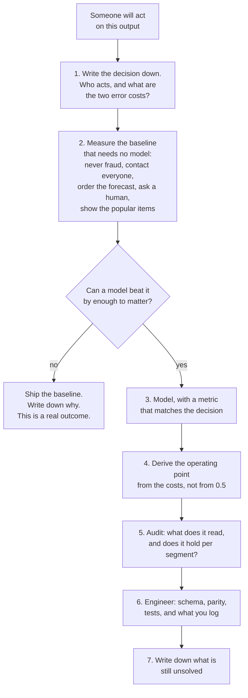

import Quiz from "../../../../components/Quiz.astro";

Every page before this one taught a technique. These five teach the sequence: **state the decision, price
the errors, measure a baseline, model, choose the operating point, audit, and write down what is still
wrong.** The models are deliberately unremarkable — logistic regression, ridge, cosine similarity — because
in each project the model is not where the value is.

## The five projects

| # | Capstone | The decision | The number that decides it |
| --- | --- | --- | --- |
| 1 | [Fraud Screening End to End](/machine-learning/phase-12---capstone-projects/capstone-1---fraud-screening-end-to-end/) | Review this transaction? | Expected loss **EUR 2.1667 → 0.5683** per transaction |
| 2 | [Churn with Point-in-Time Features](/machine-learning/phase-12---capstone-projects/capstone-2---churn-with-point-in-time-features/) | Send a retention offer? | The model is worth **EUR 576** or **EUR 3,060** depending on the offer |
| 3 | [Demand Forecasting for Ordering](/machine-learning/phase-12---capstone-projects/capstone-3---demand-forecasting-for-ordering/) | How many units to order? | Order the **0.90 quantile**: cost **3,212** against **6,382** |
| 4 | [Ticket Triage with Text](/machine-learning/phase-12---capstone-projects/capstone-4---ticket-triage-with-text/) | Route automatically or ask a human? | **73.78%** coverage at **0.9548** accuracy, **EUR 1,664** |
| 5 | [A Recommender with an Honest Evaluation](/machine-learning/phase-12---capstone-projects/capstone-5---a-recommender-with-an-honest-evaluation/) | Which ten items to show? | hit@10 **0.3540**, and **20 of 600** items for the baseline |

## What the five projects have in common

**The operating point moved more money than the model.** In every project the largest single improvement
came from choosing where to act, not from what to fit:

| Capstone | Same model, worse decision | Same model, better decision |
| --- | --- | --- |
| fraud | threshold 0.50 — EUR 12,005 | $t^*=0.0099$ — **EUR 3,410** |
| churn | contact everybody at an EUR 16 offer — **−EUR 1,164** | threshold 0.4444 — **EUR 2,676** |
| ordering | order the forecast — 6,382 | order the 0.90 quantile — **3,212** |
| triage | route everything — EUR 2,868 | abstain below 0.60 — **EUR 1,664** |
| recommender | one policy for everyone — 0.3481 | blend by history — **0.3540** |

**The baseline was closer than expected, and sometimes won.** Contacting every customer at an EUR 4
retention offer earns 99.5% of what the model earns. A tuned constant safety stock ties with quantile
regression (3,184 against 3,212). Popularity beats personalisation for users with four interactions
(0.2469 against 0.1728). Two of five projects contain a segment where the honest recommendation is *do
not use the model here*.

**The reported metric was never the deliverable.** Accuracy 0.9958 was suppressed in favour of average
precision 0.4387; MASE gave way to a service level of 0.9159; hit@10 was reported next to a catalogue
coverage of 20 items; and "0.8672 accurate" became "73.78% coverage at 0.9548".

**Every project has a section admitting what it cannot do.** Censored demand, uplift versus churn
propensity, feedback loops, label noise, 26 test positives. That section is not modesty — it is the part
that tells the next person where to spend their time.

## The six questions to answer before modelling

1. **Who acts on the output, and what changes when they do?** If nothing changes, stop.
2. **What do the two errors cost?** Even an order-of-magnitude answer is enough — the cost curves in
   Phases 10 and 12 are flat over a factor of 20.
3. **What is the no-model baseline, and what does it score?** Predict the majority class, order the
   forecast, contact everyone, ask a human, show the popular items.
4. **What metric matches the decision?** Average precision for alert queues, pinball loss for order
   quantities, selective accuracy for abstention, full-catalogue hit rate for slates.
5. **What is the operating point, and where does it come from?** A cost ratio, a capacity constraint, or a
   required service level — never a default.
6. **What would make this untrue?** A template migration, a censored label, a feedback loop, four
   positives in a segment.

Nothing in that list requires knowing which model you will use.

## How these differ from the concept pages

The earlier phases follow a fixed page shape: intuition, maths, a p5 sketch, from-scratch code, pitfalls,
five exercises. The capstones drop the interactive sketches and the derivations, and add three sections
the concept pages do not have: **the decision**, **the engineering around it**, and **what this project
does not solve**. The exercises are consequently longer and more sequential — each one builds on the
previous one, as a project does.

## How long it takes

| Activity | Time |
| --- | --- |
| Reading the five capstones | 5–6 hours |
| Running the 25 exercises | 5–7 hours |
| Doing one capstone properly on your own data | 15–25 hours |
| **Total** | **25–38 hours** |

## The project to do on your own data

Pick **one** of the five shapes that matches something you actually have, and produce a six-page memo:

1. **The decision.** One paragraph: who acts, what it costs when they act wrongly in each direction, and
   how many decisions per day.
2. **The baseline.** The no-model policy, priced. If you cannot beat it by an amount that matters, the
   memo is finished and it is a success.
3. **The model and its metric.** With a cross-validated interval, not a single number, and a paired
   comparison against the baseline.
4. **The operating point.** Derived from the costs. Include the sensitivity: how wrong can the cost
   estimate be before the decision changes?
5. **The audit.** Top features against domain expectation, and the metric sliced by every segment you
   have — with the counts printed.
6. **The limits.** What you could not measure, what you assumed, and what would break it.

Then delete the model and keep the memo. If the memo is still useful, the project was real.

<Quiz
  questions={[
    {
      q: "Across all five capstones, where did the largest improvement come from?",
      options: [
        "Better model families",
        "Choosing the operating point from the costs: 12,005 to 3,410, 6,382 to 3,212, 2,868 to 1,664 — all with the same fitted model",
        "More training data",
        "Hyperparameter tuning",
      ],
      answer: 1,
      explain: "In four of the five projects the model was left exactly as fitted and the decision rule changed. That is why the phase asks for the costs before it asks for a model.",
    },
    {
      q: "Your no-model baseline earns 99.5% of what your model earns. What is the professional response?",
      options: [
        "Ship the model anyway; it is still better",
        "Ship the baseline, document the measurement, and spend the modelling time elsewhere",
        "Tune the model until the gap widens",
        "Change the metric",
      ],
      answer: 1,
      explain: "That is the measured EUR 4 retention-offer case: contacting everybody earned 13,236 against the model's 13,296. A model that adds 0.5% carries maintenance, monitoring and failure modes that the baseline does not.",
    },
    {
      q: "Which deliverable appears in every capstone and in none of the concept pages?",
      options: [
        "A confusion matrix",
        "A section stating what the project does not solve — censored labels, feedback loops, four positives in a segment",
        "A p5 sketch",
        "A hyperparameter table",
      ],
      answer: 1,
      explain: "It is the section that tells the next person where the risk is, and writing it is what separates a finished project from a demo. It is also where the honest limits of each measurement are recorded.",
    },
    {
      q: "You have a churn model with AUC 0.71 and no cost information. What can you conclude about its value?",
      options: [
        "It is moderately useful",
        "Nothing: the same 0.7060 was worth EUR 576 at a cheap offer, EUR 3,060 at an expensive one, and zero above EUR 24 where the correct action is no campaign",
        "It needs to reach 0.8 to be useful",
        "It depends only on the base rate",
      ],
      answer: 1,
      explain: "Value is a property of the decision, not of the ranking. Without the action's cost, an AUC cannot be converted into anything a business can use — which is why the decision comes first in all five projects.",
    },
  ]}
/>

## Next

Start with
[Capstone 1 - Fraud Screening End to End](/machine-learning/phase-12---capstone-projects/capstone-1---fraud-screening-end-to-end/)
— the shortest path from "we have a model" to "we have a policy, a volume, and a number in euros".
