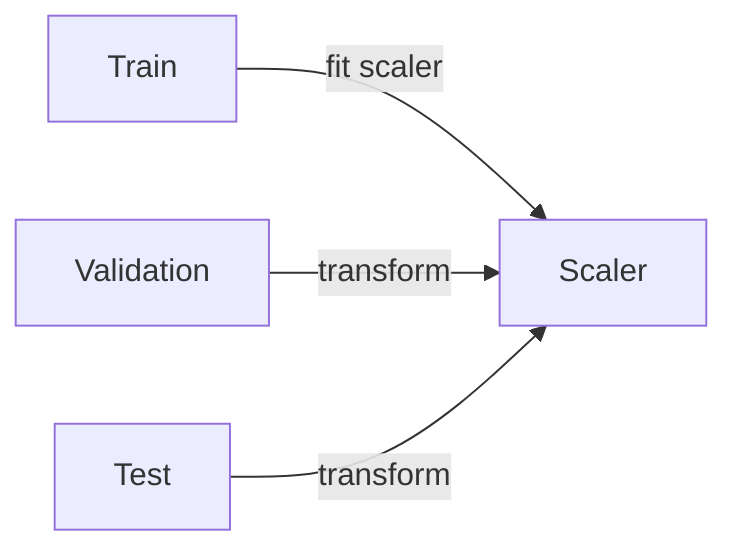

## Why scaling matters

Some algorithms are sensitive to feature magnitude.

Example:

- height in cm (150–200)
- income in dollars (20,000–200,000)

Without scaling, the model may treat income as more important just because it has bigger numbers.

## Two common scaling methods

### Standardization (z-score)

Transforms values to have:

- mean ≈ 0
- std ≈ 1

Formula:

`z = (x - mean) / std`

Use when:

- features roughly bell-shaped
- you’re using models like:
  - logistic regression
  - SVM
  - KNN
  - neural networks

### Normalization (min-max)

Scales values into a range, often [0, 1].

Formula:

`x' = (x - min) / (max - min)`

Use when:

- you need bounded inputs
- distances matter and you want strict ranges

## Which models need scaling?

Scaling usually important:

- KNN
- SVM
- Logistic/Linear Regression (with regularization)
- Neural networks

Scaling usually not required:

- decision trees
- random forests
- gradient boosting

## The leakage warning

Never compute mean/std/min/max using the whole dataset.

Fit scaler **on training only**, then transform validation/test.



## Scikit-learn example

```python title="StandardScaler in a pipeline" showLineNumbers{1}
from sklearn.pipeline import Pipeline
from sklearn.preprocessing import StandardScaler
from sklearn.linear_model import LogisticRegression

model = Pipeline(
    steps=[
        ("scaler", StandardScaler()),
        ("clf", LogisticRegression(max_iter=1000)),
    ]
)
```

## Mini-checkpoint

- Which algorithm are you using?
- Does it depend on distances or dot-products?
- If yes, you probably need scaling.
