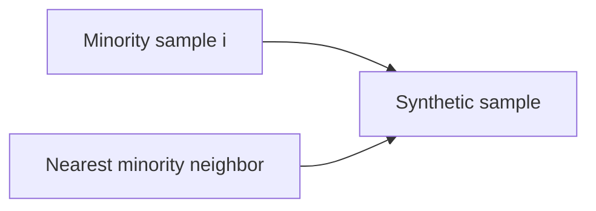

## What is an imbalanced dataset?

An imbalanced dataset has classes with very different frequencies.

Example: fraud detection

- 99.5% normal
- 0.5% fraud

If you predict “normal” always, you get 99.5% accuracy… but the model is useless.

## Why accuracy becomes misleading

With imbalance, you should prioritize:

- precision
- recall
- F1-score
- PR-AUC

## Strategies to handle imbalance

### 1) Use better metrics

Always start here.

### 2) Use class weights

Many models support weighting the minority class more.

Example: Logistic Regression

- `class_weight="balanced"`

### 3) Resampling

- **Undersampling** majority class (risk: lose information)
- **Oversampling** minority class (risk: overfit)

### 4) SMOTE (Synthetic Minority Over-sampling Technique)

SMOTE creates synthetic minority samples by interpolating between existing ones.

## Important warning: avoid leakage with SMOTE

SMOTE must be applied **only to the training set**.

Best practice:

- apply SMOTE inside a cross-validation pipeline

## Practical note

SMOTE is commonly used via `imblearn` (imbalanced-learn library). If you don’t want extra dependencies, start with **class weights**.

## Mini-checkpoint

Given a dataset with 95/5 split:

- which metric would you report?
- what might be the business cost of false negatives vs false positives?
