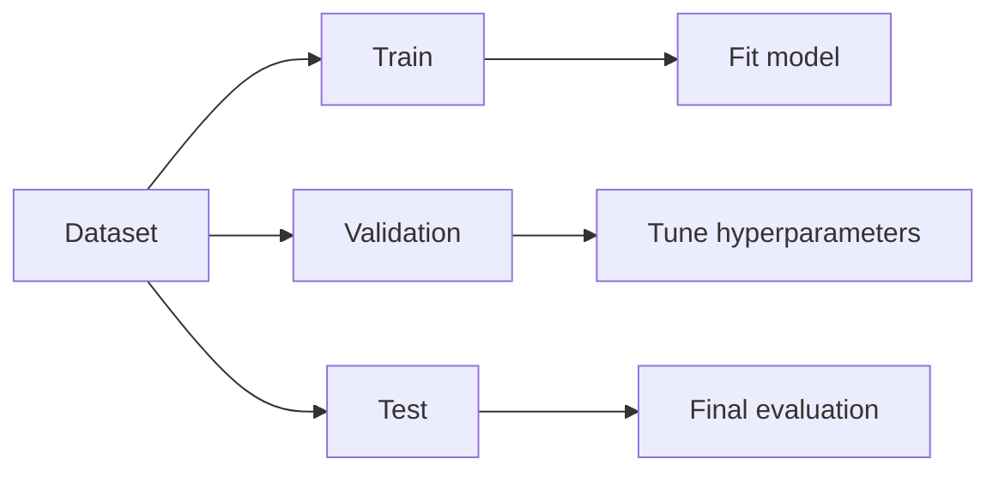

## Why we split

We split data to answer a single question:

> “How will this model perform on new data?”

If you evaluate on the same data you trained on, you’re only measuring memorization.

## The three splits

- **Train**: fit model parameters
- **Validation**: tune hyperparameters / choose model
- **Test**: final, unbiased estimate (touch only at the end)



## Typical ratios

Common starting points:

- 70/15/15
- 80/10/10

If data is small, prefer cross-validation.

## Scikit-learn example

```python title="Train/test split" showLineNumbers{1}
from sklearn.model_selection import train_test_split

X_train, X_test, y_train, y_test = train_test_split(
    X, y, test_size=0.2, random_state=42, stratify=y
)
```

Notes:

- `random_state` makes results reproducible.
- `stratify=y` preserves class ratios (important for classification).

## Time series special case

For time-dependent data, don’t shuffle.

You split by time:

- train on past
- validate on near-future
- test on future

## Leakage checklist

Before you trust your results:

- Did you fit imputers/scalers on train only?
- Did you compute aggregates using future data?
- Did you duplicate records across splits?

## Mini-checkpoint

Write down:

- what your test set represents in the real world
- when you’re allowed to look at it (answer: ideally once)
