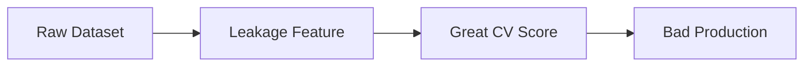

## The core rule

A model can only learn from the information you feed it.

If your data is:

- missing values
- inconsistent formats
- skewed scales
- messy categories
- leaking target information

…the model will learn the wrong thing.

## The “modeling is the easy part” reality

In practice, time spent is often:

- **Data cleaning + feature engineering**: ~60–80%
- **Modeling**: ~10–20%
- **Deployment + monitoring**: ~10–20%

## Common failures caused by bad preprocessing

### 1) Data leakage

You accidentally include information that wouldn’t be available at prediction time.

Example:

- predicting customer churn
- but you include “days_since_last_purchase” computed *after* churn happens

Symptom: extremely high validation scores that collapse in production.

### 2) Train/test contamination

You fit preprocessing on the full dataset (train + test) instead of only train.

Example: scaling with mean/std from all data.

### 3) Incorrect handling of categories

If category values appear in test data that weren’t in training, encoding can break.

### 4) Different distributions (dataset shift)

Your training data doesn’t match reality.

- prices change
- user behavior changes
- sensors drift

## The correct pattern: pipelines

The safest approach is to use a pipeline that:

- fits preprocessing only on training data
- applies the same transform to validation/test

In scikit-learn, that means:

- `Pipeline`
- `ColumnTransformer`

## Mini-checkpoint

Before you train a model, answer:

- What values are missing? Why?
- Do any columns “peek into the future”?
- Are there categories that will grow over time?
- Which features have wildly different scales?
