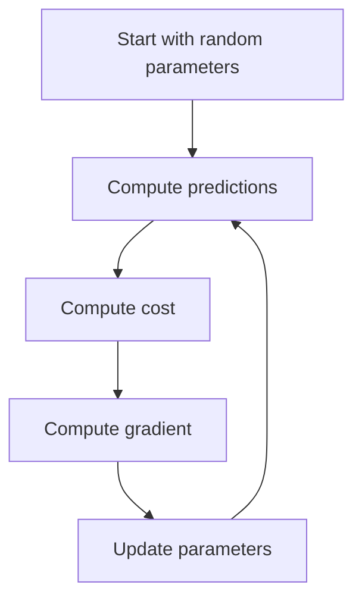
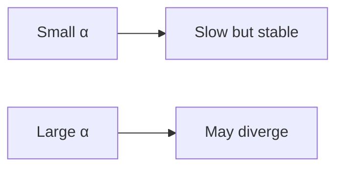

## What gradient descent does

Gradient descent is a method to minimize a cost function.

It works by repeating:

1. compute direction of steepest increase (gradient)
2. step in the opposite direction (downhill)

## The update rule

For parameter `w`:

`w := w - α * (∂Cost/∂w)`

Where:

- `α` is the learning rate

## Learning rate intuition

- too small → slow training
- too large → overshoot / diverge

## Why it matters for regression

Linear regression can be solved analytically, but gradient descent:

- generalizes to many models (logistic regression, neural nets)
- scales to large datasets

## Mini-checkpoint

If training is unstable:

- reduce learning rate
- scale features
- check for exploding gradients (in deep learning)
