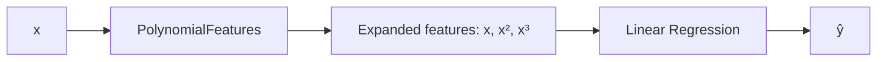

## Why polynomial regression exists

Sometimes the relationship is curved:

- learning curves
- growth/decay
- diminishing returns

A straight line underfits.

Polynomial regression keeps a linear model but **expands features**:

- x → [x, x², x³, ...]

## Picture intuition



## Scikit-learn example

```python title="Polynomial regression" showLineNumbers{1}
import numpy as np
from sklearn.pipeline import Pipeline
from sklearn.preprocessing import PolynomialFeatures
from sklearn.linear_model import LinearRegression

X = np.array([0, 1, 2, 3, 4]).reshape(-1, 1)
y = np.array([1, 2, 5, 10, 17])  # roughly quadratic

poly_model = Pipeline(
    steps=[
        ("poly", PolynomialFeatures(degree=2, include_bias=False)),
        ("lin", LinearRegression()),
    ]
)

poly_model.fit(X, y)
print(poly_model.predict([[5]]))
```

## Overfitting warning

Higher degrees can fit noise.

Use:

- validation
- regularization (Ridge/Lasso)

## Mini-checkpoint

Try degrees 1, 2, 3.

- does validation error improve?
- does it start getting worse at high degree?
