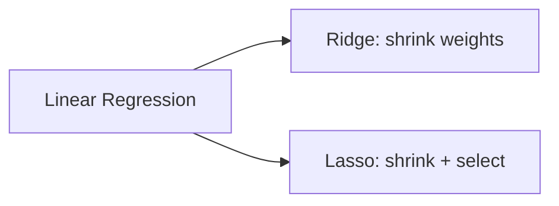

## Why regularization exists

Regression models can overfit when:

- there are many features
- features are noisy
- polynomial degree is high

Overfitting often shows up as:

- great training error
- bad validation/test error

Regularization adds a penalty that discourages overly complex solutions.

## Ridge Regression (L2)

Ridge minimizes:

`MSE + λ * Σ(wi²)`

Effect:

- shrinks coefficients toward 0
- usually keeps all features (rarely exactly 0)

## Lasso Regression (L1)

Lasso minimizes:

`MSE + λ * Σ(|wi|)`

Effect:

- can push some coefficients exactly to 0
- performs feature selection



## Scikit-learn examples

```python title="Ridge and Lasso" showLineNumbers{1}
from sklearn.linear_model import Ridge, Lasso

ridge = Ridge(alpha=1.0)  # alpha is λ
lasso = Lasso(alpha=0.1)
```

## Important: scale features

Regularization is sensitive to feature scale.

Use `StandardScaler` in a pipeline.

## Choosing λ (alpha)

- use validation or cross-validation
- `RidgeCV` / `LassoCV` can help

## Mini-checkpoint

If you have 1000 features:

- which regularization might help reduce features automatically?

(Usually Lasso.)
