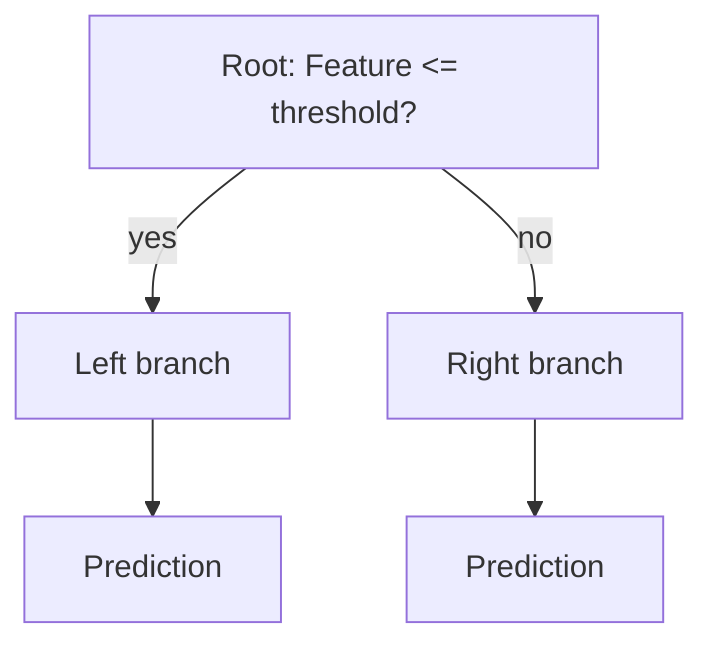

## What a decision tree is

A decision tree predicts by repeatedly asking “if/else” style questions.



## How trees choose splits

A split is chosen to make child nodes “purer”.

Two common impurity measures:

### Gini impurity

- common default
- fast

### Entropy (information gain)

- based on information theory
- sometimes behaves similarly to Gini

## Overfitting risk

Trees can memorize training data.

Common controls:

- `max_depth`
- `min_samples_split`
- `min_samples_leaf`

## Scikit-learn example

```python title="Decision tree classifier" showLineNumbers{1}
from sklearn.tree import DecisionTreeClassifier

tree = DecisionTreeClassifier(
    criterion="gini",  # or "entropy" / "log_loss" depending on sklearn version
    max_depth=5,
    random_state=42,
)
```

## Mini-checkpoint

Train two trees:

- deep tree (no max_depth)
- shallow tree (max_depth=3)

Compare train vs validation scores.
