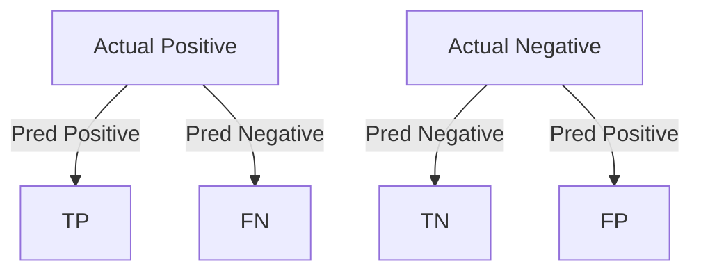

## What the confusion matrix shows

A confusion matrix compares:

- actual labels
- predicted labels

For binary classification:

- TP: true positives
- TN: true negatives
- FP: false positives
- FN: false negatives



## Why it matters

All important classification metrics come from these four numbers.

## Scikit-learn example

```python title="Confusion matrix" showLineNumbers{1}
from sklearn.metrics import confusion_matrix

cm = confusion_matrix(y_true, y_pred)
print(cm)
```

## Mini-checkpoint

If FN is very high, what does that mean?

- You’re missing many real positives.

import DataCampExercise from "../../../../components/DataCampExercise.astro";

## 🧪 Try It Yourself

### Exercise 1 – Train-Test Split

<DataCampExercise
  lang="python"
  hint={`Use \`train_test_split(X, y, test_size=0.2)\` from scikit-learn.`}
  code={`# Task: Exercise 1 – Train-Test Split
from sklearn.model_selection import ___   # replace ___ with train_test_split
import numpy as np

X = np.arange(20).reshape(10, 2)
y = np.arange(10)

X_train, X_test, y_train, y_test = ___(X, y, test_size=0.2, random_state=42)
print("Train size:", len(X_train))
print("Test size:", len(X_test))

# ── Expected Output ───────────────────────────────────────────
# Train size: 8
# Test size: 2
# ──────────────────────────────────────────────────────────────`}
  solution={`from sklearn.model_selection import train_test_split
import numpy as np

X = np.arange(20).reshape(10, 2)
y = np.arange(10)
X_train, X_test, y_train, y_test = train_test_split(X, y, test_size=0.2, random_state=42)
print("Train size:", len(X_train))
print("Test size:", len(X_test))`}
  sct={`test_output_contains("Train size: 8")
test_output_contains("Test size: 2")
success_msg("Data split correctly!")`}
  height={148}
/>

### Exercise 2 – Fit a Linear Model

<DataCampExercise
  lang="python"
  hint={`Call \`model.fit(X_train, y_train)\` then \`model.predict(X_test)\`.`}
  code={`# Task: Exercise 2 – Fit a Linear Model
from sklearn.linear_model import LinearRegression
import numpy as np

X = np.array([[1], [2], [3], [4], [5]])
y = np.array([2, 4, 6, 8, 10])

model = LinearRegression()
model.___(X, y)            # replace ___ with fit
preds = model.___(X)       # replace ___ with predict
print("Predictions:", preds.astype(int))

# ── Expected Output ───────────────────────────────────────────
# Predictions: [ 2  4  6  8 10]
# ──────────────────────────────────────────────────────────────`}
  solution={`from sklearn.linear_model import LinearRegression
import numpy as np

X = np.array([[1], [2], [3], [4], [5]])
y = np.array([2, 4, 6, 8, 10])
model = LinearRegression()
model.fit(X, y)
preds = model.predict(X)
print("Predictions:", preds.astype(int))`}
  sct={`test_output_contains("Predictions:")
success_msg("Model fitted and predictions made!")`}
  height={148}
/>

### Exercise 3 – Evaluate with MSE

<DataCampExercise
  lang="python"
  hint={`Use \`mean_squared_error(y_true, y_pred)\` to measure prediction error.`}
  code={`# Task: Exercise 3 – Evaluate with MSE
from sklearn.metrics import ___   # replace ___ with mean_squared_error
import numpy as np

y_true = np.array([3, 5, 7, 9])
y_pred = np.array([2.8, 5.1, 7.2, 8.9])

mse = ___(y_true, y_pred)         # replace ___ with mean_squared_error
print(f"MSE: {mse:.4f}")

# ── Expected Output ───────────────────────────────────────────
# MSE: 0.0275
# ──────────────────────────────────────────────────────────────`}
  solution={`from sklearn.metrics import mean_squared_error
import numpy as np

y_true = np.array([3, 5, 7, 9])
y_pred = np.array([2.8, 5.1, 7.2, 8.9])
mse = mean_squared_error(y_true, y_pred)
print(f"MSE: {mse:.4f}")`}
  sct={`test_output_contains("MSE:")
success_msg("MSE evaluated successfully!")`}
  height={138}
/>

