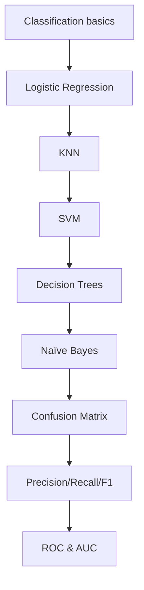

## What classification is

**Classification** predicts a **category** (class label).

Examples:

- spam vs not spam
- fraud vs normal
- cat vs dog
- churn vs not churn

In this phase you’ll learn:

- logistic regression (binary + multiclass)
- KNN
- SVM
- decision trees (entropy vs gini)
- Naïve Bayes
- how to evaluate using confusion matrix, precision/recall/F1, ROC/AUC

## Phase 4 map

## A note on metrics

Many classification datasets are imbalanced.

Accuracy can be misleading, so you’ll learn metrics suited to real-world decision-making.
