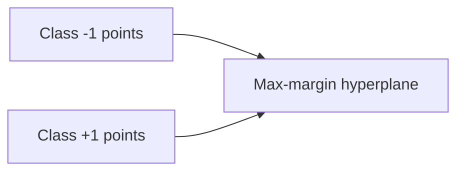

## Core idea: maximum margin

SVM tries to find a decision boundary with the **largest margin** between classes.



## Support vectors

Only a subset of points (support vectors) define the boundary.

## Kernels (non-linear boundaries)

SVM can use kernels to separate data that isn’t linearly separable.

Common kernels:

- linear
- RBF (radial basis function)
- polynomial

## Scaling matters

SVM is sensitive to feature scales.

Use `StandardScaler`.

## Scikit-learn example

```python title="SVM with scaling" showLineNumbers{1}
from sklearn.pipeline import Pipeline
from sklearn.preprocessing import StandardScaler
from sklearn.svm import SVC

svm = Pipeline(
    steps=[
        ("scaler", StandardScaler()),
        ("model", SVC(kernel="rbf", C=1.0, gamma="scale", probability=True)),
    ]
)
```

## Pros and cons

Pros:

- strong on medium-size datasets
- effective in high dimensions

Cons:

- can be slow on very large datasets
- less interpretable

## Mini-checkpoint

Try a linear kernel and RBF kernel and compare.
