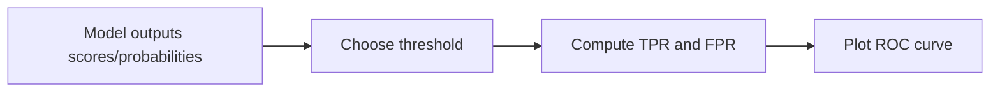

## What ROC is

ROC stands for **Receiver Operating Characteristic**.

It’s a curve that shows the tradeoff between:

- **TPR** (True Positive Rate) = recall = `TP / (TP + FN)`
- **FPR** (False Positive Rate) = `FP / (FP + TN)`

As you change the probability threshold, TPR and FPR change.



## How to interpret the curve

- A curve closer to the **top-left** is better.
- The diagonal line is a “random guess” baseline.

## AUC

**AUC** is the **Area Under the ROC Curve**.

- AUC = 1.0 → perfect ranking
- AUC = 0.5 → random

AUC measures how well the model ranks positives higher than negatives.

## When ROC/AUC is useful

- good for comparing classifiers independent of a single threshold
- useful when you care about ranking quality

## When ROC can mislead

With highly imbalanced data, **PR curves** (precision-recall) can be more informative.

## Scikit-learn example

```python title="Compute ROC-AUC" showLineNumbers{1}
from sklearn.metrics import roc_auc_score

# y_score is probability for the positive class
auc = roc_auc_score(y_true, y_score)
print("ROC-AUC:", auc)
```

## Mini-checkpoint

If a model has high accuracy but ROC-AUC ~ 0.5, what might be happening?

- The model may be predicting the majority class and not learning useful ranking.
