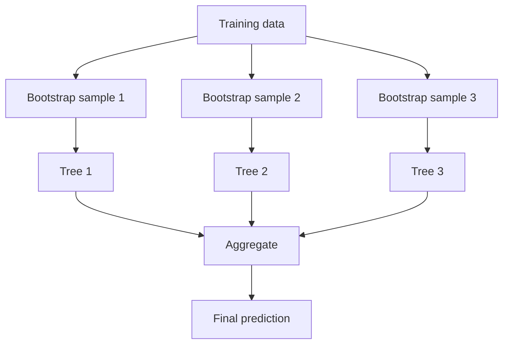

## What bagging is

Bagging = **Bootstrap Aggregating**.

Steps:

1. sample (with replacement) multiple datasets from the training set
2. train one model per sample
3. aggregate predictions (vote/average)



## Random Forest in one line

A **Random Forest** is bagging + decision trees + random feature selection at each split.

This randomness increases diversity → improves generalization.

## Classification vs regression

- RandomForestClassifier: majority vote
- RandomForestRegressor: average prediction

## Scikit-learn examples

```python title="Random Forest (classification)" showLineNumbers{1}
from sklearn.ensemble import RandomForestClassifier

rf = RandomForestClassifier(
    n_estimators=200,
    max_depth=None,
    random_state=42,
    n_jobs=-1,
)
```

```python title="Random Forest (regression)" showLineNumbers{1}
from sklearn.ensemble import RandomForestRegressor

rf = RandomForestRegressor(
    n_estimators=300,
    random_state=42,
    n_jobs=-1,
)
```

## Useful hyperparameters

- `n_estimators`: more trees → better but slower
- `max_depth`: limits overfitting
- `min_samples_leaf`: smooths leaves
- `max_features`: controls feature randomness

## Mini-checkpoint

First try:

- deep trees in forest
- tune `max_depth` and `min_samples_leaf` if overfitting
