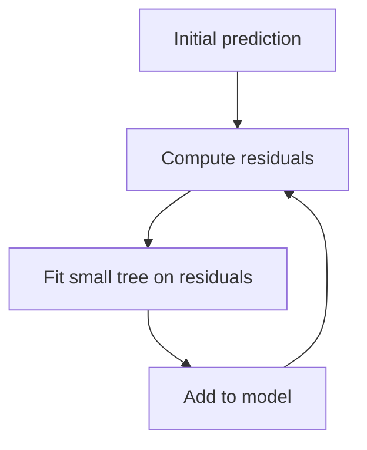

## What gradient boosting is

Gradient boosting builds an additive model:

`prediction = tree1 + tree2 + tree3 + ...`

Each new tree is trained to reduce the previous model’s errors.

For regression, it often fits the residuals.



## Why it’s so strong

Gradient boosting is great for:

- tabular data
- mixed feature types
- nonlinear interactions
- handling missing values (in some libs)

## Scikit-learn baseline: HistGradientBoosting

Scikit-learn has strong built-ins:

- `HistGradientBoostingClassifier`
- `HistGradientBoostingRegressor`

```python title="sklearn HistGradientBoosting" showLineNumbers{1}
from sklearn.ensemble import HistGradientBoostingClassifier

gb = HistGradientBoostingClassifier(random_state=42)
```

## XGBoost / LightGBM / CatBoost (high level)

- **XGBoost**: very popular, strong defaults, battle-tested
- **LightGBM**: very fast, great on large datasets
- **CatBoost**: excellent categorical handling, less preprocessing

> These external libraries are commonly used in industry, but they’re optional. You can learn the concepts using scikit-learn first.

## Mini-checkpoint

If your data is tabular and you want a strong model quickly:

- try gradient boosting and compare to random forest.
