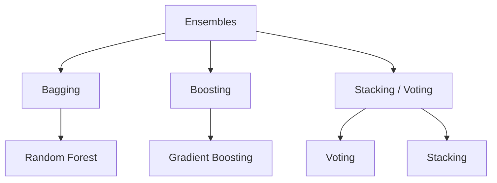

## What ensemble learning is

**Ensembles** combine multiple “weak” or “diverse” models to produce a stronger overall predictor.

Key idea:

- many models make different mistakes
- combining them reduces overall error

## The three big families

## Phase 5 topics

1. The Power of Ensembles: Why Combine Models?
2. Bagging: Random Forest Regressor/Classifier
3. Boosting: Introduction to AdaBoost
4. Gradient Boosting (XGBoost, LightGBM, CatBoost)
5. Stacking and Voting Classifiers

## Why this phase matters

Ensembles are often:

- top performers on tabular datasets
- robust and hard to beat as baselines

They’re also a stepping stone to production ML because they often generalize well.
