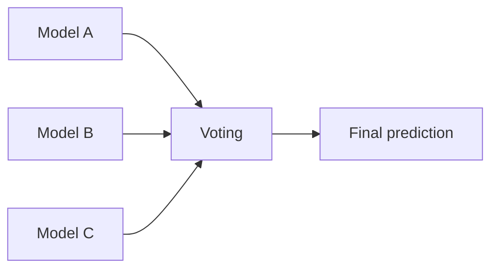

## Voting ensembles

Voting combines multiple models:

- **hard voting**: majority vote
- **soft voting**: average predicted probabilities



Soft voting usually works better if models output calibrated probabilities.

## Stacking ensembles

Stacking trains a “meta-model” that learns how to combine base model predictions.

```mermaid
flowchart TD
  X[Features] --> M1[Base Model 1]
  X --> M2[Base Model 2]
  X --> M3[Base Model 3]
  M1 --> Z[Meta-features (predictions)]
  M2 --> Z
  M3 --> Z
  Z --> META[Meta-model]
  META --> Y[Final prediction]
```

Key warning:

- stacking must be done carefully with cross-validation to avoid leakage

## Scikit-learn examples

```python title="VotingClassifier" showLineNumbers{1}
from sklearn.ensemble import VotingClassifier
from sklearn.linear_model import LogisticRegression
from sklearn.svm import SVC
from sklearn.ensemble import RandomForestClassifier

voter = VotingClassifier(
    estimators=[
        ("lr", LogisticRegression(max_iter=1000)),
        ("svm", SVC(probability=True)),
        ("rf", RandomForestClassifier(n_estimators=200)),
    ],
    voting="soft",
)
```

```python title="StackingClassifier" showLineNumbers{1}
from sklearn.ensemble import StackingClassifier
from sklearn.linear_model import LogisticRegression

stack = StackingClassifier(
    estimators=[
        ("rf", RandomForestClassifier(n_estimators=200)),
        ("svm", SVC(probability=True)),
    ],
    final_estimator=LogisticRegression(max_iter=1000),
)
```

## Mini-checkpoint

Try a voting classifier with:

- one linear model
- one non-linear model
- one tree-based model

Compare against each base model.
