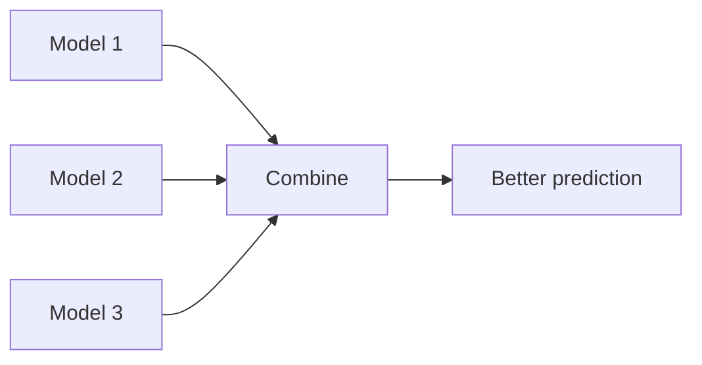

## The intuition: many opinions beat one

If you ask one person for a guess, you can get a bad answer.

If you ask 100 people and average their guesses, the result is often better.

Ensembles do the same for models.

## Why ensembles work

Ensembles improve performance through:

### 1) Variance reduction (bagging)

- high-variance models (like deep decision trees) can overfit
- averaging many trees reduces sensitivity to noise

### 2) Bias reduction (boosting)

- weak learners can underfit
- boosting adds learners that fix previous errors

### 3) Better decision boundaries (model diversity)

If models make different mistakes, combining helps.

## What “diversity” means

Models should not all make the same mistakes.

How diversity is created:

- different subsamples of data (bagging)
- different feature subsets (random forests)
- sequential focus on errors (boosting)

## The tradeoff

Ensembles can be:

- less interpretable
- heavier (more compute)

But on many tabular problems, they are the strongest first choice.

## Mini-checkpoint

Which seems more likely to generalize?

- one deep tree
- 200 trees averaged

(Usually the averaged forest.)
