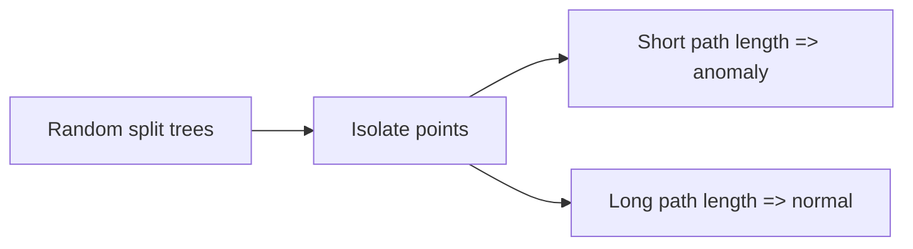

## What anomaly detection is

Anomalies (outliers) are points that are rare or unusual.

Examples:

- fraud transactions
- sensor failures
- sudden spikes in usage

## Why Isolation Forest works

Isolation Forest isolates points using random splits.

- anomalies are easier to isolate
- normal points need more splits



## Scikit-learn example

```python title="IsolationForest" showLineNumbers{1}
from sklearn.ensemble import IsolationForest

iso = IsolationForest(
    n_estimators=200,
    contamination=0.01,
    random_state=42,
)

labels = iso.fit_predict(X)
# labels: 1 (normal), -1 (anomaly)
```

## Tips

- `contamination` should be your best guess of anomaly rate
- scale features if they differ dramatically

## Mini-checkpoint

If contamination is too high, what happens?

- you’ll label too many normal points as anomalies.
