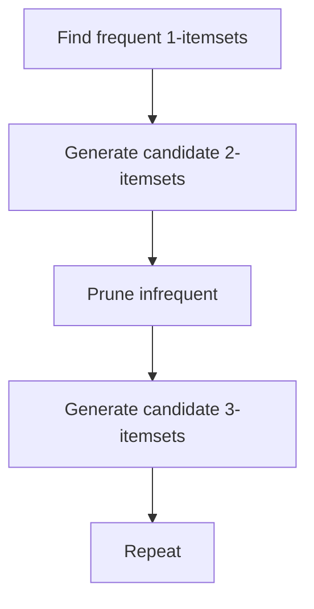

## What association rule learning is

Association rules find patterns like:
```
- {bread, butter} → {milk}
```

Common use-case: **market basket analysis**.

## Key metrics

### Support

How often an itemset appears:

- support(`{A,B}`) = fraction of transactions containing A and B

### Confidence

How often B appears when A appears:

- confidence(A→B) = support(A,B) / support(A)

### Lift

How much more likely B is when A happens, compared to baseline:

- lift(A→B) = confidence(A→B) / support(B)

Lift > 1 suggests a meaningful association.

## Apriori idea

Apriori uses the principle:

- if an itemset is frequent, all its subsets are frequent
- if an itemset is infrequent, all supersets are infrequent

This reduces search.



## Practical note

Apriori is often implemented with specialized libs (e.g., `mlxtend`). You can learn the concepts without installing anything.

## Mini-checkpoint

If a rule has confidence 0.9 but lift 1.0, what does that mean?

- It’s not actually more informative than baseline; B is common anyway.
