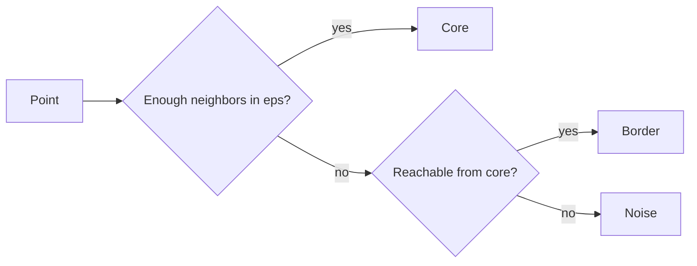

## Why DBSCAN is useful

K-means assumes spherical clusters and forces every point into a cluster.

DBSCAN can:

- find clusters of any shape
- mark outliers as noise

## Key parameters

- `eps`: neighborhood radius
- `min_samples`: minimum points to form a dense region

## Intuition

A point is:

- **core point** if it has enough neighbors within eps
- **border** if it’s near a core point but not dense enough itself
- **noise** if it’s not reachable from any core cluster



## Scikit-learn example

```python title="DBSCAN" showLineNumbers{1}
from sklearn.cluster import DBSCAN
from sklearn.preprocessing import StandardScaler
from sklearn.pipeline import Pipeline

db = Pipeline(
    steps=[
        ("scaler", StandardScaler()),
        ("model", DBSCAN(eps=0.5, min_samples=5)),
    ]
)
```

## Pros and cons

Pros:

- detects outliers naturally
- good for non-spherical clusters

Cons:

- choosing eps can be tricky
- struggles when clusters have different densities

## Mini-checkpoint

If you increase eps:

- do you get more or fewer clusters?

(Usually fewer; clusters merge.)
