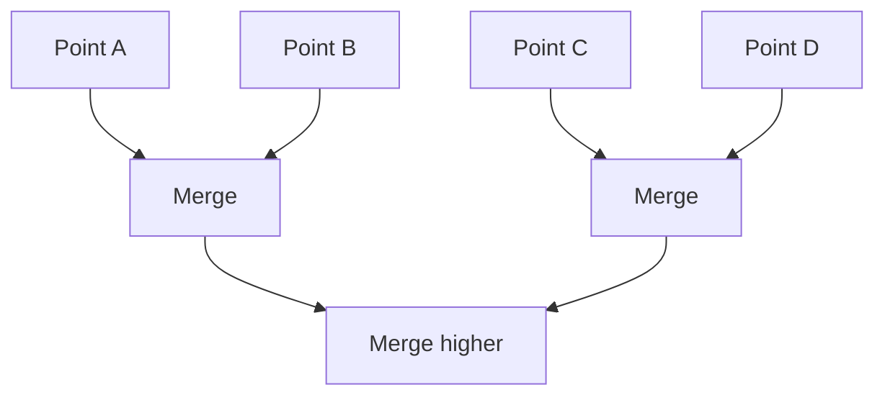

## What hierarchical clustering does

Hierarchical clustering creates a hierarchy (tree) of clusters.

Two main styles:

- **Agglomerative** (bottom-up): start with points, merge them
- **Divisive** (top-down): start with one cluster, split it

## Dendrogram intuition

A dendrogram is a tree diagram showing merge/split steps.



## Linkage criteria

How we measure distance between clusters:

- single linkage (min distance)
- complete linkage (max distance)
- average linkage
- Ward linkage (common default in sklearn; minimizes variance)

## Scikit-learn example

```python title="AgglomerativeClustering" showLineNumbers{1}
from sklearn.cluster import AgglomerativeClustering

hc = AgglomerativeClustering(n_clusters=3, linkage="ward")
labels = hc.fit_predict(X)
```

## Pros and cons

Pros:

- no need to choose K in advance (you can cut the dendrogram later)
- can work with different distance metrics

Cons:

- can be slow on large datasets

## Mini-checkpoint

Try Ward linkage and complete linkage and see how clusters differ.
