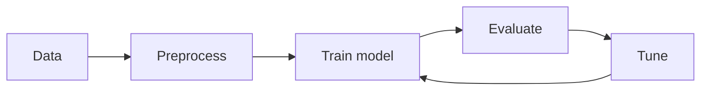

## Why this phase matters

You can get 80% of results by training a model.

You get the next 15–20% by:

- choosing the right validation strategy
- tuning hyperparameters
- building consistent preprocessing pipelines

## Phase 7 topics

1. Bias vs Variance Tradeoff
2. Underfitting vs Overfitting
3. K-Fold Cross-Validation
4. Hyperparameter Tuning with GridSearchCV
5. RandomizedSearchCV for Large Parameter Spaces
6. The ML Pipeline: Automating the Workflow

## The tuning loop

